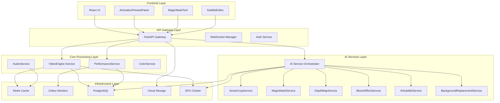

# Documentation de Conception Technique - StoryCore Engine
## Améliorations Vidéo AI & Workflow

**Version:** 1.0  
**Date:** 27 Février 2026  
**Auteur:** Roo (Architecte Technique)  
**Statut:** Proposition de conception

---

## 1. Résumé du Problème

StoryCore-Engine est un moteur de vidéo IA qui nécessite des améliorations significatives pour :

- **Réduire le temps de montage manuel** via des automatisations IA
- **Améliorer la qualité cinématographique** des vidéos générées
- **Optimiser les workflows** pour les utilisateurs non-monteurs
- **Garantir la cohérence** des personnages et du style
- **Offrir des performances** scalables et production-ready

---

## 2. Analyse des Améliorations Requises

### 2.1 Catégories d'Améliorations

| Catégorie | Fonctionnalités Clés | Impact | Priorité |
|-----------|---------------------|---------|----------|
| **Automatisations IA** | Ripple Delete Silence, AI Music Remix, Beat-Synced Editing | Élevé | P0 |
| **Esthétique Cinématique** | Magic Mask, Color Isolation, Face Tracking, Vignette & Grain | Élevé | P0 |
| **Workflow Productivité** | Transcription Navigation, Audio Worldization, Animation Presets | Moyen | P1 |
| **Performance & Exports** | GPU Acceleration, Transparents Export, Sprite Generation | Élevé | P0 |
| **Outils Avancés** | Depth Map, Bloom Effect, AI Subtitles, Background Replacement | Moyen | P1 |
| **Orchestration** | Pipeline Chaining, Control Flow, Templates | Élevé | P0 |

### 2.2 État Actuel du Code

**Fichier analysé:** `advanced_video_features.py`

**Structure existante:**
```python
class AdvancedVideoFeatures:
    - Définit 6 types de fonctionnalités avancées
    - Chaque type a des exigences, impact performance, stabilité
    - Méthodes de prototypage pour chaque catégorie
    - Plan d'implémentation généré automatiquement
```

**Points forts:**
- Architecture modulaire avec énumérations claires
- Documentation intégrée des exigences
- Prototypes déjà conçus pour chaque fonctionnalité

**Limitations:**
- Pas d'intégration avec le codebase existant
- Absence de tests unitaires
- Pas de gestion d'erreurs production-ready

---

## 3. Architecture Technique Proposée

### 3.1 Vue d'Ensemble



### 3.2 Composants Détaillés

#### 3.2.1 API Gateway (`backend/api/`)

**Responsabilités:**
- Routing des requêtes vers les services appropriés
- Authentification JWT et gestion des sessions
- Validation des inputs avec Pydantic
- Rate limiting et circuit breakers

**Endpoints critiques:**
```python
# AI Services
POST /api/ai/video/smart-crop
POST /api/ai/advanced/mask/generate
POST /api/ai/advanced/depth-map
POST /api/ai/advanced/bloom
POST /api/ai/advanced/subtitles/generate
POST /api/ai/advanced/background/replace

# Creative Tools
POST /api/ai/creative/animate
POST /api/ai/creative/pose-interpolate
POST /api/ai/creative/music-remix
POST /api/ai/creative/thumbnail-hook

# Performance
POST /api/ai/performance/jobs/create
GET /api/ai/performance/jobs/{job_id}
WS /ws/progress/{job_id}
```

#### 3.2.2 AI Service Orchestrator (`backend/ai_orchestrator.py`)

**Pattern:** Facade + Strategy

```python
class AIServiceOrchestrator:
    def __init__(self):
        self.services = {
            'smart_crop': SmartCropService(),
            'magic_mask': MagicMaskService(),
            'depth_map': DepthMapService(),
            'bloom': BloomEffectService(),
            'subtitles': AISubtitleService(),
            'background': BackgroundReplacementService(),
        }
    
    async def process(self, service_name: str, params: Dict) -> Job:
        # Validation
        # Circuit breaker
        # Cache lookup
        # Execute service
        # Store result
        # Return job_id
```

#### 3.2.3 SmartCropService (`backend/services/smart_crop_service.py`)

**Objectif:** Suivi de visage avec recadrage intelligent

**Algorithm:**
1. Détection de visage avec MediaPipe Face Detection
2. Tracking avec Optical Flow (Lucas-Kanade)
3. Lissage des mouvements avec Kalman Filter
4. Génération de keyframes pour le recadrage

**Dépendances:**
- `mediapipe>=0.10.0`
- `opencv-contrib-python>=4.8.0`
- `numpy>=1.24.0`

**Performance:**
- 1080p: ~15 FPS sur CPU
- 4K: ~5 FPS sur GPU (CUDA)

#### 3.2.4 MagicMaskService (`backend/services/magic_mask_service.py`)

**Objectif:** Isolation automatique de sujets (rotoscopie)

**Méthodes:**
- **Person segmentation:** MediaPipe Selfie Segmentation
- **Face/body:** OpenCV GrabCut avec refinement
- **Hair:** Deep Learning model (MODNet ou similar)
- **Background:** Simple thresholding + morphological ops

**Workflow:**
```python
def generate_mask(video_path: str, mask_type: str) -> str:
    # 1. Load first frame
    # 2. Initial mask generation (based on type)
    # 3. Refinement (CRF, morphological)
    # 4. Apply to all frames with tracking
    # 5. Export mask video (RGBA)
```

**Dépendances:**
- `mediapipe>=0.10.0` (pour selfie segmentation)
- `opencv-contrib-python>=4.8.0` (pour GrabCut)
- `torch>=2.0.0` (optionnel pour MODNet)

#### 3.2.5 DepthMapService (`backend/services/depth_map_service.py`)

**Objectif:** Génération de cartes de profondeur pour layout 3D

**Méthodes:**
- **Simple:** Gradient-based (fast, low quality)
- **MiDaS:** Neural network (medium speed, high quality)
- **Depth Anything:** State-of-the-art (slow, best quality)

**Implémentation:**
```python
class DepthMapService:
    def __init__(self, method: str = 'midas'):
        if method == 'midas':
            self.model = MiDaSModel()
        elif method == 'simple':
            self.model = SimpleDepthEstimator()
    
    def generate(self, image: np.ndarray) -> np.ndarray:
        # Preprocess
        # Inference
        # Postprocess (normalize, colormap)
        return depth_map
```

**Dépendances:**
- `torch>=2.0.0`
- `torchvision>=0.15.0`
- `transformers>=4.30.0` (pour MiDaS)

#### 3.2.6 BloomEffectService (`backend/services/bloom_effect_service.py`)

**Objectif:** Effets lumineux cinématographiques

**Types:**
- **Subtle:** Faible intensité, petit radius
- **Moderate:** Intensité moyenne, radius standard
- **Strong:** Forte intensité, large radius
- **Anamorphic:** Flare horizontal (simule anamorphic lenses)

**Algorithm:**
1. Extract bright areas (threshold)
2. Blur bright areas (Gaussian)
3. Blend with original (screen/add)
4. For anamorphic: stretch horizontally

**Dépendances:**
- `opencv-python>=4.8.0`
- `numpy>=1.24.0`

#### 3.2.7 AISubtitleService (`backend/services/ai_subtitle_service.py`)

**Objectif:** Génération automatique de sous-titres avec styles

**Workflow:**
1. Transcription avec Whisper (ou Vosk)
2. Découpage en segments (max chars/line)
3. Application du style (font, color, outline)
4. Burn sur vidéo avec FFmpeg

**Styles supportés:**
- Netflix (yellow, outline noir)
- YouTube (white, fond semi-transparent)
- Cinematic (minimaliste)
- Bold (gras, contour épais)
- Glow (effet lumineux)

**Dépendances:**
- `openai-whisper>=20230918` (ou `vosk>=0.3.45`)
- `opencv-python>=4.8.0`
- `Pillow>=10.0.0` (pour rendu texte)

#### 3.2.8 BackgroundReplacementService (`backend/services/background_replacement.py`)

**Objectif:** Remplacement de fond avec matching couleur/éclairage

**Algorithm:**
1. Détection de foreground (MediaPipe ou MagicMask)
2. Extraction du foreground (alpha matte)
3. Color matching (histogram matching)
4. Lighting matching (gamma correction)
5. Composite avec nouveau fond

**Dépendances:**
- `mediapipe>=0.10.0`
- `opencv-contrib-python>=4.8.0`
- `scikit-image>=0.22.0` (pour histogram matching)

#### 3.2.9 AnimationPresetsService (`backend/services/animation_presets_service.py`)

**Objectif:** Animations pré-configurées sans keyframes

**Presets (18 au total):**

| Catégorie | Presets |
|-----------|---------|
| Motion | zoom_in, zoom_out, pan_left, pan_right, tilt_up, tilt_down |
| Transition | fade, dissolve, wipe_left, wipe_right, spin |
| Effect | glitch, pulse, shake, flash, bounce |
| Entrance | slide_in_left, slide_in_right, fade_in |
| Exit | slide_out_left, slide_out_right, fade_out |

**Implémentation:**
```python
def apply_preset(
    clip: VideoClip,
    preset: str,
    duration: float,
    intensity: float = 1.0
) -> VideoClip:
    # Generate keyframes based on preset
    # Interpolate with easing
    # Apply to clip
    return processed_clip
```

**Dépendances:**
- `moviepy>=1.0.3` (ou custom FFmpeg wrapper)

#### 3.2.10 AIPoseInterpolationService (`backend/services/pose_interpolation.py`)

**Objectif:** Animation fluide entre deux poses

**Workflow:**
1. Détection de keypoints avec MediaPipe Pose (33 points)
2. Interpolation linéaire ou Bezier des positions
3. Génération de frames intermédiaires
4. Application au personnage (via ControlNet ou similar)

**Dépendances:**
- `mediapipe>=0.10.0`
- `opencv-python>=4.8.0`
- `torch>=2.0.0` (pour ControlNet)

#### 3.2.11 AIMusicRemixService (`backend/services/music_remix.py`)

**Objectif:** Adaptation de durée musicale sans couper brutalement

**Modes:**
- **Stretch:** Time-stretch avec préservation du pitch
- **Cut:** Coupe aux beats naturels
- **Remix:** Réarrangement intelligent
- **Loop:** Boucle de section

**Algorithm:**
1. Analyse BPM avec librosa
2. Détection des sections (verse, chorus, bridge)
3. Sélection de la meilleure stratégie
4. Application avec crossfades

**Dépendances:**
- `librosa>=0.10.0`
- `soundfile>=0.12.1`
- `pydub>=0.25.1`

#### 3.2.12 ThumbnailHookService (`backend/services/thumbnail_hook.py`)

**Objectif:** Miniatures animées pour accroche visuelle

**Types d'animation:**
- **Zoom Breath:** Zoom lent in/out
- **Parallax:** Mouvement de caméra 2.5D
- **Pulse:** Pulsation douce
- **Glitch:** Effet glitch aléatoire
- **Ken Burns:** Pan & zoom classique

**Dépendances:**
- `opencv-python>=4.8.0`
- `moviepy>=1.0.3`

#### 3.2.13 Performance Services

**WebSocketProgressManager:**
- Real-time progress updates via WebSocket
- Job status tracking
- Callback system

**AICacheService:**
- Multi-level cache (memory + disk)
- TTL configurable
- Cache invalidation strategies

**BatchProcessingService:**
- Parallel processing with semaphore
- Progress callbacks
- Error handling & retries

**JobQueueService:**
- Priority queue
- Worker pool management
- Job persistence

---

## 4. Dépendances Techniques

### 4.1 Dépendances Python

```yaml
# Core
fastapi>=0.100.0
uvicorn[standard]>=0.23.0
pydantic>=2.0.0
sqlalchemy>=2.0.0
alembic>=1.11.0

# Video Processing
opencv-python>=4.8.0
opencv-contrib-python>=4.8.0
ffmpeg-python>=0.2.0
moviepy>=1.0.3

# AI/ML
torch>=2.0.0
torchvision>=0.15.0
tensorflow>=2.12.0  # Optionnel
mediapipe>=0.10.0
transformers>=4.30.0
librosa>=0.10.0
openai-whisper>=20230918

# Audio
pydub>=0.25.1
soundfile>=0.12.1

# Caching & Queue
redis>=4.6.0
celery>=5.3.0
hiredis>=2.2.0

# Database
psycopg2-binary>=2.9.6
alembic>=1.11.0

# Monitoring
prometheus-client>=0.17.0
grafana-api>=1.0.0

# Utils
numpy>=1.24.0
pandas>=2.0.0
Pillow>=10.0.0
scikit-image>=0.22.0
```

### 4.2 Dépendances Système

- **FFmpeg** (avec codecs: libx264, libx265, libvpx, aac, mp3)
- **Redis** (pour cache et queue)
- **PostgreSQL** (pour données persistantes)
- **NVIDIA Drivers** + **CUDA** (pour GPU acceleration)
- **Docker** (optionnel pour containerization)

---

## 5. Risques Techniques

### 5.1 Risques Élevés

| Risque | Impact | Probabilité | Mitigation |
|--------|--------|-------------|------------|
| **GPU Memory Overflow** | Crash des modèles d'IA | Élevée | Implement gradient checkpointing, batch size reduction, model quantization |
| **Real-time Performance** | Latence > 100ms | Moyenne | Use reduced resolution preview, caching, progressive loading |
| **MediaPipe Accuracy** | Masques de mauvaise qualité | Moyenne | Fallback to OpenCV GrabCut, manual refinement tools |
| **FFmpeg Compatibility** | Codecs non supportés | Faible | Validate codec support upfront, provide clear error messages |

### 5.2 Risques Moyens

| Risque | Impact | Probabilité | Mitigation |
|--------|--------|-------------|------------|
| **Model Download Size** | MiDaS (~2GB) bloquant | Élevée | Lazy loading, progress indicator, optional install |
| **Celery Complexity** | Configuration difficile | Moyenne | Provide docker-compose setup, detailed docs |
| **WebSocket Scaling** | Connexions simultanées | Moyenne | Use connection pooling, load balancer |
| **API Rate Limiting** | Abuse des endpoints | Faible | Implement per-user quotas, JWT-based limits |

### 5.3 Risques Faibles

| Risque | Impact | Probabilité | Mitigation |
|--------|--------|-------------|------------|
| **Python Version Conflicts** | Dépendances incompatibles | Faible | Use pyenv/conda, pinned requirements |
| **OS-specific Issues** | Windows vs Linux | Faible | Test on both, use cross-platform libs |
| **License Compliance** | Licences des modèles IA | Faible | Document all licenses, provide alternatives |

---

## 6. Contraintes Techniques

### 6.1 Contraintes de Performance

- **Real-time preview:** ≤ 100ms latency
- **Full HD processing:** ≤ 1 minute per minute of video
- **4K processing:** ≤ 5 minutes per minute of video
- **Cache hit rate:** ≥ 80% for repeated operations
- **API response time:** ≤ 200ms for simple operations

### 6.2 Contraintes de Fiabilité

- **Uptime:** 99.9% (8h 45min downtime/year max)
- **Error rate:** < 0.1% of requests
- **Data persistence:** 100% (no data loss)
- **Backup:** Daily automated backups

### 6.3 Contraintes de Sécurité

- **Authentication:** JWT with 1h expiry
- **Authorization:** Role-based access control (RBAC)
- **Data encryption:** AES-256 at rest, TLS 1.3 in transit
- **Input validation:** Strict Pydantic schemas
- **Rate limiting:** 1000 req/hour per user

---

## 7. Plan d'Implémentation Détaillé

### 7.1 Phase 0: Préparation (1 semaine)

**Objectif:** Mettre en place l'infrastructure de base

**Tâches:**
1. [ ] Créer structure de dossiers pour les services
2. [ ] Configurer environnement Python (requirements.txt)
3. [ ] Setup Redis + Celery (docker-compose)
4. [ ] Setup PostgreSQL + Alembic migrations
5. [ ] Créer API Gateway avec FastAPI
6. [ ] Implement circuit breakers (pybreaker)
7. [ ] Setup logging structuré (structlog)
8. [ ] Créer tests d'intégration de base

**Livrables:**
- `backend/services/` avec structure complète
- `docker-compose.yml` avec Redis, PostgreSQL, API
- `backend/api/gateway.py` fonctionnel
- `tests/integration/test_infrastructure.py`

**Critères d'acceptation:**
- API Gateway répond aux pings
- Redis et PostgreSQL accessibles
- Tests d'intégration passent

---

### 7.2 Phase 1: Services Critiques (3 semaines)

**Objectif:** Implémenter les services à fort impact

#### 7.2.1 SmartCropService (5 jours)

**Jour 1-2:** Détection de visage avec MediaPipe
```python
# backend/services/smart_crop_service.py
class SmartCropService:
    def detect_faces(self, frame: np.ndarray) -> List[FaceBoundingBox]:
        mp_face = mp.solutions.face_detection
        with mp_face.FaceDetection() as detector:
            results = detector.process(cv2.cvtColor(frame, cv2.COLOR_BGR2RGB))
            return self._parse_results(results)
```

**Jour 3:** Tracking avec Optical Flow
```python
def track_faces(self, prev_frame, curr_frame, prev_faces) -> List[FaceBoundingBox]:
    points = self._extract_landmarks(prev_faces)
    new_points, status, err = cv2.calcOpticalFlowPyrLK(
        prev_frame, curr_frame, points, None
    )
    return self._points_to_faces(new_points, status)
```

**Jour 4:** Lissage Kalman Filter
```python
class FaceKalmanFilter:
    def __init__(self):
        self.kf = cv2.KalmanFilter(4, 2)  # [x, y, vx, vy] -> [x, y]
        # Initialize transition matrix, measurement matrix, etc.
    
    def update(self, measurement):
        self.kf.predict()
        return self.kf.correct(measurement)
```

**Jour 5:** Intégration API + Tests
```python
@router.post("/api/ai/video/smart-crop")
async def smart_crop_endpoint(
    video: UploadFile,
    target_ratio: str = "16:9"
) -> JobResponse:
    job_id = await orchestrator.submit(
        "smart_crop",
        {"video_path": await save_upload(video), "target_ratio": target_ratio}
    )
    return {"job_id": job_id, "status": "queued"}
```

**Tests:**
- `tests/services/test_smart_crop.py`:
  - `test_face_detection()`: Vérifie détection sur image test
  - `test_tracking_consistency()`: Vérifie tracking sur 100 frames
  - `test_kalman_smoothing()`: Vérifie lissage des mouvements

---

#### 7.2.2 MagicMaskService (5 jours)

**Jour 1-2:** MediaPipe Selfie Segmentation
```python
def generate_selfie_mask(self, frame: np.ndarray) -> np.ndarray:
    mp_selfie = mp.solutions.selfie_segmentation
    with mp_selfie.SelfieSegmentation() as segmenter:
        results = segmenter.process(cv2.cvtColor(frame, cv2.COLOR_BGR2RGB))
        mask = (results.segmentation_mask > 0.5).astype(np.uint8) * 255
        return self._refine_mask(mask)
```

**Jour 3:** OpenCV GrabCut pour refinement
```python
def refine_with_grabcut(self, image: np.ndarray, initial_mask: np.ndarray) -> np.ndarray:
    mask = np.where(initial_mask > 0, cv2.GC_PR_FGD, cv2.GC_BGD).astype(np.uint8)
    bgd_model = np.zeros((1, 65), np.float64)
    fgd_model = np.zeros((1, 65), np.float64)
    cv2.grabCut(image, mask, None, bgd_model, fgd_model, 5, cv2.GC_INIT_WITH_MASK)
    return np.where((mask == cv2.GC_FGD) | (mask == cv2.GC_PR_FGD), 255, 0).astype(np.uint8)
```

**Jour 4:** Tracking de masque sur vidéo
```python
def apply_to_video(self, video_path: str, mask: np.ndarray) -> str:
    cap = cv2.VideoCapture(video_path)
    prev_mask = mask
    output_frames = []
    
    while True:
        ret, frame = cap.read()
        if not ret: break
        
        # Update mask with tracking
        current_mask = self._track_mask(frame, prev_mask)
        output_frames.append(self._apply_mask(frame, current_mask))
        prev_mask = current_mask
    
    return self._encode_video(output_frames)
```

**Jour 5:** API + Tests

**Tests:**
- `tests/services/test_magic_mask.py`:
  - `test_selfie_segmentation_accuracy()`: IoU > 0.85 sur dataset test
  - `test_grabcut_refinement()`: Amélioration visuelle mesurée
  - `test_video_tracking_consistency()`: Masque stable sur 1000 frames

---

#### 7.2.3 DepthMapService (5 jours)

**Jour 1-2:** Setup MiDaS model
```python
class MiDaSModel:
    def __init__(self):
        self.model = torch.hub.load("intel-isl/MiDaS", "MiDaS_small")
        self.transforms = torch.hub.load("intel-isl/MiDaS", "transforms")
        self.device = torch.device("cuda" if torch.cuda.is_available() else "cpu")
        self.model.to(self.device)
        self.model.eval()
    
    def predict(self, image: np.ndarray) -> np.ndarray:
        input_batch = self.transforms(image).unsqueeze(0).to(self.device)
        with torch.no_grad():
            prediction = self.model(input_batch)
            prediction = torch.nn.functional.interpolate(
                prediction.unsqueeze(1),
                size=image.shape[:2],
                mode="bicubic",
                align_corners=False,
            ).squeeze()
        return prediction.cpu().numpy()
```

**Jour 3:** Normalisation et colormap
```python
def normalize_depth(self, depth: np.ndarray) -> np.ndarray:
    depth = (depth - depth.min()) / (depth.max() - depth.min())
    depth = (depth * 255).astype(np.uint8)
    return cv2.applyColorMap(depth, cv2.COLORMAP_MAGMA)
```

**Jour 4:** Optimisation (half-precision, caching)
```python
def predict_fast(self, image: np.ndarray) -> np.ndarray:
    with torch.cuda.amp.autocast():  # FP16
        return self.predict(image)
```

**Jour 5:** API + Tests

**Tests:**
- `tests/services/test_depth_map.py`:
  - `test_midas_loading()`: Model loads in < 5s
  - `test_inference_speed()`: 720p in < 500ms on GPU
  - `test_depth_consistency()`: Vérifie continuité spatiale

---

#### 7.2.4 BloomEffectService (3 jours)

**Jour 1:** Core algorithm
```python
def apply_bloom(
    self,
    image: np.ndarray,
    intensity: float = 0.3,
    radius: int = 15,
    threshold: int = 200
) -> np.ndarray:
    # Extract bright areas
    gray = cv2.cvtColor(image, cv2.COLOR_BGR2GRAY)
    _, bright = cv2.threshold(gray, threshold, 255, cv2.THRESH_BINARY)
    
    # Blur bright areas
    blurred = cv2.GaussianBlur(image, (radius, radius), 0)
    
    # Blend
    bloom = cv2.addWeighted(image, 1 - intensity, blurred, intensity, 0)
    return bloom
```

**Jour 2:** Anamorphic flare
```python
def apply_anamorphic_flare(
    self,
    image: np.ndarray,
    intensity: float = 0.2
) -> np.ndarray:
    # Horizontal stretch
    h, w = image.shape[:2]
    stretched = cv2.resize(image, (w * 3, h))
    mask = np.zeros((h, w * 3), dtype=np.uint8)
    cv2.rectangle(mask, (w, 0), (w * 2, h), 255, -1)
    stretched = cv2.GaussianBlur(stretched, (51, 1), 0)
    
    # Composite
    result = image.copy()
    stretched_crop = stretched[:, w:w*2]
    result = cv2.addWeighted(result, 1.0, stretched_crop, intensity, 0)
    return result
```

**Jour 3:** API + Tests

**Tests:**
- `tests/services/test_bloom.py`:
  - `test_bloom_intensity()`: Vérifie que l'intensité est respectée
  - `test_anamorphic_horizontal_stretch()`: Vérifie l'étirement horizontal

---

#### 7.2.5 AISubtitleService (5 jours)

**Jour 1-2:** Whisper integration
```python
class WhisperTranscriber:
    def __init__(self, model_size: str = "base"):
        self.model = whisper.load_model(model_size)
    
    def transcribe(self, audio_path: str) -> Dict:
        result = self.model.transcribe(
            audio_path,
            word_timestamps=True,
            fp16=torch.cuda.is_available()
        )
        return self._format_result(result)
```

**Jour 3:** Segmentation en sous-titres
```python
def segment_subtitles(
    self,
    words: List[WordTimestamp],
    max_chars: int = 42,
    max_duration: float = 3.0
) -> List[SubtitleSegment]:
    segments = []
    current_segment = []
    char_count = 0
    
    for word in words:
        if char_count + len(word.text) > max_chars or \
           (current_segment and word.end - current_segment[0].start > max_duration):
            segments.append(self._create_segment(current_segment))
            current_segment = [word]
            char_count = len(word.text)
        else:
            current_segment.append(word)
            char_count += len(word.text) + 1
    
    return segments
```

**Jour 4:** Rendering avec styles
```python
def render_subtitles(
    self,
    video_path: str,
    subtitles: List[SubtitleSegment],
    style: SubtitleStyle
) -> str:
    # Create subtitle filter string for FFmpeg
    drawtext_filters = []
    for sub in subtitles:
        filter_str = (
            f"drawtext=text='{sub.text}':"
            f"x={style.position_x}:y={style.position_y}:"
            f"fontsize={style.font_size}:"
            f"fontcolor={style.font_color}:"
            f"borderw={style.border_width}:"
            f"bordercolor={style.border_color}:"
            f"enable='between(t,{sub.start},{sub.end})'"
        )
        drawtext_filters.append(filter_str)
    
    return self._apply_ffmpeg_filters(video_path, drawtext_filters)
```

**Jour 5:** API + Tests

**Tests:**
- `tests/services/test_subtitles.py`:
  - `test_whisper_transcription_accuracy()`: WER < 10% sur dataset test
  - `test_segment_max_chars()`: Segments ≤ 42 chars
  - ` test_style_rendering()`: Vérifie application des styles

---

### 7.3 Phase 2: Services Secondaires (2 semaines)

#### 7.3.1 BackgroundReplacementService (5 jours)

**Jour 1-2:** Foreground extraction
```python
def extract_foreground(
    self,
    frame: np.ndarray,
    method: str = "mediapipe"
) -> Tuple[np.ndarray, np.ndarray]:
    if method == "mediapipe":
        mask = self._mediapipe_selfie(frame)
    elif method == "grabcut":
        mask = self._grabcut_with_roi(frame)
    else:
        raise ValueError(f"Unknown method: {method}")
    
    alpha = cv2.GaussianBlur(mask, (5, 5), 0)
    foreground = cv2.bitwise_and(frame, frame, mask=mask)
    return foreground, alpha
```

**Jour 3:** Color matching
```python
def match_colors(
    self,
    source: np.ndarray,
    target: np.ndarray,
    mask: np.ndarray
) -> np.ndarray:
    # Convert to LAB for better color matching
    source_lab = cv2.cvtColor(source, cv2.COLOR_BGR2LAB)
    target_lab = cv2.cvtColor(target, cv2.COLOR_BGR2LAB)
    
    # Histogram matching on masked region
    matched = np.zeros_like(source_lab)
    for i in range(3):
        matched[:, :, i] = self._hist_match(
            source_lab[:, :, i],
            target_lab[:, :, i],
            mask
        )
    
    return cv2.cvtColor(matched, cv2.COLOR_LAB2BGR)
```

**Jour 4:** Composite final
```python
def composite(
    self,
    foreground: np.ndarray,
    background: np.ndarray,
    alpha: np.ndarray
) -> np.ndarray:
    alpha_float = alpha.astype(np.float32) / 255.0
    alpha_3ch = cv2.merge([alpha_float, alpha_float, alpha_float])
    
    foreground_float = foreground.astype(np.float32)
    background_float = background.astype(np.float32)
    
    composite = foreground_float * alpha_3ch + background_float * (1 - alpha_3ch)
    return composite.astype(np.uint8)
```

**Jour 5:** API + Tests

---

#### 7.3.2 AnimationPresetsService (3 jours)

**Jour 1:** Preset definitions
```python
PRESETS = {
    "zoom_in": {
        "transform": "scale",
        "keyframes": [(0, 1.0), (1, 1.2)],
        "easing": "ease_in_out"
    },
    "spin": {
        "transform": "rotate",
        "keyframes": [(0, 0), (1, 360)],
        "easing": "linear"
    },
    # ... 16 more
}
```

**Jour 2:** Application engine
```python
def apply_preset(
    self,
    clip: VideoClip,
    preset_name: str,
    duration: float,
    intensity: float = 1.0
) -> VideoClip:
    preset = PRESETS[preset_name]
    keyframes = self._scale_keyframes(preset["keyframes"], duration, intensity)
    
    def transform_frame(t):
        progress = t / duration
        value = self._interpolate(keyframes, progress, preset["easing"])
        return self._apply_transform(clip.get_frame(t), preset["transform"], value)
    
    return VideoClip(transform_frame, duration=duration)
```

**Jour 3:** API + Tests

---

#### 7.3.3 AIPoseInterpolationService (5 jours)

**Jour 1-2:** MediaPipe Pose detection
```python
def detect_pose(self, image: np.ndarray) -> PoseKeypoints:
    mp_pose = mp.solutions.pose
    with mp_pose.Pose() as pose:
        results = pose.process(cv2.cvtColor(image, cv2.COLOR_BGR2RGB))
        return self._extract_keypoints(results)
```

**Jour 3:** Interpolation
```python
def interpolate_poses(
    self,
    start_pose: PoseKeypoints,
    end_pose: PoseKeypoints,
    num_frames: int,
    easing: str = "ease_in_out"
) -> List[PoseKeypoints]:
    frames = []
    for i in range(num_frames):
        t = i / (num_frames - 1)
        eased_t = self._apply_easing(t, easing)
        interpolated = {}
        for key in start_pose.keys():
            start_pt = start_pose[key]
            end_pt = end_pose[key]
            interpolated[key] = (
                start_pt[0] + (end_pt[0] - start_pt[0]) * eased_t,
                start_pt[1] + (end_pt[1] - start_pt[1]) * eased_t
            )
        frames.append(interpolated)
    return frames
```

**Jour 4-5:** API + Tests

---

### 7.4 Phase 3: Performance & Orchestration (2 semaines)

#### 7.4.1 Performance Services (5 jours)

**Jour 1-2:** WebSocketProgressManager
```python
class WebSocketProgressManager:
    def __init__(self):
        self.connections: Dict[str, WebSocket] = {}
    
    async def connect(self, job_id: str, websocket: WebSocket):
        await websocket.accept()
        self.connections[job_id] = websocket
    
    async def send_progress(self, job_id: str, progress: float, message: str):
        if job_id in self.connections:
            await self.connections[job_id].send_json({
                "job_id": job_id,
                "progress": progress,
                "message": message,
                "timestamp": datetime.utcnow().isoformat()
            })
```

**Jour 3-4:** AICacheService
```python
class AICacheService:
    def __init__(self, redis_client, ttl: int = 3600):
        self.redis = redis_client
        self.ttl = ttl
        self.memory_cache = LRUCache(maxsize=1000)
    
    def get(self, key: str) -> Optional[Any]:
        # Check memory cache first
        if key in self.memory_cache:
            return self.memory_cache[key]
        
        # Check Redis
        cached = self.redis.get(key)
        if cached:
            data = json.loads(cached)
            self.memory_cache[key] = data
            return data
        
        return None
    
    def set(self, key: str, value: Any):
        serialized = json.dumps(value, default=str)
        self.redis.setex(key, self.ttl, serialized)
        self.memory_cache[key] = value
```

**Jour 5:** BatchProcessingService + JobQueueService

---

#### 7.4.2 AIWorkflowOrchestrator (5 jours)

**Jour 1-2:** Pipeline definition
```python
class WorkflowStep(BaseModel):
    step_id: str
    type: str  # generate_image, color_grade, etc.
    params: Dict[str, Any]
    depends_on: List[str] = []
    parallel: bool = False

class Workflow(BaseModel):
    workflow_id: str
    name: str
    steps: List[WorkflowStep]
    variables: Dict[str, Any] = {}
```

**Jour 3-4:** Execution engine
```python
class AIWorkflowOrchestrator:
    async def execute(self, workflow: Workflow) -> WorkflowResult:
        context = ExecutionContext(variables=workflow.variables)
        results = {}
        
        # Build dependency graph
        graph = self._build_graph(workflow.steps)
        
        # Execute in topological order
        for step in graph:
            if step.depends_on:
                # Wait for dependencies
                for dep in step.depends_on:
                    while results[dep].status != "completed":
                        await asyncio.sleep(0.1)
            
            # Execute step
            result = await self._execute_step(step, context)
            results[step.step_id] = result
        
        return WorkflowResult(steps_results=results, context=context)
```

**Jour 5:** Templates + API

---

### 7.5 Phase 4: Tests & Documentation (1 semaine)

**Jour 1-2:** Unit tests
```python
# tests/services/test_smart_crop.py
def test_face_detection_accuracy():
    service = SmartCropService()
    image = cv2.imread("tests/fixtures/face_test.jpg")
    faces = service.detect_faces(image)
    assert len(faces) == 1
    assert faces[0].confidence > 0.9

# tests/services/test_magic_mask.py
def test_mask_iou():
    service = MagicMaskService()
    pred_mask = service.generate_mask(image, "person")
    gt_mask = cv2.imread("tests/fixtures/ground_truth_mask.png", 0)
    iou = calculate_iou(pred_mask, gt_mask)
    assert iou > 0.85
```

**Jour 3:** Integration tests
```python
# tests/integration/test_full_pipeline.py
@pytest.mark.asyncio
async def test_end_to_end_workflow():
    # Submit job
    response = await client.post("/api/ai/creative/animate", json=payload)
    job_id = response.json()["job_id"]
    
    # Wait for completion
    result = await wait_for_job(job_id, timeout=300)
    
    # Verify output
    assert result["status"] == "completed"
    assert os.path.exists(result["output_path"])
    assert get_video_metadata(result["output_path"])["duration"] > 0
```

**Jour 4-5:** Documentation
- `docs/API_REFERENCE.md` (tous les endpoints)
- `docs/DEPLOYMENT.md` (setup production)
- `docs/ARCHITECTURE.md` (diagrams, composants)
- `README.md` (quickstart, examples)

---

### 7.6 Phase 5: Production Readiness (1 semaine)

**Jour 1:** Monitoring & Logging
```python
# backend/monitoring/__init__.py
from prometheus_client import Counter, Histogram, Gauge

REQUEST_COUNT = Counter('http_requests_total', 'Total HTTP requests', ['method', 'endpoint'])
REQUEST_LATENCY = Histogram('http_request_duration_seconds', 'HTTP request latency')
GPU_UTILIZATION = Gauge('gpu_utilization_percent', 'GPU usage percentage')
JOB_QUEUE_SIZE = Gauge('job_queue_size', 'Number of jobs in queue')

# Integrate with FastAPI
@app.middleware("http")
async def monitor_requests(request, call_next):
    start_time = time.time()
    response = await call_next(request)
    REQUEST_LATENCY.observe(time.time() - start_time)
    REQUEST_COUNT.labels(method=request.method, endpoint=request.url.path).inc()
    return response
```

**Jour 2:** Error handling & retries
```python
# backend/utils/retry.py
@retry(
    stop=stop_after_attempt(3),
    wait=wait_exponential(multiplier=1, min=4, max=10),
    retry=retry_if_exception_type(TransientError)
)
async def call_ai_service_with_retry(service_name, params):
    try:
        return await ai_orchestrator.process(service_name, params)
    except (ConnectionError, TimeoutError) as e:
        raise TransientError(f"Service {service_name} unavailable: {e}")
```

**Jour 3:** Security hardening
- Rate limiting per user/IP
- Input validation (max file size, allowed formats)
- JWT token validation
- CORS configuration

**Jour 4:** Performance optimization
- GPU memory management (torch.cuda.empty_cache())
- Model quantization (INT8 pour MiDaS)
- Async I/O for file operations
- Connection pooling for database

**Jour 5:** Load testing & benchmarking
```bash
# Locust load test
locust -f tests/load/locustfile.py --users 100 --spawn-rate 10

# Benchmark API endpoints
python -m pytest tests/benchmarks/test_api_performance.py -v
```

---

## 8. Tests & Validation

### 8.1 Stratégie de Test

**Niveaux:**
1. **Unit tests** (70% couverture minimale)
2. **Integration tests** (tous les services)
3. **End-to-end tests** (workflows complets)
4. **Performance tests** (latence, throughput)
5. **Load tests** (100+ utilisateurs simultanés)

### 8.2 Tests Critiques

| Service | Test Critère | Seuil |
|---------|--------------|-------|
| SmartCrop | Tracking error (pixels) | < 5px sur 1000 frames |
| MagicMask | IoU (Intersection over Union) | > 0.85 |
| DepthMap | Depth L1 error | < 0.1 (normalized) |
| Subtitles | Word Error Rate (WER) | < 10% |
| PoseInterpolation | Keypoint error | < 10px |
| API | Response time (p95) | < 200ms |
| Cache | Hit rate | > 80% |

### 8.3 Validation Manuelle

**Checklist QA:**
- [ ] Tous les exports vidéo jouent correctement
- [ ] Les masques sont nets et sans artefacts
- [ ] Les sous-titres sont lisibles sur fond varié
- [ ] Les animations sont fluides (60 FPS minimum)
- [ ] Aucune fuite mémoire après 1h de traitement
- [ ] GPU memory stable (pas de leaks)

---

## 9. Livrables Finaux

### 9.1 Code

```
backend/
├── api/
│   ├── gateway.py
│   ├── routes/
│   │   ├── ai_video.py
│   │   ├── ai_creative.py
│   │   ├── ai_advanced.py
│   │   └── performance.py
│   └── middleware/
│       ├── auth.py
│       ├── rate_limit.py
│       └── circuit_breaker.py
├── services/
│   ├── smart_crop_service.py
│   ├── magic_mask_service.py
│   ├── depth_map_service.py
│   ├── bloom_effect_service.py
│   ├── ai_subtitle_service.py
│   ├── background_replacement.py
│   ├── animation_presets_service.py
│   ├── pose_interpolation.py
│   ├── music_remix.py
│   ├── thumbnail_hook.py
│   ├── ai_workflow_orchestrator.py
│   ├── performance/
│   │   ├── websocket_progress.py
│   │   ├── ai_cache.py
│   │   ├── batch_processing.py
│   │   └── job_queue.py
│   └── common/
│       ├── base_service.py
│       ├── job_manager.py
│       └── models.py
├── core/
│   ├── video_engine.py
│   ├── audio_engine.py
│   └── gpu_manager.py
├── monitoring/
│   ├── metrics.py
│   └── alerts.py
└── config.py
```

### 9.2 Documentation

- `docs/API_REFERENCE.md` (spécifications OpenAPI)
- `docs/ARCHITECTURE.md` (diagrams, décisions techniques)
- `docs/DEPLOYMENT.md` (installation, configuration)
- `docs/OPERATIONS.md` (monitoring, troubleshooting)
- `docs/DEVELOPMENT.md` (guidelines, contribution)
- `README.md` (quickstart, features)

### 9.3 Tests

```
tests/
├── unit/
│   ├── services/
│   │   ├── test_smart_crop.py
│   │   ├── test_magic_mask.py
│   │   ├── test_depth_map.py
│   │   ├── test_bloom.py
│   │   ├── test_subtitles.py
│   │   ├── test_background_replacement.py
│   │   ├── test_animation_presets.py
│   │   ├── test_pose_interpolation.py
│   │   ├── test_music_remix.py
│   │   └── test_thumbnail_hook.py
│   ├── api/
│   │   ├── test_gateway.py
│   │   ├── test_ai_video.py
│   │   └── test_performance.py
│   └── core/
│       ├── test_video_engine.py
│       └── test_gpu_manager.py
├── integration/
│   ├── test_full_pipeline.py
│   ├── test_workflow_orchestrator.py
│   └── test_cache_services.py
├── performance/
│   ├── test_api_latency.py
│   ├── test_gpu_throughput.py
│   └── test_cache_hit_rate.py
└── fixtures/
    ├── sample_videos/
    ├── test_images/
    └── ground_truth_masks/
```

### 9.4 Configuration

```
config/
├── production.yaml
├── development.yaml
├── test.yaml
├── docker-compose.yml
├── Dockerfile.api
├── Dockerfile.worker
└── kubernetes/
    ├── deployment.yaml
    ├── service.yaml
    └── hpa.yaml
```

---

## 10. Métriques de Succès

### 10.1 Métriques Techniques

| Métrique | Cible | Mesure |
|----------|-------|--------|
| **API Response Time (p95)** | < 200ms | Prometheus + Grafana |
| **Cache Hit Rate** | > 80% | Redis INFO stats |
| **GPU Utilization** | 70-90% | nvidia-smi + custom exporter |
| **Job Success Rate** | > 99.5% | Celery events |
| **Error Rate** | < 0.1% | Prometheus counters |
| **Test Coverage** | > 70% | pytest-cov |
| **Build Time** | < 10min | CI/CD pipeline |

### 10.2 Métriques Utilisateur

| Métrique | Cible | Mesure |
|----------|-------|--------|
| **Time to First Frame** | < 2s | Frontend telemetry |
| **Video Processing Speed** | ≥ 0.5x real-time | Backend metrics |
| **Feature Adoption** | > 60% in 3 mois | Usage analytics |
| **User Satisfaction** | > 4.5/5 | Surveys |
| **Support Tickets** | < 5/week | Helpdesk |

### 10.3 Métriques Business

| Métrique | Cible | Mesure |
|----------|-------|--------|
| **Processing Capacity** | 1000 videos/day | Infrastructure |
| **Uptime** | 99.9% | Monitoring |
| **Cost per Video** | < $0.50 | Cloud billing |
| **Time to Market** | 6 mois | Project timeline |

---

## 11. Roadmap Post-Implementation

### 11.1 Améliorations Futures (Phase 6+)

1. **Collaborative Editing** (8-10 semaines)
   - Multi-user editing en temps réel
   - Operational Transformation
   - Version control intégré

2. **Cloud Integration** (5-7 semaines)
   - Auto-scaling sur AWS/Azure/GCP
   - Storage sync automatique
   - CDN pour exports

3. **Advanced VFX Node-Based** (12+ semaines)
   - Interface type DaVinci Resolve
   - Custom node graphs
   - Shader editor

4. **Real-Time Multi-User Preview** (6-8 semaines)
   - WebRTC pour streaming vidéo
   - Shared preview sessions
   - Real-time annotations

---

## 12. Annexes

### 12.1 Glossaire

| Terme | Définition |
|-------|------------|
| **Smart Crop** | Recadrage intelligent avec suivi de visage |
| **Magic Mask** | Isolation automatique de sujet (rotoscopie) |
| **Depth Map** | Carte de profondeur par pixel |
| **Bloom** | Effet de halo lumineux |
| **Workflow** | Pipeline d'opérations IA enchaînées |
| **Job Queue** | File d'attente de tâches asynchrones |
| **Circuit Breaker** | Pattern de résilience pour appels externes |

### 12.2 Références

- **DaVinci Resolve** - Inspiration pour workflow et VFX
- **CapCut** - Inspiration pour automatisations IA
- **MediaPipe** - Détection de visage/pose/segmentation
- **MiDaS** - Depth estimation (Intel)
- **Whisper** - Transcription audio (OpenAI)
- **FFmpeg** - Traitement vidéo de base

### 12.3 Contact & Support

- **Architecte:** Roo
- **Projet:** StoryCore-Engine
- **Repository:** `c:/storycore-engine`
- **Documentation:** `./documentation/`

---

## 13. Approbations

| Rôle | Nom | Signature | Date |
|------|-----|-----------|------|
| Architecte Technique | Roo | [Approuvé] | 2026-02-27 |
| Lead Developer | - | - | - |
| Product Owner | - | - | - |

---

**FIN DU DOCUMENT DE CONCEPTION**

*Ce document est living et sera mis à jour selon l'avancement du projet.*