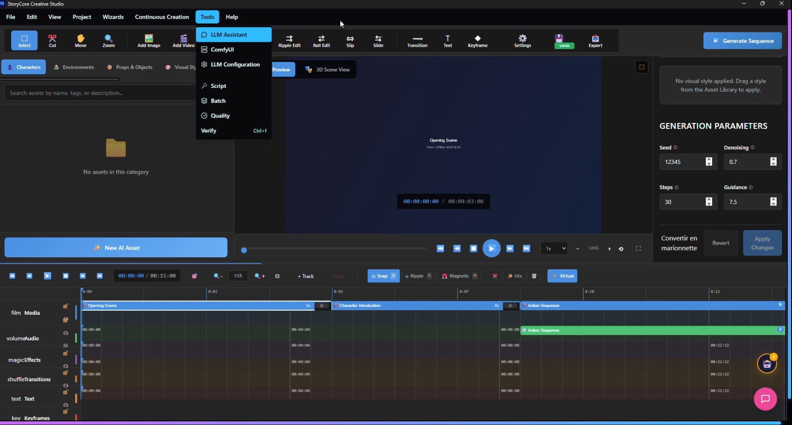

# 🎬 StoryCore-Engine
### The Self-Correcting Multimodal Production Pipeline

**From Script to Screen in 5 Minutes — With  Visual Coherence**

      


---


---

> **A Message from the Creator**
StoryCore is more than just a pipeline.
It’s a system that lets you control ComfyUI or other tools through add‑ons.
It helps you organize your entire workflow for video creation — from the written story, to the script, to the dialogue.
From 3D scene creation, to image generation, to text‑to‑image, to video, all the way to your cinematic work.
From long takes to individual shots, from visual planning to music.
From style to theme to genre — whatever you want to use.
Automation or semi‑automation powered by AI accelerates your entire creative process.

>The future of the internet? And of cinema? It’s on‑demand videos built according to people’s tastes. According to each customer. Directly on their TV. Basically, it’s instant, made‑to‑order cinema. But we’ll only really see that in five to ten years, I think.
For now, in any video you create, you have to tell a story. If it’s sloppy, meaningless content or just random life footage with no intention behind it, there’s no real reason for anyone to watch your video—except maybe for the emotional manipulation, where you’re really trying to influence the viewer’s mind

> I wanted to create a tool that modernizes long‑form video production without losing the soul of the craft. We start from the classic storyboard methods—the ones that shaped generations of creators—and we bring them into the present with the tools of our era.
>
> This isn't just another AI generator. It's a complete production pipeline: storyboard, visual coherence, narrative continuity, scene organization, character tracking, location consistency. The system remembers the entire project, just like a full team dedicated to artistic supervision.
>
> But above all, it respects the creators. The goal is not to replace artists, but to give them back time, freedom, and control. AI handles the repetitive tasks, while humans keep the vision, the emotion, and the direction. With this approach, a project that once required thirty people can now be handled by six to eight, allowing the rest of the team to focus on more creative, more human, and more meaningful work.
>
> And everything runs locally. Your data, your images, your scripts, your industrial secrets—everything stays on your machine. It's a sovereign tool, designed for studios, agencies, and independent creators who must protect their work. In a world where uploading a single file online is already a risk, I wanted to offer a safer, modern, and respectful alternative.
>
> In short, I wanted to build a bridge between yesterday and today: the rigor and poetry of traditional methods, combined with the speed and power of modern tools. A tool that accelerates production, secures your workflow, and frees creativity.

On top of all that, I’ve added an automated system for scientific checks.
If you’re working on documentaries, this can be extremely useful — or even for science‑fiction projects.
There are still a few adjustments to make to make the output a bit less strictly scientific, because right now it tends to be a little rigid on that part.
These refinements will be handled in future versions.

---

][(https://www.youtube.com/watch?v=P0K7DueyICo](https://youtu.be/P0K7DueyICo?si=kEvpsxMy4zeFEYqO))


---

## 📋 System Requirements

### Minimum Hardware
- **Display**: 1 screen, mouse, keyboard (microphone optional)
- **GPU**: NVIDIA RTX 3060 with 12GB VRAM (RTX 4070+ recommended)
- **RAM**: 32GB system memory
- **Storage**: ~500GB (includes ComfyUI models)
- **Software**: CUDA, PyTorch, Python 3.11+, latest GPU drivers

note : Be careful: even with an RTX 5060 and 32 GB of RAM — a fairly recent PC — generating a single image can take around 5 minutes. Generating a video can take anywhere from 15 to 30 minutes. Creating background music can take about 5 minutes.
As for dialogue generation, it will obviously depend on the length of the dialogue and the variables you apply. And on top of that, you might also add filters. As of right now, I’m not even sure if I’ve already integrated those filters into the user interface.

---




---
## 🚀 Quick Start

> **New to the project?** Start with [START_HERE.md](START_HERE.md) for guided navigation based on your role.

### Prerequisites

**Required Components:**
- **Graphics Card** - Minimum RTX 3060 with 12GB VRAM (recommended RTX 4070+ for optimal performance)
- **ComfyUI** - For AI image/video generation (download from [comfyanonymous.github.io](https://comfyanonymous.github.io/ComfyUI_get/))

Key Info:

ComfyUI Desktop uses port 8000
Manual ComfyUI uses port 8188
Full guides: Quick Start | Desktop Setup


- **Ollama** - For local LLM processing (download from [ollama.com](https://ollama.com/))

Both tools run locally and keep all your data secure on your machine.

### Installation

```bash
# Clone the repository
git clone https://github.com/zedarvates/StoryCore-Engine.git
cd storycore-engine

# Install dependencies
pip install -r requirements.txt
npm install

# Run the application
python storycore.py
```

### Basic Usage

```bash
# Initialize a new project
python storycore.py init my-project

# Generate visual coherence grid
python storycore.py grid --project my-project

# Run the full pipeline
python storycore.py promote --project my-project
```

---

## ✨ Key Features

- **Visual Coherence System** - Master Coherence Sheet ensures consistent style across all frames
- **Story builder System** - Master story ensures  coherences across video
- **Self-Correcting Pipeline** - Automatic quality detection and fixing during generation
- **Deterministic Output** - Reproducible results with seed control
- **Complete Local Processing** - No cloud dependencies, all data stays on your machine
- **Production-Ready** - Security validation, error handling, and resilience patterns

---

## 🏗️ Architecture

```
📝 Input (Script/Prompt)  → 🧠 Text Engine (Scene Breakdown + Shot Planning)
    ↓
🧠 LLM Processing (Ollama) → Scene Breakdown
    ↓
🎨 Visual Coherence Grid (ComfyUI) 🔀 Workflow Selection (Basic/Advanced)
    ↓
⚡ Quality Check & Auto-fix
    ↓
🔧 AutofixEngine (Parameter Adjustment + Re-processing Loop)
    ↓
🎬 Video Planning (Camera Movements + Transitions)
    ↓    
🎬 Video Generation (HunyuanVideo, Wan Video) | 🖼️ Image Generation (NewBie, Qwen)
    ↓
📦 Export Ready Output
```

ComfyUI Integration Layer (Production-Ready)

Advanced Workflows ( + 8 AI Models)
Data Flow & Performance
Validated Performance Metrics
Circuit Breaker
Fallback Chains
Graceful Degradation
Error Analytics

---
note : If you’re really in a hurry and you have Grok accounts, a Seeddance King account, and all the rest of that ecosystem — and if your video is just for testing and not a production at the peak of your capabilities — then it’s better to use those tools.
You can still rely on StoryCore to build the foundation, the story, and all that, because as of right now, they don’t yet have all the features I’ve added for creating long‑form videos. So you take the pre‑generated prompts from StoryCore, and you can run everything on their platform as your project progresses. That’s also a valid workflow.

---
## 🛡️ Error Handling & Resilience

StoryCore-Engine includes comprehensive error handling and resilience patterns for production reliability.

**Resilience Patterns:**
- Retry Mechanism with exponential backoff
- Circuit Breaker for fault tolerance
- Fallback Chains for graceful degradation
- Error Analytics for monitoring

---

## 📁 Project Structure

```
storycore-engine/
├── README.md                 # This file
├── storycore.py              # Main CLI entry point
├── backend/                  # FastAPI backend services
│   ├── main_api.py           # API server entry point
│   ├── llm_api.py            # LLM integration endpoints
│   ├── project_api.py        # Project management API
│   ├── video_editor_api.py   # Video editing endpoints
│   └── ...                   # Additional API modules
├── src/                      # Core engine modules
│   ├── grid_generator.py     # Visual coherence generation
│   ├── promotion_engine.py   # Content promotion pipeline
│   ├── qa_engine.py          # Quality assessment
│   ├── video_engine.py       # Video processing
│   ├── comfyui_manager.py    # ComfyUI integration
│   ├── narrative_engine.py   # Story processing
│   └── ...                   # Additional engine modules
├── creative-studio-ui/       # React/TypeScript frontend
├── workflows/                # ComfyUI workflow definitions
├── docs/                     # Documentation
├── documentation/            # Technical documentation
└── tests/                    # Test suite
```

---

## 🔧 Development

### Building the Application

**Production Build:**
```bash
# Build UI and Electron app
npm run build

# Package for distribution
npm run package:win   # Windows
npm run package:mac   # macOS
npm run package:linux # Linux
```

**Build Status:** ✅ All builds passing
- UI Build: ~8s
- Electron Build: Complete
- TypeScript: No errors
- Bundle Size: 1.38 MB (356 KB gzipped)

**For detailed build information, see:** [BUILD_REPORT.md](BUILD_REPORT.md)


---

## 🎯 Future Roadmap (Post-Launch Enhancements)

### 📊 Visual Roadmap

| Phase | Feature | Status | Description |
|-------|---------|--------|-------------|
| **Phase 1** | Advanced Camera Movements | 🔜 Planned | Bezier curves and complex transitions |
| **Phase 1** | Multi-format Export | 🔜 Planned | MP4 generation from video plans |
| **Phase 2** | Collaborative Features | 📋 Backlog | Multi-user project management |
| **Phase 2** | Performance Optimization | 📋 Backlog | Parallel processing and caching |
| **Phase 3** | Plugin Architecture | 📋 Backlog | Custom engine extensions |
| **Phase 3** | Cloud Deployment | 📋 Backlog | Scalable cloud infrastructure |
| **Phase 4** | Real-time Monitoring | 📋 Backlog | Enhanced monitoring with alerting |
| **Phase 4** | Multi-character Scenes | 📋 Backlog | Advanced scene composition |
| **Phase 5** | Studio Integration | 📋 Backlog | Enterprise deployment and scaling |

### 📋 Milestone List

1. **v0.2.0** - Advanced Camera Movements & Transitions
2. **v0.3.0** - Multi-format Export (MP4)
3. **v0.4.0** - Collaborative Features
4. **v0.5.0** - Performance Optimization
5. **v1.0.0** - Plugin Architecture & Cloud Ready

---

**Planned Features:**
- Advanced Camera Movements: Bezier curves and complex transitions
- Multi-format Export: MP4 generation from video plans
- Collaborative Features: Multi-user project management
- Performance Optimization: Parallel processing and caching
- Plugin Architecture: Custom engine extensions
- Cloud Deployment: Scalable cloud infrastructure
- Real-time Monitoring Dashboard: Enhanced monitoring with alerting
- Multi-character Scenes: Advanced scene composition
- Professional Studio Integration: Enterprise deployment and scaling

---

## 📚 Documentation

### Getting Started
- [Quick Start Guide](docs/COMFYUI_QUICK_START.md) - ComfyUI setup in 2 minutes
- [Documentation Index](DOCUMENTATION_INDEX.md) - 📑 **START HERE** - Complete documentation navigation
- [Quick Reference](QUICK_REFERENCE.md) - Common commands and workflows

### Build & Development
- [Build Success Summary](BUILD_SUCCESS_SUMMARY.md) - ✅ Latest build status (Jan 23, 2026)
- [Build Report](BUILD_REPORT.md) - Detailed build analysis and metrics
- [Test Fixes](FIX_TESTS.md) - Test improvements and known issues
- [TODO List](TODO.md) - Master TODO and task tracking
- [Release Notes](RELEASE_NOTES_2026_01_23.md) - Latest release information
- [Changelog](CHANGELOG.md) - Version history

### Technical Documentation
- [Technical Guide](documentation/TECHNICAL_GUIDE.md) - Architecture and implementation
- [API Reference](documentation/api/) - API documentation
- [Troubleshooting](documentation/TROUBLESHOOTING.md) - Common issues and solutions
- [Project Index](INDEX.md) - Complete project structure


---

## 🏅 Built for Hackathon 2026

**Team:** StoryCore-Engine Development Team  
**Duration:** 210+ hours  
**Focus:** Coherence-first, measurable multimodal pipeline  
**Result:** Production-ready system with professional interfaces

*Redefining how creators interact with multimodal AI through guaranteed visual coherence and autonomous quality control.*
