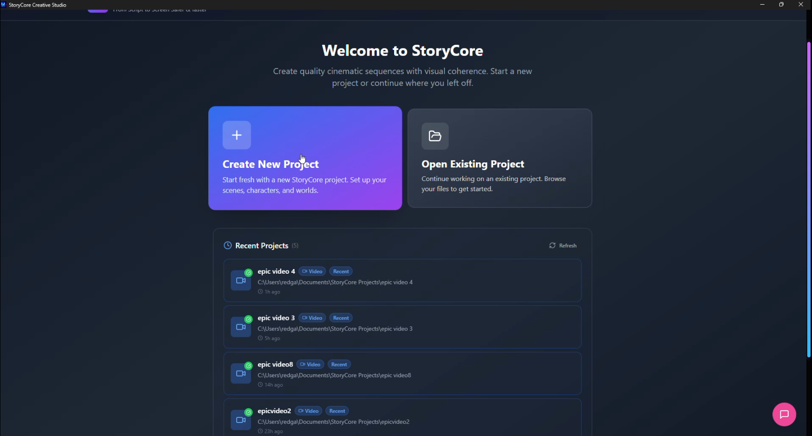
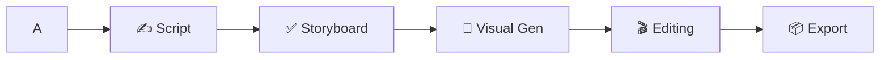
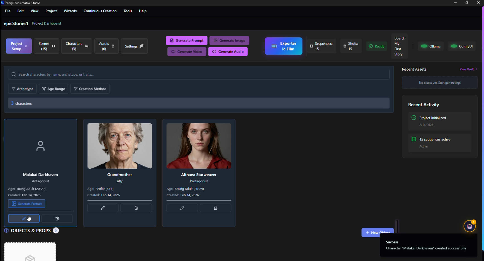
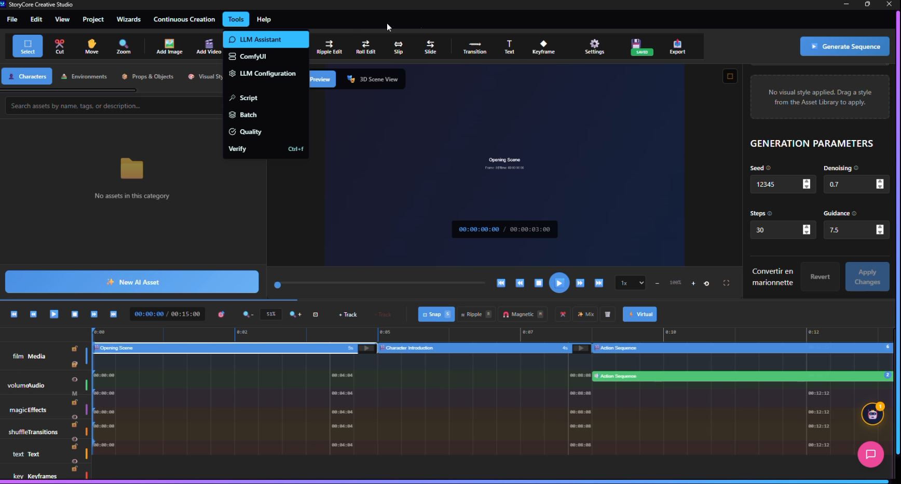

# 🎬 StoryCore Engine

## The Self-Correcting Multimodal Production Pipeline

## Vision

**From Script to Screen in Minutes — With Visual Coherence**

      


> **From Script to Screen in Minutes** - Self-correcting multimodal video pipeline with guaranteed visual coherence. 100% local processing. Data sovereignty.

---



---

## 🌟 A Message from the Creator

<details>
<summary><b>Read the vision</b></summary>

StoryCore is more than just a pipeline. It’s a system that lets you control ComfyUI or other tools through add‑ons. It helps you organize your entire workflow for video creation — from the written story, to the script, to the dialogue.

> "The future of the internet? And of cinema? It’s on‑demand videos built according to people’s tastes. According to each customer. Directly on their TV. Basically, it’s instant, made‑to‑order cinema."

I wanted to create a tool that modernizes long‑form video production without losing the soul of the craft. We start from the classic storyboard methods—the ones that shaped generations of creators—and we bring them into the present with the tools of our era.

**This isn't just another AI generator.** It's a complete production pipeline: storyboard, visual coherence, narrative continuity, scene organization, character tracking, location consistency. The system remembers the entire project, just like a full team dedicated to artistic supervision.

But above all, it **respects the creators**. The goal is not to replace artists, but to give them back time, freedom, and control. AI handles the repetitive tasks, while humans keep the vision, the emotion, and the direction.

And everything runs **locally**. Your data, your images, your scripts, your industrial secrets—everything stays on your machine. It's a sovereign tool, designed for studios, agencies, and independent creators who must protect their work.
</details>
---

## 🎯 Why StoryCore?

<details open>
<summary><b>Competitive Advantages</b></summary>

| Benefit | Impact |
| :--- | :--- |
| **100% Local Processing** | Data secured on your machine, no leaks. |
| **Visual Coherence** | Consistent style across all scenes and shots. |
| **Self-Correcting Pipeline** | Guaranteed quality without manual intervention. |
| **Native ComfyUI Integration** | Optimized professional workflows. |
| **Data Sovereignty** | No cloud, no subscription risks, full ownership. |

**Cost Reduction**: From a team of 30 to 6-8 creators.
**Time Saving**: From script to screen in minutes, not months.
</details>
---

## 🚀 Concrete Use Cases

<details open>
<summary><b>Production Examples</b></summary>

| Content Type | Benefit | Estimated Time* |
| :--- | :--- | :--- |
| **Scientific Documentaries** | Guaranteed visual accuracy & fact-checking. | 20-30 min |
| **Indie Short Films** | Stylistic consistency & narrative flow. | 15-25 min |
| **Educational Content** | Professional quality & rapid iteration. | 10-20 min |
| **Corporate Presentations** | Consistent branding & private data handling. | 5-15 min |

*\*Excluding media generation time.*
</details>

### Workflow


```mermaid
graph LR
    A --> B[✍️ Script] --> C[✅ Storyboard]
    C --> D[🎨 Visual Gen]
    D --> E[🎬 Editing]
    E --> F[📦 Export]
```

---

## 📋 System Requirements

### Minimum Hardware

- **GPU**: NVIDIA RTX 3060 with 12GB VRAM (RTX 4090+ recommended for speed)
- **RAM**: 32GB system memory
- **Storage**: ~500GB SSD (fast NVMe recommended)
- **OS**: Windows 10/11 (WSL2 supported), Linux

*Note: Generating a single high-quality image can take minutes on lower-end hardware. Video generation is compute-intensive.*

---

## ⚡ Quick Start

### Installation in 5 Minutes

1. Clone the repository

   ```bash
   git clone https://github.com/zedarvates/StoryCore-Engine.git
   cd storycore-engine
   ```

2. Install dependencies

   ```bash
   pip install -r requirements.txt
   npm install
   ```

3. Install ComfyUI (Optional but Recommended)

   Choose one of the two options below:

   **Option A — ComfyUI Standard** *(advanced users)*
   - Download from [ComfyUI GitHub](https://github.com/comfyanonymous/ComfyUI)
   - Default port: `8188`

   **Option B — ComfyUI Desktop** *(recommended for beginners)*
   - Download from [ComfyUI Desktop GitHub](https://github.com/Comfy-Org/ComfyUI_desktop?tab=readme-ov-file)
   - Default port: `8000`

   > [!IMPORTANT]
   > **CORS must be enabled** in ComfyUI settings. Set the allowed origins to `*` to allow StoryCore Engine to communicate with it.

4. Start the Engine

   ```bash
   python storycore.py
   ```

### 🖥️ Multi-Machine Connectivity (Recommended)

Running Orchestrator, LLMs, and ComfyUI simultaneously requires significant system resources. You can offload the rendering backends (ComfyUI and Ollama) to a dedicated GPU server on your local network, allowing your main computer to purely orchestrate the story generation.
👉 **[Read the Multi-Node Setup Guide](docs/MULTI_NODE_SETUP.md)**

### Video Pipeline Demo

[▶️ StoryCore E2E CLI Demo Video](https://www.youtube.com/watch?v=P0K7DueyICo)

You can run a local test of the orchestration pipeline even without a GPU using mock mode:

```bash
python scripts/run_e2e_demo.py --canonical --mock
```

---

## 📸 Interface






---

## ✨ Key Features

### 🎬 Video Generation

<details open>
<summary><b>Advanced Production Features</b></summary>

- **Visual Coherence System**: Master Coherence Sheet ensures consistent style.
- **Total Recall (Living Protocol)**: Persistent neural memory that captures stylistic decisions, character facts, and production rules as they emerge during chat or creation.
- **Multimodal Vision Analysis**: Native support for analyzing reference images to extract visual archetypes, atmospheres, and cinematic styles.
- **Multi-Model Support**: Flux, SDXL, NewBie, Qwen 2.5-VL, HunyuanVideo, Wan Video.
- **Self-Correcting**: Automatic quality detection and auto-fix capability.
- **Advanced Video AI (Power Tools)**:
  - **Smart Zoom & Pan Scan**: Intelligent face-tracking and dynamic reframing (9:16 vertical video support).
  - **Magic Mask**: AI-driven subject isolation and background removal.
  - **Transcription & OCR Search**: Navigate and search your video timeline by spoken words or on-screen text.
  - **Cinematic Flow**: Automated J-cuts and L-cuts for professional dialogue transitions.
  - **Audio Mastering**: Auto-Ducking, Voice Isolation, and High-Fidelity Cinematic EQ presets.
  - **VFX Polish**: Hellation, Color Isolation (Sin City style), and Dynamic Grain/Vignette.
  - **Multi-Angle Camera**: Instant scene variations from different cinematic angles (Low/High/Aerial).
  - **Voice-Directed 3D Controls (VDC)**: Orchestrate your 3D scene using natural language. Add objects (cars, props, NPCs), adjust camera distances, and change lighting modes (Dramatic, Night, Bright) in real-time.
  - **Automated Visual Coherence**: The engine automatically injects your project's visual style into every generation, ensuring that all 3D-to-Image and Prompt-to-Video outputs strictly follow your artistic direction.
  - **Composition Architect (v3.5)**: Professional-grade layout system with interactive overlays (Rule of Thirds, Golden Ratio, Perspective/Vanishing lines, Safe Areas).
  - **Shot Mockup Editor**: Layer-based spatial prototyping. Pre-visualize scenes by dragging characters, props, and background extras onto a 16:9 canvas before rendering.
  - **Emotional Graph RAG**: Advanced narrative mapping that detects complex relationship states (Loves, Hates, Trusts, Betrayed, Rivalry) to drive deep dialogue generation.
  - **Character Consistency Sheets**: Effortless generation of Face/Profile/Back reference sheets for steady character design.
  - **Enhanced Neural Assistant (v4)**: Floating AI companion with contextual pro-active buttons (Storyteller, Style, Logic), account management shortcuts, and dynamic layout adaptation.
  - **tttLRM 3D Reconstruction (CVPR 2026)**: Transform single images or 360 videos into high-fidelity 3D Gaussian Splats at 1024 resolution. Features Test-Time Training (TTT) adaptation for superior geometry.
  - **Native Gaussian Splat Viewer**: Premium 3D viewer integrated into the UI with OrbitControls, real-time rendering, and glassmorphism interface.
  - **Automated 3D Set Builder**: Automatically drafts 3D blocking layouts (primitives) from script breakdowns. Generates native manifests for **PrimitiveAnything** and **Playbook-nodes** in ComfyUI.
  - **Pro-Grade Lip-Sync Hub**: End-to-end phoneme-to-viseme pipeline. Generates precise animation data for Blender to sync character mouth movements with AI-generated audio instantly.
  - **Make-It-Animatable (PuppeT)**: Native support for rigging 3D puppets directly in ComfyUI, allowing AI-driven animation and posing of character meshes.
  - **Blender-in-ComfyUI Link**: Bidirectional synchronization between Blender's 3D viewport and ComfyUI's generative nodes for real-time AI-enhanced 3D rendering.
  - **Material Modifier Sync**: Link StoryCore’s aesthetic palettes to ComfyUI material nodes (Roughness, Metallic, Emissive) for consistent look-and-feel across 3D and 2D assets.
- **Weighted Prompt Composer (v1.0)**: Advanced semantic weighting system (0-100) for verbs and adjectives. Includes inline Hue Picker for color terms, Global Tone control (❄️/🔥), and Post-Response Compliance analysis.
- **Stable LLM VRAM Management**: Proactive memory management for local models (Ollama/LM Studio). Features auto-purge, éphémère loading (keep_alive: 0) for analysis tasks, and automatic OOM recovery.

</details>

### 🛠 Neural Augmented Creation & Project Genesis

<details>
<summary><b>Methodology & Asset Creation</b></summary>

- **"Bout en Bout" (End-to-End) Methodology**: Strict production bible enforcement for different modes (Fiction, Documentary, Music Video, Social Media, Cinematic).
- **Context-Bound Intelligence**: Every created character, world, and story part is cross-referenced with the **Total Recall Working Context**, ensuring zero narrative drift.
- **Autonomous Genesis**: AI can now autonomously suggest names, archetypes, and lore based on the project's living protocol, transforming creative prompts into fully realized entities instantly.
- **Multi-Methodology Weaving**: From legacy sequential generation to advanced structured drafting, the methodology engine uses neural augmentation to maintain consistency across different creative workflows.
- **Vision-to-Asset Genesis**: Transform visual inspiration into persistent project assets (Characters, Worlds, Objects) with the integrated Multimodal Vision system.
</details>

### ✍️ Story & Content Creation

<details>
<summary><b>Audio & Dialogue</b></summary>

- **AI Dialogue**: Natural voice generation with emotion control.
- **Background Music**: Automatic composition based on scene mood.
- **Sound Effects**: Integrated SFX library and synchronization.
</details>

### 🛠️ Production Tools

<details>
<summary><b>Tracking & Registry</b></summary>

- **Production Ledger**: A verified manifest of all AI-generated assets (Character Sheets, Style Guides, Lore fragments).
- **Director Rig Metadata**: High-fidelity technical metadata for shots (Lens geometry, Sensor look, Emotional intensity).
- **World Aesthetic Registry**: Persistent visual intent registry (Colors, Vibe, Artistic Signature) integrated with the World Genesis engine.
- **Production Guide**: Comprehensive shot recap with Technical Rig metadata (Lens, Sensor, Emotion).
</details>

### 🧠 Neural Brain — RLM Engine + GraphRAG

<details open>
<summary><b>Reasoning & Lore Consistency</b></summary>

The **Recursive Language Model (RLM)** engine transforms StoryCore's assistant from a simple Q&A chatbot into a **deep reasoning system** capable of actively exploring massive contexts, decomposing complex tasks, and self-correcting its own outputs through a multi-stage reflection loop.

| Capability                    | Description |
| :---                          | :---        |
| **Recursive Reasoning**       | Multi-iteration exploration loop: the AI writes Python code to analyze context, decomposes into subtasks, then synthesizes a final answer. |
| **Parallel Subtasks**         | Complex requests are split into independent sub-problems solved concurrently via async execution. |
| **Critique-Correction Loop**  | Every draft answer is validated against the Knowledge Graph before being returned — plot holes are caught automatically. |
| **Secure Python Sandbox**| AST-validated REPL with `math`, `json`, `re` — the LLM can run code safely without system access. |
| **Step Trajectory**           | Every internal reasoning step is captured and streamed to the UI in real-time for full transparency. |

**Knowledge Graph (GraphRAG):**

- **In-Process Graph Store**: Tracks characters, locations, objects, and events as nodes with directed relationship edges. Persisted as JSON per-project — zero external dependencies.
- **Character Arc Tracking**: Traces how each character evolves across scenes — relationships formed, locations visited, status changes — enabling the AI to reason about narrative progression.
- **Emotional Relationship Mapping**: 18+ semantic patterns detect dynamic bonds (loves, hates, trusts, betrayed, rival_of) to inject emotional subtext into AI-generated scripts.
- **Timeline Reconstruction**: Automatically reconstructs the chronological flow of the story, grouped by scene, with per-scene character lists and event summaries.
- **Contradiction Detection**: 12 extraction patterns (English & French) detect conflicts against the established lore (`ally_of` ↔ `enemy_of`, `alive` ↔ `dead`, betrayal, possession, etc.).
- **Fuzzy Entity Search**: Lightweight 26-dim character-frequency vectors enable approximate entity matching even with typos or alternate spellings.
- **Visual Graph Explorer**: Interactive force-directed canvas visualization with clickable nodes, glowing effects by entity type, and glassmorphism overlays.
</details>
```
RLM Reasoning Flow:
  Prompt → Active Exploration (Python REPL)
         → Task Decomposition (Subtasks)
         → Parallel Solving (Async)
         → Synthesis (FINAL_ANSWER)
         → GraphRAG Critique (Lore + Consistency)
         → Approved Answer
```

---

## 📐 "Bout en Bout" (End-to-End) Methodology

The engine enforces a strict **Production Bible** structure for every project, ensuring that the AI doesn't just "dream" a story, but "constructs" a producible asset according to industry-specific constraints.

| Production Mode | Minimum Requirements | Key Technical Focus |
| :--- | :--- | :--- |
| **Fiction** | 3 Characters (Triangle), 3 Locations | Narrative progression & spatial Trinity |
| **Documentary** | 2 Speakers/Narrators, 2 Contexts | Evidence-based objects & Diegetic SFX |
| **Music Video** | Verse/Chorus structure synced | Visual rhythm & BPM synchronization |
| **Social Media** | Hook (0-3s), Fast cuts, Outro CTA | High-retention hooks & Platform ratios |
| **Interview** | 2 Persons min, Q&A flow | Reaction shots & Dialogue clarity |
| **Cinematic Pro** | Detailed Lens/Lighting metadata | Camera rigging (Dolly/Pan/Tilt) |
| **Review (Tech/Game/Sci)** | Specs, Verdict, Demo assets | Macro shots & Technical precision |
| **Educational (Hist/Sci)** | Archival docs, Evidence, Maps | Factual grounding & Lore consistency |
| **Lifestyle/Maker** | Materials, Process, Showcase | ASMR/Tools SFX & Action-oriented shots |
| **Faith/Reflective** | Ambient, Meditative atmospheres | Silences & Atmospheric lighting |
| **Masterclass** | Chapters, Text overlays, B-roll | Educational flow & visual emphasis |
| **Real Estate** | Wide shots, Smooth movements | Material textures & spatial flow |
| **Product Hype** | Macro rotations, Dramatic light | Aesthetic "Reveal" & Design focus |
| **Gardening** | Tools, Plants, Soil, Greenhouses | Nature SFX & Botanical precision |
| **Renovation** | Before/After sites, Construction tools | Transformation flow & Process clarity |

Every story generation automatically populates:

- **Story Props**: Classified as "Worn" (character-bound) or "Immutable" (location-bound).
- **Spatial SFX**: Interaction sounds (objects), signatures (characters), and ambiences (global).

---

## 🧩 Official Add-ons (Included)

StoryCore Engine comes with a set of powerful official add-ons to extend its capabilities:

<details>
<summary><strong>🎨 Comic Generator</strong> — Comic book, manga & webtoon automation</summary>

Automates the creation of consistent comic book pages, mangas, or webtoons using your project's characters and narrative data. Handles panel layout, dialogue bubble placement, and visual style consistency across the entire publication.

</details>

<details>
<summary><strong>🛡️ Content Sensitivity</strong> — Smart content moderation & creative adaptation</summary>

A full-featured content moderation suite for professional distribution. Goes far beyond simple censorship by offering intelligent, narrative-preserving alternatives at every level — word, dialogue, scene, and image.

**Multi-layer Content Analysis**
- **Dialogue Analysis** — Automatic keyword detection for religion, racism, xenophobia, and political sensitivities in all dialogues.
- **Scenario Analysis** — Detects cultural conflicts, ideological clashes, and politically charged situations within scene descriptions.
- **Clothing Analysis** — Flags culturally inappropriate or context-mismatched clothing with alternative suggestions.
- **Image Analysis** — Identifies potentially sensitive visuals for automated post-processing.
- **Keyword Detector** — Extensible engine covering weapons, drugs, violence, adult content, extremist symbols, and criminal organizations.

**PEGI Rating Engine**
Automatically calculates a PEGI rating for any content package:

| Rating   | Score | Content Type                        |
| :---     | :---  | :---                                |
| PEGI 3   | ≤ 30  | Suitable for all ages               |
| PEGI 7   | ≤ 60  | Mild fear or tension                |
| PEGI 12  | ≤ 80  | Moderate violence or language       |
| PEGI 16  | ≤ 90  | Realistic violence, strong language |
| PEGI 18  | ≤ 100 | Extreme violence, adult themes      |

Content indicator pictograms auto-detected: Violence, Language, Fear, Drugs, Sex, Discrimination, Gambling, In-app Purchases, Online Interactions.

**Woke / Anti-Woke Gauge**
A unique ideological balance indicator: detects *woke* vocabulary (diversity, inclusion, equity, social justice) and *anti-woke* vocabulary (conservatism, libertarianism, traditional values) and produces a combined, visualized score (green / yellow / red).

**🎭 Narrative Substitution Engine** *(New)*
Instead of a blunt `[CENSORED]` tag, sensitive terms are replaced by **contextually coherent creative alternatives** that preserve the scene's dramatic tension. Each substitution is tuned by tone:
- `neutral`     — Stays close to realism (e.g. firearm → power drill)
- `poetic`      — Literary metaphor (e.g. blood → crimson ink)
- `absurde`     — Disruptive humor (e.g. bomb → carved pumpkin)
- `enfantin`    — Child-safe rewording (e.g. knife → cork saber)
- `symbolique`  — Archetypal replacement (e.g. skull → Venetian carnival mask)

Coverage: firearms, rifles, bombs, knives, cocaine, heroin, cannabis, syringes, murder, blood, hate symbols, adult content, criminal organizations, kidnapping.

**🎬 Cinematic Scene Substitution Engine** *(New)*
For entire scenes, suggests **classic filmmaking techniques** to imply content without showing it — the "effect without the cause" principle used in professional cinema:
- **Cutaway**             — A door closing, a shadow on the wall, an empty room after the fact.
- **Reaction shot**       — A bystander's face instead of the act itself (Hitchcock's rule).
- **Insert**              — Shoes falling, hands intertwining, a dying fire in the hearth.
- **Sound only**          — Audio off-screen with a city skyline or black screen.
- **Symbolic**            — A candle going out, leaves falling, two intertwined hands.

Scenes covered: explicit intimacy, graphic violence, drug consumption. Each scene includes **locale adaptations** with culturally appropriate preferred shots for: 🇫🇷 France, 🇺🇸 USA, 🇯🇵 Japan, 🇰🇷 South Korea, 🇮🇳 India, 🇩🇪 Germany, 🇸🇦 Gulf region, 🇳🇱 Netherlands.

**🖼️ Image Pixelation Engine**
Automatic sensitive-area pixelation with three intensity levels:
- `low` — 8px block size (subtle, shape still visible)
- `medium` — 16px block size (standard censorship bar)
- `high` — 32px block size (aggressive, fully unreadable)

Supports targeted zones (`face`, `body`, `full`, or custom bounding boxes). Runs in both Node.js (via `sharp`) and in-browser (via Canvas API). Files can be saved to disk or returned as a base64 data-URL for the UI.

**Two-layer Censorship Pipeline**
Every text is processed in sequence:
1. **Narrative substitution** (creative alternatives, tone-selectable)
2. **Raw fallback** `[CENSORED]` for terms not covered (can be disabled with `narrativeOnly: true`)

The result reports the method used (`narrative`, `raw`, or `mixed`) so you know exactly how each piece of content was handled.

</details>

<details>
<summary><strong>🖼️ Grok Imagine</strong> — xAI Grok image & video generation</summary>

High-performance integration with xAI's Grok API for state-of-the-art image and video generation directly within your pipeline. Supports the latest Grok vision models for ultra-realistic outputs without leaving StoryCore.

</details>

<details>
<summary><strong>📡 MCP Server</strong> — Model Context Protocol integration</summary>

Implements the Model Context Protocol (MCP) to connect StoryCore with external tools and services via a standardized JSON-RPC interface. Enables seamless communication between StoryCore and any MCP-compatible AI agent or tool.

</details>

<details>
<summary><strong>🎬 Recap Engine</strong> — Automated YouTube-style recap video generation</summary>

Automatically transforms your comic pages into narrated YouTube-style "Recap" videos with synthetic voice-over and dynamic pan/zoom animations. Ideal for publishing story recaps or teasers directly from your production pipeline.

</details>

<details>
<summary><strong>🌐 Project Translator</strong> — Full local AI project translation</summary>

Full project translation engine using local AI (Ollama). Ensures semantic consistency of characters and locations across languages using Jina Embeddings v5 — no data ever leaves your machine.

**Supported Languages (Zero-Shot Context Aware)**:

- 🇬🇧 English   (`en-US`, `en-GB`)
- 🇫🇷 French    (`fr-FR`, `fr-CA`)
- 🇪🇸 Spanish   (`es-ES`, `es-MX`)
- 🇩🇪 German    (`de-DE`)
- 🇮🇹 Italian   (`it-IT`)
- 🇯🇵 Japanese  (`ja-JP`)

</details>

<details>
<summary><strong>📹 Seedance 2.0</strong> — AI video, audio & 3D asset generation</summary>

Advanced multimedia production tool for generating high-fidelity AI videos, native audio, and 3D assets via the Seedance API. Integrates directly into your StoryCore production timeline.

</details>

<details>
<summary><strong>🏗️ StoryCore Asset Creator</strong> — 2D image to 3D asset pipeline</summary>

A bridge between 2D images and 3D worlds, using ComfyUI Trellis2 and Blender to generate 3D props and character puppets instantly. Turn any concept art or reference image into a usable 3D asset in seconds.

</details>

<details>
<summary><strong>👄 Lip-Sync & Audio</strong> — Automated audio-to-video synchronization</summary>

Automated audio-to-video synchronization (Lip-Sync) and advanced audio production workflows for emotional voice-overs. Supports multiple characters and multi-language voice assets within the same scene.

</details>

<details>
<summary><strong>🎭 Casting Studio</strong> — Character consistency & actor performance management</summary>

Manage character consistency and varied actor performances across multiple shots and sequences. Ensures that every appearance of a character stays visually and emotionally coherent throughout your production.

</details>

<details>
<summary><strong>🎬 Credits & Cinematic Screens</strong> — Automated credits & industry watermarking</summary>

Generates professional cinematic credits with customizable scroll speed, text, and duration. Includes a **Sequence Plan Automation** system that automatically injects a new plan at the beginning or end of your project. Native support for PEGI and Censure watermarks.

</details>

<details>
<summary><strong>📦 Video Studio Publisher</strong> — Multi-platform distribution hub</summary>

Unified publishing interface for professional creators. Direct export and API integration with major platforms, including StoryCore Blog and NexRealm Marketplace. Handles metadata, thumbnail generation, and platform-specific formatting.

</details>

<details>
<summary><strong>✨ Transitions & FX Pack</strong> — Cinematic transitions & visual effects</summary>

A library of cinematic transitions and specialized visual effects tailored for AI-generated footage. Plug-and-play FX that blend seamlessly with StoryCore's automated editing pipeline.

</details>

<details>
<summary><strong>🌐 NexRealm Marketplace</strong> — Built-in asset marketplace</summary>

Built-in marketplace powered by [nexrealm.store](https://nexrealm.store) for discovering, buying, and one-click installing assets: characters, locations, 3D scenes, objects, audio, styles, add-ons, templates — free & paid. Supports automatic updates and community-published content.

</details>

> [!TIP]
> **Addon Marketplace**: We are currently developing a centralized marketplace at [nexrealm.store](https://nexrealm.store) for one-click installation and automatic updates of official and community addons.

### 🏗️ Architecture

- **100% Local**: All core processing runs on your machine — no external API required.
- **Extensible**: Robust add-on system with hooks, events, permissions, CLI, and a validator for building and integrating custom tools.
- **Resilient**: Circuit breakers, retry mechanisms, advanced error handling, and an auto-fix engine for long-running tasks.
- **Agent-Ready**: Full event-driven communication layer (`addon_events`) for AI assistants and external agents.
- **API-First**: FastAPI REST backend + WebSocket real-time channel for full UI and SDK integration.
- **ComfyUI-Native**: Deep integration with both ComfyUI Standard (port 8188) and ComfyUI Desktop (port 8000).
- **AI-Augmented**: Dedicated AI engines for shot composition, color grading, audio enhancement, script analysis, and error handling.
- **Multi-Machine Ready**: Each StoryCore instance connects to a fully configurable ComfyUI endpoint — `host`, `port`, and credentials are set via config file or environment variables (`COMFYUI_HOST`, `COMFYUI_PORT`). This makes it straightforward to distribute generation across multiple dedicated machines on a local network, effectively forming a **manual generative cluster** where each node runs its own ComfyUI instance. A native multi-node load-balancer with automatic work distribution is on the roadmap.

---

## 🏗️ Architecture Overview

<details open>
<summary><b>System Block Diagram</b></summary>


```mermaid
graph TD
    Input["📝 Input\n(Script / Prompt / Image)"] --> StoryEngine

    subgraph StoryEngine ["🧠 Story Engine"]
        LLM["LLM Processing\n(Ollama / RLM)"]
        Script["AI Script Analysis"]
        Scene["Scene Breakdown"]
        Char["Character Dev\n& Consistency"]
        Memory["Total Recall\n(Living Protocol)"]
    end

    StoryEngine --> VisualPlanning

    subgraph VisualPlanning ["🎨 Visual Planning"]
        Grid["Visual Coherence Grid\n(Master Sheet)"]
        Shot["Shot Planning\n& Camera Rigging"]
        ShotAI["Composition Architect\n(Overlays & Mockups)"]
        World["World Aesthetic\nRegistry"]
    end

    VisualPlanning --> Production

    subgraph Production ["🎬 Production Pipeline"]
        ComfyUI["ComfyUI\n(Standard / Desktop)"]
        ImgGen["Image Generation\n(Flux / SDXL / Grok)"]
        VidGen["Video Generation\n(HunyuanVideo / Wan / Seedance)"]
        AudioGen["Audio Engine\n(Voice / Music / SFX)"]
        LipSync["Lip-Sync &\nAudio Mastering"]
        AutoFix["Quality Check\n& Auto-fix Engine"]
        ColorGrade["AI Color Grading"]
    end

    Production --> AddonLayer

    subgraph AddonLayer ["🧩 Add-on System"]
        AddonMgr["Addon Manager\n& Validator"]
        Hooks["Hooks & Events"]
        ContentSens["🛡️ Content Sensitivity\n(PEGI / Narrative Sub.)"]
        Comic["🎨 Comic Generator"]
        Recap["🎬 Recap Engine"]
        Translator["🌐 Project Translator"]
        AssetCreator["🏗️ Asset Creator\n(3D / Trellis2 / Blender)"]
        Marketplace["🌐 NexRealm\nMarketplace"]
    end

    AddonLayer --> API

    subgraph API ["⚙️ API & Communication Layer"]
        REST["FastAPI\nREST API"]
        WS["WebSocket\n(Real-time UI)"]
        MCP["MCP Server\n(JSON-RPC)"]
        AgentBus["Agent Event Bus"]
    end

    API --> Export["📦 Export\n(MP4 / WebM / PDF / Assets)"]
```
</details>
---

## 🔧 For Developers

### API & SDK
- **REST API**: FastAPI backend for integration.
- **WebSocket**: Real-time communication for UI updates.
- **Python SDK**: Easy integration for custom scripts.
- **CLI Tools**: Full automation capabilities.

#### RLM & Knowledge Graph API

| Method | Endpoint                                | Description                                    |
| :---   | :---                                    | :---                                           |
| `POST` | `/api/v1/generate/rlm/generate`         | Deep reasoning generation with step trajectory |
| `GET`  | `/api/v1/generate/rlm/graph`            | Full Knowledge Graph (nodes, edges, stats)     |
| `GET`  | `/api/v1/generate/rlm/graph/timeline`   | Narrative timeline reconstruction              |
| `GET`  | `/api/v1/generate/rlm/graph/arc/{name}` | Character narrative arc                        |
| `POST` | `/api/ttt-lrm/reconstruct/image`        | Single Image to 3D Gaussian Splat (1024px)     |
| `POST` | `/api/ttt-lrm/reconstruct/video`        | 360 Video to 3D Scene Reconstruction           |
| `POST` | `/api/ttt-lrm/convert/gs-to-mesh`       | 3DGS to GLB/OBJ Mesh conversion                |

### Documentation
- **[Quick Start](documentation/user_guide/comfyui_integration/COMFYUI_QUICK_START.md)** - Setup guide
- **[API Reference](documentation/api_reference/README.md)** - Full API docs
- **[Technical Guide](documentation/TECHNICAL_GUIDE.md)** - Deep dive into architecture
- **[Contributing](CONTRIBUTING.md)** - Join the project

---

## 🗺️ Roadmap 2026

| **Phase**       | Feature                                                                | Status         |
| :---        | :---                                                                   | :---           |
| **Q1 2026** | Neural Production Assistant                                            | ✅ Completed   |
| **Q1 2026** | Total Recall AI Memory (Living Protocol)                               | ✅ Completed   |
| **Q1 2026** | Multimodal Vision Integration                                          | ✅ Completed   |
| **Q1 2026** | World Aesthetic Registry & Genesis                                     | ✅ Completed   |
| **Q1 2026** | Augmented Content Creation Engine                                      | ✅ Completed   |
| **Q1 2026** | Advanced Camera Movements & Rigging                                    | ✅ Completed   |
| **Q1 2026** | Neural Augmented Creation & Project Genesis                            | ✅ Completed   |
| **Q1 2026** | Recursive LLM Service (RLM) & Parallel Subtasks                        | ✅ Completed   |
| **Q1 2026** | GraphRAG & Knowledge Graph Lore Continuity                             | ✅ Completed   |
| **Q1 2026** | Character Arc Tracking & Timeline Reconstruction                       | ✅ Completed   |
| **Q1 2026** | Lore Graph Visualization (Force-Directed Canvas)                       | ✅ Completed   |
| **Q1 2026** | RLM Critique-Correction Loop (12 Consistency Patterns)                 | ✅ Completed   |
| **Q1 2026** | Location & Object Reference Sheets                                     | ✅ Completed   |
| **Q1 2026** | **Creative Studio v3.5: Bidirectional Sync**                           | ✅ Completed   |
| **Q1 2026** | **"Bout en Bout" Production Bible Methodology**                        | ✅ Completed   |
| **Q1 2026** | **Composition Architect (Overlays & Mockups)**                         | ✅ Completed   |
| **Q1 2026** | **Multi-Mode Generation (Social, Music, Doc, Cinema)**                 | ✅ Completed   |
| **Q1 2026** | **Open Project Folder Tracking**                                       | ✅ Completed   |
| **Q1 2026** | **Weighted Prompt Composer (Semantic Weighting)**                      | ✅ Completed   |
| **Q1 2026** | **Stable LLM VRAM Management (OOM Recovery)**                          | ✅ Completed   |
| **Q2 2026** | Audio Mastering (Auto-Ducking/Isolation)                               | ✅ Completed   |
| **Q2 2026** | Multi-Angle & Character Consistency                                    | ✅ Completed   |
| **Q2 2026** | **Automated 3D Set Builder (Primitives & Blocking)**                   | ✅ Completed   |
| **Q2 2026** | **Lip-Sync Hub (IA Voice to Viseme Animation)**                        | ✅ Completed   |
| **Q2 2026** | **Blender-in-ComfyUI Bidirectional Sync**                              | ✅ Completed   |
| **Q2 2026** | **PuppeT/Make-It-Animatable Node Integration**                         | ✅ Completed   |
| **Q2 2026** | **Forge-3D-Asset generation & reconstruction**                         | ✅ Completed   |
| **Q2 2026** | **IP-Adapter Character Consistency Sheets**                            | ✅ Completed   |
| **Q2 2026** | Procedural 3D Environment (Trees, Skyboxes)                            | 🔄 In Progress |
| **Q2 2026** | Addon Marketplace (nexrealm.shop — Auto-update & One-click Install)    | 🔄 In Progress |
| **Q2 2026** | Image Generation Dialog Enhancement                                    | 🔄 In Progress |
| **Q2 2026** | AI 3D Reconstruction from Images (tttLRM / 3DGS)                       | ✅ Completed   |
| **Q2 2026** | Video Interpolation & Frame Synthesis                                  | 🔜 Planned     |
| **Q2 2026** | Multi-format Export (MP4/WebM)                                         | 🔜 Planned     |
| **Q3 2026** | Collaborative Features (Multi-user Projects)                           | 📋 Backlog     |
| **Q3 2026** | Community Addon SDK & Developer Portal                                 | 📋 Backlog     |
| **Q4 2026** | Cloud Deployment Options                                               | 📋 Backlog     |

---

## 🏆 Built for Hackathon 2026

**Team**: StoryCore-Engine Development Team
**Duration**: 210+ hours
**Focus**: Coherence-first, measurable multimodal pipeline
**Result**: Production-ready system with professional interfaces

*Redefining how creators interact with multimodal AI through guaranteed visual coherence and autonomous quality control.*

---

## 📝 License

This project is licensed under the MIT License - see the [LICENSE](LICENSE) file for details.
