# 🎬 StoryCore Engine
### The Self-Correcting Multimodal Production Pipeline

**From Script to Screen in Minutes — With Visual Coherence**

      


> **From Script to Screen in Minutes** - Self-correcting multimodal video pipeline with guaranteed visual coherence. 100% local processing. Data sovereignty.

---


---

## 🌟 A Message from the Creator

StoryCore is more than just a pipeline. It’s a system that lets you control ComfyUI or other tools through add‑ons. It helps you organize your entire workflow for video creation — from the written story, to the script, to the dialogue.

> "The future of the internet? And of cinema? It’s on‑demand videos built according to people’s tastes. According to each customer. Directly on their TV. Basically, it’s instant, made‑to‑order cinema."

I wanted to create a tool that modernizes long‑form video production without losing the soul of the craft. We start from the classic storyboard methods—the ones that shaped generations of creators—and we bring them into the present with the tools of our era.

**This isn't just another AI generator.** It's a complete production pipeline: storyboard, visual coherence, narrative continuity, scene organization, character tracking, location consistency. The system remembers the entire project, just like a full team dedicated to artistic supervision.

But above all, it **respects the creators**. The goal is not to replace artists, but to give them back time, freedom, and control. AI handles the repetitive tasks, while humans keep the vision, the emotion, and the direction.

And everything runs **locally**. Your data, your images, your scripts, your industrial secrets—everything stays on your machine. It's a sovereign tool, designed for studios, agencies, and independent creators who must protect their work.

---

## 🎯 Why StoryCore?

### Competitive Advantages

| Benefit | Impact |
| :--- | :--- |
| **100% Local Processing** | Data secured on your machine, no leaks. |
| **Visual Coherence** | Consistent style across all scenes and shots. |
| **Self-Correcting Pipeline** | Guaranteed quality without manual intervention. |
| **Native ComfyUI Integration** | Optimized professional workflows. |
| **Data Sovereignty** | No cloud, no subscription risks, full ownership. |

**Cost Reduction**: From a team of 30 to 6-8 creators.
**Time Saving**: From script to screen in minutes, not months.

---

## 🚀 Concrete Use Cases

| Content Type | Benefit | Estimated Time |
| :--- | :--- | :--- |
| **Scientific Documentaries** | Guaranteed visual accuracy & fact-checking. | 20-30 min |
| **Indie Short Films** | Stylistic consistency & narrative flow. | 15-25 min |
| **Educational Content** | Professional quality & rapid iteration. | 10-20 min |
| **Corporate Presentations** | Consistent branding & private data handling. | 5-15 min |

### Workflow


---

## 📋 System Requirements

### Minimum Hardware
- **GPU**: NVIDIA RTX 3060 with 12GB VRAM (RTX 4090+ recommended for speed)
- **RAM**: 32GB system memory
- **Storage**: ~500GB SSD (fast NVMe recommended)
- **OS**: Windows 10/11 (WSL2 supported), Linux

*Note: Generating a single high-quality image can take minutes on lower-end hardware. Video generation is compute-intensive.*

---

## ⚡ Quick Start

### Installation in 5 Minutes

1.  **Clone the repository**
    ```bash
    git clone https://github.com/zedarvates/StoryCore-Engine.git
    cd storycore-engine
    ```

2.  **Install dependencies**
    ```bash
    pip install -r requirements.txt
    npm install
    ```

3.  **Install ComfyUI (Optional but Recommended)**
    - Download from [ComfyUI GitHub](https://github.com/comfyanonymous/ComfyUI)
    - Default port: `8188`

4.  **Start the Engine**
    ```bash
    python storycore.py
    ```

### Video Demo
[![StoryCore Presentation Video]](https://www.youtube.com/watch?v=P0K7DueyICo)

---

## 📸 Interface


---

## ✨ Key Features

### 🎬 Video Generation
- **Visual Coherence System**: Master Coherence Sheet ensures consistent style.
- **Total Recall (Living Protocol)**: Persistent neural memory that captures stylistic decisions, character facts, and production rules as they emerge during chat or creation.
- **Multimodal Vision Analysis**: Native support for analyzing reference images to extract visual archetypes, atmospheres, and cinematic styles.
- **Multi-Model Support**: Flux, SDXL, NewBie, Qwen 2.5-VL, HunyuanVideo, Wan Video.
- **Self-Correcting**: Automatic quality detection and auto-fix capability.

### ✍️ Story & Content Creation
- **Augmented Creation Engine**: Significant upgrade in AI-driven generation for Characters, Locations, Objects, and Worlds with automatic detail enrichment.
- **Neural Scenario Planning**: Automated breakdown of storyboards into optimized shot sequences with technical rig metadata.
- **Project Genesis**: One-shot project creation from natural language descriptions, including automatic universe building.
- **AI Dialogue**: Natural voice generation with emotion control.
- **Background Music**: Automatic composition based on scene mood.
- **Sound Effects**: Integrated SFX library and synchronization.

### 🛠️ Production Tools
- **Neural Production Assistant**: AI-driven directorial advice and "Neural Manufacturing" workflow.
- **Neural Brain**: Dedicated interface for managing persistent project insights and distilling "Living Protocols."
- **Production Ledger**: A verified manifest of all AI-generated assets (Character Sheets, Style Guides, Lore fragments).
- **Director Rig Metadata**: High-fidelity technical metadata for shots (Lens geometry, Sensor look, Emotional intensity).
- **World Aesthetic Registry**: Persistent visual intent registry (Colors, Vibe, Artistic Signature) integrated with the World Genesis engine.
- **Production Guide**: Comprehensive shot recap with Technical Rig metadata (Lens, Sensor, Emotion).

### 🏗️ Architecture
- **100% Local**: No external dependencies for core processing.
- **Extensible**: Robust Add-on system for custom tools.
- **Resilient**: Circuit breakers and retry mechanisms for long-running tasks.
- **Agent-Ready**: Event-driven communication for AI assistants.

---

## 🏗️ Architecture Overview

```mermaid
graph TD
    Input[📝 Input Script/Prompt] --> StoryEngine
    
    subgraph StoryEngine [🧠 Story Engine]
        LLM[LLM Processing - Ollama]
        Scene[Scene Breakdown]
        Char[Character Dev]
    end
    
    StoryEngine --> VisualPlanning
    
    subgraph VisualPlanning [🎨 Visual Planning]
        Grid[Visual Coherence Grid]
        Shot[Shot Planning]
    end
    
    VisualPlanning --> Production
    
    subgraph Production [🎬 Production Pipeline]
        ImgGen[Image Gen]
        VidGen[Video Gen]
        AudioGen[Audio Gen]
        AutoFix[Quality Check & Auto-fix]
    end
    
    Production --> Export[📦 Export]
```



---

## 🔧 For Developers

### API & SDK
- **REST API**: FastAPI backend for integration.
- **WebSocket**: Real-time communication for UI updates.
- **Python SDK**: Easy integration for custom scripts.
- **CLI Tools**: Full automation capabilities.

### Documentation
- **[Quick Start](documentation/user_guide/comfyui_integration/COMFYUI_QUICK_START.md)** - Setup guide
- **[API Reference](documentation/api_reference/README.md)** - Full API docs
- **[Technical Guide](documentation/TECHNICAL_GUIDE.md)** - Deep dive into architecture
- **[Contributing](CONTRIBUTING.md)** - Join the project

---

## 🗺️ Roadmap 2026

| Phase | Feature | Status |
| :--- | :--- | :--- |
| **Q1 2026** | Neural Production Assistant | ✅ Completed |
| **Q1 2026** | Total Recall AI Memory (Living Protocol) | ✅ Completed |
| **Q1 2026** | Multimodal Vision Integration | ✅ Completed |
| **Q1 2026** | World Aesthetic Registry & Genesis | ✅ Completed |
| **Q1 2026** | Augmented Content Creation Engine | ✅ Completed |
| **Q1 2026** | Advanced Camera Movements & Rigging | ✅ Completed |
| **Q2 2026** | Image Generation Dialog Enhancement | 🔄 In Progress |
| **Q2 2026** | Multi-format Export (MP4/WebM) | 🔜 Planned |
| **Q3 2026** | Collaborative Features | 📋 Backlog |
| **Q4 2026** | Cloud Deployment Options | 📋 Backlog |

---

## 🏆 Built for Hackathon 2026

**Team**: StoryCore-Engine Development Team
**Duration**: 210+ hours
**Focus**: Coherence-first, measurable multimodal pipeline
**Result**: Production-ready system with professional interfaces

*Redefining how creators interact with multimodal AI through guaranteed visual coherence and autonomous quality control.*
