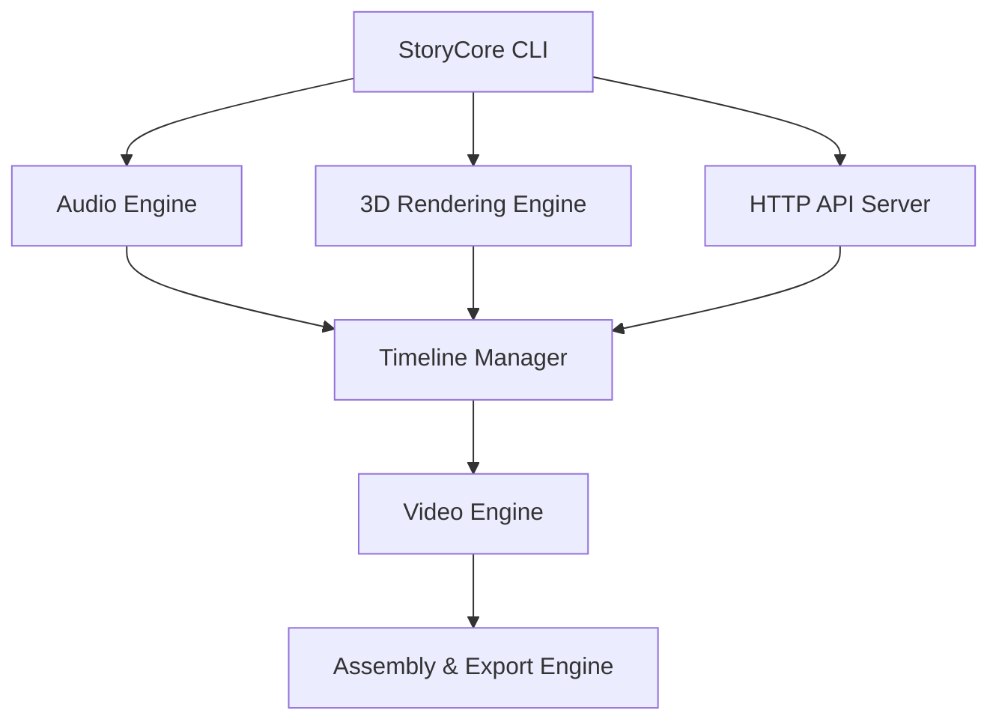

# Plan d'Intégration des Composants Python avec StoryCore

## Introduction
Ce document décrit le plan d'intégration des composants Python (audio, 3D et HTTP) avec le système StoryCore existant.

## Analyse des Composants

### 1. Module Audio (`src/audio_engine.py`)
- **Fonctionnalités** : Génération de paysages sonores complets avec dialogue, SFX, ambiance et musique
- **Technologies** : ComfyUI pour la génération audio, gestion des zones de réverbération et positionnement 3D
- **Points d'intégration** :
  - Intégration avec Timeline Manager pour la synchronisation
  - Intégration avec Video Engine pour la cohérence visuelle-audio
  - Exportation de tiges audio pour le mixage professionnel

### 2. Module 3D (`src/3d/`)
- **Sous-modules** :
  - `camera_system.py` : Contrôle avancé de la caméra avec mouvements cinématiques
  - `rendering_engine.py` : Moteur de rendu 3D utilisant Panda3D et PyOpenGL
  - `scene_manager.py` : Gestion des scènes 3D et des transitions
- **Fonctionnalités** : Animation de caméra, rendu en temps réel, gestion des scènes
- **Points d'intégration** :
  - Intégration avec le système de rendu principal
  - Synchronisation avec l'audio et la timeline

### 3. Module HTTP (`src/comfyui_api_server.py`, `src/api_orchestrator.py`)
- **Fonctionnalités** :
  - Serveur API pour l'intégration ComfyUI
  - Orchestration des communications WebSocket et HTTP
  - Gestion des workflows et des files d'attente
- **Points d'intégration** :
  - Communication avec les modules audio et 3D
  - Gestion des requêtes API pour la génération de contenu

## Architecture d'Intégration

### Schéma d'Intégration Proposé

### Points d'Intégration Clés

1. **Intégration Audio** :
   - Connecter `AudioEngine` avec `TimelineManager` pour la synchronisation
   - Utiliser les métadonnées de timeline pour la génération audio
   - Exporter les résultats audio vers le système de montage

2. **Intégration 3D** :
   - Intégrer `RenderingEngine` avec le système de rendu principal
   - Synchroniser les mouvements de caméra avec la timeline
   - Exporter les séquences 3D vers le système de montage

3. **Intégration HTTP** :
   - Connecter `ComfyUIAPI` avec les modules audio et 3D
   - Fournir des endpoints API pour la génération de contenu
   - Gérer les requêtes et les files d'attente

## Plan de Développement

### Phase 1 : Préparation
- [ ] Analyser les dépendances existantes
- [ ] Identifier les points de connexion spécifiques
- [ ] Créer des interfaces d'intégration

### Phase 2 : Intégration Audio
- [ ] Connecter `AudioEngine` avec `TimelineManager`
- [ ] Implémenter la synchronisation audio-vidéo
- [ ] Tester l'exportation des tiges audio

### Phase 3 : Intégration 3D
- [ ] Intégrer `RenderingEngine` avec le système de rendu
- [ ] Synchroniser les mouvements de caméra
- [ ] Tester l'exportation des séquences 3D

### Phase 4 : Intégration HTTP
- [ ] Connecter `ComfyUIAPI` avec les modules audio et 3D
- [ ] Implémenter les endpoints API
- [ ] Tester la gestion des requêtes

### Phase 5 : Tests et Validation
- [ ] Tester l'intégration complète
- [ ] Valider la synchronisation audio-vidéo-3D
- [ ] Optimiser les performances

## Dépendances et Configuration

### Dépendances Requises
- `aiohttp` pour les communications HTTP
- `websockets` pour les communications WebSocket
- `Panda3D` et `PyOpenGL` pour le rendu 3D
- `numpy` pour le traitement des données

### Configuration
- Configurer les URLs de connexion pour ComfyUI
- Définir les paramètres de qualité audio et 3D
- Configurer les endpoints API

## Conclusion
Ce plan d'intégration fournit une feuille de route claire pour connecter les modules audio, 3D et HTTP avec l'architecture existante de StoryCore. L'intégration se fera de manière progressive, avec des tests à chaque étape pour garantir la stabilité et la performance du système.