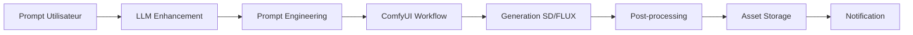

# Architecture du Système

Ce document décrit l'architecture technique de StoryCore Engine, ses composants, et comment ils interagissent.

## 📐 Architecture Globale

StoryCore Engine suit une architecture **modulaire et microservices** avec séparation claire entre frontend et backend.

```text
┌─────────────────────────────────────────────────────────────┐
│                     Frontend (React)                       │
│  ┌─────────────┐ ┌─────────────┐ ┌─────────────────────┐  │
│  │   UI Layer  │ │ State Mgmt  │ │    Services Layer   │  │
│  │ (Components)│ │  (Zustand)  │ │   (API Clients)     │  │
│  └─────────────┘ └─────────────┘ └─────────────────────┘  │
└───────────────────────────┬─────────────────────────────────┘
                            │ HTTP/WebSocket
┌───────────────────────────┴─────────────────────────────────┐
│                     Backend (Flask)                        │
│  ┌─────────────┐ ┌─────────────┐ ┌─────────────────────┐  │
│  │   API Layer  │ │  Services   │ │    Data Layer       │  │
│  │  (REST/WS)   │ │ (Business)  │ │  (SQLAlchemy)       │  │
│  └─────────────┘ └─────────────┘ └─────────────────────┘  │
└─────────────────────────────────────────────────────────────┘
```

---

## Frontend Architecture

### Stack Technologique (Frontend)

- **React 18** : UI library avec Concurrent Mode
- **TypeScript** : Typage statique strict
- **Vite** : Build tool ultra-rapide
- **Tailwind CSS** : Utility-first CSS framework
- **Radix UI** : Accessible component primitives
- **Zustand** : State management léger
- **React Query** : Server state management
- **React Router** : Client-side routing

### Structure des Dossiers (Frontend)

```text
src/
├── components/          # Composants React organisés par domaine
│   ├── wizard/         # Wizards de création
│   ├── sequence-editor/ # Éditeur de séquence
│   ├── video/          # Composants vidéo
│   ├── audio/          # Composants audio
│   ├── cinematic/      # Outils cinématiques
│   └── ui/             # Composants UI génériques
├── services/           # Services (API, logique métier)
├── hooks/              # Hooks React personnalisés
├── stores/             # Stores Zustand
├── contexts/           # Contextes React
├── types/              # Définitions TypeScript
├── utils/              # Fonctions utilitaires
├── styles/             # Styles CSS/SCSS
└── assets/             # Images, icônes, fonts
```

### State Management

Zustand est utilisé pour la gestion d'état global avec des stores modulaires :

```typescript
// Exemple d'un store
interface AppState {
  project: Project | null;
  characters: Character[];
  shots: Shot[];
  selectedShotId: string | null;
  
  // Actions
  setProject: (project: Project) => void;
  addCharacter: (character: Character) => void;
  updateShot: (shotId: string, updates: Partial<Shot>) => void;
}

const useAppStore = create<AppState>((set, get) => ({
  project: null,
  characters: [],
  shots: [],
  selectedShotId: null,
  
  setProject: (project) => set({ project }),
  addCharacter: (character) => set((state) => ({ 
    characters: [...state.characters, character] 
  })),
  // ...
}));
```

### Composants

Les composants suivent les principes :

- **Composition** : Petits composants réutilisables
- **Unidirectional flow** : Data flows down, actions flow up
- **Controlled components** : State controlled by parent
- **Memoization** : `React.memo`, `useMemo`, `useCallback`

```tsx
// Pattern typique de composant
interface ShotCardProps {
  shot: Shot;
  onSelect: (shot: Shot) => void;
  onEdit: (shot: Shot) => void;
}

const ShotCard = React.memo(({ shot, onSelect, onEdit }: ShotCardProps) => {
  const handleClick = useCallback(() => onSelect(shot), [shot, onSelect]);
  
  return (
    <div 
      className="shot-card" 
      onClick={handleClick}
      role="button"
      tabIndex={0}
    >
      <h3>{shot.title}</h3>
      <p>{shot.duration}s</p>
    </div>
  );
});
```

---

## Backend Architecture

### Stack Technologique (Backend)

- **Python 3.10+** : Langage principal
- **Flask** : Framework web léger
- **Flask-SQLAlchemy** : ORM
- **Flask-SocketIO** : WebSocket real-time
- **Celery** : Task queue asynchrone
- **Redis** : Cache et broker
- **PostgreSQL/SQLite** : Base de données

### Structure des Dossiers (Backend)

```text
backend/
├── ai_*_service.py    # Services d'IA spécialisés
├── *_api.py           # Blueprints Flask (routes API)
├── models.py          # Modèles SQLAlchemy
├── database.py        # Configuration DB
├── config.py          # Configuration
├── auth.py            # Authentification
├── cache_service.py   # Services de cache
├── messaging_api.py   # API messages
└── logs/              # logs serveur
```

### API Design

Les APIs REST sont organisées par domaines :

```python
# Exemple de blueprint
from flask import Blueprint

character_api = Blueprint('character', __name__, url_prefix='/api/characters')

@character_api.route('/', methods=['GET'])
def list_characters():
    """Liste tous les personnages"""
    characters = Character.query.all()
    return jsonify([c.to_dict() for c in characters])

@character_api.route('/', methods=['POST'])
def create_character():
    """Crée un nouveau personnage"""
    data = request.get_json()
    character = Character(**data)
    db.session.add(character)
    db.session.commit()
    return jsonify(character.to_dict()), 201
```

### WebSocket Events

```python
# Événements temps réel
from flask_socketio import emit, join_room

@socketio.on('join_project')
def on_join_project(data):
    project_id = data['project_id']
    join_room(f'project_{project_id}')
    emit('project_joined', {'status': 'ok'})

@socketio.on('shot_updated')
def on_shot_updated(data):
    shot_id = data['shot_id']
    updates = data['updates']
    # Broadcast to all clients in project room
    emit('shot_modified', {'shot_id': shot_id, 'updates': updates}, 
         room=f'project_{data["project_id"]}')
```

### Services

Les services encapsulent la logique métier :

```python
class CharacterService:
    def __init__(self, db, llm_service):
        self.db = db
        self.llm_service = llm_service
    
    def create_character(self, name: str, archetype: str) -> Character:
        """Crée un personnage avec génération LLM"""
        # Générer les attributs via LLM
        generated = self.llm_service.generate_character(name, archetype)
        
        character = Character(
            name=name,
            archetype=archetype,
            personality=generated['personality'],
            backstory=generated['backstory']
        )
        self.db.session.add(character)
        self.db.session.commit()
        return character
    
    def get_character_consistency(self, character_id: str) -> dict:
        """Calcule les métriques de cohérence"""
        character = Character.query.get(character_id)
        shots = Shot.query.filter_by(character_id=character_id).all()
        
        return {
            'visual_consistency': self._calculate_visual_score(character, shots),
            'personality_consistency': self._calculate_personality_score(shots),
            'dialogue_consistency': self._calculate_dialogue_score(shots)
        }
```

---

## Data Layer

### Modèles de Données

#### Project

```python
class Project(Base):
    __tablename__ = 'projects'
    
    id = Column(String, primary_key=True)
    name = Column(String, nullable=False)
    description = Column(Text)
    schema_version = Column(String, default='2.3')
    created_at = Column(DateTime, default=datetime.utcnow)
    updated_at = Column(DateTime, onupdate=datetime.utcnow)
    
    # Relations
    characters = relationship("Character", back_populates="project")
    shots = relationship("Shot", back_populates="project")
    worlds = relationship("World", back_populates="project")
```

#### Shot

```python
class Shot(Base):
    __tablename__ = 'shots'
    
    id = Column(String, primary_key=True)
    project_id = Column(String, ForeignKey('projects.id'))
    sequence_id = Column(String, ForeignKey('sequences.id'))
    
    title = Column(String, nullable=False)
    description = Column(Text)
    start_time = Column(Float, default=0.0)  # en secondes
    duration = Column(Float, nullable=False)
    
    # Positions et transformations
    position = Column(JSON)  # {x, y, z}
    rotation = Column(JSON)  # {x, y, z}
    scale = Column(JSON)     # {x, y, z}
    
    # Média
    video_url = Column(String)
    audio_tracks = relationship("AudioTrack", back_populates="shot")
    effects = relationship("Effect", back_populates="shot")
    text_layers = relationship("TextLayer", back_populates="shot")
```

#### Character

```python
class Character(Base):
    __tablename__ = 'characters'
    
    id = Column(String, primary_key=True)
    project_id = Column(String, ForeignKey('projects.id'))
    
    name = Column(String, nullable=False)
    archetype = Column(String)  # protagonist, antagonist, supporting
    role = Column(String)       # main, recurring, minor
    
    # Apparence
    appearance = Column(JSON)  # {age, gender, build, hair, eyes, ...}
    visual_identity = relationship("VisualIdentity", uselist=False)
    
    # Personnalité
    personality = Column(JSON)  # {traits, fears, desires, flaws, ...}
    
    # Backstory
    backstory = Column(Text)
    motivations = Column(JSON)
    
    # Relations
    relationships = relationship("Relationship", back_populates="character")
```

### Migrations

Les migrations de base de données utilisent Alembic :

```bash
# Créer une migration
alembic revision --autogenerate -m "Add character age field"

# Appliquer les migrations
alembic upgrade head

# Downgrade
alembic downgrade -1
```

---

## Workflow de Génération

### Pipeline de Génération d'Image



### Pipeline de Génération Vidéo

```text
1. Image Generation → Keyframes
2. Interpolation → Animation
3. Frame Interpolation → Smooth motion
4. Audio Synchronization → Lip-sync
5. Video Encoding → Final output
```

### Pipeline de Production Audio

```text
1. Text Analysis → SSML generation
2. TTS Synthesis → Voice generation
3. Sound Effects → SFX library
4. Mixing → Multi-track mixing
5. Mastering → Final audio
```

---

## Intégrations Externes

### LLM Providers

```typescript
// Interface commune pour tous les providers
interface LLMProvider {
  generate(prompt: string, options: LLMOptions): Promise<string>;
  stream(prompt: string, options: LLMOptions): AsyncIterable<string>;
  validateConfig(): Promise<boolean>;
}

// Implémentations
class OpenAIProvider implements LLMProvider { ... }
class AnthropicProvider implements LLMProvider { ... }
class OllamaProvider implements LLMProvider { ... }
```

### Model Context Protocol (MCP) Integration

Le système utilise MCP pour orchestrer dynamiquement des outils d'IA externes, particulièrement via les passerelles ComfyUI.

```typescript
// Interface de découverte et d'exécution MCP
interface MCPService {
  discoverTools(serverId: string): Promise<MCPTool[]>;
  callTool(serverId: string, toolName: string, args: any): Promise<any>;
}

// Mappage dynamique des outils aux tâches de production
interface ToolMappings {
  imageGeneration?: string;
  videoGeneration?: string;
  styleRefinement?: string;
  characterConsistency?: string;
}
```

### ComfyUI Integration

Le backend communique avec ComfyUI via son API standard ou via le protocole MCP :

```python
class ComfyUIService:
    def __init__(self, base_url: str):
        self.base_url = base_url
        
    def execute_workflow(self, workflow: dict, inputs: dict) -> dict:
        """Exécute un workflow ComfyUI"""
        # 1. Charger le workflow
        response = requests.post(
            f"{self.base_url}/prompt",
            json={'prompt': workflow, 'inputs': inputs}
        )
        prompt_id = response.json()['prompt_id']
        
        # 2. Attendre la completion
        result = self._wait_for_completion(prompt_id)
        
        # 3. Récupérer les outputs
        return self._get_outputs(result)
```

### Stockage Fichiers

Les assets sont stockés localement ou sur le cloud :

```python
class AssetStorage:
    def __init__(self, config: StorageConfig):
        self.config = config
        if config.type == 'local':
            self.storage = LocalStorage(config.path)
        elif config.type == 's3':
            self.storage = S3Storage(config.bucket)
        elif config.type == 'gcs':
            self.storage = GCStorage(config.bucket)
    
    async def save(self, file_data: bytes, path: str) -> str:
        """Sauvegarde un fichier"""
        return await self.storage.upload(file_data, path)
    
    async def load(self, path: str) -> bytes:
        """Charge un fichier"""
        return await self.storage.download(path)
```

---

## Performance et Optimisation

### Lazy Loading

Composants chargés dynamiquement :

```typescript
const VideoPlayer = lazy(() => import('./components/video/VideoPlayer'));
const AudioMixer = lazy(() => import('./components/audio/AudioMixer'));

// Usage
<Suspense fallback={<LoadingSpinner />}>
  <VideoPlayer />
</Suspense>
```

### Code Splitting

Vite automatiquement split le code par routes :

```typescript
// router.tsx
const routes = [
  {
    path: '/dashboard',
    component: lazy(() => import('./pages/Dashboard')),
  },
  {
    path: '/editor',
    component: lazy(() => import('./pages/Editor')),
  },
];
```

### Caching

- **Redis** : Cache serveur
- **Browser Cache** : Cache HTTP
- **Zustand Persist** : State persistant

```typescript
// Cache avec TTL
const cachedData = await redis.get(f'project:{projectId}')
if (!cachedData) {
  const data = await fetchProject(projectId)
  await redis.setex(f'project:{projectId}', 3600, JSON.stringify(data))
  return data
}
return JSON.parse(cachedData)
```

---

## Sécurité

### Authentification

```python
# JWT-based authentication
import jwt
from functools import wraps

def token_required(f):
    @wraps(f)
    def decorated(*args, **kwargs):
        token = request.headers.get('Authorization')
        if not token:
            return jsonify({'message': 'Token missing'}), 401
        
        try:
            data = jwt.decode(token, app.config['SECRET_KEY'], algorithms=['HS256'])
            current_user = User.query.get(data['user_id'])
        except:
            return jsonify({'message': 'Invalid token'}), 401
        
        return f(current_user, *args, **kwargs)
    return decorated
```

### Validation des Entrées

```python
from marshmallow import Schema, fields, validate

class CharacterSchema(Schema):
    name = fields.Str(required=True, validate=validate.Length(min=1, max=100))
    age = fields.Int(validate=validate.Range(min=0, max=150))
    archetype = fields.Str(
        validate=validate.OneOf(['protagonist', 'antagonist', 'supporting'])
    )
```

### Rate Limiting

```python
from flask_limiter import Limiter

limiter = Limiter(app, key_func=lambda: request.headers.get('X-Forwarded-For', request.remote_addr))

@app.route('/api/generate')
@limiter.limit("10 per minute")
def generate():
    # Rate limited to 10 requests per minute
    pass
```

---

## Monitoring et Logging

### Structured Logging

```python
import logging
from pythonjsonlogger import jsonlogger

logger = logging.getLogger('storycore')
handler = logging.StreamHandler()
formatter = jsonlogger.JsonFormatter()
handler.setFormatter(formatter)
logger.addHandler(handler)

# Usage
logger.info('Character created', extra={
    'character_id': character.id,
    'user_id': current_user.id,
    'timestamp': datetime.utcnow().isoformat()
})
```

### Metrics

Prometheus metrics :

```python
from prometheus_client import Counter, Histogram

REQUEST_COUNT = Counter('http_requests_total', 'Total HTTP requests', 
                        ['method', 'endpoint', 'status'])
REQUEST_LATENCY = Histogram('http_request_duration_seconds', 
                           'HTTP request latency')

@app.before_request
def before_request():
    request.start_time = time.time()

@app.after_request
def after_request(response):
    REQUEST_COUNT.labels(
        method=request.method,
        endpoint=request.path,
        status=response.status_code
    ).inc()
    REQUEST_LATENCY.observe(time.time() - request.start_time)
    return response
```

---

## Déploiement

### Docker

```dockerfile
# Frontend
FROM node:18-alpine as builder
WORKDIR /app
COPY package*.json ./
RUN npm ci
COPY . .
RUN npm run build

FROM nginx:alpine
COPY --from=builder /app/dist /usr/share/nginx/html
COPY nginx.conf /etc/nginx/nginx.conf
EXPOSE 80

# Backend
FROM python:3.11-slim
WORKDIR /app
COPY requirements.txt .
RUN pip install -r requirements.txt
COPY . .
EXPOSE 5000
CMD ["gunicorn", "-w 4", "-b 0.0.0.0:5000", "main:app"]
```

### docker-compose

```yaml
version: '3.8'
services:
  frontend:
    build: ./creative-studio-ui
    ports:
      - "3000:80"
    environment:
      - API_URL=http://backend:5000
  
  backend:
    build: ./backend
    ports:
      - "5000:5000"
    environment:
      - DATABASE_URL=postgresql://user:pass@db:5432/storycore
      - REDIS_URL=redis://redis:6379
    depends_on:
      - db
      - redis
  
  db:
    image: postgres:15
    environment:
      - POSTGRES_PASSWORD=pass
    volumes:
      - postgres_data:/var/lib/postgresql/data
  
  redis:
    image: redis:7-alpine
  
  celery:
    build: ./backend
    command: celery -A tasks worker --loglevel=info
    depends_on:
      - redis
```

---

## Tests

### Frontend Tests

```typescript
// Jest + React Testing Library
describe('ShotCard', () => {
  it('displays shot title', () => {
    const shot = { id: '1', title: 'Test Shot', duration: 5 };
    render(<ShotCard shot={shot} onSelect={() => {}} onEdit={() => {}} />);
    
    expect(screen.getByText('Test Shot')).toBeInTheDocument();
  });
  
  it('calls onSelect when clicked', () => {
    const handleSelect = jest.fn();
    const shot = { id: '1', title: 'Test', duration: 5 };
    
    render(<ShotCard shot={shot} onSelect={handleSelect} onEdit={() => {}} />);
    fireEvent.click(screen.getByText('Test'));
    
    expect(handleSelect).toHaveBeenCalledWith(shot);
  });
});
```

### Backend Tests

```python
# pytest
def test_create_character(client, db):
    """Test character creation"""
    response = client.post('/api/characters', json={
        'name': 'John Doe',
        'archetype': 'protagonist'
    })
    
    assert response.status_code == 201
    data = response.json
    assert data['name'] == 'John Doe'
    assert 'id' in data

def test_get_character_consistency(app, db):
    """Test consistency calculation"""
    character = Character(name='Test', archetype='supporting')
    db.session.add(character)
    db.session.commit()
    
    service = CharacterService(db.session)
    consistency = service.get_character_consistency(character.id)
    
    assert 'visual_consistency' in consistency
    assert 0 <= consistency['visual_consistency'] <= 1
```

---

## Évolution et Maintenance

### Versioning

Semantic Versioning (SemVer) :

- **Major** : Breaking changes
- **Minor** : New features (backward compatible)
- **Patch** : Bug fixes

### Changelog

```text
## [2.3.0] - 2026-03-15
### Added
- Support for video generation with Stable Video Diffusion
- New cinematic transition presets
- Multi-track audio mixing

### Changed
- Improved LLM prompt templates
- Optimized image generation pipeline

### Fixed
- Memory leak in audio mixer
- Type errors in sequence editor
```

---

Architecture v2.3 - Dernière mise à jour: 2026-03-22
