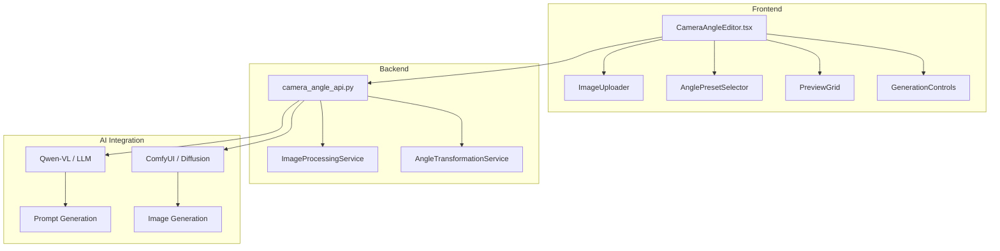
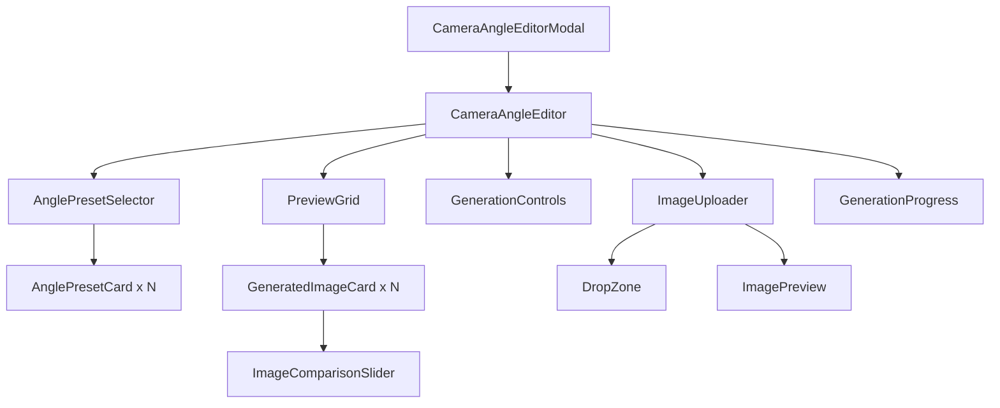
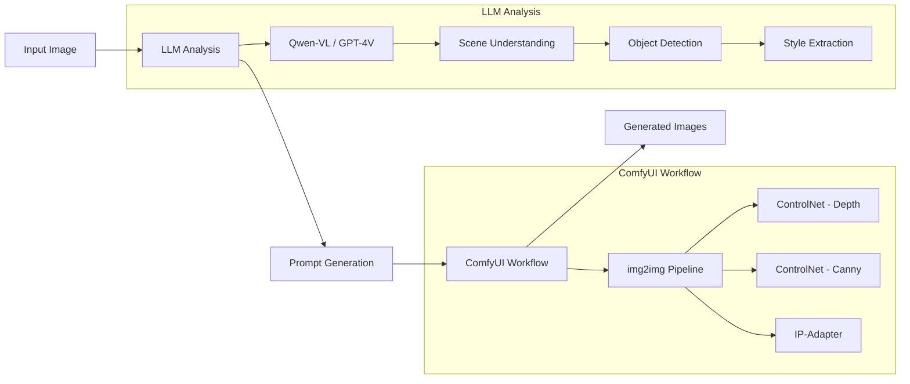
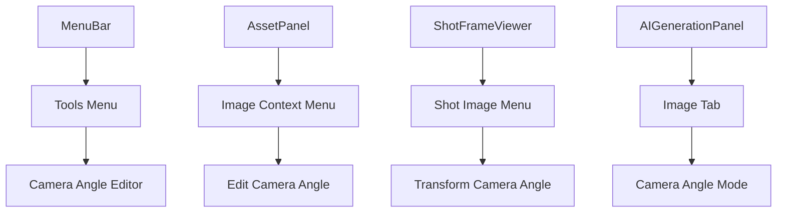
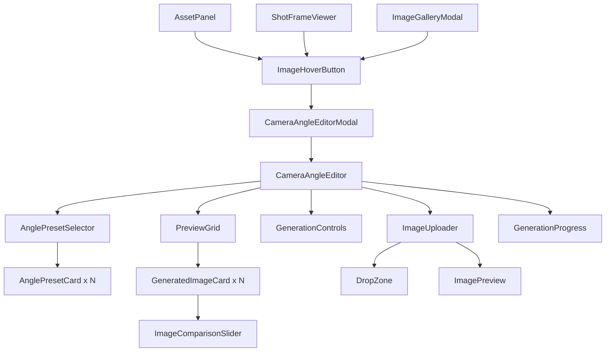
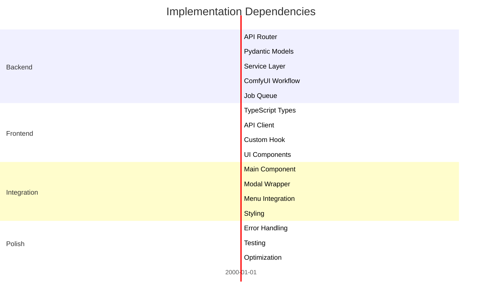

# AI-Powered Camera Angle Image Editor - Implementation Plan

## Executive Summary

This document outlines the implementation plan for adding an AI-powered camera angle image editor feature to the StoryCore Engine. The feature allows users to upload an image and generate multiple variations from different camera angles, inspired by the [HuggingFace Space: qwen-image-multiple-angles-3d-camera](https://huggingface.co/spaces/multimodalart/qwen-image-multiple-angles-3d-camera).

---

## 1. Feature Analysis

### 1.1 Reference Implementation Analysis

The HuggingFace Space reference implementation provides the following capabilities:

| Feature | Description |
|---------|-------------|
| **Image Upload** | Users can upload an image to transform |
| **Camera Angle Presets** | Predefined camera angles: front, side, top, bottom, isometric, etc. |
| **AI Transformation** | Uses Qwen-VL model for understanding image content and generating prompts |
| **Image Generation** | Uses diffusion models to generate new views |
| **Preview Grid** | Displays generated variations in a grid layout |

### 1.2 Key Components Required



### 1.3 Camera Angle Presets

| Angle ID | Display Name | Description |
|----------|--------------|-------------|
| `front` | Front View | Direct front-facing camera |
| `side_left` | Left Side View | Camera positioned to the left |
| `side_right` | Right Side View | Camera positioned to the right |
| `top` | Top/Overhead View | Bird's eye view from above |
| `bottom` | Bottom View | Looking up from below |
| `isometric` | Isometric View | 3D isometric perspective |
| `three_quarter` | 3/4 View | Classic three-quarter angle |
| `back` | Back View | Rear perspective |
| `close_up` | Close-up | Zoomed-in detail view |
| `wide` | Wide Shot | Pulled-back establishing view |

---

## 2. Architecture Design

### 2.1 Frontend Component Structure

```
creative-studio-ui/src/
├── components/
│   ├── camera-angle-editor/
│   │   ├── CameraAngleEditor.tsx        # Main container component
│   │   ├── CameraAngleEditor.css        # Styles
│   │   ├── ImageUploader.tsx            # Drag-drop image upload
│   │   ├── ImageHoverButton.tsx         # Hover button wrapper for images (NEW)
│   │   ├── AnglePresetSelector.tsx      # Camera angle selection UI
│   │   ├── AnglePresetCard.tsx          # Individual angle card
│   │   ├── PreviewGrid.tsx              # Generated images grid
│   │   ├── GenerationProgress.tsx       # Progress indicator
│   │   ├── ImageComparisonSlider.tsx    # Before/after comparison
│   │   └── index.ts                     # Exports
│   └── modals/
│       └── CameraAngleEditorModal.tsx   # Modal wrapper
├── services/
│   └── cameraAngleService.ts            # API client for camera angle feature
├── types/
│   └── cameraAngle.ts                   # TypeScript interfaces
└── hooks/
    └── useCameraAngleGeneration.ts      # Custom hook for generation logic
```

### 2.2 Backend API Structure

```
backend/
├── camera_angle_api.py                  # FastAPI router
├── camera_angle_service.py              # Business logic
├── camera_angle_prompts.py              # Prompt templates for LLM
└── workflows/
    └── camera_angle_transform.json      # ComfyUI workflow definition
```

### 2.3 Component Hierarchy



---

## 3. Technical Specifications

### 3.1 TypeScript Interfaces

```typescript
// types/cameraAngle.ts

export type CameraAngleId = 
  | 'front' 
  | 'side_left' 
  | 'side_right' 
  | 'top' 
  | 'bottom' 
  | 'isometric' 
  | 'three_quarter' 
  | 'back' 
  | 'close_up' 
  | 'wide';

export interface CameraAnglePreset {
  id: CameraAngleId;
  displayName: string;
  description: string;
  icon: string;
  promptSuffix: string;
}

export interface CameraAngleRequest {
  image: string;              // Base64 encoded image
  angleIds: CameraAngleId[];  // Selected angles to generate
  preserveStyle: boolean;     // Maintain original image style
  quality: 'draft' | 'standard' | 'high';
  seed?: number;
}

export interface CameraAngleResult {
  id: string;
  angleId: CameraAngleId;
  originalImage: string;
  generatedImage: string;
  prompt: string;
  generationTime: number;
  metadata: {
    model: string;
    steps: number;
    cfgScale: number;
  };
}

export interface CameraAngleJobStatus {
  jobId: string;
  status: 'queued' | 'processing' | 'completed' | 'failed';
  progress: number;
  completedAngles: CameraAngleId[];
  remainingAngles: CameraAngleId[];
  results: CameraAngleResult[];
  error?: string;
}
```

### 3.2 API Endpoints

| Method | Endpoint | Description |
|--------|----------|-------------|
| `POST` | `/api/camera-angle/generate` | Start generation job |
| `GET` | `/api/camera-angle/job/{jobId}` | Get job status |
| `POST` | `/api/camera-angle/cancel/{jobId}` | Cancel running job |
| `GET` | `/api/camera-angle/presets` | Get available angle presets |
| `POST` | `/api/camera-angle/analyze` | Analyze image for best angles |

### 3.3 API Request/Response Schemas

```python
# backend/camera_angle_api.py

from pydantic import BaseModel
from typing import List, Optional
from enum import Enum

class CameraAngleId(str, Enum):
    FRONT = "front"
    SIDE_LEFT = "side_left"
    SIDE_RIGHT = "side_right"
    TOP = "top"
    BOTTOM = "bottom"
    ISOMETRIC = "isometric"
    THREE_QUARTER = "three_quarter"
    BACK = "back"
    CLOSE_UP = "close_up"
    WIDE = "wide"

class CameraAngleRequest(BaseModel):
    image_base64: str
    angle_ids: List[CameraAngleId]
    preserve_style: bool = True
    quality: str = "standard"  # draft, standard, high
    seed: Optional[int] = None

class CameraAngleResult(BaseModel):
    id: str
    angle_id: CameraAngleId
    generated_image_base64: str
    prompt_used: str
    generation_time_seconds: float

class CameraAngleJobStatus(BaseModel):
    job_id: str
    status: str
    progress: float
    completed_angles: List[CameraAngleId]
    remaining_angles: List[CameraAngleId]
    results: List[CameraAngleResult]
    error: Optional[str] = None
```

### 3.4 Required Dependencies

#### Frontend Dependencies
```json
{
  "dependencies": {
    // Already installed - verify versions
    "react": "^18.x",
    "react-dropzone": "^14.x",     // For image upload
    "react-compare-image": "^3.x", // For before/after comparison
    "zustand": "^4.x"              // State management (already used)
  }
}
```

#### Backend Dependencies
```txt
# requirements_api.txt additions
# All core dependencies already present
# No new Python packages required
```

---

## 4. AI Model Integration Approach

### 4.1 Integration Strategy

The feature will leverage existing AI infrastructure in StoryCore Engine:



### 4.2 LLM Integration for Prompt Generation

The existing [`llm_api.py`](backend/llm_api.py) will be extended with camera angle prompt templates:

```python
# backend/camera_angle_prompts.py

CAMERA_ANGLE_PROMPTS = {
    "front": "front view, facing the camera directly, eye-level shot",
    "side_left": "left side view, profile shot from the left, 90-degree angle",
    "side_right": "right side view, profile shot from the right, 90-degree angle",
    "top": "top-down view, overhead shot, bird's eye view, looking down",
    "bottom": "low angle view, looking up, worm's eye view",
    "isometric": "isometric view, 3D isometric perspective, diagonal angle",
    "three_quarter": "three-quarter view, 45-degree angle, classic portrait angle",
    "back": "rear view, from behind, back perspective",
    "close_up": "extreme close-up, macro shot, detailed view",
    "wide": "wide shot, establishing shot, full scene view, pulled back"
}

def build_camera_angle_prompt(
    base_description: str,
    angle_id: str,
    style_info: str
) -> str:
    """Build a complete prompt for camera angle transformation."""
    angle_prompt = CAMERA_ANGLE_PROMPTS.get(angle_id, "")
    return f"{base_description}, {angle_prompt}, {style_info}"
```

### 4.3 ComfyUI Workflow Integration

The existing [`comfyuiService.ts`](creative-studio-ui/src/services/comfyuiService.ts) infrastructure will be used with a new workflow:

```json
// workflows/camera_angle_transform.json
{
  "name": "camera_angle_transform",
  "description": "Transform image to different camera angles using ControlNet and IP-Adapter",
  "nodes": [
    {
      "type": "LoadImage",
      "id": "input_image",
      "inputs": ["image_path"]
    },
    {
      "type": "ControlNetApply",
      "id": "depth_controlnet",
      "model": "control_depth_fp16.safetensors",
      "inputs": ["input_image"]
    },
    {
      "type": "ControlNetApply", 
      "id": "canny_controlnet",
      "model": "control_canny_fp16.safetensors",
      "inputs": ["input_image"]
    },
    {
      "type": "IPAdapterApply",
      "id": "ip_adapter",
      "model": "ip-adapter_sd15.safetensors",
      "inputs": ["input_image"]
    },
    {
      "type": "KSampler",
      "id": "sampler",
      "inputs": ["prompt", "negative_prompt", "latent", "steps", "cfg", "seed"]
    },
    {
      "type": "VAEDecode",
      "id": "decode",
      "inputs": ["samples"]
    }
  ]
}
```

### 4.4 Model Requirements

| Model | Purpose | Size | Source |
|-------|---------|------|--------|
| ControlNet Depth | Depth estimation for angle transformation | ~1.4GB | HuggingFace |
| ControlNet Canny | Edge preservation | ~1.4GB | HuggingFace |
| IP-Adapter | Style/identity preservation | ~400MB | HuggingFace |
| Qwen-VL (optional) | Image understanding | ~4GB | Ollama/HuggingFace |

---

## 5. Implementation Steps

### Phase 1: Foundation (Backend)

| Step | Task | Dependencies |
|------|------|--------------|
| 1.1 | Create `backend/camera_angle_api.py` with FastAPI router | None |
| 1.2 | Define Pydantic models for request/response | 1.1 |
| 1.3 | Create `backend/camera_angle_service.py` with business logic | 1.2 |
| 1.4 | Implement image analysis using existing LLM integration | 1.3 |
| 1.5 | Create ComfyUI workflow for camera angle transformation | 1.3 |
| 1.6 | Implement job queue integration using existing `task_queue_api.py` | 1.3 |
| 1.7 | Add API router to `backend/main_api.py` | 1.1-1.6 |

### Phase 2: Foundation (Frontend)

| Step | Task | Dependencies |
|------|------|--------------|
| 2.1 | Create TypeScript types in `types/cameraAngle.ts` | None |
| 2.2 | Create `services/cameraAngleService.ts` API client | 2.1 |
| 2.3 | Create `hooks/useCameraAngleGeneration.ts` custom hook | 2.2 |
| 2.4 | Create `ImageUploader.tsx` component | None |
| 2.5 | Create `ImageHoverButton.tsx` hover button component | None |
| 2.6 | Create `AnglePresetSelector.tsx` and `AnglePresetCard.tsx` | 2.1 |
| 2.7 | Create `PreviewGrid.tsx` component | None |
| 2.8 | Create `GenerationProgress.tsx` component | None |

### Phase 3: Integration

| Step | Task | Dependencies |
|------|------|--------------|
| 3.1 | Create main `CameraAngleEditor.tsx` container | Phase 1, Phase 2 |
| 3.2 | Create `CameraAngleEditorModal.tsx` wrapper | 3.1 |
| 3.3 | Integrate with existing modal system in `ModalsContainer.tsx` | 3.2 |
| 3.4 | Add menu entry in `MenuBar.tsx` or relevant location | 3.3 |
| 3.5 | Integrate `ImageHoverButton` with `AssetPanel.tsx` | 2.5, 3.2 |
| 3.6 | Integrate `ImageHoverButton` with `ImageGalleryModal.tsx` | 2.5, 3.2 |
| 3.7 | Integrate `ImageHoverButton` with shot viewer components | 2.5, 3.2 |
| 3.8 | Create CSS styles for all components | 3.1-3.7 |

### Phase 4: Polish & Testing

| Step | Task | Dependencies |
|------|------|--------------|
| 4.1 | Add error handling and loading states | Phase 3 |
| 4.2 | Implement image comparison slider | 4.1 |
| 4.3 | Add keyboard shortcuts | 4.1 |
| 4.4 | Write unit tests for components | 4.1 |
| 4.5 | Write integration tests for API | 4.1 |
| 4.6 | Performance optimization and caching | 4.1-4.5 |

---

## 6. Integration Points

### 6.1 UI Integration

The Camera Angle Editor can be accessed from multiple entry points:



**Recommended Primary Entry Point**: Add to the existing Tools menu in [`MenuBar.tsx`](creative-studio-ui/src/components/MenuBar.tsx)

### 6.2 Hover Button Interaction Pattern

The primary user interaction pattern for accessing the Camera Angle Editor is through a hover button that appears when users hover over images. This pattern is already established in the codebase and should be followed for consistency.

#### 6.2.1 Existing Pattern Reference

The hover button pattern is used in several components throughout the application:

| Component | Location | Pattern Used |
|-----------|----------|--------------|
| [`ImageGalleryModal.tsx`](creative-studio-ui/src/components/modals/ImageGalleryModal.tsx) | Lines 389-420 | Overlay with action buttons on image hover |
| [`AssetCard.tsx`](creative-studio-ui/src/components/AssetCard.tsx) | Lines 119-124 | Hover overlay with click/drag text |
| [`CanvasArea.tsx`](creative-studio-ui/src/components/CanvasArea.tsx) | Lines 613-650 | Quick action buttons overlay |

#### 6.2.2 ImageHoverButton Component Specification

A new reusable component should be created to wrap images with the camera angle hover button:

```typescript
// components/camera-angle-editor/ImageHoverButton.tsx

interface ImageHoverButtonProps {
  /** The image source URL or base64 data */
  imageSrc: string;
  /** Alt text for accessibility */
  imageAlt: string;
  /** Callback when camera angle button is clicked */
  onOpenEditor: (imageSrc: string) => void;
  /** Optional children to render instead of default image */
  children?: React.ReactNode;
  /** Additional CSS classes */
  className?: string;
  /** Button label - defaults to French text */
  buttonLabel?: string;
  /** Whether the button should be disabled */
  disabled?: boolean;
  /** Position of the button - defaults to center */
  buttonPosition?: 'center' | 'bottom-right' | 'bottom-left';
}
```

#### 6.2.3 CSS/Styling Approach

The hover effect uses Tailwind CSS with the `group` and `group-hover` pattern:

```tsx
// Wrapper with group class
<div className="group relative overflow-hidden">
  {/* Image with hover scale effect */}
  
  
  {/* Hover overlay - invisible by default, visible on hover */}
  <div className="absolute inset-0 bg-black/40 opacity-0 group-hover:opacity-100 transition-opacity duration-300 flex items-center justify-center">
    <button
      onClick={handleOpenEditor}
      className="px-4 py-2 bg-white/90 hover:bg-white rounded-lg transition-colors shadow-lg text-sm font-medium"
    >
      <CameraIcon className="w-4 h-4 mr-2 inline" />
      Changer l'angle de vue par IA
    </button>
  </div>
</div>
```

**Key CSS Classes**:
- `group` - Marks the parent container as a group for hover states
- `opacity-0 group-hover:opacity-100` - Hidden by default, visible on hover
- `transition-opacity duration-300` - Smooth fade transition
- `bg-black/40` - Semi-transparent dark overlay
- `group-hover:scale-105` - Subtle zoom effect on image

#### 6.2.4 Component Implementation Template

```tsx
// components/camera-angle-editor/ImageHoverButton.tsx

import React from 'react';
import { CameraIcon } from 'lucide-react';
import { cn } from '@/lib/utils';

interface ImageHoverButtonProps {
  imageSrc: string;
  imageAlt: string;
  onOpenEditor: (imageSrc: string) => void;
  children?: React.ReactNode;
  className?: string;
  buttonLabel?: string;
  disabled?: boolean;
}

export const ImageHoverButton: React.FC<ImageHoverButtonProps> = ({
  imageSrc,
  imageAlt,
  onOpenEditor,
  children,
  className,
  buttonLabel = 'Changer l\'angle de vue par IA',
  disabled = false,
}) => {
  const handleClick = (e: React.MouseEvent) => {
    e.stopPropagation();
    if (!disabled) {
      onOpenEditor(imageSrc);
    }
  };

  return (
    <div className={cn('group relative overflow-hidden', className)}>
      {/* Render children or default image */}
      {children || (
        
      )}
      
      {/* Hover overlay with button */}
      <div className="absolute inset-0 bg-black/40 opacity-0 group-hover:opacity-100 transition-opacity duration-300 flex items-center justify-center">
        <button
          onClick={handleClick}
          disabled={disabled}
          className={cn(
            'flex items-center gap-2 px-4 py-2 rounded-lg transition-colors shadow-lg text-sm font-medium',
            disabled
              ? 'bg-gray-400/50 cursor-not-allowed text-gray-300'
              : 'bg-white/90 hover:bg-white text-gray-800'
          )}
          aria-label={buttonLabel}
        >
          <CameraIcon className="w-4 h-4" />
          {buttonLabel}
        </button>
      </div>
    </div>
  );
};
```

#### 6.2.5 Integration with Existing Components

**AssetPanel Integration**:

```tsx
// In AssetPanel.tsx - wrap image assets with hover button

import { ImageHoverButton } from './camera-angle-editor/ImageHoverButton';

// Inside asset rendering:
{asset.type === 'image' && (
  <ImageHoverButton
    imageSrc={asset.thumbnail || asset.url}
    imageAlt={asset.name}
    onOpenEditor={(src) => openCameraAngleEditor(src)}
  >
    {/* Existing asset card content */}
    
  </ImageHoverButton>
)}
```

**ShotFrameViewer Integration**:

```tsx
// In ShotFrameViewer or similar component

<ImageHoverButton
  imageSrc={shot.image}
  imageAlt={shot.title}
  onOpenEditor={(src) => {
    // Open modal with the shot image
    openCameraAngleEditorModal({ 
      sourceImage: src,
      context: 'shot',
      shotId: shot.id 
    });
  }}
  buttonLabel="Changer l'angle de vue par IA"
/>
```

**ImageGalleryModal Integration**:

```tsx
// Add to existing action buttons in ImageGalleryModal.tsx

<Button
  size="sm"
  variant="secondary"
  onClick={() => openCameraAngleEditor(image.url)}
  className="bg-white/90 hover:bg-white"
  aria-label="Changer l'angle de vue"
>
  <CameraIcon className="w-4 h-4" />
</Button>
```

#### 6.2.6 Updated Component Hierarchy



#### 6.2.7 Accessibility Considerations for Hover Button

- Button must be keyboard accessible (Tab navigation)
- Add `aria-label` with descriptive text
- Ensure sufficient color contrast (WCAG 2.1 AA minimum)
- Provide visible focus indicator
- Support touch devices with long-press alternative

```tsx
// Enhanced accessibility implementation
<button
  onClick={handleClick}
  onKeyDown={(e) => {
    if (e.key === 'Enter' || e.key === ' ') {
      e.preventDefault();
      handleClick(e as unknown as React.MouseEvent);
    }
  }}
  aria-label="Ouvrir l'éditeur d'angle de caméra IA"
  className="focus:ring-2 focus:ring-white focus:ring-offset-2 focus:ring-offset-black/40"
>
  {/* button content */}
</button>
```

### 6.3 Backend Service Integration

| Existing Service | Integration Point |
|------------------|-------------------|
| [`comfyuiService.ts`](creative-studio-ui/src/services/comfyuiService.ts) | Use for image generation workflow execution |
| [`llmService.ts`](creative-studio-ui/src/services/llmService.ts) | Use for prompt generation and image analysis |
| [`taskQueueService.ts`](creative-studio-ui/src/services/taskQueueService.ts) | Use for job queue management |
| [`imageStorageService.ts`](creative-studio-ui/src/services/imageStorageService.ts) | Use for storing generated images |
| [`GenerationHistoryService.ts`](creative-studio-ui/src/services/GenerationHistoryService.ts) | Log generation history |

### 6.3 Database/Storage Considerations

Generated images should be stored following the existing pattern:

```
data/
├── camera-angle/
│   ├── jobs/
│   │   └── {job_id}/
│   │       ├── original.png
│   │       ├── metadata.json
│   │       └── results/
│   │           ├── front.png
│   │           ├── side_left.png
│   │           └── ...
│   └── cache/
│       └── {image_hash}/
│           └── {angle_id}.png
```

**Storage Strategy**:
1. **Temporary Storage**: During generation, images stored in `data/jobs/{job_id}/`
2. **Permanent Storage**: When user saves, copy to project assets
3. **Caching**: Cache generated angles to avoid regeneration
4. **Cleanup**: Implement TTL-based cleanup for temporary files

---

## 7. State Management

### 7.1 Zustand Store Extension

```typescript
// stores/cameraAngleStore.ts

import { create } from 'zustand';

interface CameraAngleState {
  // Input state
  sourceImage: string | null;
  selectedAngles: CameraAngleId[];
  
  // Generation state
  isGenerating: boolean;
  currentJobId: string | null;
  jobStatus: CameraAngleJobStatus | null;
  
  // Results
  results: CameraAngleResult[];
  
  // Settings
  preserveStyle: boolean;
  quality: 'draft' | 'standard' | 'high';
  
  // Actions
  setSourceImage: (image: string) => void;
  toggleAngle: (angleId: CameraAngleId) => void;
  selectAllAngles: () => void;
  clearSelection: () => void;
  startGeneration: () => Promise<void>;
  cancelGeneration: () => Promise<void>;
  clearResults: () => void;
}
```

---

## 8. Error Handling

### 8.1 Error Scenarios

| Scenario | Handling |
|----------|----------|
| ComfyUI not connected | Show connection prompt with retry option |
| Image too large | Display size limit warning, offer resize |
| Generation timeout | Offer retry with lower quality |
| No angles selected | Disable generate button, show tooltip |
| LLM unavailable | Use fallback prompt templates |
| Insufficient GPU memory | Suggest using draft quality |

### 8.2 Error Display

Use existing [`ErrorNotification.tsx`](creative-studio-ui/src/components/ErrorNotification.tsx) component for consistent error display.

---

## 9. Accessibility Considerations

- All interactive elements must have proper ARIA labels
- Keyboard navigation for angle selection
- High contrast mode support
- Screen reader announcements for generation progress
- Focus management in modal dialogs

---

## 10. Performance Considerations

### 10.1 Optimization Strategies

1. **Lazy Loading**: Load angle preview images on demand
2. **Progressive Generation**: Generate angles sequentially, show results as ready
3. **Caching**: Cache generated images by source hash + angle
4. **Debouncing**: Debounce angle selection changes
5. **Web Workers**: Move image processing to web workers

### 10.2 Resource Management

- Limit concurrent generations to 3 angles
- Implement request queuing
- Cancel pending generations on modal close
- Clean up blob URLs to prevent memory leaks

---

## 11. Testing Strategy

### 11.1 Unit Tests

| Component | Test Focus |
|-----------|------------|
| `ImageUploader` | File validation, drag-drop, preview |
| `AnglePresetSelector` | Selection state, keyboard navigation |
| `PreviewGrid` | Grid layout, image loading |
| `cameraAngleService` | API calls, error handling |

### 11.2 Integration Tests

| Scenario | Test Focus |
|----------|------------|
| Full generation flow | Upload → Select → Generate → View |
| Error recovery | Connection loss, timeout handling |
| Cancellation | Cancel mid-generation |

### 11.3 E2E Tests

- Complete user workflow from upload to save
- Cross-browser compatibility
- Performance under load

---

## 12. Future Enhancements

| Enhancement | Description | Priority |
|-------------|-------------|----------|
| Custom angle input | Allow users to specify custom camera positions | Medium |
| Batch processing | Process multiple images at once | Low |
| Animation preview | Generate smooth transition between angles | Low |
| 3D reconstruction | Generate 3D model from multiple angles | Future |
| Video support | Apply camera angle changes to video frames | Future |

---

## 13. Dependencies Between Tasks



---

## 14. Risk Assessment

| Risk | Impact | Mitigation |
|------|--------|------------|
| ComfyUI model compatibility | High | Test with existing models, provide fallback |
| GPU memory constraints | Medium | Implement quality tiers, batch size limits |
| LLM prompt quality | Medium | Extensive prompt engineering, user override option |
| Generation time | Medium | Progress indicators, background processing |
| Storage bloat | Low | Implement cleanup policies, compression |

---

## 15. Acceptance Criteria

### Must Have (MVP)
- [x] User can upload an image via drag-drop or file picker
- [x] User can select one or more camera angle presets
- [x] System generates transformed images for selected angles
- [x] User can preview generated images in a grid
- [x] User can compare original and generated images
- [x] User can save generated images to project assets
- [x] Progress indicator shows generation status
- [x] Error handling for common failure scenarios

### Should Have
- [x] Image analysis suggests best angles
- [x] Style preservation toggle
- [x] Quality selection (draft/standard/high)
- [x] Generation history
- [ ] Keyboard shortcuts

### Nice to Have
- [ ] Custom angle input
- [ ] Batch processing
- [ ] Animation preview between angles

---

## 15.1 Implementation Status (Phase 4 Complete)

### Backend Implementation ✅
| File | Status | Notes |
|------|--------|-------|
| [`backend/camera_angle_types.py`](backend/camera_angle_types.py) | ✅ Complete | Pydantic models for all request/response types |
| [`backend/camera_angle_service.py`](backend/camera_angle_service.py) | ✅ Complete | Business logic with ComfyUI integration |
| [`backend/camera_angle_api.py`](backend/camera_angle_api.py) | ✅ Complete | FastAPI router with all endpoints |
| [`backend/tests/test_camera_angle_api.py`](backend/tests/test_camera_angle_api.py) | ✅ Complete | Unit tests for all API endpoints |

### Frontend Implementation ✅
| File | Status | Notes |
|------|--------|-------|
| [`types/cameraAngle.ts`](creative-studio-ui/src/types/cameraAngle.ts) | ✅ Complete | TypeScript interfaces matching backend |
| [`services/cameraAngleService.ts`](creative-studio-ui/src/services/cameraAngleService.ts) | ✅ Complete | API client with error handling |
| [`stores/cameraAngleStore.ts`](creative-studio-ui/src/stores/cameraAngleStore.ts) | ✅ Complete | Zustand store for state management |
| [`hooks/useCameraAngleGeneration.ts`](creative-studio-ui/src/hooks/useCameraAngleGeneration.ts) | ✅ Complete | Custom hook for generation logic |
| [`components/camera-angle-editor/ImageHoverButton.tsx`](creative-studio-ui/src/components/camera-angle-editor/ImageHoverButton.tsx) | ✅ Complete | Reusable hover button component |
| [`components/camera-angle-editor/AnglePresetSelector.tsx`](creative-studio-ui/src/components/camera-angle-editor/AnglePresetSelector.tsx) | ✅ Complete | Angle selection grid |
| [`components/camera-angle-editor/ResultsGrid.tsx`](creative-studio-ui/src/components/camera-angle-editor/ResultsGrid.tsx) | ✅ Complete | Generated images display |
| [`components/camera-angle-editor/CameraAngleEditor.tsx`](creative-studio-ui/src/components/camera-angle-editor/CameraAngleEditor.tsx) | ✅ Complete | Main editor component |
| [`components/camera-angle-editor/CameraAngleEditorModal.tsx`](creative-studio-ui/src/components/camera-angle-editor/CameraAngleEditorModal.tsx) | ✅ Complete | Modal wrapper |
| [`components/camera-angle-editor/CameraAngleEditorErrorBoundary.tsx`](creative-studio-ui/src/components/camera-angle-editor/CameraAngleEditorErrorBoundary.tsx) | ✅ Complete | Error boundary for graceful error handling |
| [`components/camera-angle-editor/CameraAngleSkeletons.tsx`](creative-studio-ui/src/components/camera-angle-editor/CameraAngleSkeletons.tsx) | ✅ Complete | Loading skeleton components |
| [`contexts/CameraAngleEditorContext.tsx`](creative-studio-ui/src/contexts/CameraAngleEditorContext.tsx) | ✅ Complete | React context for editor state |

### Frontend Tests ✅
| File | Status | Notes |
|------|--------|-------|
| [`__tests__/CameraAngleEditor.test.tsx`](creative-studio-ui/src/components/camera-angle-editor/__tests__/CameraAngleEditor.test.tsx) | ✅ Complete | Main component tests |
| [`__tests__/AnglePresetSelector.test.tsx`](creative-studio-ui/src/components/camera-angle-editor/__tests__/AnglePresetSelector.test.tsx) | ✅ Complete | Preset selector tests |
| [`__tests__/ResultsGrid.test.tsx`](creative-studio-ui/src/components/camera-angle-editor/__tests__/ResultsGrid.test.tsx) | ✅ Complete | Results grid tests |

### i18n Support ✅
| Language | Status | Notes |
|----------|--------|-------|
| English (en) | ✅ Complete | All UI labels translated |
| French (fr) | ✅ Complete | All UI labels translated |
| Spanish (es) | ✅ Complete | All UI labels translated |
| German (de) | ✅ Complete | All UI labels translated |
| Japanese (ja) | ✅ Complete | All UI labels translated |
| Portuguese (pt) | ✅ Complete | All UI labels translated |
| Italian (it) | ✅ Complete | All UI labels translated |
| Russian (ru) | ✅ Complete | All UI labels translated |
| Chinese (zh) | ✅ Complete | All UI labels translated |

### Documentation ✅
| File | Status | Notes |
|------|--------|-------|
| [`docs/CAMERA_ANGLE_EDITOR_PLAN.md`](docs/CAMERA_ANGLE_EDITOR_PLAN.md) | ✅ Complete | Implementation plan (this document) |
| [`docs/CAMERA_ANGLE_EDITOR_USAGE.md`](docs/CAMERA_ANGLE_EDITOR_USAGE.md) | ✅ Complete | User guide and API documentation |

---

## 16. Appendix

### A. Existing Components Reference

| Component | Location | Reusability |
|-----------|----------|-------------|
| Modal system | [`ModalsContainer.tsx`](creative-studio-ui/src/components/ModalsContainer.tsx) | High - use for modal wrapper |
| Image upload | [`ComfyUIMediaUpload.tsx`](creative-studio-ui/src/components/ComfyUIMediaUpload.tsx) | Medium - adapt for single image |
| Progress indicator | [`GenerationProgressModal.tsx`](creative-studio-ui/src/components/GenerationProgressModal.tsx) | High - reuse pattern |
| Results gallery | [`ResultsGallery.tsx`](creative-studio-ui/src/components/ResultsGallery.tsx) | High - adapt for grid layout |
| Service status | [`ServiceStatusIndicator.tsx`](creative-studio-ui/src/components/ServiceStatusIndicator.tsx) | High - show ComfyUI status |

### B. API Configuration

```typescript
// config/apiConfig.ts addition
export const CAMERA_ANGLE_API = {
  BASE: '/api/camera-angle',
  GENERATE: '/api/camera-angle/generate',
  JOB_STATUS: '/api/camera-angle/job',
  PRESETS: '/api/camera-angle/presets',
  ANALYZE: '/api/camera-angle/analyze',
};
```

### C. ComfyUI Workflow Template

The workflow should be created at:
`comfyui/workflows/camera_angle_transform.json`

Using existing ControlNet models available in the ComfyUI installation.

---

*Document Version: 1.0*
*Created: 2026-02-15*
*Author: Architecture Planning*
