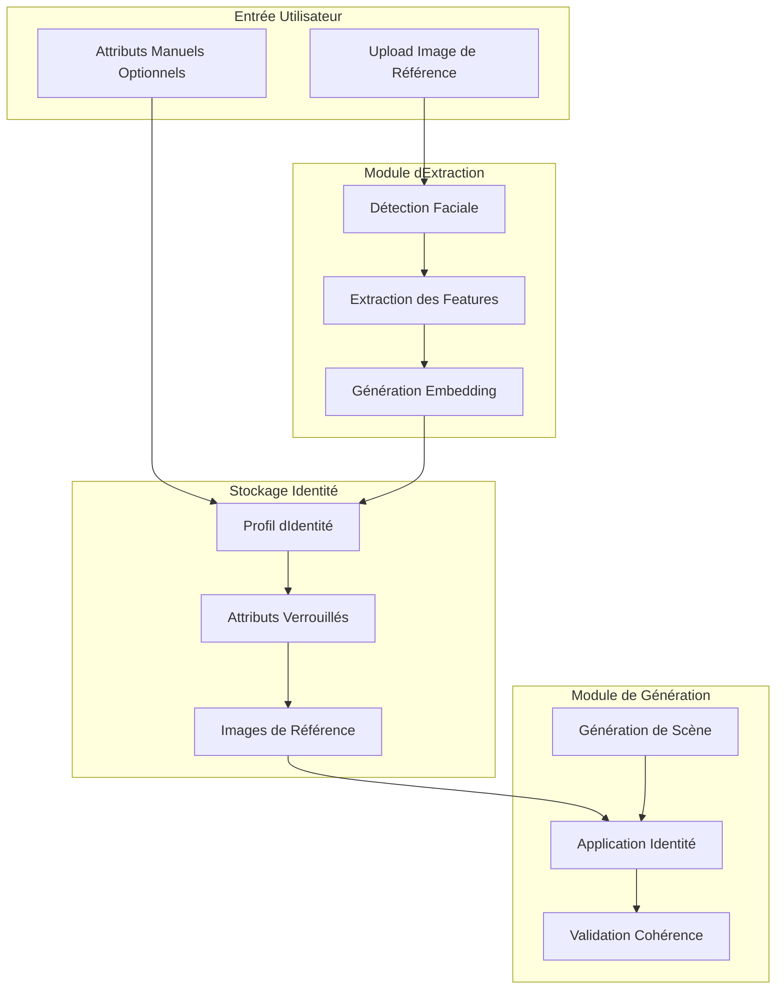
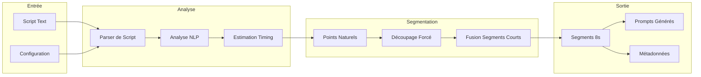
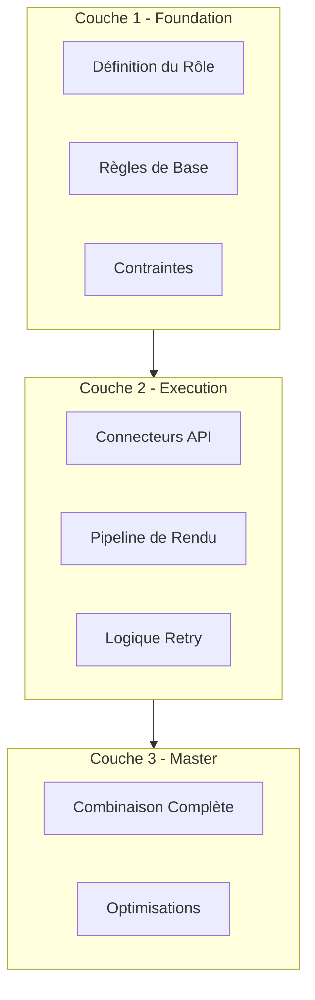
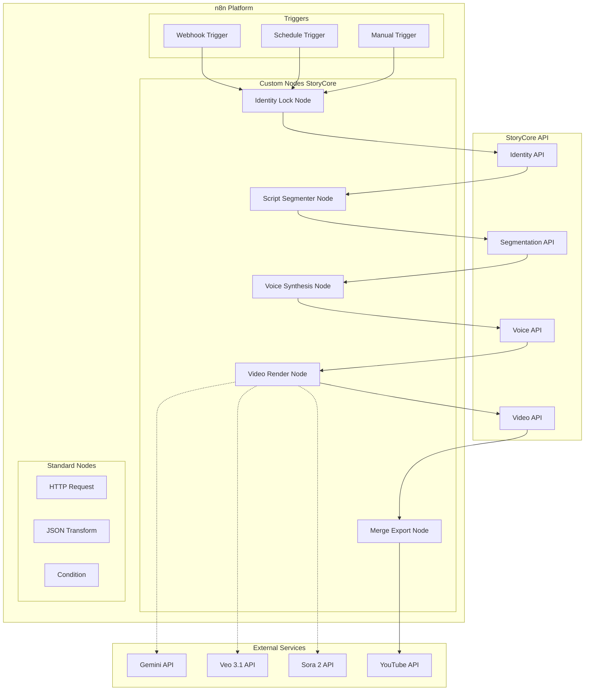

# Plan d'Implémentation - Nouvelles Fonctionnalités

## Résumé Exécutif

Ce document détaille le plan d'implémentation de quatre nouvelles fonctionnalités majeures pour storycore-engine, identifiées à partir de l'analyse des meilleures pratiques de Robert's Tech Toolbox. Ces fonctionnalités visent à améliorer la cohérence des personnages, l'efficacité de la production vidéo, et l'automatisation du workflow créatif.

### Fonctionnalités Priorisées

| Priorité | Fonctionnalité | Impact | Complexité |
|----------|----------------|--------|------------|
| HAUTE | Système Identity Lock | Critique pour la qualité | Moyenne |
| HAUTE | Segmentation Intelligente de Scripts | Critique pour l'efficacité | Moyenne |
| MOYENNE | Templates de Prompts Optimisés | Important pour la productivité | Faible |
| MOYENNE | Architecture Plugin n8n | Important pour l'intégration | Élevée |

---

## Phase 1 : Fondations

### 1.1 Système Identity Lock

#### Objectif
Maintenir l'identité visuelle d'un personnage à travers toutes les scènes d'un projet, en verrouillant les caractéristiques faciales et visuelles extraites d'une image de référence.

#### Architecture du Système



#### Structure de Données

##### Modèle IdentityProfile

```python
@dataclass
class IdentityProfile:
    """Profil d'identité verrouillé pour un personnage."""
    id: str
    name: str
    project_id: str
    
    # Features extraites
    facial_features: Dict[str, Any]  # Embeddings faciaux
    visual_attributes: VisualAttributes
    
    # Métadonnées de verrouillage
    locked_features: List[str]  # Features verrouillées
    lock_strength: float  # 0.0 - 1.0
    
    # Références
    reference_images: List[str]  # Paths des images de référence
    thumbnail_path: str
    
    # Timestamps
    created_at: datetime
    updated_at: datetime


@dataclass
class VisualAttributes:
    """Attributs visuels extraits et verrouillés."""
    # Caractéristiques faciales
    age_range: str  # "20-30", "30-40", etc.
    gender: str
    ethnicity_hint: str  # Optionnel
    
    # Caractéristiques physiques
    hair_color: str
    hair_style: str
    eye_color: str
    skin_tone: str
    
    # Caractéristiques distinctives
    distinctive_features: List[str]  # cicatrice, tatouage, etc.
    
    # Style
    clothing_style: str
    accessories: List[str]
    
    # Éclairage de référence
    lighting_preference: str  # "soft_front", "dramatic", etc.
```

##### Extension du Modèle Character Existant

Le système doit s'intégrer avec le [`CharacterAIService`](backend/character_ai_service.py:110) existant en ajoutant:

```python
@dataclass
class Character:
    # ... champs existants ...
    
    # Nouveau: Support Identity Lock
    identity_profile_id: Optional[str] = None
    identity_locked: bool = False
    locked_attributes: List[str] = field(default_factory=list)
```

#### API Endpoints

##### Création d'un Profil d'Identité

```
POST /api/identity/create
Content-Type: multipart/form-data

Parameters:
  - reference_image: File (image de référence)
  - name: string (nom du personnage)
  - project_id: string
  - manual_attributes: JSON (optionnel)
  - lock_features: string[] (features à verrouiller)

Response:
{
  "identity_id": "uuid",
  "name": "Character Name",
  "extracted_attributes": {
    "age_range": "25-35",
    "gender": "female",
    "hair_color": "brown",
    ...
  },
  "thumbnail_url": "/output/identity/uuid/thumbnail.jpg",
  "lock_strength": 0.85
}
```

##### Application d'Identité à une Scène

```
POST /api/identity/apply
Content-Type: application/json

{
  "identity_id": "uuid",
  "scene_id": "uuid",
  "generation_params": {
    "pose": "standing",
    "expression": "neutral",
    "camera_angle": "eye_level"
  }
}

Response:
{
  "applied": true,
  "prompt_enhanced": "...",
  "identity_score": 0.92
}
```

##### Validation de Cohérence

```
GET /api/identity/{identity_id}/validate/{scene_id}

Response:
{
  "identity_id": "uuid",
  "scene_id": "uuid",
  "consistency_score": 0.88,
  "issues": [],
  "recommendations": [
    "Consider adjusting lighting for better identity match"
  ]
}
```

#### Fichiers à Créer/Modifier

| Fichier | Action | Description |
|---------|--------|-------------|
| `backend/identity_lock_service.py` | Créer | Service principal de gestion d'identité |
| `backend/identity_lock_api.py` | Créer | Endpoints API REST |
| `backend/identity_extraction.py` | Créer | Module d'extraction de features |
| `backend/database_models.py` | Modifier | Ajouter IdentityProfile model |
| `backend/character_ai_service.py` | Modifier | Intégrer identity_profile_id |
| `backend/main_api.py` | Modifier | Inclure nouveau router |

#### Intégration avec le Système Existant

Le système Identity Lock s'intègre avec:

1. **[`CharacterAIService`](backend/character_ai_service.py:110)** - Extension du modèle Character
2. **[`StoryGenerationService`](backend/story_generation_service.py:73)** - Application automatique aux scènes
3. **[`PromptComposer`](backend/prompt_composer.py:35)** - Enrichissement des prompts avec attributs verrouillés

---

### 1.2 Segmentation Intelligente de Scripts

#### Objectif
Découper automatiquement les scripts en segments de 8 secondes optimisés pour la génération vidéo, avec détection des points de coupure naturels.

#### Pourquoi 8 Secondes?

D'après l'analyse:
- Parfait pour Shorts, Reels, TikTok, ads
- Correspond à la durée d'attention humaine
- Prévient le "model drift" dans la génération
- Facilite la synchronisation audio
- Réduit le taux d'échec de génération

#### Architecture du Système



#### Algorithme de Segmentation

```python
class ScriptSegmenter:
    """Service de segmentation intelligente de scripts."""
    
    TARGET_DURATION = 8.0  # secondes
    MIN_DURATION = 5.0
    MAX_DURATION = 12.0
    
    def segment_script(
        self,
        script: str,
        language: str = "fr",
        speaking_rate: float = 150  # mots/minute
    ) -> List[ScriptSegment]:
        """
        Segmente un script en segments de ~8 secondes.
        
        Étapes:
        1. Parser le script en unités sémantiques
        2. Identifier les points de coupure naturels
        3. Calculer la durée estimée de chaque unité
        4. Regrouper/fusionner pour atteindre ~8s
        5. Générer les métadonnées par segment
        """
        pass
    
    def find_natural_breaks(
        self,
        text: str
    ) -> List[NaturalBreakPoint]:
        """
        Identifie les points de coupure naturels:
        - Changements de locuteur
        - Changements de scène/lieu
        - Pauses dans le dialogue
        - Transitions narratives
        - Fin de phrases/pensées
        """
        pass
    
    def estimate_duration(
        self,
        text: str,
        speaking_rate: float,
        pause_factor: float = 1.1
    ) -> float:
        """
        Estime la durée audio d'un texte.
        
        Prend en compte:
        - Vitesse de parole
        - Pauses naturelles
        - Ponctuation
        - Émotions (ralentissement/accélération)
        """
        pass
```

#### Structure de Données

```python
@dataclass
class ScriptSegment:
    """Segment de script optimisé pour la génération."""
    id: str
    script_id: str
    
    # Contenu
    text: str
    word_count: int
    
    # Timing
    estimated_duration: float
    start_time: float
    end_time: float
    
    # Contexte
    segment_type: SegmentType  # dialogue, narration, action
    speakers: List[str]
    location: Optional[str]
    mood: str
    
    # Génération
    prompt_suggestions: List[str]
    visual_direction: str
    audio_mood: str
    
    # Métadonnées
    break_reason: str  # Pourquoi ce point de coupure
    confidence_score: float


@dataclass
class SegmentationResult:
    """Résultat complet de la segmentation."""
    script_id: str
    original_text: str
    total_duration: float
    segments: List[ScriptSegment]
    
    # Statistiques
    average_segment_duration: float
    natural_breaks_used: int
    forced_breaks: int
    
    # Recommandations
    optimization_suggestions: List[str]
```

#### API Endpoints

##### Segmentation de Script

```
POST /api/segmentation/segment
Content-Type: application/json

{
  "script": "Texte du script complet...",
  "language": "fr",
  "target_duration": 8.0,
  "speaking_rate": 150,
  "preserve_speakers": true
}

Response:
{
  "segmentation_id": "uuid",
  "total_duration": 64.5,
  "segments_count": 8,
  "segments": [
    {
      "id": "seg_001",
      "text": "Premier segment...",
      "estimated_duration": 7.8,
      "speakers": ["Character1"],
      "prompt_suggestion": "..."
    }
  ]
}
```

##### Ajustement de Segmentation

```
PUT /api/segmentation/{segmentation_id}/adjust
Content-Type: application/json

{
  "segment_id": "seg_001",
  "action": "split" | "merge" | "extend",
  "params": {
    "split_at": 50,  // position de coupure
    "merge_with": "seg_002"  // segment à fusionner
  }
}
```

#### Fichiers à Créer/Modifier

| Fichier | Action | Description |
|---------|--------|-------------|
| `backend/script_segmenter_service.py` | Créer | Service de segmentation |
| `backend/script_segmenter_api.py` | Créer | Endpoints API REST |
| `backend/script_parser.py` | Créer | Parser de scripts NLP |
| `backend/story_generation_service.py` | Modifier | Intégrer segmentation auto |

---

## Phase 2 : Templates & Intégrations

### 2.1 Templates de Prompts Optimisés

#### Objectif
Créer un système de templates réutilisables basés sur les patterns identifiés dans l'analyse, avec support pour la structure en couches et le JSON prompting.

#### Patterns de Templates Identifiés

##### 1. Structure en Couches (Layered Prompts)



##### 2. Template Foundation (Prompt 1)

```python
FOUNDATION_TEMPLATE = """
You are an AI {domain} system architect.

Rules:
- Extract {entity_type} identity from one uploaded {source_type}.
- Lock {lock_features} permanently.
- Split {content_type} into {segment_duration}-second segments.
- Output {output_format} prompts.
- Do not render {forbidden_actions}.
- Ensure all outputs inherit the same identity.

Constraints:
- Maximum {max_tokens} tokens per output.
- Language: {language}
- Style: {style}
"""
```

##### 3. Template Execution (Prompt 2)

```python
EXECUTION_TEMPLATE = """
Extend the {system_name} to include:
- Model connectors for {model_list}
- API key handling with {auth_method}
- {operation_type} processing
- Retry logic with {retry_config}
- {merge_strategy} pipeline
- Preview UI with {ui_features}
"""
```

##### 4. Template Master (Prompt 3)

```python
MASTER_TEMPLATE = """
Build a complete {system_name} with:
{foundation_requirements}
{execution_requirements}
All in one system.

Output Format:
{output_schema}
"""
```

##### 5. JSON Prompting pour Contrôle Technique

```python
JSON_PROMPT_TEMPLATE = {
    "camera": {
        "path": "{camera_path}",
        "movement": "{movement_type}",
        "framing": "{framing_style}"
    },
    "video": {
        "frame_rate": 24,
        "resolution": "{resolution}",
        "aspect_ratio": "{aspect_ratio}"
    },
    "lighting": {
        "type": "{lighting_type}",
        "intensity": "{intensity}",
        "color_temp": "{color_temp}"
    },
    "transition": {
        "type": "{transition_type}",
        "duration": "{transition_duration}"
    }
}
```

#### Structure de Données des Templates

```python
@dataclass
class PromptTemplate:
    """Template de prompt réutilisable."""
    id: str
    name: str
    category: TemplateCategory
    
    # Contenu du template
    template_text: str
    variables: List[TemplateVariable]
    
    # Métadonnées
    description: str
    use_cases: List[str]
    tags: List[str]
    
    # Configuration
    output_format: str  # "text", "json", "markdown"
    max_tokens: int
    temperature: float
    
    # Versioning
    version: str
    created_at: datetime
    updated_at: datetime


@dataclass
class TemplateVariable:
    """Variable dynamique d'un template."""
    name: str
    type: str  # "string", "number", "enum", "list"
    required: bool
    default_value: Any
    description: str
    enum_values: Optional[List[str]] = None


@dataclass
class RenderedPrompt:
    """Prompt rendu à partir d'un template."""
    template_id: str
    rendered_text: str
    variables_used: Dict[str, Any]
    token_count: int
    created_at: datetime
```

#### Bibliothèque de Templates par Catégorie

| Catégorie | Templates | Usage |
|-----------|-----------|-------|
| **Video Generation** | `video_scene`, `video_transition`, `video_effect` | Génération vidéo |
| **Voice Synthesis** | `voice_dialogue`, `voice_narration`, `voice_emotion` | Synthèse vocale |
| **Character** | `character_description`, `character_dialogue`, `character_action` | Personnages |
| **Scene** | `scene_setup`, `scene_lighting`, `scene_camera` | Scènes |
| **SEO/Metadata** | `youtube_title`, `youtube_description`, `thumbnail_concept` | Métadonnées |

#### API Endpoints

```
GET /api/templates?category=video
POST /api/templates/{template_id}/render
POST /api/templates/create
PUT /api/templates/{template_id}
DELETE /api/templates/{template_id}
```

#### Fichiers à Créer/Modifier

| Fichier | Action | Description |
|---------|--------|-------------|
| `backend/prompt_template_service.py` | Créer | Service de gestion des templates |
| `backend/prompt_template_api.py` | Créer | Endpoints API REST |
| `data/prompt_templates/` | Créer | Répertoire des templates JSON |
| `backend/prompt_composer.py` | Modifier | Intégrer les templates |

---

### 2.2 Architecture Plugin n8n

#### Objectif
Permettre l'intégration avec n8n pour l'automatisation des workflows de génération vidéo.

#### Architecture Globale



#### Spécification des Custom Nodes

##### 1. StoryCore Identity Lock Node

```typescript
interface IdentityLockNodeConfig {
  // Input
  referenceImage: BinaryProperty;  // Image de référence
  name: StringProperty;            // Nom du personnage
  
  // Options
  lockFeatures: MultiSelectProperty<{
    options: ['face', 'lighting', 'proportions', 'clothing', 'accessories'];
    default: ['face', 'lighting', 'proportions'];
  }>;
  
  lockStrength: NumberProperty<{
    min: 0.0,
    max: 1.0,
    default: 0.85
  }>;
  
  // Output
  output: {
    identityId: string;
    extractedAttributes: object;
    thumbnailUrl: string;
  };
}
```

##### 2. StoryCore Script Segmenter Node

```typescript
interface ScriptSegmenterNodeConfig {
  // Input
  script: StringProperty;          // Script à segmenter
  
  // Options
  targetDuration: NumberProperty<{
    default: 8.0,
    description: 'Durée cible par segment en secondes'
  }>;
  
  language: SelectProperty<{
    options: ['fr', 'en', 'es', 'de'];
    default: 'fr'
  }>;
  
  speakingRate: NumberProperty<{
    default: 150,
    description: 'Mots par minute'
  }>;
  
  // Output
  output: {
    segmentationId: string;
    segments: Array<{
      id: string;
      text: string;
      duration: number;
      promptSuggestion: string;
    }>;
    totalDuration: number;
  };
}
```

##### 3. StoryCore Voice Synthesis Node

```typescript
interface VoiceSynthesisNodeConfig {
  // Input
  text: StringProperty;            // Texte à synthétiser
  identityId: StringProperty;      // Identité optionnelle
  
  // Options
  provider: SelectProperty<{
    options: ['gemini', 'elevenlabs', 'playht', 'minimax'];
    default: 'gemini'
  }>;
  
  emotion: SelectProperty<{
    options: ['neutral', 'happy', 'sad', 'angry', 'fearful'];
    default: 'neutral'
  }>;
  
  speed: NumberProperty<{
    min: 0.5,
    max: 2.0,
    default: 0.95
  }>;
  
  // Output
  output: {
    audioUrl: string;
    duration: number;
    format: string;
  };
}
```

##### 4. StoryCore Video Render Node

```typescript
interface VideoRenderNodeConfig {
  // Input
  prompt: StringProperty;          // Prompt de génération
  identityId: StringProperty;      // Identité optionnelle
  audioUrl: StringProperty;        // Audio optionnel
  
  // Options
  provider: SelectProperty<{
    options: ['veo', 'sora', 'comfyui', 'runway'];
    default: 'veo'
  }>;
  
  resolution: SelectProperty<{
    options: ['720p', '1080p', '4K'];
    default: '1080p'
  }>;
  
  aspectRatio: SelectProperty<{
    options: ['16:9', '9:16', '1:1', '4:5'];
    default: '16:9'
  }>;
  
  retryConfig: ObjectProperty<{
    maxRetries: number;
    fallbackProvider: string;
  }>;
  
  // Output
  output: {
    videoUrl: string;
    duration: number;
    resolution: string;
  };
}
```

##### 5. StoryCore Merge Export Node

```typescript
interface MergeExportNodeConfig {
  // Input
  videos: CollectionProperty;      // Liste des vidéos
  audioTracks: CollectionProperty; // Pistes audio
  
  // Options
  outputFormat: SelectProperty<{
    options: ['mp4', 'webm', 'mov'];
    default: 'mp4'
  }>;
  
  platforms: MultiSelectProperty<{
    options: ['youtube', 'tiktok', 'instagram', 'facebook'];
    default: ['youtube']
  }>;
  
  generateMetadata: BooleanProperty<{
    default: true
  }>;
  
  // Output
  output: {
    finalVideoUrl: string;
    platformVersions: object;
    metadata: object;
  };
}
```

#### Configuration Type d'un Workflow

```json
{
  "storycore_workflow": {
    "name": "AI Video Story Generator",
    "trigger": {
      "type": "webhook",
      "path": "/generate-story"
    },
    "nodes": [
      {
        "type": "storycoreIdentityLock",
        "config": {
          "referenceImage": "={{ $binary.image }}",
          "name": "Main Character",
          "lockFeatures": ["face", "lighting", "proportions"],
          "lockStrength": 0.85
        }
      },
      {
        "type": "storycoreScriptSegmenter",
        "config": {
          "script": "={{ $json.script }}",
          "targetDuration": 8,
          "language": "fr"
        }
      },
      {
        "type": "storycoreVoiceSynthesis",
        "config": {
          "text": "={{ $json.segment.text }}",
          "provider": "gemini",
          "emotion": "neutral",
          "speed": 0.95
        }
      },
      {
        "type": "storycoreVideoRender",
        "config": {
          "prompt": "={{ $json.segment.promptSuggestion }}",
          "identityId": "={{ $nodes.identityLock.output.identityId }}",
          "provider": "veo",
          "resolution": "1080p",
          "aspectRatio": "16:9"
        }
      },
      {
        "type": "storycoreMergeExport",
        "config": {
          "videos": "={{ $json.renderedVideos }}",
          "platforms": ["youtube", "tiktok"],
          "generateMetadata": true
        }
      }
    ]
  }
}
```

#### Webhooks StoryCore

```
POST /api/webhooks/n8n/identity-lock
POST /api/webhooks/n8n/segment
POST /api/webhooks/n8n/voice-synthesize
POST /api/webhooks/n8n/video-render
POST /api/webhooks/n8n/merge-export
```

#### Fichiers à Créer

| Fichier | Description |
|---------|-------------|
| `n8n-nodes-storycore/` | Package npm des custom nodes |
| `n8n-nodes-storycore/nodes/IdentityLockNode.ts` | Node Identity Lock |
| `n8n-nodes-storycore/nodes/ScriptSegmenterNode.ts` | Node Script Segmenter |
| `n8n-nodes-storycore/nodes/VoiceSynthesisNode.ts` | Node Voice Synthesis |
| `n8n-nodes-storycore/nodes/VideoRenderNode.ts` | Node Video Render |
| `n8n-nodes-storycore/nodes/MergeExportNode.ts` | Node Merge Export |
| `backend/webhook_api.py` | Endpoints webhook pour n8n |
| `docs/n8n_integration_guide.md` | Guide d'intégration n8n |

---

## Spécifications Techniques Détaillées

### API Endpoints - Résumé Complet

| Endpoint | Méthode | Description |
|----------|---------|-------------|
| `/api/identity/create` | POST | Créer un profil d'identité |
| `/api/identity/{id}` | GET | Récupérer un profil |
| `/api/identity/{id}` | PUT | Mettre à jour un profil |
| `/api/identity/{id}` | DELETE | Supprimer un profil |
| `/api/identity/apply` | POST | Appliquer à une scène |
| `/api/identity/{id}/validate/{scene_id}` | GET | Valider la cohérence |
| `/api/segmentation/segment` | POST | Segmenter un script |
| `/api/segmentation/{id}` | GET | Récupérer une segmentation |
| `/api/segmentation/{id}/adjust` | PUT | Ajuster une segmentation |
| `/api/templates` | GET | Lister les templates |
| `/api/templates/{id}/render` | POST | Rendre un template |
| `/api/webhooks/n8n/*` | POST | Webhooks n8n |

### Structures de Données - Schéma de Base de Données

```sql
-- Table des profils d'identité
CREATE TABLE identity_profiles (
    id UUID PRIMARY KEY,
    name VARCHAR(255) NOT NULL,
    project_id UUID REFERENCES projects(id),
    
    -- Features
    facial_features JSONB,
    visual_attributes JSONB,
    
    -- Verrouillage
    locked_features TEXT[],
    lock_strength FLOAT DEFAULT 0.85,
    
    -- Références
    reference_images TEXT[],
    thumbnail_path VARCHAR(500),
    
    created_at TIMESTAMP DEFAULT NOW(),
    updated_at TIMESTAMP DEFAULT NOW()
);

-- Table des segmentations
CREATE TABLE script_segmentations (
    id UUID PRIMARY KEY,
    script_id UUID,
    project_id UUID REFERENCES projects(id),
    
    original_text TEXT,
    total_duration FLOAT,
    
    segments JSONB,
    statistics JSONB,
    
    created_at TIMESTAMP DEFAULT NOW()
);

-- Table des templates de prompts
CREATE TABLE prompt_templates (
    id UUID PRIMARY KEY,
    name VARCHAR(255) NOT NULL,
    category VARCHAR(100),
    
    template_text TEXT,
    variables JSONB,
    
    output_format VARCHAR(50),
    max_tokens INT DEFAULT 2000,
    temperature FLOAT DEFAULT 0.7,
    
    version VARCHAR(20),
    created_at TIMESTAMP DEFAULT NOW(),
    updated_at TIMESTAMP DEFAULT NOW()
);
```

### Fichiers à Créer - Liste Complète

| Fichier | Priorité | Description |
|---------|----------|-------------|
| `backend/identity_lock_service.py` | HAUTE | Service Identity Lock |
| `backend/identity_lock_api.py` | HAUTE | API Identity Lock |
| `backend/identity_extraction.py` | HAUTE | Extraction de features |
| `backend/script_segmenter_service.py` | HAUTE | Service Segmentation |
| `backend/script_segmenter_api.py` | HAUTE | API Segmentation |
| `backend/script_parser.py` | HAUTE | Parser NLP |
| `backend/prompt_template_service.py` | MOYENNE | Service Templates |
| `backend/prompt_template_api.py` | MOYENNE | API Templates |
| `backend/webhook_api.py` | MOYENNE | Webhooks n8n |
| `n8n-nodes-storycore/` | MOYENNE | Package n8n |
| `data/prompt_templates/` | MOYENNE | Templates JSON |

---

## Risques et Mitigations

### Risques Techniques

| Risque | Probabilité | Impact | Mitigation |
|--------|-------------|--------|------------|
| **Model Drift** - Perte de cohérence sur longues séquences | Moyenne | Élevé | Segmentation 8s + Identity Lock |
| **Échec d'extraction faciale** | Moyenne | Moyen | Fallback sur attributs manuels |
| **Incompatibilité n8n** | Faible | Moyen | Tests d'intégration continus |
| **Performance extraction** | Moyenne | Faible | Cache des embeddings |
| **Surcharge API** | Faible | Élevé | Rate limiting + queue |

### Risques de Projet

| Risque | Probabilité | Impact | Mitigation |
|--------|-------------|--------|------------|
| **Complexité underestimated** | Moyenne | Moyen | Approche itérative |
| **Changement de requirements** | Moyenne | Moyen | Architecture modulaire |
| **Dépendances externes** | Faible | Élevé | Fallback providers |

---

## Critères de Succès

### Phase 1 - Identity Lock

- [ ] Extraction faciale fonctionne avec 90%+ de précision
- [ ] Cohérence visuelle maintenue sur 10+ scènes
- [ ] API response time < 500ms
- [ ] Tests unitaires coverage > 80%

### Phase 1 - Segmentation

- [ ] Segmentation automatique en segments de 8s ± 2s
- [ ] Détection des points de coupure naturels avec 85%+ précision
- [ ] Support multi-langue (FR, EN)
- [ ] API response time < 200ms

### Phase 2 - Templates

- [ ] 20+ templates disponibles
- [ ] Système de variables dynamiques fonctionnel
- [ ] Intégration avec PromptComposer existant
- [ ] Documentation complète

### Phase 2 - n8n Plugin

- [ ] 5 custom nodes publiés
- [ ] Workflow exemple complet fonctionnel
- [ ] Documentation d'intégration
- [ ] Tests d'intégration automatisés

---

## Annexes

### A. Références

- Analyse web: [`docs/web_content_analysis.md`](docs/web_content_analysis.md)
- Backend existant: [`backend/`](backend/)
- Modèles de données: [`backend/database_models.py`](backend/database_models.py)
- Service personnages: [`backend/character_ai_service.py`](backend/character_ai_service.py)

### B. Glossaire

| Terme | Définition |
|-------|------------|
| **Identity Lock** | Verrouillage des caractéristiques visuelles d'un personnage |
| **Segment 8s** | Segment de script optimisé pour la génération vidéo |
| **JSON Prompting** | Utilisation de JSON pour un contrôle technique précis |
| **Layered Prompts** | Structure de prompts en couches (Foundation → Execution → Master) |

### C. Diagrammes Mermaid

Tous les diagrammes de ce document sont au format Mermaid et peuvent être visualisés dans tout éditeur compatible.

---

*Document créé le 2026-02-21 - Version 1.0*
