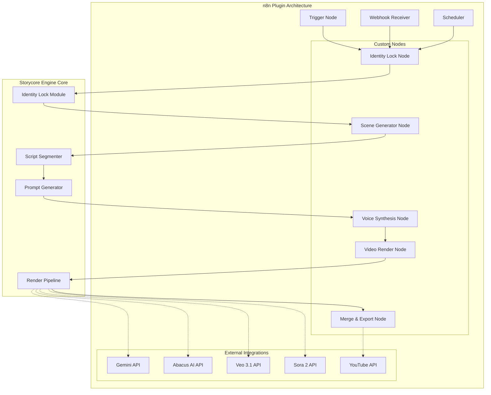

# Analyse de Contenu Web - Robert's Tech Toolbox

## Objectif
Extraire les données nécessaires pour :
- Conception de nouvelles fonctionnalités dans storycore-engine
- Amélioration du workflow sur différents types de projets
- Amélioration de la qualité des prompts
- Génération de plugin n8n

---

## Page 1: How to Build 3 Free AI Apps with No Code
**URL:** https://robertstechtoolbox.com/how-to-build-3-free-ai-apps-with-no-code/

### Contenu
Article tutoriel sur la création de 3 applications AI sans code via Google Gemini Studio et Abacus AI.

### Points Clés Extraits

#### Outils et Plateformes
- **Google Gemini Studio** - App Builder no-code gratuit
- **Abacus AI** - Plateforme de génération vidéo avec support Sora 2/Veo 3
- **ChatGPT** - Génération de scripts et dialogues
- **CapCut / Premiere Rush** - Assemblage final

#### Workflow d'Automatisation
1. **APP #1 - AI Character Story Image Generator**
   - Génère des personnages cohérents across scenes
   - 4 slots d'upload d'images de référence
   - Support multi-scènes avec batch generation
   - Output 4K

2. **APP #2 - AI Voice Narrator App**
   - Remplace ElevenLabs, Play.ht, Minimax
   - Détection multi-speaker
   - Contrôle émotion, pitch, vitesse
   - Export MP3

3. **APP #3 - AI Video Story Creator**
   - 10 slots d'upload d'images
   - Prompts JSON multi-lignes
   - Auto-validator
   - Merge-all-clips tool

#### Cas d'Usage Concrets
- Chaînes YouTube faceless
- Vidéos d'histoires pour enfants
- Projets fantasy/anime
- Publicités et campagnes

### Prompts Identifiés

#### Prompt de Génération d'Histoire
```
"Write a short movie story idea with three characters, including a character named King Kong Jr."
```

#### Prompt de Scènes
```
"Give me 10 scene prompts for this story."
```

#### Structure de Prompt pour App Builder
- Template avec slots d'upload d'images
- Dropdown de ratio d'aspect
- Zone de prompt multi-scènes
- Générateur de batch
- Bouton Download All

### Fonctionnalités Potentielles
1. **Système de Cohérence de Personnage** - Lock des caractéristiques faciales via image de référence
2. **Génération de Scènes par Batch** - Production de multiples scènes en une opération
3. **Pipeline Audio-Vidéo Intégré** - Workflow complet de la voix à la vidéo
4. **Export Multi-Format** - Support automatique des formats plateformes (9:16, 16:9, 4:5)

---

## Page 2: AI Video Ads - From 1 Image to Viral Cinematic AI Ads in 2026
**URL:** https://robertstechtoolbox.com/ai-video-ads-from-1-image-to-viral-cinematic-ai-ads-in-2026/

### Contenu
Guide complet sur la création de publicités vidéo AI à partir d'une seule image produit.

### Points Clés Extraits

#### Outils et Plateformes
- **Google Veo 3.1** - Génération vidéo cinématique avec JSON prompting
- **ChatGPT / Gemini** - Génération de métadonnées et scripts
- **Facebook Ads Manager / TikTok Ads Manager** - Plateformes cibles

#### Workflow d'Automatisation - One Image System
1. **Step 1: Choose the Right Image**
   - Image produit claire
   - Éclairage réaliste
   - Éviter les angles extrêmes

2. **Step 2: Lock Character Consistency**
   - Définir: âge, genre, cheveux, tenue, personnalité
   - Prévenir la régénération de visage différent

3. **Step 3: Design Realistic Motion**
   - Mouvement handheld camera
   - Shake subtil
   - Framing naturel

4. **Step 4: Use Google Veo 3.1 JSON Prompting**
   - Contrôle des camera paths
   - Frame rate
   - Lighting
   - Transitions

5. **Step 5: Export for Each Platform**
   - TikTok Ads: 9:16
   - Facebook Ads: 4:5
   - YouTube Shorts: 9:16

#### Cas d'Usage Concrets
- UGC-style ads avec créateur tenant le produit
- CGI ads avec rotation subtile du produit
- Lifestyle AI video ads

### Prompts Identifiés

#### High-Performing Prompt Structure
```
"Create a realistic AI video ad using one product image, a consistent character, natural lighting, handheld UGC camera movement, and cinematic depth. Optimize for TikTok engagement."
```

#### Règle d'Or
```
"If a real cameraman could follow the instruction, AI can too."
```

#### JSON Prompting pour Veo 3.1
- Camera paths
- Frame rate
- Lighting parameters
- Transition definitions

### Fonctionnalités Potentielles
1. **Système d'Ancre Visuelle** - Une image comme source de vérité unique
2. **Verrouillage d'Identité** - Extraction et réutilisation des caractéristiques
3. **Motion Design Réaliste** - Imperfections caméra pour authenticité
4. **Export Multi-Plateforme Automatisé** - Formats optimisés par plateforme

---

## Page 3: Page d'Accueil Robert's Tech Toolbox
**URL:** https://robertstechtoolbox.com/

### Contenu
Page d'accueil listant les articles et tutoriels disponibles sur le site.

### Points Clés Extraits

#### Catégories de Contenu
- **AI Apps** - Applications AI no-code
- **Image To Video** - Conversion image vers vidéo
- **Text To Image** - Génération d'images
- **Text To Speech** - Synthèse vocale
- **Text To Video** - Génération vidéo depuis texte

#### Articles Principaux
1. AI Talking Avatar App
2. AI Video Ads
3. NotebookLM Google AI System
4. Build Any Website Free
5. Automate YouTube
6. Build 3 Free AI Apps
7. Faceless Kids' Song AI Prompts
8. AI Kids' Story Passive Income

### Prompts Identifiés
- Pas de prompts spécifiques sur cette page d'index

### Fonctionnalités Potentielles
1. **Catalogue de Templates** - Système de templates par catégorie
2. **Navigation par Cas d'Usage** - Organisation par objectif créatif
3. **Système de Tags** - Classification multi-dimensionnelle

---

## Page 4: AI Talking Avatar App - 3 Powerful Prompts to Build a Free System 2025
**URL:** https://robertstechtoolbox.com/ai-talking-avatar-app-3-powerful-prompts-to-build-a-free-system-2025/

### Contenu
Guide complet pour créer un système d'avatar parlant AI de niveau HeyGen avec 3 prompts structurés.

### Points Clés Extraits

#### Outils et Plateformes
- **Google Studio** - Builder no-code
- **Abacus AI** - Rendu vidéo
- **Lovable / Base44** - Alternatives no-code
- **Veo 3.1 / Sora 2** - Modèles vidéo
- **fal.ai / kie.ai** - Providers API tiers
- **HeyGen / Synthesia / D-ID** - Comparaison concurrents

#### Workflow d'Automatisation - 3-Prompt System

**Prompt 1 - Foundation (The Brain)**
- Extrait l'identité de l'avatar depuis une image
- Divise le script en scènes de 8 secondes
- Génère des prompts Veo JSON et Sora-style
- Ne touche pas aux APIs (100% gratuit)

**Prompt 2 - Control & Power (Execution Layer)**
- Connecteurs de modèles
- Gestion des clés API
- Pipeline de rendu
- Logique de retry
- Merge de scènes

**Prompt 3 - One-Go Master Prompt (Production System)**
- Combine Prompt 1 + Prompt 2
- Système complet en un seul prompt
- Élimine l'erreur humaine

#### Concept Clé: Avatar Identity Lock
```
Upload avatar image once
Extract facial features once
Lock identity permanently
All scenes inherit the same face, lighting, proportions
```

#### Pourquoi 8 Secondes?
- Parfait pour Shorts, Reels, TikTok, ads
- Correspond à la durée d'attention humaine
- Prévient le model drift
- Sync audio plus facile
- Taux d'échec réduit

### Prompts Identifiés

#### Prompt 1 - Foundation Template
```
You are an AI avatar system architect.

Rules:
- Extract avatar identity from one uploaded image.
- Lock facial proportions, lighting, and features permanently.
- Split scripts into 8-second scenes.
- Output Veo 3.1 JSON prompts and Sora-style text prompts.
- Do not render video.
- Do not call APIs.
- Ensure all scenes inherit the same identity.
```

#### Prompt 2 - Execution Upgrade Template
```
Extend the avatar system to include:
- Model connectors for Veo 3.1 and Sora 2
- API key handling
- Scene-by-scene rendering
- Retry logic
- Scene merging pipeline
- Preview UI
```

#### Prompt 3 - One-Go Master Prompt
```
Build a complete AI Talking Avatar App with:
- Identity locking
- Script segmentation
- Prompt generation
- Rendering pipeline
- API integration
- Retry handling
- Preview and merge workflow
All in one system.
```

#### Best Settings
| Setting | Recommended |
|---------|-------------|
| Scene Length | 8 seconds |
| Emotion Baseline | Neutral to Slight Warmth |
| Voice Speed | 0.95x |
| Lighting | Soft front-facing |
| Camera Angle | Slight downward |
| Resolution | 1080p |
| Output Ratio | 9:16 Shorts, 16:9 YouTube |

### Fonctionnalités Potentielles
1. **Système d'Identité d'Avatar** - Extraction et verrouillage des caractéristiques faciales
2. **Segmentation Automatique de Script** - Découpage en segments de 8 secondes
3. **Pipeline de Rendu Multi-Modèle** - Support Veo, Sora, et autres
4. **Système de Retry Automatique** - Gestion des échecs de génération
5. **Merge de Scènes** - Assemblage automatique des clips

---

## Page 5: Automate YouTube - Build 2 Free AI Apps No Code to Boost Growth Fast
**URL:** https://robertstechtoolbox.com/automate-youtube-build-2-free-ai-apps-no-code-to-boost-growth-fast/

### Contenu
Tutoriel pour automatiser le workflow YouTube avec 2 applications AI via Gemini 3.0 Pro.

### Points Clés Extraits

#### Outils et Plateformes
- **Gemini 3.0 Pro (Google AI Studio)** - Builder no-code principal
- **YouTube Creator Studio** - Plateforme cible
- **Google Trends** - Recherche de tendances
- **Canva** - Design complémentaire

#### Workflow d'Automatisation

**APP #1 - YouTube Upload Pack Builder**
- Génération de 3 titres high-CTR (< 65 caractères)
- Description SEO
- Bloc de 500 caractères de tags
- Hashtags
- Commentaire épinglé high-CTR
- 4 concepts de thumbnails

**APP #2 - Thumbnail Generator with Competitor Learning**
- Upload de 10-15 thumbnails concurrentes
- Extraction automatique depuis URL YouTube
- Génération de 2 thumbnails
- Palette de couleurs HEX
- Analyse de style
- Mockups
- Tips CTR

#### Cas d'Usage Concrets
- Automatisation de métadonnées YouTube
- Analyse de thumbnails concurrents
- Génération de contenu SEO optimisé

### Prompts Identifiés

#### Structure de Prompt pour Upload Pack
- Input: Keyword 1, Keyword 2, Keyword 3, Video Script
- Logic: "Generate 3 high-CTR titles under 65 characters"
- Stop rule: "Stop and wait for the user to choose one"
- Output: Full upload pack

#### Configuration de Génération de Titres
```
Generate 3 high-CTR titles under 65 characters
Stop and wait for the user to choose one
```

#### Compétitor Learning Pattern
- Upload 10-15 images de thumbnails concurrentes
- Affichage en grille
- Fonctions delete + reorder
- Auto-fetch depuis URL YouTube

### Fonctionnalités Potentielles
1. **Génération de Métadonnées SEO** - Titres, descriptions, tags automatisés
2. **Analyse de Thumbnails Concurrents** - Pattern learning visuel
3. **Extraction de Palette de Couleurs** - Cohérence de marque
4. **Workflow Multi-Étapes** - Génération avec validation utilisateur

---

## Synthèse Globale

### Patterns de Prompts Efficaces

#### 1. Structure en Couches (Layered Prompts)
```
Prompt 1: Foundation/Brain - Définit la logique et les règles
Prompt 2: Execution/Power - Ajoute les connecteurs et pipelines
Prompt 3: One-Go Master - Combine tout en un système complet
```

#### 2. Verrouillage d'Identité (Identity Lock)
```
- Extraire les caractéristiques depuis une source unique
- Verrouiller définitivement ces caractéristiques
- Forcer toutes les générations à hériter de la même identité
```

#### 3. Segmentation Temporelle
```
- Scènes de 8 secondes pour stabilité
- Correspondance avec durée d'attention humaine
- Prévention du model drift
```

#### 4. Prompts avec Règles d'Arrêt
```
- "Stop and wait for user to choose"
- Empêche la génération non contrôlée
- Permet validation humaine
```

#### 5. JSON Prompting pour Contrôle Précis
```json
{
  "camera_path": "...",
  "frame_rate": 24,
  "lighting": "soft_front",
  "transition": "cut"
}
```

#### 6. Validation par Règle Métier
```
"If a real cameraman could follow the instruction, AI can too."
```

### Fonctionnalités à Intégrer dans storycore-engine

#### 1. Système de Cohérence de Personnage
- **Description**: Verrouillage des caractéristiques faciales et visuelles
- **Implémentation**: Extraction depuis image de référence + stockage des features
- **Bénéfice**: Cohérence across toutes les scènes d'un projet

#### 2. Segmentation Intelligente de Scripts
- **Description**: Découpage automatique en segments de 8 secondes
- **Implémentation**: Parser de script avec timing
- **Bénéfice**: Stabilité de génération et sync audio facilité

#### 3. Pipeline de Rendu Multi-Modèle
- **Description**: Support de multiples backends vidéo (Veo, Sora, ComfyUI)
- **Implémentation**: Abstraction de provider avec interface commune
- **Bénéfice**: Flexibilité et résilience

#### 4. Système de Retry Intelligent
- **Description**: Reprise automatique sur échec de génération
- **Implémentation**: Queue avec retry logic et fallback
- **Bénéfice**: Fiabilité de production

#### 5. Génération de Métadonnées SEO
- **Description**: Titres, descriptions, tags optimisés
- **Implémentation**: Templates de prompts avec analyse de mots-clés
- **Bénéfice**: Optimisation automatique pour plateformes

#### 6. Analyse de Style Concurrent
- **Description**: Learning visuel depuis exemples existants
- **Implémentation**: Extraction de palette, composition, style
- **Bénéfice**: Alignement avec tendances du marché

#### 7. Export Multi-Format Automatisé
- **Description**: Génération automatique des formats plateforme
- **Implémentation**: Templates de ratio et résolution
- **Bénéfice**: Distribution omnicanale

### Architecture Plugin n8n Proposée



#### Composants du Plugin n8n

##### 1. Storycore Trigger Node
- Déclenchement par webhook
- Scheduler intégré
- Support de templates de projet

##### 2. Identity Lock Node
- Upload d'image de référence
- Extraction des caractéristiques
- Stockage du profil d'identité

##### 3. Scene Generator Node
- Input de script
- Segmentation automatique
- Génération de prompts par scène

##### 4. Voice Synthesis Node
- Multi-provider support
- Contrôle émotion/vitesse
- Export audio

##### 5. Video Render Node
- Abstraction multi-modèle
- Retry automatique
- Progress tracking

##### 6. Merge & Export Node
- Assemblage des clips
- Export multi-format
- Publication directe

#### Configuration Type

```json
{
  "storycore_workflow": {
    "identity": {
      "source_image": "{{ $binary.image }}",
      "lock_features": ["face", "lighting", "proportions"]
    },
    "script": {
      "input": "{{ $json.script }}",
      "segment_duration": 8,
      "language": "fr"
    },
    "voice": {
      "provider": "gemini",
      "emotion": "neutral_warmth",
      "speed": 0.95
    },
    "video": {
      "provider": "veo",
      "resolution": "1080p",
      "aspect_ratio": "16:9"
    },
    "export": {
      "formats": ["mp4"],
      "platforms": ["youtube", "tiktok"]
    }
  }
}
```

### Améliorations Workflow Recommandées

#### 1. Intégration Identity Lock dans Wizards Existants
- Ajouter une étape de verrouillage de personnage dans les wizards
- Permettre la réutilisation d'identités entre projets
- Stocker les profils dans la bibliothèque d'assets

#### 2. Segmentation Automatique dans Timeline
- Implémenter la logique de découpage 8 secondes
- Afficher les segments dans l'UI timeline
- Permettre ajustement manuel avec contraintes

#### 3. Système de Prompts en Couches
- Créer une bibliothèque de prompts foundation
- Permettre l'ajout de couches execution
- Générer des master prompts à la demande

#### 4. Pipeline de Retry avec Fallback
- Implémenter retry sur échec de génération
- Ajouter fallback vers modèles alternatifs
- Logger les échecs pour analyse

#### 5. Templates de Métadonnées par Plateforme
- Créer des templates YouTube, TikTok, Instagram
- Générer automatiquement titres, descriptions, tags
- Permettre personnalisation par projet

#### 6. Analyse Concurrentielle Intégrée
- Permettre import de références visuelles
- Extraire palettes et styles
- Suggérer des améliorations basées sur tendances

---

## Annexes

### A. Outils Mentionnés par Catégorie

| Catégorie | Outils |
|-----------|--------|
| No-Code Builders | Google Gemini Studio, Abacus AI, Lovable, Base44 |
| Video Generation | Veo 3.1, Sora 2, ComfyUI |
| Voice Synthesis | Gemini TTS, ElevenLabs, Play.ht |
| Image Generation | Midjourney, Leonardo, Flux |
| Editing | CapCut, Premiere Rush |
| SEO/Metadata | Gemini 3.0 Pro, ChatGPT |
| Platforms | YouTube, TikTok, Facebook Ads |

### B. Structure de Prompt Optimale

```
[ROLE DEFINITION]
You are an AI [domain] system architect.

[RULES]
- [Rule 1]
- [Rule 2]
- [Rule 3]

[CONSTRAINTS]
- [Constraint 1]
- [Constraint 2]

[OUTPUT FORMAT]
- [Format specification]

[STOP CONDITIONS]
- [When to pause for user input]
```

### C. Références

- Google AI Studio: https://ai.google.dev/
- Abacus AI: https://abacus.ai
- n8n Documentation: https://docs.n8n.io/
- Veo 3.1 API: Via Google AI Studio