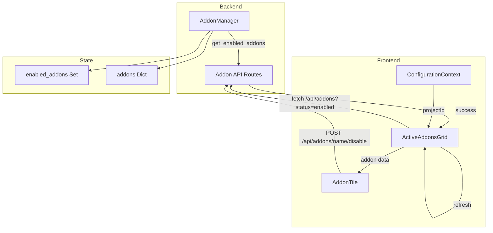
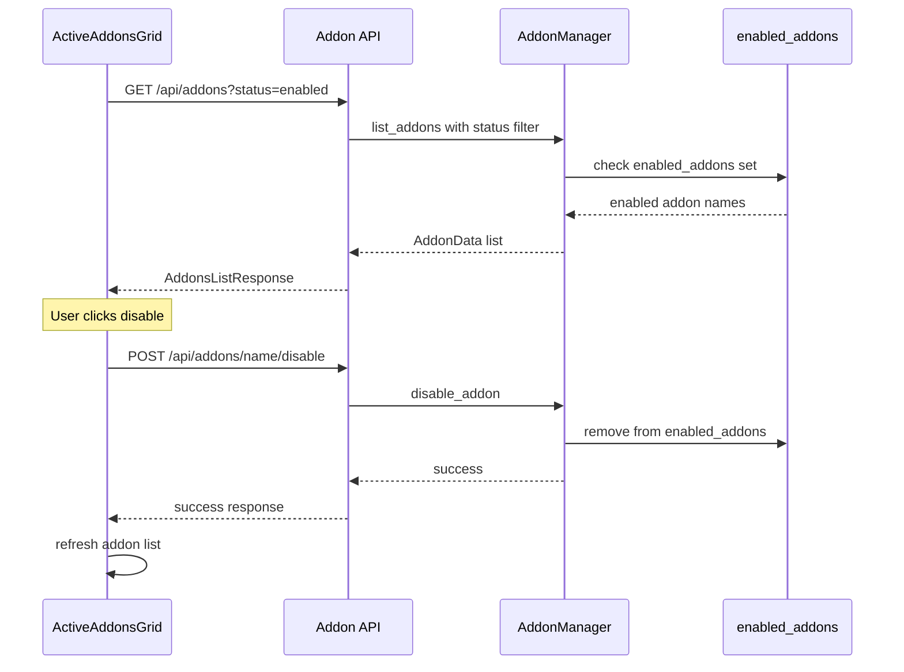

# ActiveAddonsGrid Component Specification

## Overview

This document specifies the design and implementation guidelines for the `ActiveAddonsGrid` component, a visual tile-based interface for displaying and interacting with enabled add-ons in StoryCore. The design follows the existing Wizards interface pattern for visual consistency.

---

## 1. Analysis of Existing Systems

### 1.1 Addon Manager Structure

**File:** [`src/addon_manager.py`](src/addon_manager.py)

The addon system is built around the following core structures:

#### AddonType Enum
```python
class AddonType(Enum):
    WORKFLOW = "workflow_addon"
    UI = "ui_addon"
    PROCESSING = "processing_addon"
    MODEL = "model_addon"
    EXPORT = "export_addon"
```

#### AddonState Enum
```python
class AddonState(Enum):
    DISABLED = "disabled"
    ENABLED = "enabled"
    ERROR = "error"
    LOADING = "loading"
```

#### AddonManifest Dataclass
| Field | Type | Description |
|-------|------|-------------|
| `name` | `str` | Unique identifier |
| `version` | `str` | Semantic version |
| `type` | `AddonType` | Add-on category |
| `author` | `str` | Creator name |
| `description` | `str` | Brief description |
| `compatibility` | `Dict[str, str]` | Version requirements |
| `permissions` | `List[str]` | Required permissions |
| `entry_points` | `Dict[str, str]` | Module entry points |
| `dependencies` | `Dict[str, str]` | Required dependencies |
| `metadata` | `Dict[str, Any]` | Additional metadata |

#### AddonInfo Dataclass
| Field | Type | Description |
|-------|------|-------------|
| `manifest` | `AddonManifest` | Add-on manifest |
| `path` | `Path` | Installation path |
| `state` | `AddonState` | Current state |
| `module` | `Optional[Any]` | Loaded module |
| `error_message` | `Optional[str]` | Error details |
| `load_time` | `Optional[float]` | Load duration |

#### Key AddonManager Methods
- [`get_enabled_addons()`](src/addon_manager.py:368) - Returns list of enabled addon names
- [`get_addon_info(addon_name)`](src/addon_manager.py:372) - Returns AddonInfo for specific addon
- [`get_addons_by_type(addon_type)`](src/addon_manager.py:376) - Filters addons by type
- [`enable_addon(addon_name)`](src/addon_manager.py:279) - Enables an addon
- [`disable_addon(addon_name)`](src/addon_manager.py:317) - Disables an addon

### 1.2 Addon API Routes

**File:** [`src/api/addon_routes.py`](src/api/addon_routes.py)

The backend exposes RESTful endpoints for addon management:

| Endpoint | Method | Description |
|----------|--------|-------------|
| `/api/addons` | GET | List all addons with optional filters |
| `/api/addons/{addon_name}` | GET | Get addon details |
| `/api/addons/{addon_name}/enable` | POST | Enable an addon |
| `/api/addons/{addon_name}/disable` | POST | Disable an addon |
| `/api/addons/types/list` | GET | Get addon type definitions |
| `/api/addons/stats` | GET | Get addon system statistics |

#### List Addons Response Structure
```json
{
  "success": true,
  "count": 3,
  "addons": [
    {
      "name": "demo_addon",
      "version": "1.0.0",
      "type": "workflow_addon",
      "author": "Unknown",
      "description": "Add-on de démonstration du système",
      "category": "community",
      "status": "enabled",
      "enabled": true,
      "permissions": ["model_access"],
      "dependencies": {},
      "metadata": {
        "created_with": "addon_cli",
        "category": "community"
      },
      "load_time": 0.123,
      "error_message": null
    }
  ]
}
```

### 1.3 Wizards Tile Implementation

**Files:** 
- [`src/ui/WizardLauncher.tsx`](src/ui/WizardLauncher.tsx)
- [`src/ui/WizardLauncher.css`](src/ui/WizardLauncher.css)

The Wizards interface provides the visual pattern to follow:

#### Component Structure
```
WizardLauncher
├── wizard-launcher (container)
│   ├── wizard-launcher-title (header)
│   └── wizard-grid (grid container)
│       └── WizardButton (per wizard)
│           ├── wizard-button-container
│           │   ├── wizard-button
│           │   │   ├── wizard-icon
│           │   │   │   ├── img (custom icon) OR
│           │   │   │   └── default-icon (emoji fallback)
│           │   │   └── wizard-name
│           │   └── wizard-tooltip (hover)
│           │       ├── tooltip-title
│           │       ├── tooltip-description
│           │       └── tooltip-requirements (if disabled)
```

#### Key CSS Classes and Styles

| Class | Purpose | Key Properties |
|-------|---------|----------------|
| `.wizard-launcher` | Container | `padding: 20px` |
| `.wizard-launcher-title` | Header | `font-size: 1.5rem`, `font-weight: 600` |
| `.wizard-grid` | Grid layout | `display: grid`, `grid-template-columns: repeat(auto-fit, minmax(200px, 1fr))`, `gap: 16px` |
| `.wizard-button` | Tile button | `border: 2px solid`, `border-radius: 12px`, `min-height: 140px`, `max-width: 180px` |
| `.wizard-button:hover` | Hover state | `transform: translateY(-2px)`, `box-shadow: 0 4px 12px` |
| `.wizard-button.enabled` | Enabled state | `border-color: #28a745` |
| `.wizard-button.disabled` | Disabled state | `opacity: 0.6`, `border-color: #dc3545` |
| `.wizard-icon` | Icon container | `width: 60px`, `height: 60px`, `font-size: 2.5rem` |
| `.wizard-tooltip` | Tooltip popup | `position: absolute`, `background: #333`, `z-index: 1000` |

#### Hover Animation
```css
.wizard-button:hover:not(.disabled) {
  border-color: #007bff;
  box-shadow: 0 4px 12px rgba(0, 123, 255, 0.15);
  transform: translateY(-2px);
}
```

### 1.4 Integration Point

**File:** [`src/ui/ProjectWorkspace.tsx`](src/ui/ProjectWorkspace.tsx)

The ProjectWorkspace component is the main integration point:
- Uses `ConfigurationContext` for project configuration
- Contains `WizardLauncher` component
- Has sections for Pipeline Status, Quick Assets, Activity Logs, Configuration

---

## 2. ActiveAddonsGrid Component Design

### 2.1 Component Architecture

```
ActiveAddonsGrid
├── active-addons-grid (container)
│   ├── active-addons-title (header)
│   └── addons-grid (grid container)
│       └── AddonTile (per enabled addon)
│           ├── addon-tile-container
│           │   ├── addon-tile
│           │   │   ├── addon-icon
│           │   │   │   ├── img (custom icon) OR
│           │   │   │   └── default-addon-icon (type-based emoji)
│           │   │   ├── addon-name
│           │   │   └── addon-version
│           │   └── addon-tooltip (hover)
│           │       ├── tooltip-title
│           │       ├── tooltip-description
│           │       ├── tooltip-meta (author, type)
│           │       └── tooltip-actions (disable button)
```

### 2.2 TypeScript Interfaces

```typescript
// Addon type enum matching Python backend
export type AddonType = 
  | 'workflow_addon'
  | 'ui_addon'
  | 'processing_addon'
  | 'model_addon'
  | 'export_addon';

// Addon state enum matching Python backend
export type AddonState = 
  | 'disabled'
  | 'enabled'
  | 'error'
  | 'loading';

// Addon data from API
export interface AddonData {
  name: string;
  version: string;
  type: AddonType;
  author: string;
  description: string;
  category: 'official' | 'community';
  status: AddonState;
  enabled: boolean;
  permissions: string[];
  dependencies: Record<string, string>;
  metadata: Record<string, any>;
  load_time: number | null;
  error_message: string | null;
}

// API response for list addons
export interface AddonsListResponse {
  success: boolean;
  count: number;
  addons: AddonData[];
}

// Props for ActiveAddonsGrid
export interface ActiveAddonsGridProps {
  projectId: string;
  onAddonClick?: (addon: AddonData) => void;
  onAddonDisable?: (addonName: string) => void;
  refreshTrigger?: number; // External trigger to refresh data
}

// Props for individual AddonTile
export interface AddonTileProps {
  addon: AddonData;
  onDisable: () => void;
  onClick?: () => void;
}
```

### 2.3 Component Props and State

#### ActiveAddonsGrid Component

| Prop | Type | Required | Description |
|------|------|----------|-------------|
| `projectId` | `string` | Yes | Current project identifier |
| `onAddonClick` | `(addon: AddonData) => void` | No | Callback when addon tile is clicked |
| `onAddonDisable` | `(addonName: string) => void` | No | Callback when addon is disabled |
| `refreshTrigger` | `number` | No | External trigger to refresh addon list |

| State | Type | Description |
|-------|------|-------------|
| `addons` | `AddonData[]` | List of enabled addons |
| `isLoading` | `boolean` | Loading state |
| `error` | `string \| null` | Error message if any |

#### AddonTile Component

| Prop | Type | Required | Description |
|------|------|----------|-------------|
| `addon` | `AddonData` | Yes | Addon data to display |
| `onDisable` | `() => void` | Yes | Callback to disable addon |
| `onClick` | `() => void` | No | Callback when tile is clicked |

| State | Type | Description |
|-------|------|-------------|
| `showTooltip` | `boolean` | Tooltip visibility state |
| `isDisabling` | `boolean` | Disable operation in progress |

### 2.4 Icon Mapping by Addon Type

```typescript
const ADDON_TYPE_ICONS: Record<AddonType, string> = {
  workflow_addon: '⚡',
  ui_addon: '🖥️',
  processing_addon: '🔧',
  model_addon: '🤖',
  export_addon: '📤'
};

const ADDON_TYPE_LABELS: Record<AddonType, string> = {
  workflow_addon: 'Workflow',
  ui_addon: 'UI',
  processing_addon: 'Processing',
  model_addon: 'Model',
  export_addon: 'Export'
};
```

---

## 3. Data Flow Design

### 3.1 Data Flow Diagram



### 3.2 Synchronization Mechanism



### 3.3 State Synchronization Strategy

1. **Initial Load**: Fetch enabled addons on component mount
2. **Polling**: Optional polling interval for real-time updates
3. **Event-Driven**: Listen for addon state changes via WebSocket (future)
4. **Manual Refresh**: Trigger refresh after disable/enable operations

```typescript
// Example hook for fetching enabled addons
const useEnabledAddons = (refreshTrigger?: number) => {
  const [addons, setAddons] = useState<AddonData[]>([]);
  const [isLoading, setIsLoading] = useState(true);
  const [error, setError] = useState<string | null>(null);

  const fetchAddons = useCallback(async () => {
    setIsLoading(true);
    try {
      const response = await fetch('/api/addons?status=enabled');
      const data: AddonsListResponse = await response.json();
      setAddons(data.addons);
      setError(null);
    } catch (err) {
      setError(err.message);
    } finally {
      setIsLoading(false);
    }
  }, []);

  useEffect(() => {
    fetchAddons();
  }, [fetchAddons, refreshTrigger]);

  return { addons, isLoading, error, refetch: fetchAddons };
};
```

---

## 4. CSS Styling Requirements

### 4.1 File: `src/ui/ActiveAddonsGrid.css`

The styling should mirror the WizardLauncher patterns:

```css
/* ActiveAddonsGrid Component Styles */

.active-addons-grid {
  padding: 20px;
  max-width: 100%;
}

.active-addons-title {
  font-size: 1.5rem;
  font-weight: 600;
  margin-bottom: 16px;
  color: #333;
  text-align: center;
}

.addons-grid {
  display: grid;
  grid-template-columns: repeat(auto-fit, minmax(200px, 1fr));
  gap: 16px;
  margin-top: 16px;
}

.addon-tile-container {
  position: relative;
  display: flex;
  justify-content: center;
}

.addon-tile {
  display: flex;
  flex-direction: column;
  align-items: center;
  padding: 20px;
  border: 2px solid #28a745; /* Green for enabled */
  border-radius: 12px;
  background: white;
  cursor: pointer;
  transition: all 0.2s ease;
  min-height: 140px;
  width: 100%;
  max-width: 180px;
  text-decoration: none;
  color: inherit;
  box-shadow: 0 2px 4px rgba(0, 0, 0, 0.1);
}

.addon-tile:hover {
  border-color: #007bff;
  box-shadow: 0 4px 12px rgba(0, 123, 255, 0.15);
  transform: translateY(-2px);
}

.addon-icon {
  font-size: 2.5rem;
  margin-bottom: 12px;
  display: flex;
  align-items: center;
  justify-content: center;
  width: 60px;
  height: 60px;
}

.default-addon-icon {
  font-size: 2.5rem;
}

.addon-name {
  font-size: 0.9rem;
  font-weight: 500;
  text-align: center;
  color: #333;
  line-height: 1.3;
}

.addon-version {
  font-size: 0.75rem;
  color: #666;
  margin-top: 4px;
}

/* Tooltip Styles */
.addon-tooltip {
  position: absolute;
  bottom: 100%;
  left: 50%;
  transform: translateX(-50%);
  background: #333;
  color: white;
  padding: 12px 16px;
  border-radius: 8px;
  font-size: 0.85rem;
  max-width: 250px;
  width: max-content;
  z-index: 1000;
  box-shadow: 0 4px 12px rgba(0, 0, 0, 0.3);
  margin-bottom: 8px;
  pointer-events: auto;
}

.addon-tooltip::after {
  content: '';
  position: absolute;
  top: 100%;
  left: 50%;
  transform: translateX(-50%);
  border: 6px solid transparent;
  border-top-color: #333;
}

.tooltip-title {
  font-weight: 600;
  margin-bottom: 4px;
  font-size: 0.9rem;
}

.tooltip-description {
  margin-bottom: 8px;
  line-height: 1.4;
}

.tooltip-meta {
  font-size: 0.8rem;
  color: #aaa;
  border-top: 1px solid #555;
  padding-top: 6px;
  margin-top: 6px;
}

.tooltip-actions {
  margin-top: 8px;
  padding-top: 8px;
  border-top: 1px solid #555;
}

.disable-btn {
  background: #dc3545;
  color: white;
  border: none;
  padding: 6px 12px;
  border-radius: 4px;
  font-size: 0.8rem;
  cursor: pointer;
  transition: background 0.2s ease;
}

.disable-btn:hover {
  background: #c82333;
}

.disable-btn:disabled {
  background: #6c757d;
  cursor: not-allowed;
}

/* Empty State */
.no-addons {
  text-align: center;
  padding: 40px;
  color: #666;
}

.no-addons-icon {
  font-size: 3rem;
  margin-bottom: 16px;
}

.no-addons-text {
  font-size: 1rem;
}

/* Loading State */
.addons-loading {
  display: flex;
  flex-direction: column;
  align-items: center;
  padding: 40px;
}

.loading-spinner {
  width: 40px;
  height: 40px;
  border: 3px solid #f3f3f3;
  border-top: 3px solid #007bff;
  border-radius: 50%;
  animation: spin 1s linear infinite;
}

@keyframes spin {
  0% { transform: rotate(0deg); }
  100% { transform: rotate(360deg); }
}

/* Error State */
.addons-error {
  text-align: center;
  padding: 20px;
  color: #dc3545;
}

/* Responsive Design */
@media (max-width: 768px) {
  .addons-grid {
    grid-template-columns: repeat(auto-fit, minmax(150px, 1fr));
    gap: 12px;
  }

  .addon-tile {
    padding: 16px;
    min-height: 120px;
    max-width: none;
  }

  .addon-icon {
    font-size: 2rem;
    width: 50px;
    height: 50px;
  }

  .addon-name {
    font-size: 0.8rem;
  }

  .addon-tooltip {
    max-width: 200px;
    font-size: 0.8rem;
  }
}

@media (max-width: 480px) {
  .addons-grid {
    grid-template-columns: repeat(2, 1fr);
  }

  .active-addons-title {
    font-size: 1.25rem;
  }
}
```

---

## 5. Implementation Guidelines

### 5.1 File Structure

```
src/ui/
├── ActiveAddonsGrid.tsx      # Main component
├── ActiveAddonsGrid.css      # Component styles
├── components/
│   └── AddonTile.tsx         # Individual tile component
└── hooks/
    └── useEnabledAddons.ts   # Data fetching hook
```

### 5.2 Integration Points

1. **Import in ProjectWorkspace.tsx**:
```typescript
import ActiveAddonsGrid from './ActiveAddonsGrid';
```

2. **Add to workspace content** (after WizardLauncher):
```tsx
<ActiveAddonsGrid
  projectId={projectId}
  onAddonDisable={(name) => console.log('Disable:', name)}
/>
```

### 5.3 API Integration

The component should use the existing API endpoint:
- **Base URL**: Configured via environment or context
- **Endpoint**: `GET /api/addons?status=enabled`
- **Disable**: `POST /api/addons/{addon_name}/disable`

### 5.4 Error Handling

1. **Network Errors**: Display error message with retry button
2. **Empty State**: Show friendly message when no addons enabled
3. **Disable Failure**: Show toast notification, keep addon in grid

### 5.5 Accessibility

- Use semantic HTML (`button`, `section`)
- Include `aria-label` for interactive elements
- Keyboard navigation support
- Focus management for tooltips

---

## 6. Component Implementation Template

### 6.1 ActiveAddonsGrid.tsx

```typescript
import React, { useState, useEffect, useCallback } from 'react';
import type { AddonData, AddonsListResponse, ActiveAddonsGridProps } from './addonTypes';
import AddonTile from './components/AddonTile';
import { useEnabledAddons } from './hooks/useEnabledAddons';
import './ActiveAddonsGrid.css';

const ActiveAddonsGrid: React.FC<ActiveAddonsGridProps> = ({
  projectId,
  onAddonClick,
  onAddonDisable,
  refreshTrigger
}) => {
  const { addons, isLoading, error, refetch } = useEnabledAddons(refreshTrigger);

  const handleDisable = useCallback(async (addonName: string) => {
    try {
      const response = await fetch(`/api/addons/${addonName}/disable`, {
        method: 'POST'
      });
      if (response.ok) {
        onAddonDisable?.(addonName);
        refetch();
      }
    } catch (err) {
      console.error('Failed to disable addon:', err);
    }
  }, [onAddonDisable, refetch]);

  if (isLoading) {
    return (
      <div className="active-addons-grid">
        <div className="addons-loading">
          <div className="loading-spinner"></div>
          <p>Loading active add-ons...</p>
        </div>
      </div>
    );
  }

  if (error) {
    return (
      <div className="active-addons-grid">
        <div className="addons-error">
          <p>Failed to load add-ons: {error}</p>
          <button onClick={refetch}>Retry</button>
        </div>
      </div>
    );
  }

  if (addons.length === 0) {
    return (
      <div className="active-addons-grid">
        <h3 className="active-addons-title">Active Add-ons</h3>
        <div className="no-addons">
          <div className="no-addons-icon">📦</div>
          <p className="no-addons-text">No add-ons enabled</p>
        </div>
      </div>
    );
  }

  return (
    <div className="active-addons-grid">
      <h3 className="active-addons-title">Active Add-ons ({addons.length})</h3>
      <div className="addons-grid">
        {addons.map((addon) => (
          <AddonTile
            key={addon.name}
            addon={addon}
            onDisable={() => handleDisable(addon.name)}
            onClick={() => onAddonClick?.(addon)}
          />
        ))}
      </div>
    </div>
  );
};

export default ActiveAddonsGrid;
```

### 6.2 AddonTile.tsx

```typescript
import React, { useState } from 'react';
import type { AddonTileProps, AddonType } from '../addonTypes';

const ADDON_TYPE_ICONS: Record<AddonType, string> = {
  workflow_addon: '⚡',
  ui_addon: '🖥️',
  processing_addon: '🔧',
  model_addon: '🤖',
  export_addon: '📤'
};

const ADDON_TYPE_LABELS: Record<AddonType, string> = {
  workflow_addon: 'Workflow',
  ui_addon: 'UI',
  processing_addon: 'Processing',
  model_addon: 'Model',
  export_addon: 'Export'
};

const AddonTile: React.FC<AddonTileProps> = ({ addon, onDisable, onClick }) => {
  const [showTooltip, setShowTooltip] = useState(false);
  const [isDisabling, setIsDisabling] = useState(false);

  const handleDisable = async (e: React.MouseEvent) => {
    e.stopPropagation();
    setIsDisabling(true);
    await onDisable();
    setIsDisabling(false);
  };

  const icon = ADDON_TYPE_ICONS[addon.type] || '📦';
  const typeLabel = ADDON_TYPE_LABELS[addon.type] || 'Unknown';

  return (
    <div className="addon-tile-container">
      <button
        className="addon-tile"
        onClick={onClick}
        onMouseEnter={() => setShowTooltip(true)}
        onMouseLeave={() => setShowTooltip(false)}
        aria-label={`${addon.name}: ${addon.description}`}
      >
        <div className="addon-icon">
          <div className="default-addon-icon">{icon}</div>
        </div>
        <div className="addon-name">{addon.name}</div>
        <div className="addon-version">v{addon.version}</div>
      </button>

      {showTooltip && (
        <div className="addon-tooltip">
          <div className="tooltip-title">{addon.name}</div>
          <div className="tooltip-description">{addon.description}</div>
          <div className="tooltip-meta">
            <div>Author: {addon.author}</div>
            <div>Type: {typeLabel}</div>
            <div>Category: {addon.category}</div>
          </div>
          <div className="tooltip-actions">
            <button
              className="disable-btn"
              onClick={handleDisable}
              disabled={isDisabling}
            >
              {isDisabling ? 'Disabling...' : 'Disable'}
            </button>
          </div>
        </div>
      )}
    </div>
  );
};

export default AddonTile;
```

---

## 7. Testing Considerations

### 7.1 Unit Tests

- Component renders with empty addons list
- Component renders with multiple addons
- Tooltip shows on hover
- Disable button triggers callback
- Loading state displays correctly
- Error state displays correctly

### 7.2 Integration Tests

- API fetch on component mount
- API call on disable action
- State refresh after disable
- Responsive layout at different breakpoints

### 7.3 E2E Tests

- User can view enabled addons
- User can disable an addon from the grid
- Changes persist after page refresh

---

## 8. Future Enhancements

1. **WebSocket Integration**: Real-time addon state updates
2. **Drag and Drop**: Reorder addon tiles
3. **Addon Settings**: Quick access to addon configuration
4. **Search/Filter**: Filter addons by type or name
5. **Bulk Actions**: Enable/disable multiple addons
6. **Addon Marketplace**: Browse and install new addons

---

## 9. Summary

The ActiveAddonsGrid component provides a visual tile-based interface for managing enabled add-ons, following the established Wizards UI pattern. Key aspects:

- **Visual Consistency**: Matches WizardLauncher styling
- **API Integration**: Uses existing `/api/addons` endpoints
- **State Synchronization**: Fetches enabled addons and updates on changes
- **User Interaction**: Hover tooltips with disable functionality
- **Responsive Design**: Adapts to different screen sizes
- **Accessibility**: Semantic HTML and keyboard support

The implementation requires creating 3 new files:
1. `src/ui/ActiveAddonsGrid.tsx` - Main component
2. `src/ui/ActiveAddonsGrid.css` - Styling
3. `src/ui/components/AddonTile.tsx` - Tile sub-component

And optionally:
- `src/ui/hooks/useEnabledAddons.ts` - Data fetching hook
- `src/ui/addonTypes.ts` - TypeScript type definitions
