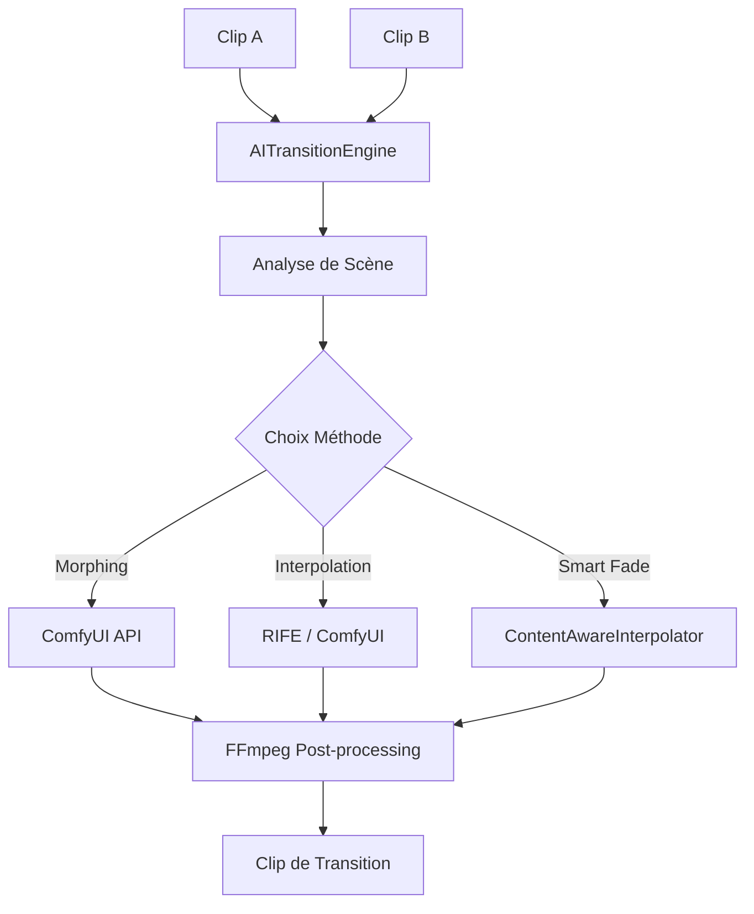

# Spécification Technique : Système de Transitions IA (StoryCore-Engine)

## 1. Résumé du Problème
Les transitions classiques (fondu, balayage) manquent de fluidité et de professionnalisme pour des contenus générés par IA. L'objectif est d'implémenter un moteur de transitions capable de générer des transitions intelligentes (morphing, interpolation de frames) entre deux clips vidéo.

## 2. Analyse des Compromis (Trade-offs)

| Méthode | Performance | Complexité | Maintenabilité | Qualité Visuelle |
| :--- | :--- | :--- | :--- | :--- |
| **FFmpeg xfade** | Excellente (ms) | Faible | Haute | Basse (Standard) |
| **Smart Crossfade** | Bonne (sec) | Moyenne | Haute | Moyenne (Sans fantômes) |
| **RIFE Interpolation** | Moyenne (sec/min) | Haute | Moyenne | Haute (Fluide) |
| **AI Morphing** | Basse (min) | Très Haute | Basse | Très Haute (Cinématique) |

## 3. Solution Choisie : `AITransitionEngine`

Le service `AITransitionEngine` agira comme un orchestrateur entre FFmpeg (pour le montage de base) et ComfyUI (pour les calculs IA lourds).

### 3.1 Types de Transitions Supportées
1.  **`AI_MORPH`** : Utilise un workflow ComfyUI (IP-Adapter + ControlNet) pour transformer la fin du clip A vers le début du clip B.
2.  **`AI_INTERPOLATE`** : Utilise le modèle RIFE pour générer des frames intermédiaires fluides entre A et B.
3.  **`AI_SMART_FADE`** : Utilise `ContentAwareInterpolator` pour un fondu intelligent basé sur l'analyse de mouvement.

### 3.2 Architecture du Service



## 4. Spécification de l'Interface (API)

```python
class AITransitionType(Enum):
    MORPH = "ai_morph"
    INTERPOLATE = "ai_interpolate"
    SMART_FADE = "ai_smart_fade"

@dataclass
class AITransitionConfig:
    duration: float = 1.0
    fps: int = 30
    quality: str = "high" # fast, balanced, high
    workflow_id: Optional[str] = None # Pour ComfyUI custom

class AITransitionEngine:
    def __init__(self, comfy_config: ComfyUIConfig, ffmpeg_path: str):
        self.comfy = comfy_config
        self.ffmpeg = ffmpeg_path
        self.interpolator = ContentAwareInterpolator()

    async def generate_transition(
        self, 
        clip_a_path: str, 
        clip_b_path: str, 
        transition_type: AITransitionType,
        config: AITransitionConfig
    ) -> str:
        """Génère un clip de transition entre A et B."""
        # 1. Extraction des frames clés (dernière de A, première de B)
        # 2. Appel du backend approprié (ComfyUI ou Local)
        # 3. Génération des frames intermédiaires
        # 4. Encodage du clip de transition via FFmpeg
        # 5. Retourne le chemin du fichier généré
        pass
```

## 5. Intégration avec les Outils Existants

### 5.1 ComfyUI (Morphing & RIFE)
-   **Workflow** : Utilisation de `ComfyUI-Frame-Interpolation` pour RIFE.
-   **Morphing** : Workflow basé sur `AnimateDiff` ou `IP-Adapter` pour assurer la cohérence entre les deux clips.
-   **Communication** : WebSocket pour le suivi en temps réel et HTTP pour l'envoi des frames initiales.

### 5.2 FFmpeg
-   **Extraction** : `ffmpeg -i clip_a.mp4 -sseof -1 -t 1 -f image2 last_frame.png`
-   **Assemblage** : `ffmpeg -framerate 30 -i frame_%04d.png -c:v libx264 -pix_fmt yuv420p transition.mp4`

## 6. Points de Défaillance & Atténuation (Next Failure Points)

1.  **Latence ComfyUI** : Les transitions IA sont lentes.
    -   *Mitigation* : Système de cache pour les transitions déjà générées et mode "Preview" (Smart Fade) pendant le montage.
2.  **Incohérence Visuelle (Morphing)** : Le morphing peut créer des artefacts étranges.
    -   *Mitigation* : Utilisation de ControlNet Depth/Canny pour maintenir la structure spatiale.
3.  **Mémoire GPU** : RIFE et Morphing consomment beaucoup de VRAM.
    -   *Mitigation* : File d'attente de rendu (Queue) et vérification de la VRAM disponible via `GPUService`.

## 7. Plan de Validation
-   [ ] Test unitaire : Extraction correcte des frames de début/fin.
-   [ ] Test d'intégration : Appel API ComfyUI avec un workflow simple.
-   [ ] Benchmark : Temps de génération pour 1 seconde de transition (Morph vs RIFE).
-   [ ] Évaluation qualitative : Score SSIM entre les frames générées et les frames sources.
