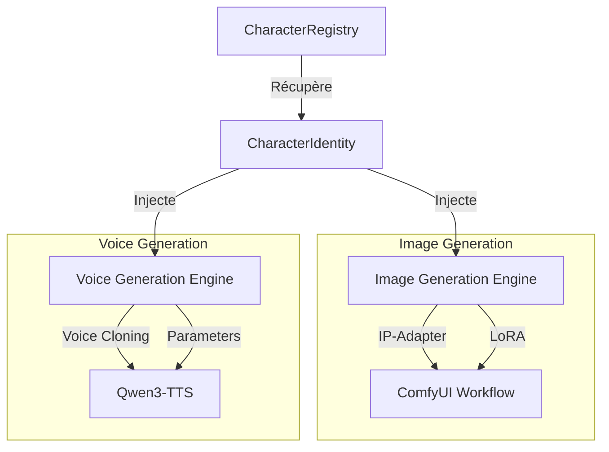

# Spécification Technique : Système de Personnages Cohérents (Consistent Characters)

## 1. Introduction
L'objectif de ce système est de garantir une cohérence absolue des personnages (apparence visuelle et identité vocale) à travers toutes les scènes d'un projet StoryCore-Engine.

## 2. Architecture du Système

Le système repose sur trois piliers :
1. **Identité Centralisée** : Une structure de données unique regroupant tous les traits.
2. **Registre Persistant** : Un gestionnaire de stockage pour la réutilisation.
3. **Moteurs d'Injection** : Adaptateurs pour ComfyUI (Image) et Qwen3-TTS (Audio).



## 3. Structure de Données : `CharacterIdentity`

La structure `CharacterIdentity` est conçue pour être compatible avec `CharacterProfile` tout en isolant les éléments critiques pour la cohérence.

```python
@dataclass
class VoiceProfile:
    voice_id: str               # Identifiant unique de la voix
    provider: str = "qwen3-tts" # Fournisseur TTS
    base_model: str = ""        # Modèle de base (ex: qwen3-tts-1.7b)
    reference_audio_path: Optional[str] = None  # Pour le clonage
    parameters: Dict[str, Any] = field(default_factory=lambda: {
        "pitch": 1.0,
        "speed": 1.0,
        "accent": "neutral",
        "emotion_map": {
            "happy": "cheerful",
            "sad": "melancholic",
            "angry": "aggressive"
        }
    })

@dataclass
class CharacterIdentity:
    character_id: str
    name: str
    
    # Description physique pour les prompts (LLM-ready)
    physical_description: str 
    
    # Référence visuelle pour IP-Adapter
    reference_image_path: Optional[str] = None
    
    # Référence LoRA spécifique (optionnel)
    lora_weights_path: Optional[str] = None
    
    # Profil vocal
    voice_profile: VoiceProfile
    
    # Métadonnées de cohérence
    consistency_seeds: Dict[str, int] = field(default_factory=lambda: {
        "appearance": 42,
        "pose_variation": 123
    })
```

## 4. CharacterRegistry

Le `CharacterRegistry` gère le cycle de vie des identités.

### Fonctions Clés :
- `register(identity: CharacterIdentity)` : Persiste l'identité en JSON/YAML dans `data/characters/`.
- `get_by_id(id: str) -> CharacterIdentity` : Récupère une identité.
- `resolve_for_prompt(id: str) -> str` : Génère le fragment de prompt physique.
- `get_ip_adapter_config(id: str) -> IPAdapterConfig` : Prépare la config pour ComfyUI.

## 5. Stratégies d'Injection

### 5.1 Cohérence Visuelle (IP-Adapter)
Le système utilise **IP-Adapter-Plus** dans ComfyUI pour injecter les caractéristiques faciales et corporelles à partir de `reference_image_path`.

- **Poids (Weight)** : 0.6 - 0.8 pour une fidélité maximale sans étouffer la créativité de la pose.
- **Noise** : 0.0 pour éviter les artefacts sur le visage.
- **Prompt Augmentation** : La `physical_description` est ajoutée au prompt positif pour renforcer les détails que l'IP-Adapter pourrait omettre (couleur des yeux, cicatrices spécifiques).

### 5.2 Cohérence Vocale (Qwen3-TTS)
L'injection vocale suit deux modes :
1. **Mode Clonage** : Si `reference_audio_path` est présent, utilisation de `clone_voice()`.
2. **Mode Paramétrique** : Utilisation de `generate_voice()` avec les `parameters` du `VoiceProfile`.

## 6. Flux de Travail (Workflow)

1. **Création** : L'utilisateur définit le personnage via le `CharacterWizard`.
2. **Ancrage** : Une image de référence "Master" est générée ou fournie.
3. **Stockage** : L'identité est enregistrée dans le `CharacterRegistry`.
4. **Production** :
   - Pour chaque scène, le `PipelineManager` appelle le `CharacterRegistry`.
   - Les nœuds IP-Adapter de ComfyUI sont configurés dynamiquement.
   - Les prompts TTS sont ajustés selon l'émotion de la scène via la `emotion_map`.

## 7. Validation & Qualité
- **Score de Cohérence** : Comparaison CLIP entre l'image générée et l'image de référence.
- **Score Vocal** : Analyse de corrélation spectrale pour vérifier la stabilité du timbre.
