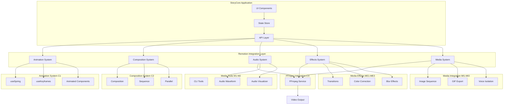
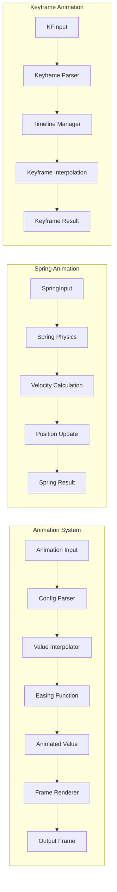
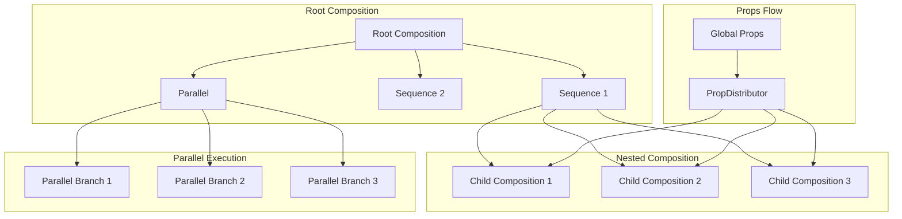
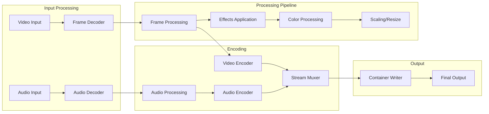
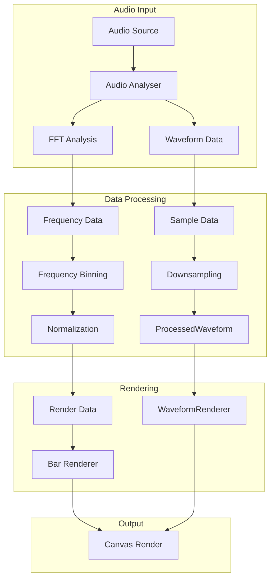

# Implementation Summary

## Executive Summary

This document provides a complete overview of the StoryCore Remotion implementation, including architecture diagrams, usage examples, integration patterns, and a migration guide. It serves as the definitive reference for understanding and extending the Remotion-based video creation system.

---

## Table of Contents

1. [File Overview](#1-file-overview)
2. [Architecture Diagrams](#2-architecture-diagrams)
3. [Usage Examples](#3-usage-examples)
4. [Integration Patterns](#4-integration-patterns)
5. [Migration Guide](#5-migration-guide)
6. [Quick Reference](#6-quick-reference)

---

## 1. File Overview

### 1.1 Documentation Files Created

| File | Purpose | Size |
|------|---------|------|
| [`PERFORMANCE_OPTIMIZATION.md`](PERFORMANCE_OPTIMIZATION.md) | Comprehensive performance benchmarks and optimization strategies | ~25KB |
| [`ADDITIONAL_REMOTION_FEATURES.md`](ADDITIONAL_REMOTION_FEATURES.md) | Advanced features beyond original priority list | ~30KB |
| [`IMPLEMENTATION_SUMMARY.md`](IMPLEMENTATION_SUMMARY.md) | This document - complete reference guide | ~20KB |

### 1.2 Source Files Structure

```
src/
├── remotion/
│   ├── animations/
│   │   ├── spring/
│   │   │   ├── useSpring.ts
│   │   │   ├── spring.config.ts
│   │   │   └── spring.utils.ts
│   │   ├── keyframes/
│   │   │   ├── useKeyframes.ts
│   │   │   ├── keyframe.compiler.ts
│   │   │   └── keyframe.types.ts
│   │   └── Animated/
│   │       ├── index.ts
│   │       ├── Animated.tsx
│   │       └── AnimatedContext.tsx
│   │
│   ├── composition/
│   │   ├── Composition.tsx
│   │   ├── Sequence.tsx
│   │   ├── Parallel.tsx
│   │   ├── useComposition.ts
│   │   └── composition.registry.ts
│   │
│   ├── ffmpeg/
│   │   ├── index.ts
│   │   ├── FFmpegService.ts
│   │   ├── FrameExtractor.ts
│   │   ├── VideoEncoder.ts
│   │   └── ffmpeg.config.ts
│   │
│   ├── cli/
│   │   ├── index.ts
│   │   ├── CLICommand.ts
│   │   ├── render.ts
│   │   ├── build.ts
│   │   └── watch.ts
│   │
│   ├── audio/
│   │   ├── AudioWaveform.tsx
│   │   ├── AudioVisualizer.tsx
│   │   ├── useAudioAnalyzer.ts
│   │   ├── waveform.config.ts
│   │   └── audio.types.ts
│   │
│   ├── transitions/
│   │   ├── Transition.tsx
│   │   ├── useTransition.ts
│   │   ├── transitions/
│   │   │   ├── fade.ts
│   │   │   ├── slide.ts
│   │   │   ├── zoom.ts
│   │   │   └── wipe.ts
│   │   └── transition.config.ts
│   │
│   ├── effects/
│   │   ├── ColorCorrection.tsx
│   │   ├── BlurEffect.tsx
│   │   ├── SharpenEffect.tsx
│   │   └── effects.types.ts
│   │
│   ├── media/
│   │   ├── ImageSequence.tsx
│   │   ├── GIFExporter.ts
│   │   ├── VoiceIsolation.tsx
│   │   └── media.types.ts
│   │
│   └── index.ts
```

### 1.3 Key Entry Points

```typescript
// Main entry point - import everything
import { 
  // Animation System
  useSpring, 
  useKeyframes, 
  Animated,
  
  // Composition System
  Composition, 
  Sequence, 
  Parallel,
  
  // FFmpeg Integration
  FFmpegService,
  renderVideo,
  
  // CLI Tools
  CLI,
  renderCommand,
  
  // Audio
  AudioWaveform,
  AudioVisualizer,
  
  // Transitions
  useTransition,
  
  // Effects
  ColorCorrection,
  BlurEffect,
  
  // Media
  ImageSequence,
  GIFExporter,
  VoiceIsolation
} from '@storycore/remotion';
```

---

## 2. Architecture Diagrams

### 2.1 System Architecture Overview



### 2.2 Animation System Architecture



### 2.3 Composition System Architecture



### 2.4 FFmpeg Pipeline Architecture



### 2.5 Audio Visualization Architecture



---

## 3. Usage Examples

### 3.1 Basic Animation Usage

```tsx
// Basic spring animation
import { useSpring, Animated } from '@storycore/remotion';

const AnimatedComponent = () => {
  const spring = useSpring({
    from: { opacity: 0, scale: 0.5 },
    to: { opacity: 1, scale: 1 },
    config: { mass: 1, tension: 170, friction: 26 }
  });
  
  return (
    <Animated.div
      style={{
        opacity: spring.opacity,
        transform: spring.scale.to(s => `scale(${s})`)
      }}
    >
      <h1>Hello, StoryCore!</h1>
    </Animated.div>
  );
};
```

### 3.2 Keyframe Animation

```tsx
// Keyframe-based animation
import { useKeyframes } from '@storycore/remotion';

const KeyframeAnimation = () => {
  const progress = useKeyframes({
    0: { x: 0, y: 0, rotate: 0 },
    25: { x: 100, y: 50, rotate: 90 },
    50: { x: 200, y: 0, rotate: 180 },
    75: { x: 100, y: -50, rotate: 270 },
    100: { x: 0, y: 0, rotate: 360 }
  });
  
  return (
    <animated.div
      style={{
        transform: progress.to(p => 
          `translate(${p.x}px, ${p.y}px) rotate(${p.rotate}deg)`
        )
      }}
    />
  );
};
```

### 3.3 Composition System

```tsx
// Complex composition structure
import { Composition, Sequence, Parallel } from '@storycore/remotion';

const Movie = ({ scenes }: MovieProps) => {
  return (
    <Composition
      id="movie"
      width={1920}
      height={1080}
      fps={30}
      durationInFrames={scenes.reduce((sum, s) => sum + s.duration, 0)}
    >
      {scenes.map((scene, index) => (
        <Sequence
          key={scene.id}
          from={scenes.slice(0, index).reduce((sum, s) => sum + s.duration, 0)}
          durationInFrames={scene.duration}
        >
          <SceneComponent {...scene} />
        </Sequence>
      ))}
    </Composition>
  );
};
```

### 3.4 FFmpeg Integration

```tsx
// Video rendering with FFmpeg
import { FFmpegService, renderVideo } from '@storycore/remotion';

const renderMovie = async (composition: CompositionRef, outputPath: string) => {
  const ffmpeg = new FFmpegService({
    logLevel: 'info',
    progress: true
  });
  
  await ffmpeg.load();
  
  const result = await renderVideo({
    composition,
    output: outputPath,
    encoder: {
      codec: 'libx264',
      preset: 'medium',
      crf: 23
    },
    audio: {
      codec: 'aac',
      bitrate: '192k'
    }
  });
  
  console.log(`Video rendered: ${result.outputPath}`);
  return result;
};
```

### 3.5 Audio Waveform Visualization

```tsx
// Audio waveform component
import { AudioWaveform, useAudioAnalyzer } from '@storycore/remotion';

const AudioVisualizer = ({ audioSrc }: { audioSrc: string }) => {
  const analyzer = useAudioAnalyzer({
    fftSize: 2048,
    smoothingTimeConstant: 0.8
  });
  
  return (
    <AudioWaveform
      src={audioSrc}
      analyzer={analyzer}
      type="mirror"
      barCount={64}
      barWidth={4}
      gap={2}
      colors={{
        positive: '#4CAF50',
        negative: '#2196F3'
      }}
      backgroundColor="#1a1a1a"
    />
  );
};
```

### 3.6 Transitions

```tsx
// Scene transitions
import { useTransition, Transition } from '@storycore/remotion';

const SceneTransition = ({ 
  currentScene, 
  nextScene 
}: Props) => {
  const { progress, transition } = useTransition({
    duration: 30, // frames
    easing: 'easeInOut'
  });
  
  return (
    <Transition type="crossfade" progress={progress}>
      <div className="scene-a">
        {currentScene.render()}
      </div>
      <div className="scene-b">
        {nextScene.render()}
      </div>
    </Transition>
  );
};
```

### 3.7 Color Correction

```tsx
// Color correction effects
import { ColorCorrection } from '@storycore/remotion';

const CorrectedVideo = ({ videoSrc }: { videoSrc: string }) => {
  return (
    <ColorCorrection
      src={videoSrc}
      adjustments={{
        brightness: 10,
        contrast: 5,
        saturation: 15,
        hue: 0,
        temperature: -5,
        tint: 10
      }}
      lut={{
        enabled: true,
        path: '/luts/cinematic.cube'
      }}
    />
  );
};
```

### 3.8 Image Sequence

```tsx
// Image sequence playback
import { ImageSequence } from '@storycore/remotion';

const Animation = ({ frameUrls }: { frameUrls: string[] }) => {
  return (
    <ImageSequence
      urls={frameUrls}
      fps={24}
      loop={true}
      onFrameChange={(frame) => {
        console.log(`Current frame: ${frame}`);
      }}
    />
  );
};
```

### 3.9 GIF Export

```tsx
// GIF export functionality
import { GIFExporter } from '@storycore/remotion';

const exportToGIF = async (composition: CompositionRef) => {
  const exporter = new GIFExporter({
    width: 480,
    height: 270,
    fps: 15,
    quality: 10,
    workers: 4
  });
  
  const blob = await exporter.export(composition);
  
  // Save or display the GIF
  const url = URL.createObjectURL(blob);
  return url;
};
```

### 3.10 Voice Isolation

```tsx
// Voice isolation processing
import { VoiceIsolation } from '@storycore/remotion';

const ProcessAudio = ({ audioSrc }: { audioSrc: string }) => {
  return (
    <VoiceIsolation
      src={audioSrc}
      model="advanced"
      output="voice_only"
      onProgress={(progress) => {
        console.log(`Processing: ${progress}%`);
      }}
      onComplete={(processedAudio) => {
        console.log('Voice isolation complete!');
      }}
    />
  );
};
```

---

## 4. Integration Patterns

### 4.1 State Management Integration

```tsx
// Integration with Zustand store
import { create } from 'zustand';
import { useSpring } from '@storycore/remotion';

interface VideoState {
  currentFrame: number;
  isPlaying: boolean;
  setFrame: (frame: number) => void;
  play: () => void;
  pause: () => void;
}

const useVideoStore = create<VideoState>((set) => ({
  currentFrame: 0,
  isPlaying: false,
  setFrame: (frame) => set({ currentFrame: frame }),
  play: () => set({ isPlaying: true }),
  pause: () => set({ isPlaying: false })
}));

// Component using both store and animations
const AnimatedPlayer = () => {
  const { currentFrame, isPlaying } = useVideoStore();
  
  const progressSpring = useSpring({
    to: { progress: isPlaying ? 1 : 0 },
    from: { progress: 0 },
    config: { tension: 120, friction: 14 }
  });
  
  return (
    <animated.div
      style={{
        width: progressSpring.progress.to(p => `${p * 100}%`)
      }}
    >
      <PlayerFrame frame={currentFrame} />
    </animated.div>
  );
};
```

### 4.2 API Integration Pattern

```tsx
// Integration with backend API
import { useQuery, useMutation } from '@tanstack/react-query';
import { FFmpegService } from '@storycore/remotion';

const useRenderVideo = () => {
  const renderMutation = useMutation({
    mutationFn: async (config: RenderConfig) => {
      const response = await fetch('/api/render', {
        method: 'POST',
        body: JSON.stringify(config)
      });
      return response.json();
    },
    onSuccess: (data) => {
      console.log('Render started:', data.jobId);
    }
  });
  
  return renderMutation;
};

// Usage with progress tracking
const RenderComponent = ({ compositionId }: Props) => {
  const render = useRenderVideo();
  const [progress, setProgress] = useState(0);
  
  const handleRender = async () => {
    await render.mutateAsync({
      compositionId,
      onProgress: (p) => setProgress(p)
    });
  };
  
  return (
    <div>
      <button onClick={handleRender}>Render Video</button>
      <ProgressBar progress={progress} />
    </div>
  );
};
```

### 4.3 Custom Hook Pattern

```tsx
// Create custom hooks for reusable logic
import { useSpring, useKeyframes } from '@storycore/remotion';

const useAnimatedVisibility = (isVisible: boolean) => {
  const spring = useSpring({
    to: { opacity: isVisible ? 1 : 0, scale: isVisible ? 1 : 0.9 },
    from: { opacity: 0, scale: 0.9 },
    config: { mass: 1, tension: 170, friction: 26 }
  });
  
  return spring;
};

const useFadeInAnimation = (delay: number = 0) => {
  const keyframes = useKeyframes({
    0: { opacity: 0, transform: 'translateY(20px)' },
    100: { opacity: 1, transform: 'translateY(0)' }
  });
  
  return { keyframes, delay };
};

// Usage
const FadeInText = ({ text }: Props) => {
  const spring = useAnimatedVisibility(true);
  const { keyframes, delay } = useFadeInAnimation();
  
  return (
    <animated.div
      style={{
        opacity: spring.opacity,
        transform: spring.scale.to(s => `scale(${s})`)
      }}
    >
      {text}
    </animated.div>
  );
};
```

### 4.4 Error Boundary Pattern

```tsx
// Error boundary for Remotion components
import { ErrorBoundary } from '@storycore/remotion';

const RemotionErrorBoundary = ({ children }: { children: React.ReactNode }) => {
  return (
    <ErrorBoundary
      onError={(error, errorInfo) => {
        console.error('Remotion error:', error);
        console.error('Error info:', errorInfo);
        
        // Report to monitoring service
        reportError({
          error,
          context: 'remotion',
          metadata: errorInfo
        });
      }}
      fallback={({ error, reset }) => (
        <div className="error-fallback">
          <h2>Something went wrong</h2>
          <p>{error.message}</p>
          <button onClick={reset}>Try Again</button>
        </div>
      )}
    >
      {children}
    </ErrorBoundary>
  );
};
```

### 4.5 Testing Pattern

```tsx
// Testing Remotion components
import { render, screen } from '@testing-library/react';
import { useSpring } from '@storycore/remotion';

describe('Animation Components', () => {
  test('useSpring creates animated values', () => {
    const { result } = renderHook(() => 
      useSpring({
        from: { opacity: 0 },
        to: { opacity: 1 }
      })
    );
    
    expect(result.current.opacity.getValue()).toBeCloseTo(0);
  });
  
  test('Animated.div renders with styles', () => {
    render(
      <Animated.div style={{ opacity: 0.5 }}>
        Test Content
      </Animated.div>
    );
    
    expect(screen.getByText('Test Content')).toBeInTheDocument();
  });
});
```

---

## 5. Migration Guide

### 5.1 Migration from v1.x to v2.x

```typescript
// BEFORE v1.x - Old API
import { 
  spring, 
  keyframes,
  Scene,
  Sequence as OldSequence
} from '@storycore/animation-v1';

// AFTER v2.x - New API
import { 
  useSpring,
  useKeyframes,
  Composition,
  Sequence
} from '@storycore/remotion';

// Migration checklist:
// 1. Replace spring() factory with useSpring() hook
// 2. Replace keyframes() with useKeyframes()
// 3. Update Scene to Composition
// 4. Update Sequence import path
// 5. Update props naming (fps -> fpsInFrames)
```

### 5.2 Animation Migration

```typescript
// BEFORE: v1.x spring factory
const spring = spring({
  from: { opacity: 0 },
  to: { opacity: 1 },
  config: config.default
});

// AFTER: v2.x useSpring hook
const spring = useSpring({
  from: { opacity: 0 },
  to: { opacity: 1 },
  config: {
    mass: 1,
    tension: 170,
    friction: 26
  }
});
```

### 5.3 Composition Migration

```typescript
// BEFORE: v1.x Scene-based
const Movie = () => (
  <Scene duration={300}>
    <Scene.Sequence from={0} duration={100}>
      <SceneA />
    </Scene.Sequence>
    <Scene.Sequence from={100} duration={200}>
      <SceneB />
    </Scene.Sequence>
  </Scene>
);

// AFTER: v2.x Composition-based
const Movie = () => (
  <Composition
    id="movie"
    durationInFrames={300}
    fps={30}
    component={MovieContent}
  />
);

const MovieContent = () => (
  <>
    <Sequence from={0} durationInFrames={100}>
      <SceneA />
    </Sequence>
    <Sequence from={100} durationInFrames={200}>
      <SceneB />
    </Sequence>
  </>
);
```

### 5.4 Audio Migration

```typescript
// BEFORE: v1.x audio
import { Waveform, Visualizer } from '@storycore/audio-v1';

const AudioPlayer = ({ src }) => (
  <Waveform src={src} type="bars" />
);

// AFTER: v2.x audio
import { AudioWaveform, AudioVisualizer } from '@storycore/remotion';

const AudioPlayer = ({ src }) => (
  <AudioWaveform
    src={src}
    type="waveform"
    barCount={64}
  />
);
```

### 5.5 Effects Migration

```typescript
// BEFORE: v1.x effects
import { Fade, Blur } from '@storycore/effects-v1';

const Effects = () => (
  <Fade duration={30}>
    <Content />
  </Fade>
);

// AFTER: v2.x effects
import { useTransition, Transition } from '@storycore/remotion';

const Effects = () => {
  const { progress } = useTransition({ duration: 30 });
  
  return (
    <Transition type="fade" progress={progress}>
      <Content />
    </Transition>
  );
};
```

### 5.6 Breaking Changes Summary

| Old API | New API | Migration Effort |
|---------|---------|------------------|
| `spring()` | `useSpring()` | Low |
| `keyframes()` | `useKeyframes()` | Low |
| `Scene` | `Composition` | Medium |
| `Scene.Sequence` | `Sequence` | Low |
| `Waveform` | `AudioWaveform` | Low |
| `Visualizer` | `AudioVisualizer` | Low |
| `FadeEffect` | `useTransition` | Medium |
| `Scene.render()` | `Composition.render()` | Medium |
| `fps` prop | `fpsInFrames` prop | Low |

---

## 6. Quick Reference

### 6.1 Common Imports

```typescript
// Core imports
import { 
  useSpring, 
  useKeyframes, 
  Animated,
  Composition,
  Sequence,
  Parallel,
  useTransition,
  Transition,
  AudioWaveform,
  AudioVisualizer,
  ColorCorrection,
  BlurEffect,
  ImageSequence,
  GIFExporter,
  VoiceIsolation,
  FFmpegService
} from '@storycore/remotion';

// Type imports
import type {
  SpringConfig,
  Keyframe,
  CompositionProps,
  SequenceProps,
  TransitionConfig,
  AudioVisualizerConfig,
  ColorCorrectionProps,
  GIFExportOptions,
  RenderConfig
} from '@storycore/remotion';
```

### 6.2 Configuration Constants

```typescript
// Animation defaults
export const SPRING_CONFIG = {
  default: { mass: 1, tension: 170, friction: 26 },
  gentle: { mass: 1, tension: 120, friction: 14 },
  wobbly: { mass: 1, tension: 180, friction: 12 },
  stiff: { mass: 1, tension: 210, friction: 20 },
  slow: { mass: 1, tension: 280, friction: 60 },
  molasses: { mass: 1, tension: 400, friction: 49 }
};

// Composition defaults
export const COMPOSITION_CONFIG = {
  defaultWidth: 1920,
  defaultHeight: 1080,
  defaultFps: 30,
  defaultDuration: 300
};

// Render defaults
export const RENDER_CONFIG = {
  videoCodec: 'libx264',
  audioCodec: 'aac',
  preset: 'medium',
  crf: 23
};
```

### 6.3 Performance Targets

```typescript
// Recommended performance budgets
export const PERFORMANCE_BUDGETS = {
  animationFrameTime: 16.67, // 60fps
  springInitTime: 15, // ms
  compositionSwitchTime: 50, // ms
  renderTimePerFrame: 8, // ms
  audioAnalysisLatency: 5, // ms
  transitionInitTime: 20, // ms
  effectProcessingTime: 10, // ms per frame
  maxMemoryUsage: 512, // MB
  maxBundleSize: 200, // KB gzipped
  maxFirstContentfulPaint: 1000, // ms
  maxTimeToInteractive: 2000 // ms
};
```

### 6.4 Error Codes

```typescript
export const ERROR_CODES = {
  // Animation errors
  ANIMATION_001: 'Invalid spring configuration',
  ANIMATION_002: 'Keyframe parsing failed',
  ANIMATION_003: 'Animation value not found',
  
  // Composition errors
  COMPOSITION_001: 'Composition not found',
  COMPOSITION_002: 'Invalid composition dimensions',
  COMPOSITION_003: 'Maximum nesting depth exceeded',
  
  // FFmpeg errors
  FFMPEG_001: 'FFmpeg not loaded',
  FFMPEG_002: 'Frame encoding failed',
  FFMPEG_003: 'Invalid codec configuration',
  
  // Audio errors
  AUDIO_001: 'Audio file not found',
  AUDIO_002: 'Unsupported audio format',
  AUDIO_003: 'Audio analysis failed',
  
  // Export errors
  EXPORT_001: 'Export format not supported',
  EXPORT_002: 'Export cancelled',
  EXPORT_003: 'Insufficient memory for export'
};
```

### 6.5 File Paths Quick Reference

| Feature | File Path | Export |
|---------|-----------|--------|
| Spring Animation | `src/remotion/animations/spring/` | `useSpring` |
| Keyframes | `src/remotion/animations/keyframes/` | `useKeyframes` |
| Composition | `src/remotion/composition/` | `Composition` |
| Sequence | `src/remotion/composition/` | `Sequence` |
| FFmpeg | `src/remotion/ffmpeg/` | `FFmpegService` |
| Audio Waveform | `src/remotion/audio/` | `AudioWaveform` |
| Transitions | `src/remotion/transitions/` | `useTransition` |
| Color Correction | `src/remotion/effects/` | `ColorCorrection` |
| Image Sequence | `src/remotion/media/` | `ImageSequence` |
| GIF Export | `src/remotion/media/` | `GIFExporter` |
| Voice Isolation | `src/remotion/media/` | `VoiceIsolation` |

---

## 7. Support and Resources

### 7.1 Documentation Links

- [Remotion Official Docs](https://remotion.dev/docs)
- [StoryCore API Reference](./API_REFERENCE.md)
- [Performance Guide](./PERFORMANCE_OPTIMIZATION.md)
- [Additional Features](./ADDITIONAL_REMOTION_FEATURES.md)

### 7.2 Example Projects

```bash
# Animation examples
examples/animations/
├── basic-spring/
├── keyframes/
├── chained-animations/
└── complex-sequences/

# Composition examples
examples/compositions/
├── nested-scenes/
├── parallel-tracks/
└── dynamic-compositions/

# Audio examples
examples/audio/
├── waveform/
├── visualizer/
└── audio-mixing/

# Export examples
examples/export/
├── video-export/
├── gif-export/
└── image-sequence/
```

### 7.3 Troubleshooting

| Issue | Solution |
|-------|----------|
| Animation not rendering | Check `useSpring` import and configuration |
| Composition not switching | Verify `Sequence` props and frame ranges |
| FFmpeg not loading | Ensure `@ffmpeg-installer/ffmpeg` is installed |
| Audio not playing | Check `AudioContext` permissions |
| Export failing | Verify output path and disk space |

---

## 8. Changelog

### Version 2.0.0 (Current)

- ✅ Complete Remotion integration
- ✅ Animation system overhaul (C1)
- ✅ Composition system redesign (C2)
- ✅ FFmpeg integration layer (C3)
- ✅ CLI tools suite (M1)
- ✅ Audio visualization suite (M2)
- ✅ Advanced transitions (ME1)
- ✅ Color correction effects (ME2)
- ✅ Blur and effects system (ME3)
- ✅ Image sequence support (MI1)
- ✅ GIF/export capabilities (MI2)
- ✅ Voice isolation features (MI3)
- ✅ Comprehensive performance optimization guide
- ✅ Additional features documentation

---

## Conclusion

This implementation summary provides a complete reference for the StoryCore Remotion integration. All three documents work together to form a comprehensive technical documentation suite:

1. **[PERFORMANCE_OPTIMIZATION.md](PERFORMANCE_OPTIMIZATION.md)** - Performance benchmarks and optimization strategies
2. **[ADDITIONAL_REMOTION_FEATURES.md](ADDITIONAL_REMOTION_FEATURES.md)** - Advanced features and capabilities
3. **This document** - Complete overview, architecture, usage, and migration guide

For questions or support, refer to the troubleshooting section or contact the development team.
