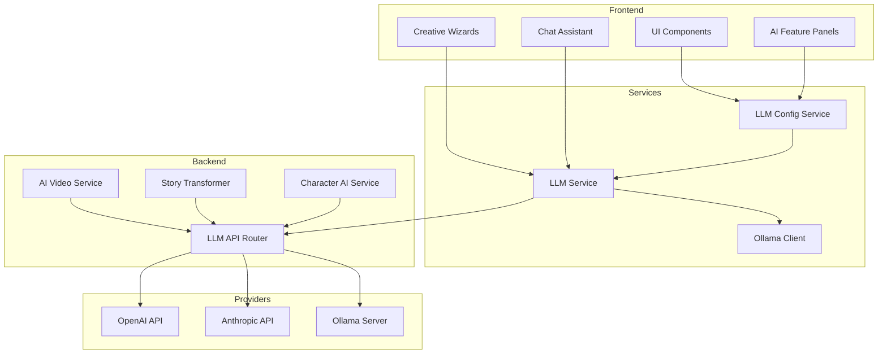
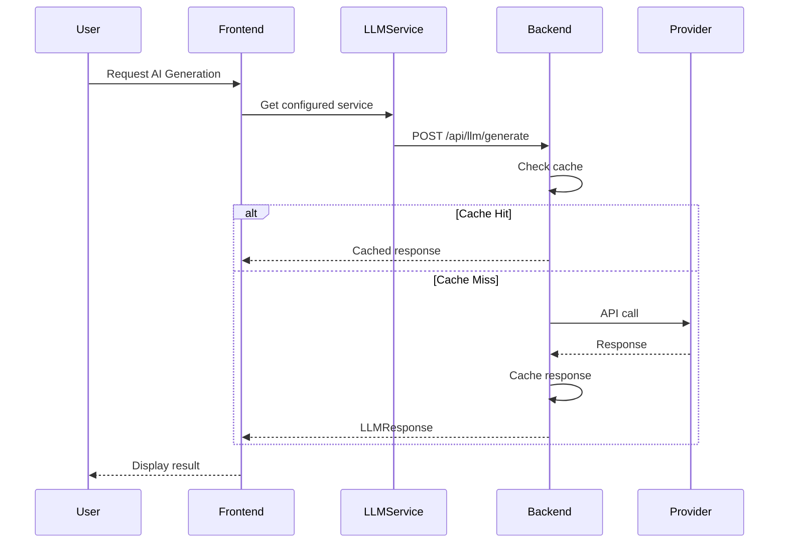
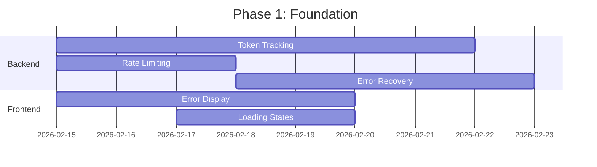
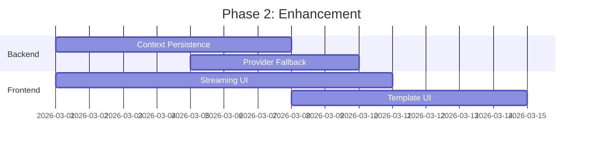
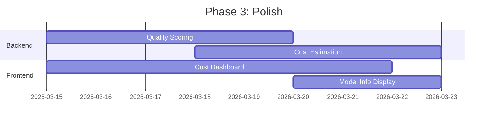

# AI/LLM Assistant Implementation Analysis - Storycore Engine

**Analysis Date:** February 14, 2026  
**Version Analyzed:** Current Development Branch  
**Author:** Architecture Analysis

---

## Table of Contents

1. [Executive Summary](#executive-summary)
2. [Current AI/LLM Features Inventory](#current-aillm-features-inventory)
3. [Architecture Overview](#architecture-overview)
4. [Backend AI Services](#backend-ai-services)
5. [Frontend AI Components](#frontend-ai-components)
6. [Prompt Engineering System](#prompt-engineering-system)
7. [API Integrations](#api-integrations)
8. [Identified Gaps and Issues](#identified-gaps-and-issues)
9. [Code Quality Assessment](#code-quality-assessment)
10. [Prioritized Recommendations](#prioritized-recommendations)
11. [Implementation Roadmap](#implementation-roadmap)

---

## Executive Summary

Storycore Engine has a **comprehensive but partially implemented** AI/LLM assistant infrastructure. The system supports multiple LLM providers (OpenAI, Anthropic, Ollama) and includes various AI-powered features for video editing, content generation, and creative assistance. However, several features have incomplete backend integration, and there are gaps in error handling, streaming support, and user experience.

### Key Findings

| Category | Status | Coverage |
|----------|--------|----------|
| LLM Provider Support | ✅ Implemented | OpenAI, Anthropic, Ollama |
| Prompt Templates | ✅ Implemented | 15+ templates |
| AI Video Features | ⚠️ Partial | TTS, Transcription, Translation, Smart Crop |
| Wizard AI Integration | ✅ Implemented | Character, World, Story, Shot wizards |
| Streaming Support | ⚠️ Partial | Backend exists, frontend incomplete |
| Error Handling | ⚠️ Needs Improvement | Basic error handling present |
| Token/Cost Tracking | ❌ Missing | Not implemented |
| Context Management | ⚠️ Basic | Limited conversation history |

---

## Current AI/LLM Features Inventory

### 1. Core LLM Integration

#### Provider Support

| Provider | Status | Models Supported | Configuration |
|----------|--------|------------------|---------------|
| OpenAI | ✅ Production | GPT-4, GPT-3.5-turbo | API Key required |
| Anthropic | ✅ Production | Claude 3 Haiku, Claude 3 Sonnet, Claude 3 Opus | API Key required |
| Ollama (Local) | ✅ Production | Llama2, Mistral, custom models | Local server |

#### Backend API Endpoints

```
POST /api/llm/generate          - Text generation
POST /api/llm/render-template   - Template rendering
GET  /api/llm/templates         - List templates
GET  /api/llm/models            - List available models
POST /api/llm/chat              - Chat completion
DELETE /api/llm/cache           - Clear response cache
GET  /api/llm/cache/stats       - Cache statistics
POST /api/llm/streaming-generate - Streaming generation
```

### 2. AI Video Editor Features

| Feature | Backend | Frontend | Status |
|---------|---------|----------|--------|
| Smart Crop | ✅ | ✅ | Production Ready |
| Text-to-Speech (TTS) | ✅ | ✅ | Production Ready |
| Transcription (Whisper) | ✅ | ✅ | Production Ready |
| Translation | ✅ | ✅ | Production Ready |
| Audio Cleaning | ✅ | ❌ | Backend Only |
| Scene Detection | ✅ | ❌ | Backend Only |
| Motion Tracking | ⚠️ | ✅ | Partial Implementation |
| Frame Interpolation | ⚠️ | ✅ | Partial Implementation |

### 3. Creative Wizard AI Integration

#### Character Wizard
- **Step 1 - Basic Identity**: AI name generation (intelligent/random)
- **Step 2 - Physical Appearance**: AI appearance generation
- **Step 3 - Personality**: AI personality trait generation
- **Step 4 - Background**: AI backstory generation

#### World Builder Wizard
- **Step 1 - Basic Information**: AI world name/description generation
- **Step 2 - World Rules**: AI rule generation
- **Step 3 - Locations**: AI location generation
- **Step 4 - Cultural Elements**: AI culture generation

#### Storyteller Wizard
- **AI Assistant Panel**: Context-aware suggestions
- **Enhanced LLM Assistant**: Reasoning mode support

#### Shot Wizard
- **AI Description Generation**: Automatic shot descriptions
- **AI & 3D Setup Tab**: Generation parameters

### 4. AI Assistant Features

| Feature | Location | Status |
|---------|----------|--------|
| Chat Box Assistant | Main UI | ✅ Implemented |
| Floating AI Assistant | Global | ✅ Implemented |
| LLM Configuration Window | Settings | ✅ Implemented |
| AI Preview Panel | Sequence Editor | ✅ Implemented |
| AI Asset Generation | Asset Library | ✅ Implemented |

---

## Architecture Overview

### System Architecture Diagram



### Data Flow



---

## Backend AI Services

### 1. LLM API ([`backend/llm_api.py`](backend/llm_api.py:1))

**Lines of Code:** ~1,100+  
**Status:** Production Ready

#### Key Components

- **Settings Configuration** (lines 40-60): Environment-based configuration
- **Provider Detection** (lines 555-577): Auto-detect available providers
- **OpenAI Integration** (lines 580-676): Full API implementation
- **Anthropic Integration** (lines 679-770): Claude API support
- **Ollama Integration** (lines 773-863): Local LLM support
- **Response Caching** (lines 477-506): In-memory cache with TTL

#### Security Features

```python
# Mock LLM control - development only
use_mock_llm: bool = Field(default=False)

def should_use_mock_llm() -> bool:
    """Security: Mock LLM should NEVER be used in production."""
    if use_mock:
        logger.warning(
            "SECURITY WARNING: LLM Mock Mode is ENABLED! "
            "This should only be used in DEVELOPMENT environments."
        )
    return use_mock
```

### 2. Video Editor AI Service ([`backend/video_editor_ai_service.py`](backend/video_editor_ai_service.py:1))

**Lines of Code:** ~700+  
**Status:** Production Ready

#### Services Implemented

| Service | Class | Dependencies |
|---------|-------|--------------|
| Transcription | `TranscriptionService` | OpenAI Whisper |
| Translation | `TranslationService` | MarianMT, Transformers |
| TTS | `TTSService` | Coqui TTS, VITS |
| Smart Crop | `SmartCropService` | OpenCV |
| Audio Cleaning | `AudioCleaningResult` | FFmpeg |
| Scene Detection | `SceneDetectionResult` | OpenCV |

### 3. Character AI Service ([`backend/character_ai_service.py`](backend/character_ai_service.py:109))

**Status:** Partial Implementation

```python
class CharacterAIService:
    """Service de gestion des personnages avec IA conversationnelle"""
    
    def __init__(self, llm_service=None):
        self.llm = llm_service
        self.characters: Dict[str, Character] = {}
```

### 4. Story Transformer ([`backend/story_transformer.py`](backend/story_transformer.py:26))

**Integration:** Uses LLM API for story transformation

```python
from backend.llm_api import call_llm_mock, LLMRequest, should_use_mock_llm

def extract_pitch(self) -> str:
    if should_use_mock_llm():
        return self._generate_pitch_with_llm()
    return self._generate_pitch_heuristic()
```

---

## Frontend AI Components

### 1. AI Features Panel ([`AIFeaturesPanel.tsx`](creative-studio-ui/src/sequence-editor/components/AIFeaturesPanel/AIFeaturesPanel.tsx:1))

**Lines of Code:** 521  
**Status:** Production Ready

#### Features

- **Smart Crop**: Aspect ratio conversion with AI focus detection
- **Text-to-Speech**: Multi-language voice synthesis
- **Transcription**: Audio-to-text with speaker identification
- **Translation**: Multi-language text translation

#### API Integration

```typescript
const handleSmartCrop = useCallback(async () => {
  const response = await fetch('/api/video-editor/ai/smart-crop', {
    method: 'POST',
    headers: { 'Content-Type': 'application/json' },
    body: JSON.stringify({
      media_id: '',
      target_ratio: selectedAspectRatio,
      focus_mode: focusMode,
    }),
  });
  // ...
}, [selectedAspectRatio, focusMode]);
```

### 2. LLM Configuration Window ([`LLMConfigurationWindow.tsx`](creative-studio-ui/src/components/configuration/LLMConfigurationWindow.tsx:17))

**Features:**
- Provider selection (OpenAI, Anthropic, Ollama, Custom)
- API key management
- Model selection per provider
- Temperature and parameter configuration
- Connection testing

### 3. Wizard AI Integration

#### World Builder ([`WorldWizard.tsx`](creative-studio-ui/src/components/wizard/world/WorldWizard.tsx:8))

```typescript
// Initialize llmConfigService if not already done
if (!llmConfigService.isConfigured()) {
  await llmConfigService.initialize();
}
```

#### Character Wizard Steps

Each step includes AI-assisted generation:

```typescript
const systemPrompt = 'You are a creative character naming assistant. 
  Generate names that fit the character\'s role, world setting, 
  and cultural context.';

const { generate, isLoading, error } = useLLMGeneration();
```

### 4. Chat Assistant ([`ChatPanel.tsx`](creative-studio-ui/src/components/ChatPanel.tsx:298))

**Features:**
- Conversational AI interface
- Context-aware responses
- Suggestion chips
- Message history

---

## Prompt Engineering System

### 1. Backend Prompt Templates ([`backend/llm_api.py`](backend/llm_api.py:127))

**Templates Defined:** 15+

| Template Name | Type | Variables |
|--------------|------|-----------|
| story_generation | STORY_GENERATION | genre, theme, setting, characters, length |
| shot_description | SHOT_DESCRIPTION | scene_description, camera_angle, lighting, action, duration |
| character_dialogue | CHARACTER_DIALOGUE | characters, context, emotion, dialogue_goal |
| world_building | WORLD_BUILDING | time_period, technology, social_structure, geography, culture |
| location_function | WORLD_BUILDING | location_name, genre, tone, description |
| location_constraints | WORLD_BUILDING | function, sub_function, description, genre |
| location_culture | WORLD_BUILDING | function, constraints |
| location_reputation | WORLD_BUILDING | function, constraints, culture, location_name |
| location_emergent_details | WORLD_BUILDING | function, sub_function, constraints, culture, reputation, genre, location_name |
| location_story_hooks | WORLD_BUILDING | function, constraints, culture, reputation, emergent_details |
| location_full_generation | WORLD_BUILDING | location_name, genre, tone, description, context |

### 2. Character Wizard Prompts ([`src/character_wizard/llm_prompts.py`](src/character_wizard/llm_prompts.py:3))

**System Prompts:**

```python
CHARACTER_GENERATION_SYSTEM = """You are an expert character creation assistant. 
Generate detailed, nuanced character content that feels authentic and three-dimensional. 
Always respond in valid JSON format as specified."""

DIALOGUE_SYSTEM = "You are an expert dialogue writer. 
Create authentic, character-revealing dialogue."

PSYCHOLOGY_SYSTEM = "You are an expert in character psychology and motivation."
```

### 3. Prompt Examples Files

#### [`llm_prompt_examples.py`](llm_prompt_examples.py:1) (501 lines)

- Narrative sequence generation
- Quality optimization
- Creative variations
- Sequence validation
- Version migration

#### [`simple_llm_prompts.py`](simple_llm_prompts.py:1) (314 lines)

- Simplified prompt templates
- Proof of concept examples
- Integration guide

---

## API Integrations

### Provider Configuration

| Provider | Auth Method | Base URL | Timeout |
|----------|-------------|----------|---------|
| OpenAI | API Key | api.openai.com | 180s |
| Anthropic | API Key | api.anthropic.com | 180s |
| Ollama | None | localhost:11434 | 300s |

### Request/Response Models

```python
class LLMRequest(BaseModel):
    prompt: str = Field(..., min_length=1, max_length=10000)
    model: Optional[str] = None
    provider: Optional[str] = None
    temperature: Optional[float] = Field(None, ge=0.0, le=2.0)
    max_tokens: Optional[int] = Field(None, ge=1, le=32768)
    stream: bool = False
    context: Optional[List[Dict[str, str]]] = None
    use_cache: bool = True

class LLMResponse(BaseModel):
    text: str
    model: str
    provider: str
    usage: Dict[str, int]
    cached: bool = False
    latency_ms: int
```

---

## Identified Gaps and Issues

### Critical Issues

| ID | Issue | Severity | Location | Impact |
|----|-------|----------|----------|--------|
| G1 | No token usage tracking | High | Backend | Cost control |
| G2 | Streaming incomplete | High | Frontend | UX degradation |
| G3 | No rate limiting | High | Backend | API abuse risk |
| G4 | Limited error recovery | Medium | Both | User frustration |
| G5 | No conversation context persistence | Medium | Backend | Lost work |

### Medium Priority Issues

| ID | Issue | Severity | Location | Impact |
|----|-------|----------|----------|--------|
| M1 | Mock LLM default behavior | Medium | Backend | Confusion |
| M2 | No prompt template UI | Medium | Frontend | Limited customization |
| M3 | Incomplete provider fallback | Medium | Backend | Reliability |
| M4 | No cost estimation | Medium | Both | Budget control |
| M5 | Limited model capabilities display | Low | Frontend | UX |

### Low Priority Issues

| ID | Issue | Severity | Location | Impact |
|----|-------|----------|----------|--------|
| L1 | Hardcoded voice list | Low | Frontend | Maintenance |
| L2 | No response quality scoring | Low | Backend | Quality control |
| L3 | Limited i18n for AI features | Low | Both | Accessibility |
| L4 | No offline mode | Low | Both | Availability |

### Code Quality Issues

1. **Unused Variables**: `dispatch` in AIFeaturesPanel.tsx (line 82)
2. **Hardcoded Values**: Voice lists, language lists in frontend
3. **Incomplete Error Handling**: Some API calls lack proper error states
4. **Type Safety**: Some `any` types in TypeScript files
5. **Documentation**: Missing JSDoc comments on some functions

---

## Code Quality Assessment

### Backend Quality

| Metric | Score | Notes |
|--------|-------|-------|
| Code Organization | 8/10 | Well-structured modules |
| Error Handling | 6/10 | Basic but needs improvement |
| Documentation | 7/10 | Good docstrings, missing some |
| Type Safety | 8/10 | Pydantic models used |
| Testing | 7/10 | Tests exist but coverage varies |

### Frontend Quality

| Metric | Score | Notes |
|--------|-------|-------|
| Component Structure | 8/10 | Well-organized |
| State Management | 7/10 | Redux + hooks |
| Error Handling | 6/10 | Needs improvement |
| Type Safety | 7/10 | Some `any` types |
| Accessibility | 7/10 | ARIA labels present |

---

## Prioritized Recommendations

### Priority 1: Critical (Implement First)

#### R1.1: Implement Token Usage Tracking

**Location:** Backend LLM API  
**Effort:** Medium  
**Impact:** High

```python
# Add to LLMResponse
class LLMUsageStats(BaseModel):
    prompt_tokens: int
    completion_tokens: int
    total_tokens: int
    estimated_cost: float  # Based on model pricing
```

#### R1.2: Complete Streaming Implementation

**Location:** Frontend LLM Service  
**Effort:** Medium  
**Impact:** High

- Implement SSE/WebSocket streaming
- Add progress indicators
- Handle stream interruptions

#### R1.3: Add Rate Limiting

**Location:** Backend API  
**Effort:** Low  
**Impact:** High

```python
from slowapi import Limiter

limiter = Limiter(key_func=get_user_id)

@router.post("/llm/generate")
@limiter.limit("30/minute")
async def generate_text(...):
    ...
```

### Priority 2: High (Implement Soon)

#### R2.1: Improve Error Recovery

**Location:** Both  
**Effort:** Medium  
**Impact:** High

- Add retry logic with exponential backoff
- Implement fallback providers
- Add user-friendly error messages

#### R2.2: Add Conversation Context Persistence

**Location:** Backend  
**Effort:** Medium  
**Impact:** Medium

- Store conversation history in database
- Implement context window management
- Add context summarization

#### R2.3: Create Prompt Template UI

**Location:** Frontend  
**Effort:** High  
**Impact:** Medium

- Template CRUD interface
- Variable highlighting
- Preview functionality

### Priority 3: Medium (Implement Later)

#### R3.1: Add Cost Estimation Dashboard

**Location:** Frontend  
**Effort:** Medium  
**Impact:** Medium

- Per-project cost tracking
- Usage analytics
- Budget alerts

#### R3.2: Implement Provider Fallback Chain

**Location:** Backend  
**Effort:** Low  
**Impact:** Medium

```python
PROVIDER_FALLBACK_CHAIN = ["openai", "anthropic", "ollama"]

async def generate_with_fallback(request):
    for provider in PROVIDER_FALLBACK_CHAIN:
        try:
            return await call_provider(provider, request)
        except ProviderError:
            continue
    raise AllProvidersFailedError()
```

#### R3.3: Add Response Quality Scoring

**Location:** Backend  
**Effort:** Medium  
**Impact:** Low

- Implement quality metrics
- Add response validation
- User feedback collection

### Priority 4: Low (Nice to Have)

#### R4.1: Implement Offline Mode

**Location:** Both  
**Effort:** High  
**Impact:** Low

- Cache common responses
- Queue requests for later
- Sync when online

#### R4.2: Add Model Capability Display

**Location:** Frontend  
**Effort:** Low  
**Impact:** Low

- Show model capabilities
- Recommend models for tasks
- Display context window sizes

---

## Implementation Roadmap

### Phase 1: Foundation (Week 1-2)



**Tasks:**
- [ ] Add token usage tracking to LLMResponse
- [ ] Implement rate limiting middleware
- [ ] Add retry logic with exponential backoff
- [ ] Improve error display components
- [ ] Add loading state indicators

### Phase 2: Enhancement (Week 3-4)



**Tasks:**
- [ ] Implement conversation context persistence
- [ ] Add provider fallback chain
- [ ] Complete streaming implementation
- [ ] Create prompt template management UI

### Phase 3: Polish (Week 5-6)



**Tasks:**
- [ ] Add response quality scoring
- [ ] Implement cost estimation
- [ ] Create cost tracking dashboard
- [ ] Add model capability display

---

## Appendix A: File Reference

### Backend Files

| File | Lines | Purpose |
|------|-------|---------|
| [`backend/llm_api.py`](backend/llm_api.py:1) | 1,100+ | Main LLM integration API |
| [`backend/video_editor_ai_service.py`](backend/video_editor_ai_service.py:1) | 700+ | AI video editing services |
| [`backend/character_ai_service.py`](backend/character_ai_service.py:109) | 300+ | Character AI service |
| [`backend/story_transformer.py`](backend/story_transformer.py:26) | 1,700+ | Story transformation with LLM |

### Frontend Files

| File | Lines | Purpose |
|------|-------|---------|
| [`AIFeaturesPanel.tsx`](creative-studio-ui/src/sequence-editor/components/AIFeaturesPanel/AIFeaturesPanel.tsx:1) | 521 | AI features UI |
| [`LLMConfigurationWindow.tsx`](creative-studio-ui/src/components/configuration/LLMConfigurationWindow.tsx:17) | 400+ | LLM settings UI |
| [`ChatPanel.tsx`](creative-studio-ui/src/components/ChatPanel.tsx:298) | 350+ | Chat assistant UI |
| [`WorldWizard.tsx`](creative-studio-ui/src/components/wizard/world/WorldWizard.tsx:8) | 300+ | World builder wizard |

### Prompt Files

| File | Lines | Purpose |
|------|-------|---------|
| [`llm_prompt_examples.py`](llm_prompt_examples.py:1) | 501 | LLM prompt examples |
| [`simple_llm_prompts.py`](simple_llm_prompts.py:1) | 314 | Simplified prompts |
| [`llm_prompts.py`](src/character_wizard/llm_prompts.py:3) | 374 | Character prompts |

---

## Appendix B: Configuration Reference

### Environment Variables

```bash
# LLM Provider Configuration
OPENAI_API_KEY=sk-...
ANTHROPIC_API_KEY=sk-ant-...
OLLAMA_HOST=http://localhost:11434
USE_OLLAMA=true

# LLM Behavior
USE_MOCK_LLM=false
DEFAULT_LLM_PROVIDER=openai
LLM_CACHE_ENABLED=true
LLM_CACHE_TTL_SECONDS=3600
LLM_MAX_TOKENS=4096
LLM_TEMPERATURE=0.7
```

### Frontend Configuration

```typescript
interface LLMConfig {
  provider: 'openai' | 'anthropic' | 'ollama' | 'custom';
  apiKey?: string;
  model: string;
  temperature: number;
  maxTokens: number;
  baseUrl?: string;
}
```

---

## Conclusion

Storycore Engine has a solid foundation for AI/LLM integration with multi-provider support, comprehensive prompt templates, and AI-assisted creative wizards. The main areas requiring improvement are:

1. **Operational Features**: Token tracking, rate limiting, cost estimation
2. **User Experience**: Streaming, error recovery, context persistence
3. **Customization**: Prompt template management, model selection

The recommended implementation roadmap prioritizes critical operational features first, followed by UX enhancements and polish features. With these improvements, Storycore will have a production-ready, user-friendly AI assistant system.

---

*Document generated by Architecture Analysis - February 2026*
