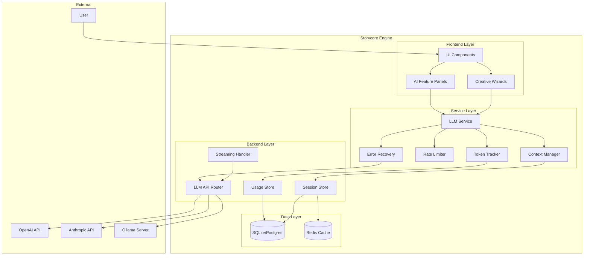
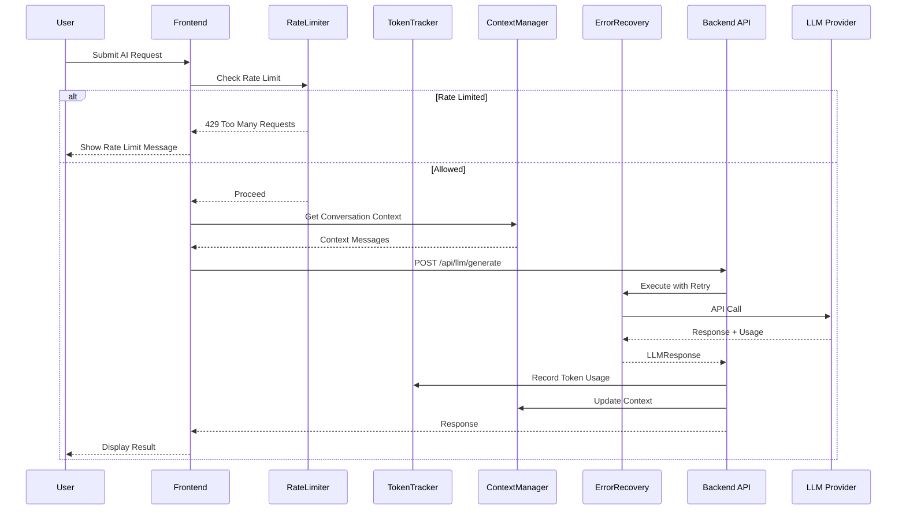
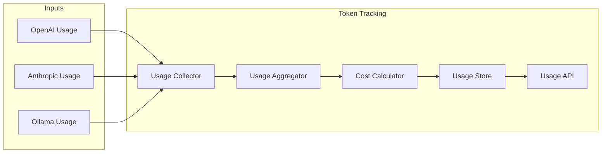
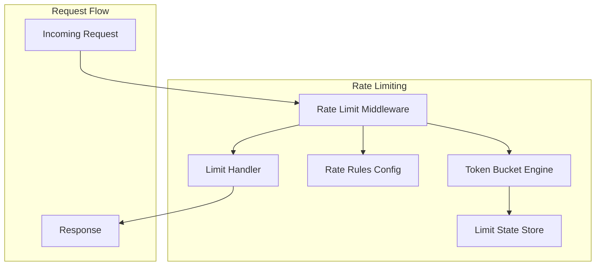
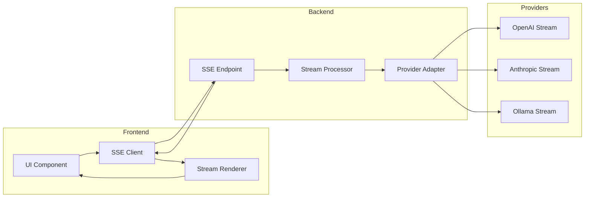
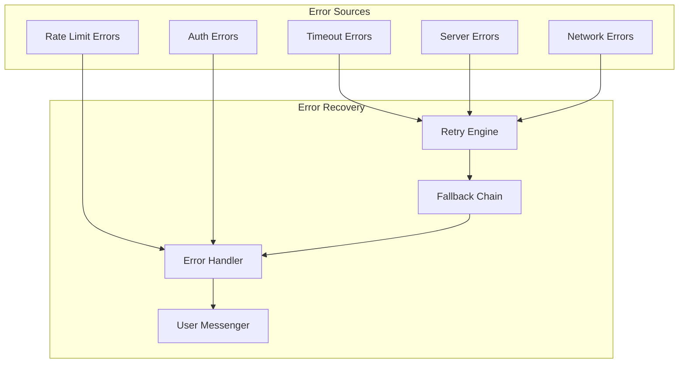
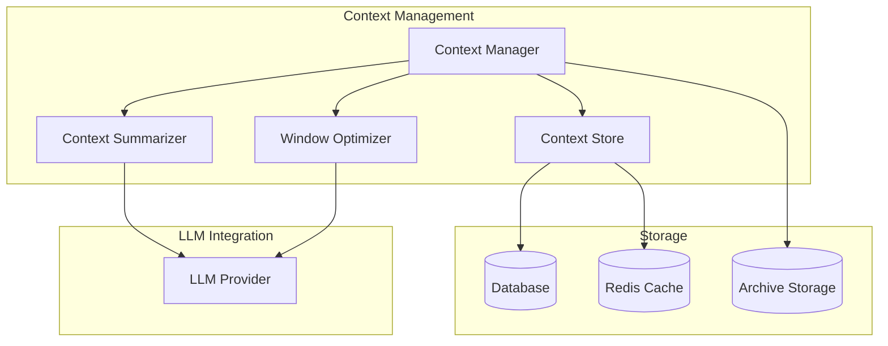

# AI/LLM Assistant Enhancement Architecture

**Document Version:** 1.0  
**Created:** February 14, 2026  
**Status:** Design Phase  
**Based on:** [AI_LLM_ASSISTANT_ANALYSIS.md](AI_LLM_ASSISTANT_ANALYSIS.md:1)

---

## Table of Contents

1. [Executive Summary](#executive-summary)
2. [Architecture Overview](#architecture-overview)
3. [Token Tracking System](#token-tracking-system)
4. [Rate Limiting System](#rate-limiting-system)
5. [Streaming Completion System](#streaming-completion-system)
6. [Error Recovery System](#error-recovery-system)
7. [Context Persistence System](#context-persistence-system)
8. [API Specifications](#api-specifications)
9. [Data Models](#data-models)
10. [Configuration Schema](#configuration-schema)
11. [Implementation Phases](#implementation-phases)

---

## Executive Summary

This document defines the architecture for enhancing the AI/LLM assistant capabilities in Storycore Engine. The enhancement addresses five critical gaps identified in the analysis:

| Gap | Current State | Target State |
|-----|---------------|--------------|
| Token Tracking | Not implemented | Full tracking with cost estimation |
| Rate Limiting | Not implemented | Multi-tier throttling system |
| Streaming | Backend partial, frontend incomplete | End-to-end SSE streaming |
| Error Recovery | Basic HTTP errors | Retry + fallback + graceful degradation |
| Context Persistence | In-memory only | Database-backed with summarization |

### Design Principles

1. **Non-Breaking**: All enhancements are additive; existing APIs remain functional
2. **Observable**: Every component emits metrics and logs
3. **Configurable**: Behavior tunable via environment variables and config files
4. **Resilient**: Graceful degradation when components fail
5. **Testable**: Each system can be unit tested in isolation

---

## Architecture Overview

### System Context Diagram



### Component Interaction Flow



---

## Token Tracking System

### Overview

The Token Tracking System provides comprehensive monitoring of LLM token usage across all providers, enabling cost control, budgeting, and usage analytics.

### Architecture



### Components

#### 1. Usage Collector

Intercepts all LLM API responses and extracts token usage data.

```python
# Conceptual structure
class UsageCollector:
    def collect(self, response: LLMResponse, context: UsageContext) -> UsageRecord:
        return UsageRecord(
            request_id=context.request_id,
            user_id=context.user_id,
            project_id=context.project_id,
            session_id=context.session_id,
            provider=response.provider,
            model=response.model,
            prompt_tokens=response.usage.prompt_tokens,
            completion_tokens=response.usage.completion_tokens,
            total_tokens=response.usage.total_tokens,
            latency_ms=response.latency_ms,
            cached=response.cached,
            timestamp=datetime.utcnow()
        )
```

#### 2. Usage Aggregator

Aggregates usage data across different dimensions for analytics.

**Aggregation Dimensions:**
- Per Request (immediate)
- Per Session (conversation)
- Per Project (story/video)
- Per User (account)
- Per Time Period (daily/weekly/monthly)

#### 3. Cost Calculator

Calculates estimated costs based on provider pricing.

**Pricing Configuration:**

| Provider | Model | Input $/1K tokens | Output $/1K tokens |
|----------|-------|-------------------|-------------------|
| OpenAI | gpt-4 | $0.03 | $0.06 |
| OpenAI | gpt-3.5-turbo | $0.0005 | $0.0015 |
| Anthropic | claude-3-opus | $0.015 | $0.075 |
| Anthropic | claude-3-sonnet | $0.003 | $0.015 |
| Anthropic | claude-3-haiku | $0.00025 | $0.00125 |
| Ollama | * | $0.00 | $0.00 |

#### 4. Usage Store

Persistent storage for usage records.

**Storage Strategy:**
- Hot data (7 days): SQLite with indexes
- Warm data (30 days): Compressed SQLite
- Cold data (archive): JSON files in `data/usage_archive/`

### Data Model

```python
@dataclass
class UsageRecord:
    id: str  # UUID
    request_id: str
    user_id: str
    project_id: Optional[str]
    session_id: Optional[str]
    provider: str
    model: str
    prompt_tokens: int
    completion_tokens: int
    total_tokens: int
    estimated_cost_usd: float
    latency_ms: int
    cached: bool
    success: bool
    error_message: Optional[str]
    timestamp: datetime

@dataclass
class UsageSummary:
    user_id: str
    period_start: datetime
    period_end: datetime
    total_requests: int
    total_tokens: int
    total_cost_usd: float
    by_provider: Dict[str, int]
    by_model: Dict[str, int]
    cache_hit_rate: float
    average_latency_ms: float
```

### API Endpoints

| Method | Endpoint | Description |
|--------|----------|-------------|
| GET | `/api/llm/usage` | Get usage summary for current user |
| GET | `/api/llm/usage/project/{id}` | Get usage for specific project |
| GET | `/api/llm/usage/session/{id}` | Get usage for specific session |
| GET | `/api/llm/usage/export` | Export usage data as CSV/JSON |
| POST | `/api/llm/usage/budget` | Set usage budget alert |
| GET | `/api/llm/usage/cost-estimate` | Estimate cost for a request |

---

## Rate Limiting System

### Overview

The Rate Limiting System protects against API abuse, controls costs, and ensures fair resource allocation across users and features.

### Architecture



### Rate Limiting Strategies

#### 1. Token Bucket Algorithm

Each user/feature has a bucket of tokens that refills at a configured rate.

```
Bucket State:
- capacity: Maximum tokens in bucket
- tokens: Current token count
- refill_rate: Tokens added per second
- last_refill: Timestamp of last refill
```

#### 2. Multi-Tier Limits

**Tier 1: Global (System-wide)**
- Total requests per minute across all users
- Protects backend resources

**Tier 2: User (Per-account)**
- Requests per minute per user
- Prevents single user from monopolizing

**Tier 3: Feature (Per-feature)**
- Different limits for different features
- E.g., chat: 30/min, generation: 10/min

**Tier 4: Provider (Per-provider)**
- Limits per LLM provider
- Protects API quotas

### Configuration

```yaml
rate_limits:
  global:
    requests_per_minute: 1000
    tokens_per_minute: 1000000
    
  user:
    default:
      requests_per_minute: 60
      tokens_per_minute: 100000
    premium:
      requests_per_minute: 200
      tokens_per_minute: 500000
      
  feature:
    chat:
      requests_per_minute: 30
    story_generation:
      requests_per_minute: 10
    character_generation:
      requests_per_minute: 15
    world_building:
      requests_per_minute: 10
      
  provider:
    openai:
      requests_per_minute: 500
      tokens_per_minute: 500000
    anthropic:
      requests_per_minute: 300
      tokens_per_minute: 300000
    ollama:
      requests_per_minute: 1000
      tokens_per_minute: unlimited
```

### Rate Limit Response

When rate limited, the API returns:

```json
{
  "error": "rate_limit_exceeded",
  "message": "Rate limit exceeded. Please wait before making more requests.",
  "retry_after": 45,
  "limit_type": "user",
  "limit_value": 60,
  "current_value": 61,
  "reset_at": "2026-02-14T18:00:00Z"
}
```

### Headers

All responses include rate limit headers:

```
X-RateLimit-Limit: 60
X-RateLimit-Remaining: 45
X-RateLimit-Reset: 1707931200
X-RateLimit-Reset-After: 45
```

---

## Streaming Completion System

### Overview

The Streaming Completion System enables real-time response delivery, improving perceived latency and user experience for long-running generations.

### Architecture



### Backend Implementation

#### SSE Endpoint

```python
@router.post("/api/llm/streaming-generate")
async def streaming_generate(
    request: LLMRequest,
    accept: str = Header(default="application/json")
):
    if accept == "text/event-stream":
        return StreamingResponse(
            stream_llm_response(request),
            media_type="text/event-stream",
            headers={
                "Cache-Control": "no-cache",
                "Connection": "keep-alive",
                "X-Accel-Buffering": "no"
            }
        )
    # Fallback to non-streaming
    return await generate_text(request)

async def stream_llm_response(request: LLMRequest):
    # Send initial metadata
    yield f"data: {json.dumps({'type': 'start', 'request_id': str(uuid.uuid4())})}\n\n"
    
    try:
        async for chunk in call_llm_streaming(request):
            yield f"data: {json.dumps({'type': 'chunk', 'text': chunk})}\n\n"
        
        yield f"data: {json.dumps({'type': 'done'})}\n\n"
    except Exception as e:
        yield f"data: {json.dumps({'type': 'error', 'message': str(e)})}\n\n"
```

#### Provider Streaming Adapters

```python
class StreamAdapter(Protocol):
    async def stream(self, request: LLMRequest) -> AsyncIterator[str]:
        ...

class OpenAIStreamAdapter(StreamAdapter):
    async def stream(self, request: LLMRequest) -> AsyncIterator[str]:
        async with httpx.AsyncClient() as client:
            async with client.stream(
                "POST",
                "https://api.openai.com/v1/chat/completions",
                json={**request.dict(), "stream": True}
            ) as response:
                async for line in response.aiter_lines():
                    if line.startswith("data: "):
                        data = json.loads(line[6:])
                        if data.get("choices"):
                            yield data["choices"][0]["delta"].get("content", "")

class AnthropicStreamAdapter(StreamAdapter):
    async def stream(self, request: LLMRequest) -> AsyncIterator[str]:
        # Anthropic uses different streaming format
        ...

class OllamaStreamAdapter(StreamAdapter):
    async def stream(self, request: LLMRequest) -> AsyncIterator[str]:
        # Ollama native streaming
        ...
```

### Frontend Implementation

#### SSE Client Hook

```typescript
interface StreamOptions {
  onChunk: (chunk: string) => void;
  onComplete: (fullText: string) => void;
  onError: (error: Error) => void;
  signal?: AbortSignal;
}

function useLLMStream() {
  const [isStreaming, setIsStreaming] = useState(false);
  const [streamedText, setStreamedText] = useState('');
  
  const stream = useCallback(async (
    request: LLMRequest,
    options: StreamOptions
  ) => {
    setIsStreaming(true);
    setStreamedText('');
    
    const eventSource = new EventSource(
      `/api/llm/streaming-generate?${new URLSearchParams(request)}`
    );
    
    eventSource.onmessage = (event) => {
      const data = JSON.parse(event.data);
      
      switch (data.type) {
        case 'chunk':
          setStreamedText(prev => prev + data.text);
          options.onChunk(data.text);
          break;
        case 'done':
          eventSource.close();
          setIsStreaming(false);
          options.onComplete(streamedText);
          break;
        case 'error':
          eventSource.close();
          setIsStreaming(false);
          options.onError(new Error(data.message));
          break;
      }
    };
    
    if (options.signal) {
      options.signal.addEventListener('abort', () => {
        eventSource.close();
        setIsStreaming(false);
      });
    }
  }, []);
  
  return { stream, isStreaming, streamedText };
}
```

#### Stream Renderer Component

```typescript
const StreamRenderer: React.FC<{ text: string; isStreaming: boolean }> = ({
  text,
  isStreaming
}) => {
  return (
    <div className="stream-container">
      <Markdown content={text} />
      {isStreaming && (
        <span className="cursor-blink">|</span>
      )}
    </div>
  );
};
```

### Streaming Events Protocol

| Event Type | Data | Description |
|------------|------|-------------|
| `start` | `{request_id, model, provider}` | Generation started |
| `chunk` | `{text}` | Text chunk received |
| `usage` | `{prompt_tokens, completion_tokens}` | Token usage (when available) |
| `done` | `{}` | Generation complete |
| `error` | `{message, code}` | Error occurred |

---

## Error Recovery System

### Overview

The Error Recovery System provides robust handling of LLM API failures through retry logic, provider fallback chains, and user-friendly error messages.

### Architecture



### Retry Logic

#### Exponential Backoff Configuration

```python
@dataclass
class RetryConfig:
    max_retries: int = 3
    base_delay_ms: int = 1000
    max_delay_ms: int = 30000
    exponential_base: float = 2.0
    jitter: bool = True  # Add randomness to prevent thundering herd
    
    # Error-specific retry behavior
    retryable_errors: List[str] = field(default_factory=lambda: [
        "timeout",
        "rate_limit",
        "server_error",
        "network_error"
    ])
    
    non_retryable_errors: List[str] = field(default_factory=lambda: [
        "invalid_api_key",
        "invalid_request",
        "content_filter",
        "context_length_exceeded"
    ])
```

#### Retry Implementation

```python
async def execute_with_retry(
    request: LLMRequest,
    provider: str,
    config: RetryConfig = RetryConfig()
) -> LLMResponse:
    last_error = None
    
    for attempt in range(config.max_retries + 1):
        try:
            return await call_provider(provider, request)
        except LLMError as e:
            last_error = e
            
            if e.code in config.non_retryable_errors:
                raise  # Don't retry non-retryable errors
            
            if attempt < config.max_retries:
                delay = calculate_backoff(
                    attempt, 
                    config.base_delay_ms,
                    config.exponential_base,
                    config.max_delay_ms,
                    config.jitter
                )
                logger.warning(f"LLM call failed, retrying in {delay}ms: {e}")
                await asyncio.sleep(delay / 1000)
    
    raise last_error

def calculate_backoff(
    attempt: int,
    base_ms: int,
    exponential_base: float,
    max_ms: int,
    jitter: bool
) -> int:
    delay = base_ms * (exponential_base ** attempt)
    if jitter:
        delay *= random.uniform(0.5, 1.5)
    return min(int(delay), max_ms)
```

### Provider Fallback Chain

When a provider fails, the system automatically tries the next provider in the chain.

```python
PROVIDER_FALLBACK_CHAIN = {
    "default": ["openai", "anthropic", "ollama"],
    "creative": ["anthropic", "openai", "ollama"],  # Claude better for creative
    "fast": ["ollama", "openai", "anthropic"],  # Local first
    "quality": ["openai", "anthropic", "ollama"]  # GPT-4 first
}

async def generate_with_fallback(
    request: LLMRequest,
    chain_name: str = "default"
) -> LLMResponse:
    chain = PROVIDER_FALLBACK_CHAIN.get(chain_name, PROVIDER_FALLBACK_CHAIN["default"])
    errors = []
    
    for provider in chain:
        if not is_provider_available(provider):
            continue
            
        try:
            return await execute_with_retry(request, provider)
        except LLMError as e:
            errors.append((provider, e))
            logger.warning(f"Provider {provider} failed: {e}")
    
    # All providers failed
    raise AllProvidersFailedError(
        message="All LLM providers are currently unavailable",
        errors=errors
    )
```

### Error Classification

| Error Code | Category | Retry | Fallback | User Message |
|------------|----------|-------|----------|---------------|
| `timeout` | Transient | Yes | Yes | "The request took too long. Retrying..." |
| `rate_limit` | Transient | Yes | Yes | "Rate limit reached. Trying alternative provider..." |
| `server_error` | Transient | Yes | Yes | "Server error. Retrying..." |
| `network_error` | Transient | Yes | Yes | "Connection issue. Retrying..." |
| `invalid_api_key` | Permanent | No | No | "API key is invalid. Please check your settings." |
| `insufficient_quota` | Permanent | No | Yes | "Quota exceeded. Trying alternative provider..." |
| `content_filter` | Permanent | No | No | "Content was filtered by safety guidelines." |
| `context_length_exceeded` | User | No | No | "Your request is too long. Please shorten it." |

### User-Friendly Error Messages

```python
ERROR_MESSAGES = {
    "timeout": {
        "title": "Request Timeout",
        "message": "The AI is taking longer than expected to respond. Please try again.",
        "action": "Retry"
    },
    "rate_limit": {
        "title": "Rate Limit Reached",
        "message": "You've made too many requests. Please wait {retry_after} seconds.",
        "action": "Wait"
    },
    "invalid_api_key": {
        "title": "Invalid API Key",
        "message": "Your API key is not valid. Please check your configuration.",
        "action": "Settings"
    },
    "all_providers_failed": {
        "title": "Service Unavailable",
        "message": "All AI providers are currently unavailable. Please try again later.",
        "action": "Retry"
    },
    "content_filter": {
        "title": "Content Filtered",
        "message": "Your request was blocked by content safety guidelines.",
        "action": "Modify Request"
    }
}
```

---

## Context Persistence System

### Overview

The Context Persistence System maintains conversation history across sessions, enabling coherent multi-turn conversations and context-aware responses.

### Architecture



### Components

#### 1. Context Manager

Manages conversation context lifecycle.

```python
class ContextManager:
    def __init__(self, session_id: str, config: ContextConfig):
        self.session_id = session_id
        self.config = config
        self.messages: List[Message] = []
    
    async def add_message(self, role: str, content: str):
        message = Message(
            id=str(uuid.uuid4()),
            session_id=self.session_id,
            role=role,
            content=content,
            timestamp=datetime.utcnow()
        )
        self.messages.append(message)
        await self._persist_message(message)
        await self._check_context_window()
    
    async def get_context(self) -> List[Dict[str, str]]:
        # Return messages formatted for LLM API
        return [{"role": m.role, "content": m.content} for m in self.messages]
    
    async def _check_context_window(self):
        token_count = self._estimate_tokens()
        if token_count > self.config.max_context_tokens:
            await self._optimize_context()
    
    async def _optimize_context(self):
        # Summarize or truncate old messages
        ...
```

#### 2. Context Summarizer

Summarizes old conversation turns to maintain context while reducing token count.

```python
class ContextSummarizer:
    def __init__(self, llm_client: LLMClient):
        self.llm = llm_client
    
    async def summarize_messages(
        self, 
        messages: List[Message],
        target_tokens: int
    ) -> str:
        # Create summary prompt
        prompt = f"""Summarize the following conversation history concisely, 
        preserving key information, decisions, and context:
        
        {self._format_messages(messages)}
        
        Summary:"""
        
        response = await self.llm.generate(prompt, max_tokens=target_tokens)
        return response.text
```

#### 3. Window Optimizer

Optimizes context window usage by prioritizing important messages.

**Optimization Strategies:**

1. **Sliding Window**: Keep last N messages
2. **Importance-Based**: Keep messages marked as important
3. **Summary-Based**: Replace old messages with summary
4. **Hybrid**: Combine all strategies

```python
class WindowOptimizer:
    def optimize(
        self,
        messages: List[Message],
        max_tokens: int,
        strategy: str = "hybrid"
    ) -> List[Message]:
        if strategy == "sliding_window":
            return self._sliding_window(messages, max_tokens)
        elif strategy == "importance":
            return self._importance_based(messages, max_tokens)
        elif strategy == "summary":
            return self._summary_based(messages, max_tokens)
        else:
            return self._hybrid(messages, max_tokens)
```

### Data Model

```python
@dataclass
class ConversationSession:
    id: str  # UUID
    user_id: str
    project_id: Optional[str]
    title: Optional[str]
    created_at: datetime
    updated_at: datetime
    message_count: int
    total_tokens: int
    summary: Optional[str]
    metadata: Dict[str, Any]

@dataclass
class Message:
    id: str  # UUID
    session_id: str
    role: str  # user, assistant, system
    content: str
    token_count: int
    timestamp: datetime
    importance: int  # 0-10, higher = more important
    metadata: Dict[str, Any]  # model, provider, latency, etc.

@dataclass
class ContextSummary:
    id: str
    session_id: str
    summarized_message_ids: List[str]
    summary_text: str
    token_count: int
    created_at: datetime
```

### Session Management

```python
class SessionManager:
    async def create_session(
        self,
        user_id: str,
        project_id: Optional[str] = None,
        initial_context: Optional[List[Dict]] = None
    ) -> ConversationSession:
        session = ConversationSession(
            id=str(uuid.uuid4()),
            user_id=user_id,
            project_id=project_id,
            created_at=datetime.utcnow(),
            updated_at=datetime.utcnow()
        )
        await self.store.save_session(session)
        
        if initial_context:
            for msg in initial_context:
                await self.add_message(session.id, msg["role"], msg["content"])
        
        return session
    
    async def load_session(self, session_id: str) -> ConversationSession:
        # Load from cache first, then database
        cached = await self.cache.get(f"session:{session_id}")
        if cached:
            return cached
        
        session = await self.store.get_session(session_id)
        await self.cache.set(f"session:{session_id}", session, ttl=3600)
        return session
    
    async def archive_session(self, session_id: str):
        # Move to archive storage for long-term retention
        session = await self.load_session(session_id)
        await self.archive.store(session)
        await self.store.delete_session(session_id)
        await self.cache.delete(f"session:{session_id}")
```

### API Endpoints

| Method | Endpoint | Description |
|--------|----------|-------------|
| POST | `/api/llm/sessions` | Create new conversation session |
| GET | `/api/llm/sessions` | List user's sessions |
| GET | `/api/llm/sessions/{id}` | Get session with messages |
| DELETE | `/api/llm/sessions/{id}` | Delete session |
| POST | `/api/llm/sessions/{id}/messages` | Add message to session |
| POST | `/api/llm/sessions/{id}/summarize` | Force context summarization |

---

## API Specifications

### Enhanced LLM API Endpoints

#### POST /api/llm/generate

**Request:**
```json
{
  "prompt": "Generate a character description...",
  "model": "gpt-4",
  "provider": "openai",
  "temperature": 0.7,
  "max_tokens": 2048,
  "stream": false,
  "session_id": "uuid",
  "use_cache": true,
  "fallback_chain": "default"
}
```

**Response:**
```json
{
  "text": "Generated response...",
  "model": "gpt-4",
  "provider": "openai",
  "usage": {
    "prompt_tokens": 150,
    "completion_tokens": 500,
    "total_tokens": 650
  },
  "cost": {
    "estimated_usd": 0.0345
  },
  "cached": false,
  "latency_ms": 2340,
  "session_id": "uuid",
  "request_id": "uuid"
}
```

#### POST /api/llm/streaming-generate

**Request Headers:**
```
Accept: text/event-stream
```

**Response Stream:**
```
data: {"type": "start", "request_id": "uuid", "model": "gpt-4"}

data: {"type": "chunk", "text": "Once upon"}

data: {"type": "chunk", "text": " a time..."}

data: {"type": "usage", "prompt_tokens": 150, "completion_tokens": 500}

data: {"type": "done"}
```

#### GET /api/llm/usage

**Query Parameters:**
- `period`: day, week, month
- `project_id`: Filter by project
- `provider`: Filter by provider

**Response:**
```json
{
  "period": {
    "start": "2026-02-01T00:00:00Z",
    "end": "2026-02-14T23:59:59Z"
  },
  "summary": {
    "total_requests": 245,
    "total_tokens": 125000,
    "total_cost_usd": 3.75,
    "cache_hit_rate": 0.35,
    "average_latency_ms": 1850
  },
  "by_provider": {
    "openai": {"requests": 150, "tokens": 75000, "cost": 2.50},
    "anthropic": {"requests": 95, "tokens": 50000, "cost": 1.25}
  },
  "by_model": {
    "gpt-4": {"requests": 50, "tokens": 40000},
    "gpt-3.5-turbo": {"requests": 100, "tokens": 35000},
    "claude-3-haiku": {"requests": 95, "tokens": 50000}
  }
}
```

---

## Data Models

### Database Schema

```sql
-- Usage tracking
CREATE TABLE llm_usage_records (
    id TEXT PRIMARY KEY,
    request_id TEXT NOT NULL,
    user_id TEXT NOT NULL,
    project_id TEXT,
    session_id TEXT,
    provider TEXT NOT NULL,
    model TEXT NOT NULL,
    prompt_tokens INTEGER NOT NULL,
    completion_tokens INTEGER NOT NULL,
    total_tokens INTEGER NOT NULL,
    estimated_cost_usd REAL NOT NULL,
    latency_ms INTEGER NOT NULL,
    cached BOOLEAN DEFAULT FALSE,
    success BOOLEAN DEFAULT TRUE,
    error_message TEXT,
    timestamp DATETIME NOT NULL,
    created_at DATETIME DEFAULT CURRENT_TIMESTAMP
);

CREATE INDEX idx_usage_user ON llm_usage_records(user_id);
CREATE INDEX idx_usage_project ON llm_usage_records(project_id);
CREATE INDEX idx_usage_timestamp ON llm_usage_records(timestamp);

-- Conversation sessions
CREATE TABLE conversation_sessions (
    id TEXT PRIMARY KEY,
    user_id TEXT NOT NULL,
    project_id TEXT,
    title TEXT,
    message_count INTEGER DEFAULT 0,
    total_tokens INTEGER DEFAULT 0,
    summary TEXT,
    metadata JSON,
    created_at DATETIME NOT NULL,
    updated_at DATETIME NOT NULL
);

CREATE TABLE conversation_messages (
    id TEXT PRIMARY KEY,
    session_id TEXT NOT NULL,
    role TEXT NOT NULL,
    content TEXT NOT NULL,
    token_count INTEGER NOT NULL,
    importance INTEGER DEFAULT 5,
    metadata JSON,
    timestamp DATETIME NOT NULL,
    FOREIGN KEY (session_id) REFERENCES conversation_sessions(id)
);

CREATE INDEX idx_messages_session ON conversation_messages(session_id);
CREATE INDEX idx_messages_timestamp ON conversation_messages(timestamp);

-- Context summaries
CREATE TABLE context_summaries (
    id TEXT PRIMARY KEY,
    session_id TEXT NOT NULL,
    summarized_message_ids JSON NOT NULL,
    summary_text TEXT NOT NULL,
    token_count INTEGER NOT NULL,
    created_at DATETIME NOT NULL,
    FOREIGN KEY (session_id) REFERENCES conversation_sessions(id)
);

-- Rate limit state
CREATE TABLE rate_limit_state (
    key TEXT PRIMARY KEY,
    tokens REAL NOT NULL,
    last_refill DATETIME NOT NULL
);
```

---

## Configuration Schema

### Environment Variables

```bash
# Token Tracking
LLM_TRACK_USAGE=true
LLM_USAGE_STORAGE=sqlite  # sqlite, postgres, memory
LLM_USAGE_DB_PATH=data/llm_usage.db
LLM_USAGE_ARCHIVE_DAYS=30

# Cost Estimation
LLM_COST_TRACKING=true
LLM_COST_ALERT_THRESHOLD_USD=10.00

# Rate Limiting
LLM_RATE_LIMIT_ENABLED=true
LLM_RATE_LIMIT_STORAGE=memory  # memory, redis, sqlite
LLM_RATE_LIMIT_USER_RPM=60
LLM_RATE_LIMIT_GLOBAL_RPM=1000

# Streaming
LLM_STREAMING_ENABLED=true
LLM_STREAMING_TIMEOUT_MS=60000
LLM_STREAMING_CHUNK_SIZE=100

# Error Recovery
LLM_RETRY_ENABLED=true
LLM_RETRY_MAX_ATTEMPTS=3
LLM_RETRY_BASE_DELAY_MS=1000
LLM_RETRY_MAX_DELAY_MS=30000
LLM_FALLBACK_ENABLED=true
LLM_FALLBACK_CHAIN=default

# Context Persistence
LLM_CONTEXT_PERSISTENCE=true
LLM_CONTEXT_STORAGE=sqlite
LLM_CONTEXT_MAX_TOKENS=4096
LLM_CONTEXT_SUMMARIZATION=true
LLM_CONTEXT_SUMMARY_THRESHOLD=0.8
```

### Configuration File (YAML)

```yaml
llm:
  # Provider settings
  default_provider: openai
  default_model: gpt-3.5-turbo
  
  # Token tracking
  tracking:
    enabled: true
    storage:
      type: sqlite
      path: data/llm_usage.db
    archive:
      enabled: true
      after_days: 30
      path: data/usage_archive/
    alerts:
      - threshold_usd: 10.00
        notify: email
      - threshold_usd: 50.00
        notify: email
        action: throttle
  
  # Rate limiting
  rate_limits:
    enabled: true
    storage:
      type: memory
    tiers:
      global:
        requests_per_minute: 1000
      user:
        default:
          requests_per_minute: 60
        premium:
          requests_per_minute: 200
      feature:
        chat:
          requests_per_minute: 30
        generation:
          requests_per_minute: 10
  
  # Streaming
  streaming:
    enabled: true
    timeout_ms: 60000
    chunk_size: 100
    providers:
      openai: true
      anthropic: true
      ollama: true
  
  # Error recovery
  error_recovery:
    retry:
      enabled: true
      max_attempts: 3
      base_delay_ms: 1000
      max_delay_ms: 30000
      exponential_base: 2.0
      jitter: true
    fallback:
      enabled: true
      chains:
        default: [openai, anthropic, ollama]
        creative: [anthropic, openai, ollama]
        fast: [ollama, openai, anthropic]
  
  # Context persistence
  context:
    persistence_enabled: true
    storage:
      type: sqlite
      path: data/conversations.db
    max_tokens: 4096
    summarization:
      enabled: true
      threshold: 0.8  # Summarize at 80% of max_tokens
      model: gpt-3.5-turbo  # Use cheaper model for summarization
    session:
      ttl_hours: 168  # 1 week
      archive_after_days: 30
```

---

## Implementation Phases

### Phase 1: Foundation

**Objective:** Implement core infrastructure for token tracking and rate limiting.

**Deliverables:**
- [ ] Token tracking data models and database schema
- [ ] Usage collector integrated into LLM API
- [ ] Cost calculator with provider pricing
- [ ] Basic usage API endpoints
- [ ] Rate limiting middleware
- [ ] Rate limit configuration system
- [ ] Rate limit headers in responses

**Dependencies:**
- Database migration system
- Environment configuration loading

**Testing:**
- Unit tests for token counting
- Integration tests for usage recording
- Load tests for rate limiting

### Phase 2: Resilience

**Objective:** Implement error recovery and provider fallback.

**Deliverables:**
- [ ] Retry engine with exponential backoff
- [ ] Error classification system
- [ ] Provider fallback chain implementation
- [ ] User-friendly error messages
- [ ] Error logging and monitoring
- [ ] Frontend error display components

**Dependencies:**
- Phase 1 complete
- Provider health check system

**Testing:**
- Chaos testing (simulated provider failures)
- Error scenario coverage tests

### Phase 3: Streaming

**Objective:** Complete end-to-end streaming implementation.

**Deliverables:**
- [ ] Backend SSE endpoint
- [ ] Provider streaming adapters (OpenAI, Anthropic, Ollama)
- [ ] Frontend SSE client hook
- [ ] Stream renderer component
- [ ] Streaming error handling
- [ ] Cancellation support

**Dependencies:**
- Phase 2 complete
- Frontend state management

**Testing:**
- Streaming integration tests
- Cancellation tests
- Network interruption tests

### Phase 4: Context

**Objective:** Implement conversation context persistence.

**Deliverables:**
- [ ] Session management system
- [ ] Message persistence
- [ ] Context window optimizer
- [ ] Context summarization service
- [ ] Session API endpoints
- [ ] Frontend session management

**Dependencies:**
- Phase 3 complete
- Database schema for sessions

**Testing:**
- Session persistence tests
- Context window optimization tests
- Summarization quality tests

### Phase 5: Polish

**Objective:** Add analytics, dashboards, and user-facing features.

**Deliverables:**
- [ ] Usage analytics dashboard
- [ ] Cost estimation UI
- [ ] Budget alert system
- [ ] Session history UI
- [ ] Provider health dashboard
- [ ] Configuration UI for all features

**Dependencies:**
- Phases 1-4 complete

**Testing:**
- E2E tests for all features
- User acceptance testing
- Performance optimization

---

## Appendix A: Provider Pricing Reference

### OpenAI Pricing (as of 2026)

| Model | Input $/1K tokens | Output $/1K tokens | Context Window |
|-------|-------------------|-------------------|-----------------|
| gpt-4-turbo | $0.01 | $0.03 | 128K |
| gpt-4 | $0.03 | $0.06 | 8K |
| gpt-3.5-turbo | $0.0005 | $0.0015 | 16K |

### Anthropic Pricing (as of 2026)

| Model | Input $/1K tokens | Output $/1K tokens | Context Window |
|-------|-------------------|-------------------|-----------------|
| claude-3-opus | $0.015 | $0.075 | 200K |
| claude-3-sonnet | $0.003 | $0.015 | 200K |
| claude-3-haiku | $0.00025 | $0.00125 | 200K |

### Ollama (Local)

| Model | Input Cost | Output Cost | Notes |
|-------|------------|-------------|-------|
| All models | $0.00 | $0.00 | Local inference, hardware costs only |

---

## Appendix B: Error Code Reference

| Code | HTTP Status | Description | Retry | Fallback |
|------|-------------|-------------|-------|----------|
| `E001` | 408 | Request timeout | Yes | Yes |
| `E002` | 429 | Rate limit exceeded | Yes | Yes |
| `E003` | 401 | Invalid API key | No | No |
| `E004` | 402 | Insufficient quota | No | Yes |
| `E005` | 500 | Provider server error | Yes | Yes |
| `E006` | 503 | Provider unavailable | Yes | Yes |
| `E007` | 400 | Invalid request | No | No |
| `E008` | 400 | Context length exceeded | No | No |
| `E009` | 400 | Content filtered | No | No |
| `E010` | 503 | All providers failed | No | No |

---

## Appendix C: Migration Guide

### From Current Implementation

1. **Database Migration**
   - Run schema creation scripts
   - No data migration needed (new tables)

2. **Configuration Migration**
   - Add new environment variables
   - Update config files with new sections

3. **API Compatibility**
   - All existing endpoints remain functional
   - New fields added to responses (non-breaking)
   - New endpoints added

4. **Frontend Updates**
   - Update LLM service to use new endpoints
   - Add streaming support
   - Add error handling components

---

*Document generated by Architecture Design - February 2026*