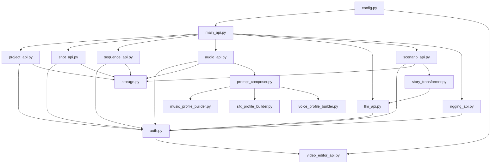
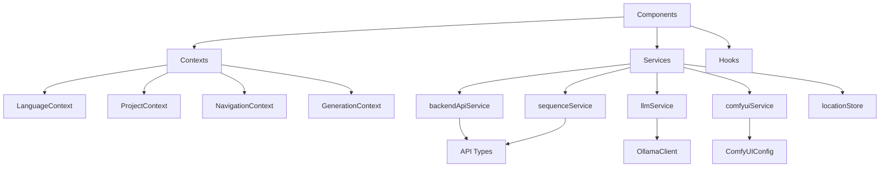

# Architectural Coherence and Module Dependencies Analysis

**Project:** storycore-engine  
**Date:** 2026-02-12  
**Scope:** Backend, Frontend (creative-studio-ui), Config

---

## Executive Summary

The storycore-engine project is a comprehensive creative studio platform with a FastAPI Python backend and React/TypeScript frontend. The architecture follows a modular design with clear separation between API layers, services, and data storage. However, several integration inconsistencies and potential issues have been identified.

**Overall Health:** ⚠️ Moderate - Core functionality is solid, but integration points need attention

---

## 1. Architecture Overview

### 1.1 High-Level Architecture Diagram

```
┌─────────────────────────────────────────────────────────────────────────────┐
│                           STORYCORE-ENGINE ARCHITECTURE                      │
├─────────────────────────────────────────────────────────────────────────────┤
│                                                                              │
│  ┌──────────────────────────────────────────────────────────────────────┐   │
│  │                     FRONTEND (creative-studio-ui)                     │   │
│  │  ┌─────────────┐  ┌─────────────┐  ┌─────────────┐  ┌─────────────┐  │   │
│  │  │   React     │  │  Contexts   │  │  Services   │  │   Stores    │  │   │
│  │  │  Components │  │  (15 files) │  │  (40+ files)│  │  (Zustand)  │  │   │
│  │  └──────┬──────┘  └──────┬──────┘  └──────┬──────┘  └──────┬──────┘  │   │
│  │         │                │                │                │         │   │
│  │         └────────────────┴────────────────┴────────────────┘         │   │
│  │                                   │                                   │   │
│  │                          ┌────────┴────────┐                          │   │
│  │                          │  API Services   │                          │   │
│  │                          │  - backendApi   │                          │   │
│  │                          │  - sequenceSvc  │                          │   │
│  │                          │  - llmService   │                          │   │
│  │                          │  - comfyuiSvc   │                          │   │
│  │                          └────────┬────────┘                          │   │
│  └───────────────────────────────────┼───────────────────────────────────┘   │
│                                      │                                       │
│                          ┌───────────┴───────────┐                           │
│                          │   HTTP/WebSocket      │                           │
│                          │   :8080 (default)     │                           │
│                          └───────────┬───────────┘                           │
│                                      │                                       │
│  ┌───────────────────────────────────┼───────────────────────────────────┐   │
│  │                     BACKEND (FastAPI)                                 │   │
│  │                          ┌────────┴────────┐                          │   │
│  │                          │   main_api.py   │                          │   │
│  │                          │   (Entry Point) │                          │   │
│  │                          └────────┬────────┘                          │   │
│  │                                   │                                   │   │
│  │         ┌─────────────────────────┼─────────────────────────┐         │   │
│  │         │                         │                         │         │   │
│  │  ┌──────┴──────┐  ┌───────────────┴───────────────┐  ┌──────┴──────┐  │   │
│  │  │ API Routers │  │        Core Services          │  │   Storage   │  │   │
│  │  │             │  │                               │  │             │  │   │
│  │  │ - project   │  │ - story_transformer          │  │ - JSONFile  │  │   │
│  │  │ - shot      │  │ - prompt_composer            │  │   Storage   │  │   │
│  │  │ - sequence  │  │ - audio_mix_service          │  │ - LRU Cache │  │   │
│  │  │ - audio     │  │ - video_editor_ai_service    │  │             │  │   │
│  │  │ - llm       │  │ - character_ai_service       │  │             │  │   │
│  │  │ - scenario  │  │ - scene_composition_service  │  │             │  │   │
│  │  │ - location  │  │                               │  │             │  │   │
│  │  │ - rigging   │  │                               │  │             │  │   │
│  │  └──────┬──────┘  └───────────────┬───────────────┘  └──────┬──────┘  │   │
│  │         │                         │                         │         │   │
│  │         └─────────────────────────┼─────────────────────────┘         │   │
│  │                                   │                                   │   │
│  │                          ┌────────┴────────┐                          │   │
│  │                          │  Shared Modules │                          │   │
│  │                          │  - auth.py      │                          │   │
│  │                          │  - config.py    │                          │   │
│  │                          │  - storage.py   │                          │   │
│  │                          └─────────────────┘                          │   │
│  └───────────────────────────────────────────────────────────────────────┘   │
│                                      │                                       │
│                          ┌───────────┴───────────┐                           │
│                          │  External Services    │                           │
│  │                          │                       │                           │
│  │         ┌────────────────┼────────────────┐    │                           │
│  │         │                │                │    │                           │
│  │    ┌────┴────┐     ┌─────┴─────┐    ┌─────┴─────┐                         │
│  │    │ Ollama  │     │  ComfyUI  │    │   Redis   │                         │
│  │    │ :11434  │     │  :8000    │    │   :6379   │                         │
│  │    └─────────┘     └───────────┘    └───────────┘                         │
│  └───────────────────────────────────────────────────────────────────────────┘
│                                                                              │
└─────────────────────────────────────────────────────────────────────────────┘
```

---

## 2. Module Analysis

### 2.1 Backend Python Modules

| Module | Purpose | Dependencies | Status |
|--------|---------|--------------|--------|
| [`main_api.py`](backend/main_api.py) | FastAPI entry point, router aggregation | All API routers | ✅ Active |
| [`project_api.py`](backend/project_api.py) | Project CRUD operations | auth, storage | ✅ Active |
| [`shot_api.py`](backend/shot_api.py) | Shot management | auth, storage | ✅ Active |
| [`sequence_api.py`](backend/sequence_api.py) | Sequence generation with SSE | auth, storage | ✅ Active |
| [`audio_api.py`](backend/audio_api.py) | Audio generation/mixing | auth, storage, profile builders | ✅ Active |
| [`llm_api.py`](backend/llm_api.py) | LLM integration (OpenAI, Ollama) | auth | ✅ Active |
| [`scenario_api.py`](backend/scenario_api.py) | Story-to-scenario transformation | auth, storage, story_transformer | ✅ Active |
| [`location_api.py`](backend/location_api.py) | Location management | standalone | ⚠️ Not in main_api |
| [`rigging_api.py`](backend/rigging_api.py) | Rigging conversion | auth | ✅ Active |
| [`video_editor_api.py`](backend/video_editor_api.py) | Video editing wizard | config, redis, video_editor_types | ⚠️ Not in main_api |
| [`auth.py`](backend/auth.py) | JWT authentication | jwt, video_editor_api (fallback) | ✅ Active |
| [`storage.py`](backend/storage.py) | JSON file storage with LRU cache | None | ✅ Active |
| [`config.py`](backend/config.py) | Centralized configuration | pydantic-settings | ✅ Active |
| [`story_transformer.py`](backend/story_transformer.py) | Story transformation logic | llm_api | ✅ Active |
| [`prompt_composer.py`](backend/prompt_composer.py) | Prompt composition | profile builders | ✅ Active |

### 2.2 Frontend TypeScript Modules

| Directory | Purpose | Key Files | Status |
|-----------|---------|-----------|--------|
| [`components/`](creative-studio-ui/src/components) | UI components | 100+ components | ✅ Active |
| [`services/`](creative-studio-ui/src/services) | API communication | 40+ services | ✅ Active |
| [`contexts/`](creative-studio-ui/src/contexts) | React contexts | 15 context files | ✅ Active |
| [`stores/`](creative-studio-ui/src/stores) | Zustand stores | 5 store files | ✅ Active |
| [`types/`](creative-studio-ui/src/types) | TypeScript definitions | 20+ type files | ✅ Active |
| [`hooks/`](creative-studio-ui/src/hooks) | Custom React hooks | 30+ hooks | ✅ Active |
| [`config/`](creative-studio-ui/src/config) | Frontend configuration | serverConfig.ts | ✅ Active |

---

## 3. Dependency Analysis

### 3.1 Backend Module Dependencies



### 3.2 Frontend Service Dependencies



---

## 4. API Endpoint Mapping

### 4.1 Backend API Endpoints

| Router | Endpoint | Method | Purpose | Frontend Consumer |
|--------|----------|--------|---------|-------------------|
| project_api | `/api/projects` | GET, POST | List/create projects | backendApiService |
| project_api | `/api/projects/{id}` | GET, PUT, DELETE | Project CRUD | backendApiService |
| shot_api | `/api/shots` | POST | Create shot | - |
| shot_api | `/api/shots/{id}` | GET, PUT, DELETE | Shot CRUD | - |
| shot_api | `/api/projects/{id}/shots` | GET | List project shots | - |
| sequence_api | `/api/sequences/generate` | POST | Generate sequence | sequenceService |
| sequence_api | `/api/sequences/{id}/status` | GET | Get generation status | sequenceService |
| sequence_api | `/api/sequences/{id}/stream` | GET | SSE progress stream | sequenceService |
| audio_api | `/api/audio/generate` | POST | Generate audio | - |
| audio_api | `/api/audio/mix` | POST | Mix audio tracks | - |
| llm_api | `/api/llm/generate` | POST | Generate text | llmService |
| llm_api | `/api/llm/chat` | POST | Chat completion | llmService |
| llm_api | `/api/llm/streaming-generate` | POST | Streaming generation | llmService |
| scenario_api | `/api/scenario/transform` | POST | Transform story | - |
| location_api | `/api/locations` | GET, POST | Location CRUD | locationStore |
| rigging_api | `/api/rigging/convert` | POST | Convert to rig | - |

### 4.2 Frontend API Configuration

| Service | Default URL | Environment Variable | Port |
|---------|-------------|---------------------|------|
| Backend API | `http://localhost:3000` | `VITE_BACKEND_URL` | 3000 |
| API Server | `http://localhost:8080` | `VITE_API_URL` | 8080 |
| ComfyUI | `http://localhost:8000` | - | 8000 |
| Ollama | `http://localhost:11434` | - | 11434 |

---

## 5. Issues Identified

### 5.1 Critical Issues

#### CI-1: API Router Not Registered in Main API
**Severity:** 🔴 Critical  
**Location:** [`backend/location_api.py`](backend/location_api.py:19)  
**Description:** The `location_api` router is defined but NOT included in [`main_api.py`](backend/main_api.py). Frontend calls to `/api/locations` will return 404.

**Evidence:**
```python
# backend/location_api.py:19
router = APIRouter(prefix="/api/locations", tags=["locations"])

# backend/main_api.py - location_api is NOT included
app.include_router(project_router, prefix="/api")
app.include_router(shot_router, prefix="/api")
# ... other routers, but NO location_router
```

**Impact:** Location management features are non-functional when using main_api entry point.

**Recommendation:** Add to [`main_api.py`](backend/main_api.py):
```python
from backend.location_api import router as location_router
app.include_router(location_router, prefix="/api")
```

---

#### CI-2: Video Editor API Not Integrated
**Severity:** 🔴 Critical  
**Location:** [`backend/video_editor_api.py`](backend/video_editor_api.py:53)  
**Description:** The `video_editor_api` defines a router with prefix `/api/video-editor` but is not included in main_api.py.

**Evidence:**
```python
# backend/video_editor_api.py:53
VIDEO_EDITOR_ROUTER = APIRouter(prefix="/api/video-editor", tags=["Video Editor Wizard"])
```

**Impact:** Video editing wizard endpoints are inaccessible.

**Recommendation:** Register the router in [`main_api.py`](backend/main_api.py).

---

### 5.2 High Severity Issues

#### HI-1: Inconsistent Default Ports
**Severity:** 🟠 High  
**Locations:**
- [`creative-studio-ui/src/services/backendApiService.ts:27`](creative-studio-ui/src/services/backendApiService.ts:27)
- [`creative-studio-ui/src/services/sequenceService.ts:6`](creative-studio-ui/src/services/sequenceService.ts:6)
- [`backend/config.py:46`](backend/config.py:46)

**Description:** Frontend services use inconsistent default ports:
- `backendApiService.ts`: `http://localhost:3000`
- `sequenceService.ts`: `http://localhost:8000/api`
- Backend config: `http://localhost:8080`

**Evidence:**
```typescript
// backendApiService.ts:27
baseUrl: import.meta.env.VITE_BACKEND_URL || 'http://localhost:3000',

// sequenceService.ts:6
const API_BASE = import.meta.env.VITE_API_URL || 'http://localhost:8000/api';

// backend/config.py:46
API_URL: str = Field(default="http://localhost:8080")
```

**Impact:** API calls may fail if environment variables are not set correctly.

**Recommendation:** Standardize to port 8080 across all services or document the port strategy clearly.

---

#### HI-2: Circular Dependency in Auth Module
**Severity:** 🟠 High  
**Location:** [`backend/auth.py:34-36`](backend/auth.py:34)  
**Description:** The auth module attempts to import `SECRET_KEY` from `video_editor_api` as a fallback, creating a potential circular dependency.

**Evidence:**
```python
# backend/auth.py:34-36
try:
    from backend.video_editor_api import SECRET_KEY
    return SECRET_KEY
except ImportError:
    pass
```

**Impact:** If video_editor_api imports auth before SECRET_KEY is defined, it will cause import errors.

**Recommendation:** Move SECRET_KEY to centralized config.py and import from there.

---

#### HI-3: Missing Type Synchronization
**Severity:** 🟠 High  
**Locations:**
- [`backend/shot_api.py:62-70`](backend/shot_api.py:62) (ShotBase model)
- [`creative-studio-ui/src/types/shot.ts:67-96`](creative-studio-ui/src/types/shot.ts:67) (Shot interface)

**Description:** Backend and frontend Shot models have different structures.

**Backend ShotBase:**
```python
class ShotBase(BaseModel):
    name: str
    description: Optional[str]
    prompt: str
    shot_type: ShotType
    duration_seconds: float
    order_index: int
    metadata: Dict[str, Any]
```

**Frontend Shot:**
```typescript
interface Shot {
  id: string;
  number: number;
  type: ShotType;
  timing: { duration, inPoint, outPoint, transition, ... };
  thumbnailUrl?: string;
  // ... many more fields
}
```

**Impact:** Data transfer between frontend and backend may lose information or cause validation errors.

**Recommendation:** Create shared type definitions or generate frontend types from backend Pydantic models.

---

### 5.3 Medium Severity Issues

#### MI-1: Duplicate Shot Type Definitions
**Severity:** 🟡 Medium  
**Locations:**
- [`backend/shot_api.py:52-59`](backend/shot_api.py:52)
- [`creative-studio-ui/src/types/shot.ts:7-14`](creative-studio-ui/src/types/shot.ts:7)

**Description:** Shot types are defined differently on backend and frontend.

**Backend:**
```python
class ShotType(str, Enum):
    ACTION = "action"
    DIALOGUE = "dialogue"
    TRANSITION = "transition"
    ESTABLISHING = "establishing"
    CLOSEUP = "closeup"
    WIDE = "wide"
```

**Frontend:**
```typescript
type ShotType =
  | 'extreme-wide'
  | 'wide'
  | 'medium'
  | 'close-up'
  | 'extreme-close-up'
  | 'over-the-shoulder'
  | 'pov';
```

**Impact:** Type mismatches when sending shot data between frontend and backend.

**Recommendation:** Align type definitions or create a mapping layer.

---

#### MI-2: Hardcoded IP Address
**Severity:** 🟡 Medium  
**Location:** [`creative-studio-ui/src/services/dialogueService.ts:303`](creative-studio-ui/src/services/dialogueService.ts:303)  
**Description:** Hardcoded IP address `192.168.1.47:3000` for SAPI service.

**Evidence:**
```typescript
const sapiUrl = 'http://192.168.1.47:3000/api/sapi/generate';
```

**Impact:** Will fail on different network configurations.

**Recommendation:** Use environment variable or configuration.

---

#### MI-3: Deprecated Component Still Present
**Severity:** 🟡 Medium  
**Location:** [`creative-studio-ui/src/components/MenuBar.tsx`](creative-studio-ui/src/components/MenuBar.tsx)  
**Description:** Old MenuBar component marked as deprecated but still in codebase.

**Evidence:**
```typescript
/**
 * @deprecated Use the new MenuBar from menuBar directory instead
 */
export function MenuBarOld(): React.ReactElement {
```

**Impact:** Potential confusion and accidental usage of deprecated component.

**Recommendation:** Remove deprecated file or move to archive directory.

---

#### MI-4: ComfyUI Port Inconsistency
**Severity:** 🟡 Medium  
**Locations:**
- [`creative-studio-ui/src/services/comfyuiService.ts:93`](creative-studio-ui/src/services/comfyuiService.ts:93): `localhost:8000`
- [`backend/config.py:103`](backend/config.py:103): `127.0.0.1:7860`

**Description:** Different default ComfyUI ports in frontend vs backend config.

**Frontend:**
```typescript
serverUrl: 'http://localhost:8000', // ComfyUI Desktop default port
```

**Backend:**
```python
COMFYUI_BASE_URL: str = Field(
    default="http://127.0.0.1:7860",
    description="ComfyUI service base URL"
)
```

**Impact:** Connection failures if ComfyUI is running on a different port.

**Recommendation:** Standardize ComfyUI port configuration.

---

### 5.4 Low Severity Issues

#### LI-1: Missing Index Exports
**Severity:** 🟢 Low  
**Location:** [`creative-studio-ui/src/services/index.ts`](creative-studio-ui/src/services/index.ts)  
**Description:** Not all services are exported from the index file.

**Impact:** Inconsistent import paths across the codebase.

**Recommendation:** Add all services to index exports.

---

#### LI-2: Duplicate JSON Import
**Severity:** 🟢 Low  
**Location:** [`backend/location_api.py:6,13`](backend/location_api.py:6)  
**Description:** JSON module imported twice.

**Evidence:**
```python
import json  # line 6
import json  # line 13
```

**Impact:** Code quality issue, no functional impact.

**Recommendation:** Remove duplicate import.

---

## 6. External Service Integration

### 6.1 Ollama LLM Integration

| Aspect | Status | Details |
|--------|--------|---------|
| Connection | ✅ Working | Default: `http://localhost:11434` |
| Endpoints Used | `/api/tags`, `/api/generate` | Model listing and generation |
| Frontend Service | [`llmService.ts`](creative-studio-ui/src/services/llmService.ts) | OllamaClient integration |
| Backend Service | [`llm_api.py`](backend/llm_api.py) | Mock mode available |

### 6.2 ComfyUI Integration

| Aspect | Status | Details |
|--------|--------|---------|
| Connection | ⚠️ Port Mismatch | Frontend: 8000, Backend: 7860 |
| Endpoints Used | `/prompt`, `/history`, `/view` | Workflow execution |
| Frontend Service | [`comfyuiService.ts`](creative-studio-ui/src/services/comfyuiService.ts) | Full configuration |
| Backend Service | Not directly integrated | Frontend connects directly |

### 6.3 Redis Integration

| Aspect | Status | Details |
|--------|--------|---------|
| Connection | ⚠️ Optional | Default: `redis://localhost:6379/0` |
| Usage | Session management, jobs | video_editor_api only |
| Mock Mode | Available | `USE_MOCK_REDIS=true` |

---

## 7. Orphaned/Disconnected Components

### 7.1 Backend

| Component | Status | Recommendation |
|-----------|--------|----------------|
| [`location_api.py`](backend/location_api.py) | ⚠️ Not registered | Add to main_api.py |
| [`video_editor_api.py`](backend/video_editor_api.py) | ⚠️ Not registered | Add to main_api.py |
| [`automation_endpoints.py`](backend/automation_endpoints.py) | ⚠️ Not registered | Review and integrate |
| [`feedback_proxy.py`](backend/feedback_proxy.py) | ⚠️ Standalone | Used for GitHub feedback |

### 7.2 Frontend

| Component | Status | Recommendation |
|-----------|--------|----------------|
| [`MenuBar.tsx`](creative-studio-ui/src/components/MenuBar.tsx) | 🗑️ Deprecated | Remove or archive |
| [`sequence-editor/`](creative-studio-ui/src/sequence-editor) | ⚠️ Partially used | Review integration |

---

## 8. Recommendations Summary

### Immediate Actions (Critical)

1. **Register Missing Routers** - Add `location_api` and `video_editor_api` routers to [`main_api.py`](backend/main_api.py)
2. **Fix Circular Dependency** - Move JWT secret to centralized config
3. **Standardize Ports** - Use consistent default ports (recommend 8080 for backend API)

### Short-term Actions (High Priority)

1. **Type Synchronization** - Create shared type definitions or auto-generate from backend
2. **Environment Configuration** - Document required environment variables
3. **Remove Hardcoded IPs** - Replace with configuration

### Long-term Actions (Medium Priority)

1. **Clean Up Deprecated Code** - Remove or archive deprecated components
2. **Service Index Exports** - Ensure all services are properly exported
3. **API Documentation** - Generate OpenAPI docs and share with frontend team

---

## 9. File Reference Index

### Backend Files Analyzed
- [`backend/main_api.py`](backend/main_api.py) - Main API entry point
- [`backend/config.py`](backend/config.py) - Centralized configuration
- [`backend/auth.py`](backend/auth.py) - JWT authentication
- [`backend/storage.py`](backend/storage.py) - JSON file storage
- [`backend/project_api.py`](backend/project_api.py) - Project management
- [`backend/shot_api.py`](backend/shot_api.py) - Shot management
- [`backend/sequence_api.py`](backend/sequence_api.py) - Sequence generation
- [`backend/audio_api.py`](backend/audio_api.py) - Audio processing
- [`backend/llm_api.py`](backend/llm_api.py) - LLM integration
- [`backend/scenario_api.py`](backend/scenario_api.py) - Story transformation
- [`backend/location_api.py`](backend/location_api.py) - Location management
- [`backend/rigging_api.py`](backend/rigging_api.py) - Rigging conversion
- [`backend/video_editor_api.py`](backend/video_editor_api.py) - Video editor

### Frontend Files Analyzed
- [`creative-studio-ui/package.json`](creative-studio-ui/package.json) - Dependencies
- [`creative-studio-ui/src/services/index.ts`](creative-studio-ui/src/services/index.ts) - Service exports
- [`creative-studio-ui/src/services/backendApiService.ts`](creative-studio-ui/src/services/backendApiService.ts) - Backend API client
- [`creative-studio-ui/src/services/sequenceService.ts`](creative-studio-ui/src/services/sequenceService.ts) - Sequence service
- [`creative-studio-ui/src/services/llmService.ts`](creative-studio-ui/src/services/llmService.ts) - LLM service
- [`creative-studio-ui/src/services/comfyuiService.ts`](creative-studio-ui/src/services/comfyuiService.ts) - ComfyUI service
- [`creative-studio-ui/src/types/api.ts`](creative-studio-ui/src/types/api.ts) - API types
- [`creative-studio-ui/src/types/shot.ts`](creative-studio-ui/src/types/shot.ts) - Shot types
- [`creative-studio-ui/src/types/projectDashboard.ts`](creative-studio-ui/src/types/projectDashboard.ts) - Project types
- [`creative-studio-ui/src/stores/locationStore.ts`](creative-studio-ui/src/stores/locationStore.ts) - Location store

---

## 10. Conclusion

The storycore-engine project has a well-structured architecture with clear separation of concerns. The main issues identified are:

1. **Integration gaps** - Some API routers are not registered in the main entry point
2. **Configuration inconsistencies** - Different default ports across services
3. **Type mismatches** - Frontend and backend type definitions are not synchronized

Addressing the critical and high-severity issues will significantly improve the system's reliability and maintainability. The modular design of both backend and frontend makes it straightforward to implement the recommended fixes.

---

*Report generated as part of Technical Audit 2026-02-12*
