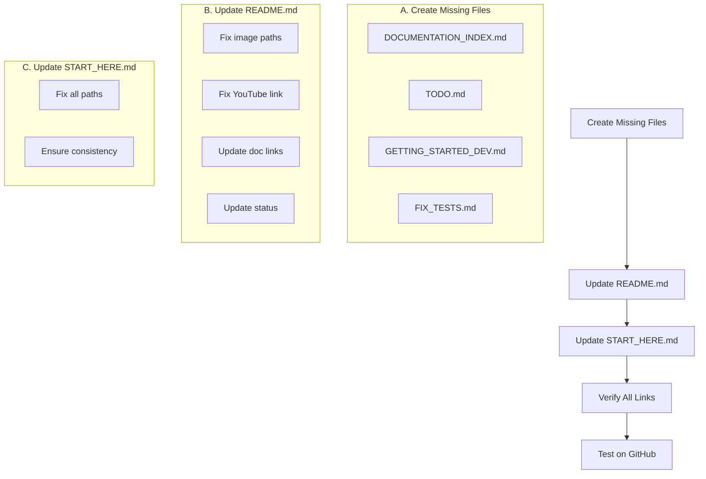

# Documentation Improvement Plan for StoryCore-Engine

## Overview

This plan outlines the improvements needed for the GitHub documentation, with priority on fixing the README.md file.

---

## 1. Issues Identified

### 1.1 Broken Image Links in README.md

**Problem:** Image filenames contain spaces, but README references them with hyphens.

| Current Reference | Actual File |
|-------------------|-------------|
| `assets/Screenshot-2026-02-15-060825.png` | `assets/Screenshot 2026-02-15 060825.png` |
| `assets/Screenshot-2026-02-15060805.png` | `assets/Screenshot 2026-02-15 060805.png` |
| `assets/Screenshot-2026-02-15-060909.png` | `assets/Screenshot 2026-02-15 060909.png` |
| `assets/Screenshot-2026-02-15-060938.png` | `assets/Screenshot 2026-02-15 060938.png` |

**Solution:** Update README.md to use URL-encoded paths with `%20` for spaces, or rename files.

---

### 1.2 Malformed YouTube Link (Line 46)

**Current (broken):**
```markdown
][(https://www.youtube.com/watch?v=P0K7DueyICo](https://youtu.be/P0K7DueyICo?si=kEvpsxMy4zeFEYqO))
```

**Solution:** Fix to proper markdown format:
```markdown
[](https://www.youtube.com/watch?v=P0K7DueyICo)
```

---

### 1.3 Non-Existent Documentation Files

Files referenced but do not exist at root level:

| File | Status | Action |
|------|--------|--------|
| `DOCUMENTATION_INDEX.md` | Missing | Create new file |
| `TODO.md` | Missing at root | Create new file |
| `GETTING_STARTED_DEV.md` | Missing | Create new file |
| `FIX_TESTS.md` | Missing | Create new file |
| `docs/COMFYUI_QUICK_START.md` | Missing | Create or update path |

---

### 1.4 Wrong Paths for Existing Files

| Current Reference | Correct Path |
|-------------------|--------------|
| `BUILD_SUCCESS_SUMMARY.md` | `documentation/reports/BUILD_SUCCESS_SUMMARY.md` |
| `BUILD_REPORT.md` | `documentation/reports/BUILD_REPORT.md` |
| `RELEASE_NOTES_2026_01_23.md` | `documentation/RELEASE_NOTES_2026_01_23.md` |
| `documentation/api/` | `documentation/api_reference/` |

---

## 2. Files to Create

### 2.1 DOCUMENTATION_INDEX.md

A comprehensive navigation index for all documentation.

**Content Structure:**
- Getting Started section
- Technical Documentation section
- API Reference section
- Guides section
- Reports section

### 2.2 TODO.md

A master TODO file consolidating tasks from various TODO files.

**Content Structure:**
- Current priorities
- In-progress tasks
- Planned features
- Completed tasks

### 2.3 GETTING_STARTED_DEV.md

A developer onboarding guide.

**Content Structure:**
- Prerequisites
- Installation steps
- Project structure overview
- Development workflow
- Common commands

### 2.4 FIX_TESTS.md

Test status and known issues document.

**Content Structure:**
- Test coverage status
- Known test issues
- Test commands
- How to run tests

---

## 3. Files to Update

### 3.1 README.md

**Changes Required:**
1. Fix image paths (use URL encoding for spaces)
2. Fix YouTube link formatting
3. Update documentation links to correct paths
4. Update project status to reflect current state
5. Ensure all links are functional

### 3.2 START_HERE.md

**Changes Required:**
1. Update all documentation links
2. Fix paths to BUILD_SUCCESS_SUMMARY.md, BUILD_REPORT.md
3. Update RELEASE_NOTES path
4. Ensure consistency with README.md

---

## 4. Implementation Order



---

## 5. Detailed Changes

### 5.1 README.md Specific Changes

#### Line 12 - Image Path
```markdown
# Before


# After

```

#### Line 46 - YouTube Link
```markdown
# Before
][(https://www.youtube.com/watch?v=P0K7DueyICo](https://youtu.be/P0K7DueyICo?si=kEvpsxMy4zeFEYqO))

# After
[](https://www.youtube.com/watch?v=P0K7DueyICo)
```

#### Line 64-68 - Additional Images
```markdown
# Before


# After


```

#### Documentation Section - Lines 277-294
```markdown
# Before
- [Quick Start Guide](docs/COMFYUI_QUICK_START.md)
- [Documentation Index](DOCUMENTATION_INDEX.md)
- [Build Success Summary](BUILD_SUCCESS_SUMMARY.md)
- [Build Report](BUILD_REPORT.md)
- [Test Fixes](FIX_TESTS.md)
- [TODO List](TODO.md)
- [Release Notes](RELEASE_NOTES_2026_01_23.md)

# After
- [Quick Start Guide](documentation/getting_started/QUICK_START.md)
- [Documentation Index](DOCUMENTATION_INDEX.md)
- [Build Success Summary](documentation/reports/BUILD_SUCCESS_SUMMARY.md)
- [Build Report](documentation/reports/BUILD_REPORT.md)
- [Test Status](FIX_TESTS.md)
- [TODO List](TODO.md)
- [Release Notes](documentation/RELEASE_NOTES_2026_01_23.md)
```

---

## 6. Verification Checklist

After implementation, verify:

- [ ] All image links display correctly on GitHub
- [ ] YouTube video link works and shows thumbnail
- [ ] All documentation links resolve to existing files
- [ ] START_HERE.md links match README.md
- [ ] No 404 errors on any links
- [ ] Mobile rendering is correct

---

## 7. Files Summary

| Action | File | Priority |
|--------|------|----------|
| Create | DOCUMENTATION_INDEX.md | High |
| Create | TODO.md | High |
| Create | GETTING_STARTED_DEV.md | High |
| Create | FIX_TESTS.md | Medium |
| Update | README.md | Critical |
| Update | START_HERE.md | High |

---

**Plan Created:** February 16, 2026
**Status:** Ready for Implementation