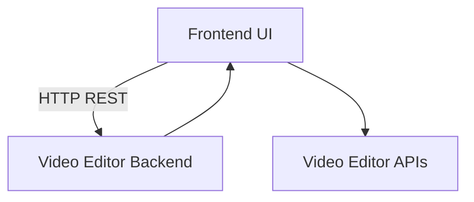
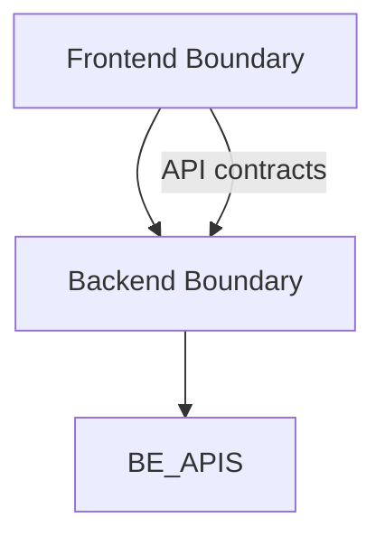

Plan d'audit d'architecture - Phase 2.x

Plan d'exécution Phase 2.2 (Cartographie des flux entre Frontend et Backend)
- Objectif: produire la cartographie des flux Frontend ↔ Backend et les points d’entrée, et préparer le Diagramme Mermaid associé.
- Livrables attendus: Rapport Markdown (Section Flux de données) + Diagramme Mermaid à insérer dans le rapport.
- Prochaines étapes: lancer Phase 2.3 (cartographie boundaries), Phase 2.4 (documentation mapping) et Phase 2.5 (plan d’action préliminaire).

## Phase 2.2 Détails et livrables (Cartographie des flux Frontend ↔ Backend)
- 2.2.1 Inventaire des appels API frontend → backend et des DTOs utilisés
- 2.2.2 Cartographie des flux de données: séquences, payloads, chemins et transformations
- 2.2.3 Données échangées entre les composants UI et les services backend (projet, clips, tracks, médias, etc.)
- 2.2.4 Diagramme Mermaid du flux de données et des frontières
- 2.2.5 Livrable: Section Flux de données dans le rapport Markdown et Diagramme Mermaid

Mermaid Diagrammes proposés (à insérer dans le rapport)

Boundaries simples (Frontend vs Backend)

2.2 Détails et livrables (Cartographie des flux Frontend ↔ Backend)
- 2.2.1 Inventaire des appels API frontend → backend et des DTOs utilisés
- 2.2.2 Cartographie des flux de données: séquences, payloads, chemins et transformations
- 2.2.3 Données échangées entre les composants UI et les services backend (projet, clips, tracks, médias, etc.)
- 2.2.4 Diagramme Mermaid du flux de données et des frontières
- 2.2.5 Livrable: Section Flux de données dans le rapport Markdown et Diagramme Mermaid

Mermaid Diagrammes proposés (à insérer dans le rapport)

Boundaries simples (Frontend vs Backend)

Contexte et objectif
- Compléter Phase 2 en livrant les cartographies et les livrables associés afin de préparer le plan d’action 90 jours et le reporting KPI.
- Périmètre: cartographie des flux de données Frontend ↔ Backend, boundaries et modules, et documentation mapping.

Livrables attendus pour Phase 2.2
- Inventaire des appels API frontend → backend et des modèles de données échangés
- Cartographie des flux de données: séquences, payloads, chemins et transformations
- Définition des points d’entrée et des données échangées entre les composants UI critiques et les services backend
- Diagramme Mermaid du flux de données (à intégrer dans le rapport Markdown)
- Livrable: Rapport Markdown Section Flux de données + Diagramme Mermaid

Références et preuves d’alignement (à consulter dans le workspace)
- Frontend API Client et DTOs: creative-studio-ui/src/services/videoEditorAPI.ts, creative-studio-ui/src/types/video-editor.ts
- Composants déclencheurs: creative-studio-ui/src/components/editor/effects/EffectsLibrary.tsx, creative-studio-ui/src/components/VideoEditor/Toolbar/Toolbar.tsx, creative-studio-ui/src/components/VideoEditor/StatusBar/StatusBar.tsx

Diagramme Mermaid proposé (à copier dans le rapport Markdown)
graph TD
  FE[Frontend UI] -->|HTTP REST| BE[Video Editor Backend]
  FE --> BE_APIS[Video Editor APIs]
  BE --> FE

Boundaries simples (Frontend vs Backend)
graph TD
  FE_Boundary[Frontend Boundary] --> BE_Boundary[Backend Boundary]
  FE_Boundary -- API contracts --> BE_Boundary
  BE_Boundary --> BE_APIS

Plan d’action préliminaire (Phase 2.2 -> Phase 2.5)
- 2.2 Cartographie des flux et des points d’entrée
- 2.3 Cartographie des boundaries et modules
- 2.4 Rédaction du mapping dans le rapport Markdown et génération du diagramme Mermaid
- 2.5 Préparation des livrables d’architecture (Executive summary + plan d’action préliminaire)

Hypothèses et limites
- Hypothèses: les endpoints existants et les DTOs actuels seront consolidés durant les prochaines itérations.
- Limites: ne couvre pas les dépendances internes non liées au trafic Frontend↔Backend.

Prochaines étapes
- Lancement de la Phase 2.2 (cartographie des flux et des points d’entrée)
- Suivi par Phase 2.3 (cartographie boundaries) puis Phase 2.4 et Phase 2.5

Remarque
- Le livrable sera enregistré sous Plans_Audit_Architecture_Phase2.md et fusionné dans le plan global d’audit.
