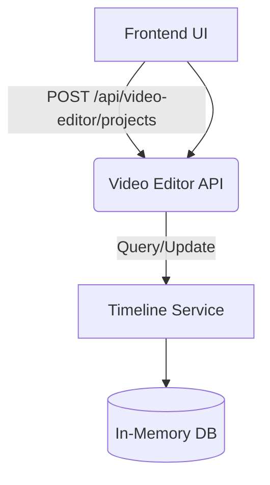
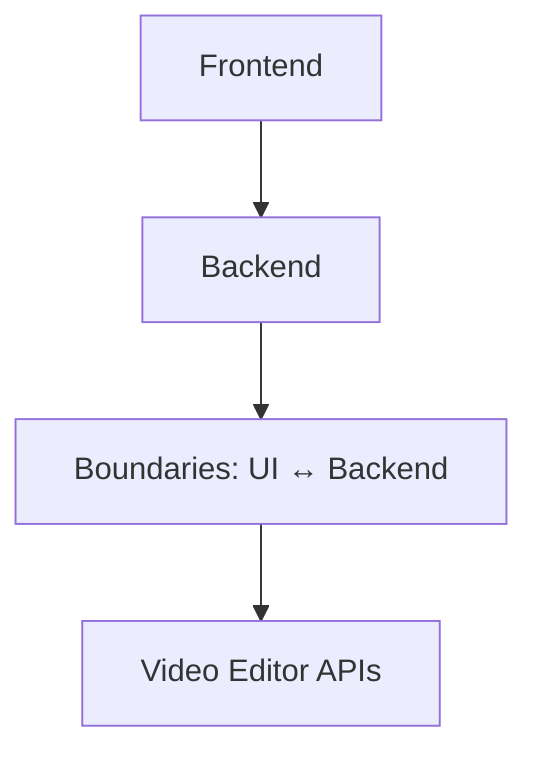
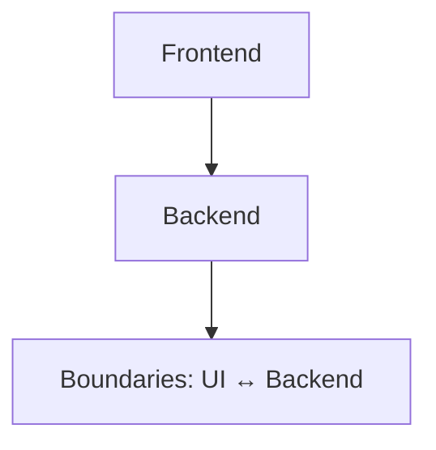
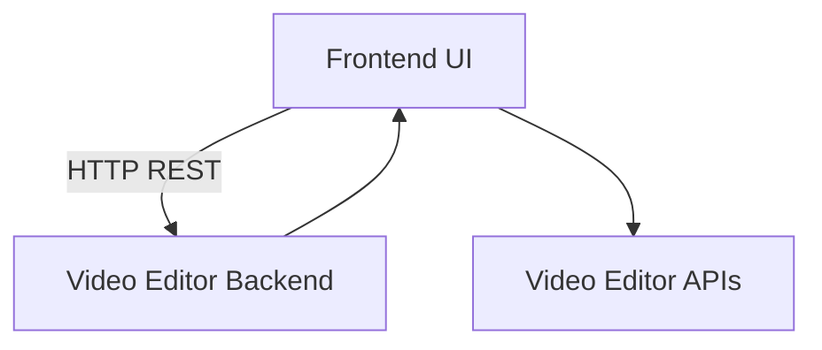
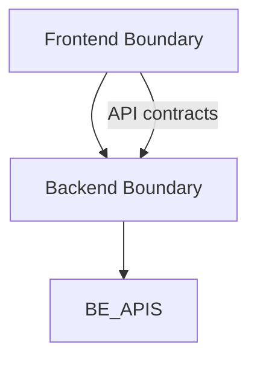

 Plan d'audit d'architecture - Phase 2.x (version préliminaire)

Contexte et approche
- Objectif: livrer une cartographie claire des flux de données et des boundaries entre le frontend et le backend, et préparer les livrables d’architecture (Rapport Markdown + Diagramme Mermaid), en vue du plan d’action 90 jours et des KPI.
- Périmètre: cartographie des échanges Frontend ↔ Backend autour des composants UI critiques et des endpoints du backend StoryCore Video Editor.

Livrables attendus pour Phase 2.x
- 2.2 Cartographie des flux de données et des points d’entrée entre frontend et backend
  - 2.2.1 Inventaire des appels API frontend → backend et des DTOs utilisés
  - 2.2.2 Cartographie des flux de données: séquences, payloads, chemins et transformations
  - 2.2.3 Données échangées entre les composants UI et les services backend (projet, clips, tracks, médias, etc.)
  - 2.2.4 Diagramme Mermaid du flux de données
  - 2.2.5 Livrable: Section Flux de données dans le rapport Markdown et Diagramme Mermaid

- 2.3 Cartographie des boundaries et modules
  - 2.3.1 Définir les frontières entre frontend et backend (responsabilités et interfaces)
  - 2.3.2 Définir les API contracts et les DTOs implicites/explicites
  - 2.3.3 Diagramme de boundaries Mermaid ou schéma simple

- 2.4 Documentation mapping (Rapport Markdown) et diagramme Mermaid
  - 2.4.1 Rédiger le brouillon du rapport de mapping (structure synthèse, méthodologie, découvertes, risques, recommandations)
  - 2.4.2 Intégrer les diagrammes Mermaid des phases 2.2 et 2.3

- 2.5 Préparer les livrables d’architecture
  - 2.5.1 Executive summary des découvertes
  - 2.5.2 Plan d’action préliminaire et priorisation
  - 2.5.3 Mise à jour de la TodoList et attribution des responsables

Références et preuves d’alignement (à consulter dans le workspace)
- Frontend API Client et DTOs: creative-studio-ui/src/services/videoEditorAPI.ts, creative-studio-ui/src/types/video-editor.ts
- Composants déclencheurs: creative-studio-ui/src/components/editor/effects/EffectsLibrary.tsx, creative-studio-ui/src/components/VideoEditor/Toolbar/Toolbar.tsx, creative-studio-ui/src/components/VideoEditor/StatusBar/StatusBar.tsx

Diagramme Mermaid proposé (à insérer dans le rapport Markdown)
graph TD
  FE[Frontend UI] -->|HTTP REST| BE[Video Editor Backend]
  FE --> BE_APIS[Video Editor APIs]
  BE --> FE

Boundaries simples (Frontend vs Backend)
graph TD
  FE_Boundary[Frontend Boundary] --> BE_Boundary[Backend Boundary]
  FE_Boundary -- API contracts --> BE_Boundary
  BE_Boundary --> BE_APIS

Prochaines étapes
- Lancement de la Phase 2.2 (cartographie des flux et des points d’entrée)
- Puis Phase 2.3 (cartographie boundaries)
- Phase 2.4 (rédaction mapping et diagramme Mermaid)
- Phase 2.5 (livrables et plan d’action préliminaire)

Délégation et livrables finaux
- Sous-tâche: Architect – Cartographie des flux et mapping (Phase 2.2)
- Livrables: Plan_Audit_Architecture_Phase2.md (Markdown), Diagramme_Mermaid.md, notes de mapping et limites

- Remarque
- Ce plan est partagé et peut être enrichi en fonction des résultats des analyses Phase 2.2 et suivantes.

Phase 2.2 Détails complémentaires (prolongement)
- 2.2.1 Inventaire des endpoints consommés par le frontend et DTOs utilisés
- 2.2.2 Cartographie des flux de données: séquences et transformations
- 2.2.3 Données échangées entre UI et services backend (projets, médias, clips, etc.)
- 2.2.4 Diagramme Mermaid du flux de données
- 2.2.5 Livrable: Section Flux de données dans le rapport Markdown et Diagramme Mermaid

2.2.1 Inventaire des appels API frontend → backend et des DTOs utilisés
- Frontend API surface: creative-studio-ui/src/services/videoEditorAPI.ts
- DTOs UI: creative-studio-ui/src/types/video-editor.ts
- Backend API surface: backend/video_editor_api.py
- DTOs Backend: video_editor_types.py (ProjectCreate, ProjectResponse, MediaResponse, ExportRequest/Response, etc.)
- Observed endpoints (extraits principaux dans le code): /auth/*, /projects, /projects/{project_id}, /projects/{project_id}/tracks, /projects/{project_id}/clips, /media/upload, /export, /ai/*, /health

2.2.2 Cartographie des flux de données: séquences, payloads, chemins et transformations
- UI createProject -> Backend create_project -> ProjectResponse
- UI addTrack -> Backend add_track
- UI addClip -> Backend add_clip
- UI uploadMedia -> Backend upload_media
- AI invocations: /ai/generate-ambiance, /ai/tts, /ai/transcribe, /ai/smart-crop

2.2.3 Données échangées UI ↔ Backend
- Projets: id, name, description, user_id, aspect_ratio, resolution, frame_rate, duration
- Tracks: id, type, name, clips
- Clips: id, media_id, track_id, start_time, inPoint, outPoint, duration
- Media: id, name, type, path, duration, metadata

2.2.4 Diagramme Mermaid du flux de données et des frontières

 

2.2.5 Livrable: Section Flux de données dans le rapport Markdown et Diagramme Mermaid
- Intégrer les diagrams Mermaid ci-dessus dans Plan_Audit_Architecture_Phase2.md et Plan_Audit_Architecture_Phase2_v2.md
- Ce plan est partagé et peut être enrichi en fonction des résultats des analyses Phase 2.2 et suivantes.

### Plan d'exécution Phase 2.2 (Cartographie des flux)

## 2.2 Cartographie des flux Frontend ↔ Backend (Phase 2.2)

- 2.2.1 Inventaire des appels API et des DTOs frontend/backend
- Frontend API surface: creative-studio-ui/src/services/videoEditorAPI.ts
- DTOs: creative-studio-ui/src/types/video-editor.ts
- Backend API surface: backend/video_editor_api.py
- DTOs: video_editor_types.py (ProjectCreate, ProjectResponse, MediaResponse, etc.)
- Observed endpoints (extraits principaux dans le code) : /auth/*, /projects, /projects/{id}, /projects/{id}/tracks, /projects/{id}/clips, /media/upload, /export, /ai/*, /health

- 2.2.2 Cartographie des flux de données: séquences, payloads, chemins et transformations
- Décrire les séquences UI → API, API → Timeline Service, Timeline Service → stockage
- Lister les payloads par endpoint et les transformations attendues (sanitization, validation, mapping DTOs)

- 2.2.3 Données échangées UI ↔ Backend
- Projets (name, description, aspect_ratio, resolution, frame_rate), Tracks, Clips, Media, Exports
- Payloads create/update/delete et statuts de progression

- 2.2.4 Diagramme Mermaid du flux de données et des frontières (dataFlow et boundaries)
- Diagrammes Mermaid à inclure (dataFlow et boundaries)

- 2.2.5 Livrable: Section Flux de données dans le rapport Markdown et Diagramme Mermaid
- Livrable attendu : sections Markdown et diagrammes Mermaid insérés dans Plan_Audit_Architecture_Phase2.md et Plan_Audit_Architecture_Phase2_v2.md

- Objectif: produire la cartographie des flux Frontend ↔ Backend et le diagramme Mermaid correspondant.
- Livrables intermédiaires: liste des endpoints consommés, DTOs, flux de données, diagramme Mermaid à insérer dans le rapport.
- Prochaines étapes: lancer Phase 2.3 (cartographie boundaries), Phase 2.4 (documentation mapping) et Phase 2.5 (plan d’action).

## Phase 2.2 Détails et livrables (Cartographie des flux Frontend ↔ Backend)
- 2.2.1 Inventaire des appels API frontend → backend et des DTOs utilisés
- 2.2.2 Cartographie des flux de données: séquences, payloads, chemins et transformations
- 2.2.3 Données échangées entre les composants UI et les services backend (projet, clips, tracks, médias, etc.)
- 2.2.4 Diagramme Mermaid du flux de données et des frontières
- 2.2.5 Livrable: Section Flux de données dans le rapport Markdown et Diagramme Mermaid

Mermaid diagrams proposés (à insérer dans le rapport)

Boundaries simples (Frontend vs Backend)

## Phase 2.2 Détails et livrables (Cartographie des flux Frontend ↔ Backend)
- 2.2.1 Inventaire des appels API frontend → backend et des DTOs utilisés
- 2.2.2 Cartographie des flux de données: séquences, payloads, chemins et transformations
- 2.2.3 Données échangées entre les composants UI et les services backend (projet, clips, tracks, médias, etc.)
- 2.2.4 Diagramme Mermaid du flux de données et des frontières
- 2.2.5 Livrable: Section Flux de données dans le rapport Markdown et Diagramme Mermaid

## Phase 2.2 Détails et livrables (Cartographie des flux Frontend ↔ Backend)
- 2.2.1 Inventaire des appels API frontend → backend et des DTOs utilisés
- 2.2.2 Cartographie des flux de données: séquences, payloads, chemins et transformations
- 2.2.3 Données échangées entre les composants UI et les services backend (projet, clips, tracks, médias, etc.)
- 2.2.4 Diagramme Mermaid du flux de données et des frontières
- 2.2.5 Livrable: Section Flux de données dans le rapport Markdown et Diagramme Mermaid
