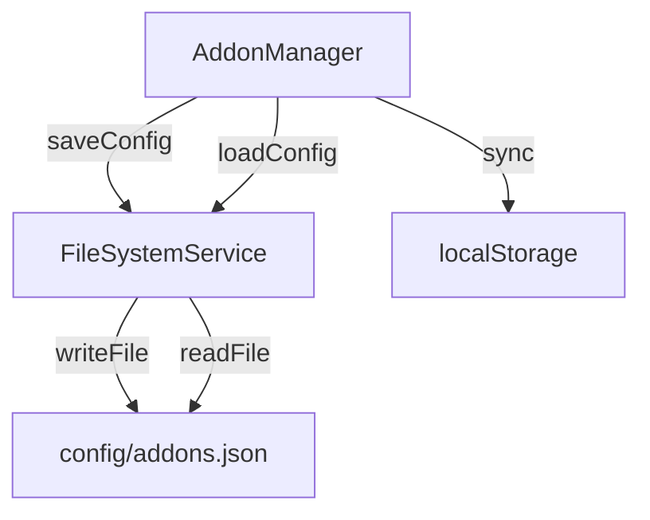
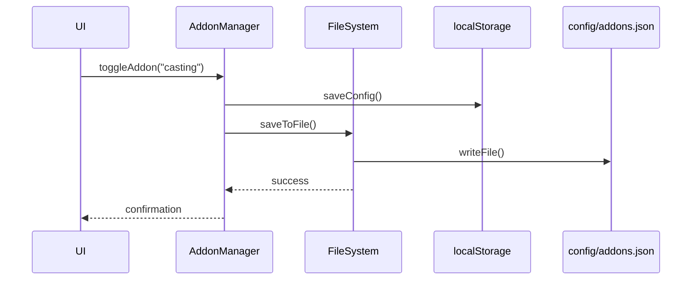

# Solution de Sauvegarde des Add-ons

## Analyse de la Structure Actuelle

Le système actuel utilise :
- `AddonManager` pour gérer les add-ons (activation/désactivation, paramètres)
- Stockage dans `localStorage` sous la clé `storycore_addon_config`
- Interface utilisateur dans `AddonsPanel.tsx` et `AddonSettingsModal.tsx`

## Problèmes Identifiés

1. **Stockage limité** : `localStorage` est limité au navigateur et non partagé
2. **Pas d'export/import** : Impossible de sauvegarder ou restaurer la configuration
3. **Pas de synchronisation** : Aucune synchronisation entre les environnements

## Solution Proposée

### Architecture



### Composants à Implémenter

1. **FileSystemService**
   - Méthodes : `readConfigFile()`, `writeConfigFile()`
   - Gestion des erreurs et création de dossier
   - Synchronisation avec localStorage

2. **AddonManager - Modifications**
   - Ajouter `saveToFile()` et `loadFromFile()`
   - Synchronisation automatique entre localStorage et fichier
   - Gestion des conflits

3. **Interface Utilisateur**
   - Boutons "Exporter" et "Importer" dans AddonsPanel
   - Notification de synchronisation
   - Gestion des erreurs

### Format du Fichier

```json
{
  "version": "1.0",
  "timestamp": "2026-01-25T09:42:37.301Z",
  "addons": {
    "casting": {
      "enabled": true,
      "settings": {
        "maxActorsPerScene": 5,
        "enableActorTemplates": true,
        "autoSaveCasting": true
      }
    },
    "audio-production": {
      "enabled": false,
      "settings": {
        "defaultSampleRate": 44100,
        "maxAudioTracks": 16,
        "enableAudioNormalization": true
      }
    }
  }
}
```

### Flux de Synchronisation



### Spécifications Techniques

#### 1. FileSystemService

```typescript
interface FileSystemService {
  readConfigFile(path: string): Promise<AddonConfig>;
  writeConfigFile(path: string, config: AddonConfig): Promise<void>;
  ensureDirectoryExists(path: string): Promise<void>;
  syncWithLocalStorage(config: AddonConfig): Promise<void>;
}
```

#### 2. AddonManager - Nouvelles Méthodes

```typescript
class AddonManager {
  // ... méthodes existantes
  
  async saveToFile(filePath: string = 'config/addons.json'): Promise<void> {
    const config = this.exportConfig();
    await fileSystemService.writeConfigFile(filePath, config);
    await this.saveConfig(); // Sync localStorage
  }
  
  async loadFromFile(filePath: string = 'config/addons.json'): Promise<void> {
    const config = await fileSystemService.readConfigFile(filePath);
    this.importConfig(config);
    await this.saveConfig(); // Sync localStorage
  }
  
  async autoSync(): Promise<void> {
    // Synchronisation automatique
  }
}
```

#### 3. Interface Utilisateur

```typescript
// Dans AddonsPanel.tsx
const handleExportConfig = async () => {
  try {
    await addonManager.saveToFile();
    toast.success('Configuration sauvegardée avec succès');
  } catch (error) {
    toast.error('Échec de la sauvegarde');
  }
};

const handleImportConfig = async () => {
  try {
    await addonManager.loadFromFile();
    setAddons(addonManager.getAddons());
    toast.success('Configuration restaurée avec succès');
  } catch (error) {
    toast.error('Échec de la restauration');
  }
};
```

### Gestion des Erreurs

1. **Fichier introuvable** : Créer un fichier par défaut
2. **Format invalide** : Valider le JSON et fournir des messages clairs
3. **Permissions** : Gérer les erreurs d'accès au système de fichiers
4. **Conflits** : Priorité au fichier pour la synchronisation

### Tests Requis

1. **Unitaires** : FileSystemService, nouvelles méthodes AddonManager
2. **Intégration** : Synchronisation entre localStorage et fichier
3. **UI** : Boutons d'export/import, notifications
4. **Erreurs** : Cas d'erreur et récupération

### Étapes d'Implémentation

1. Créer FileSystemService
2. Modifier AddonManager
3. Mettre à jour l'interface utilisateur
4. Ajouter des tests
5. Documenter la nouvelle fonctionnalité