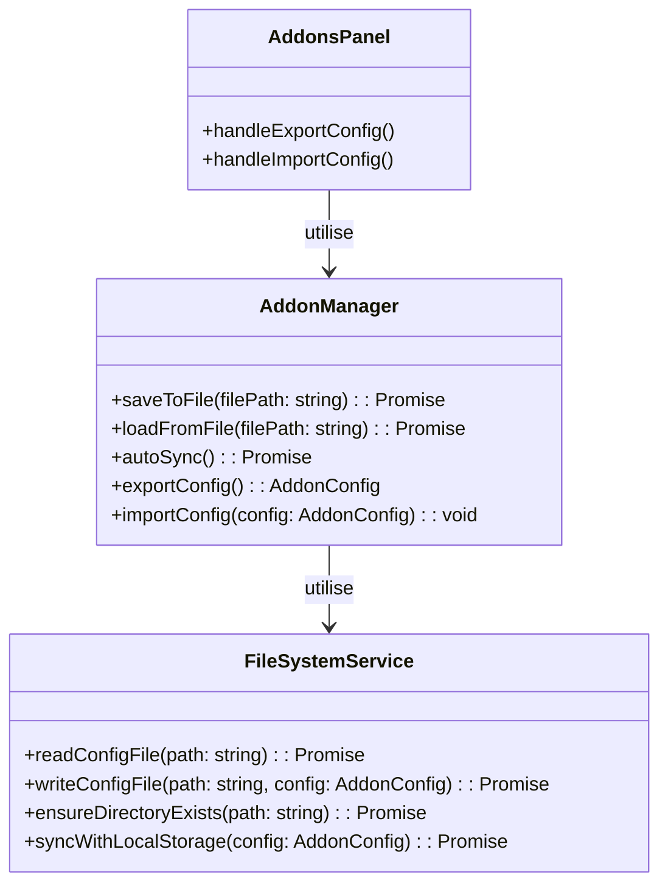
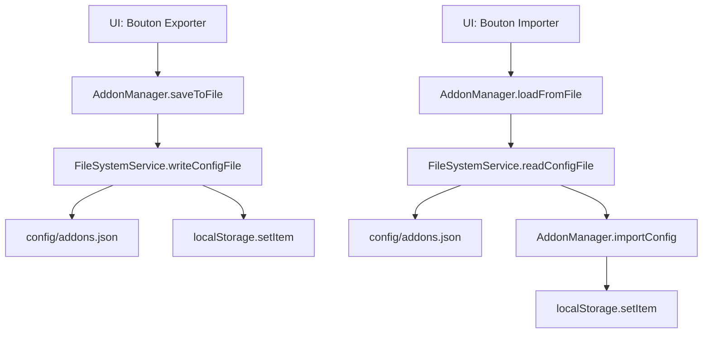

# Spécification Technique - Sauvegarde des Add-ons

## Vue d'Ensemble

Ce document fournit une spécification technique détaillée pour l'implémentation de la sauvegarde des paramètres et de l'état des add-ons dans un fichier JSON.

## Architecture du Système

### Composants Principaux



### Flux de Données



## Interfaces et Contrats

### 1. FileSystemService Interface

```typescript
interface FileSystemService {
    /**
     * Lit le fichier de configuration des add-ons
     * @param path Chemin du fichier
     * @returns Configuration des add-ons
     * @throws Error Si le fichier est introuvable ou invalide
     */
    readConfigFile(path: string): Promise<AddonConfig>;
    
    /**
     * Écrit la configuration des add-ons dans un fichier
     * @param path Chemin du fichier
     * @param config Configuration à sauvegarder
     * @throws Error Si l'écriture échoue
     */
    writeConfigFile(path: string, config: AddonConfig): Promise<void>;
    
    /**
     * S'assure que le répertoire existe
     * @param path Chemin du répertoire
     */
    ensureDirectoryExists(path: string): Promise<void>;
    
    /**
     * Synchronise la configuration avec localStorage
     * @param config Configuration à synchroniser
     */
    syncWithLocalStorage(config: AddonConfig): Promise<void>;
}
```

### 2. AddonManager Extensions

```typescript
class AddonManager {
    // ... méthodes existantes
    
    /**
     * Sauvegarde la configuration dans un fichier
     * @param filePath Chemin du fichier (par défaut: 'config/addons.json')
     */
    async saveToFile(filePath: string = 'config/addons.json'): Promise<void>;
    
    /**
     * Charge la configuration depuis un fichier
     * @param filePath Chemin du fichier (par défaut: 'config/addons.json')
     */
    async loadFromFile(filePath: string = 'config/addons.json'): Promise<void>;
    
    /**
     * Synchronisation automatique entre localStorage et fichier
     */
    async autoSync(): Promise<void>;
    
    /**
     * Exporte la configuration actuelle
     * @returns Configuration complète des add-ons
     */
    exportConfig(): AddonConfig;
    
    /**
     * Importe une configuration
     * @param config Configuration à importer
     */
    importConfig(config: AddonConfig): void;
}
```

### 3. AddonConfig Structure

```typescript
interface AddonConfig {
    [addonId: string]: {
        enabled: boolean;
        settings?: Record<string, any>;
    };
}
```

### 4. Fichier JSON Structure

```json
{
    "version": "1.0",
    "timestamp": "2026-01-25T09:44:03.526Z",
    "addons": {
        "casting": {
            "enabled": true,
            "settings": {
                "maxActorsPerScene": 5,
                "enableActorTemplates": true,
                "autoSaveCasting": true
            }
        },
        "audio-production": {
            "enabled": false,
            "settings": {
                "defaultSampleRate": 44100,
                "maxAudioTracks": 16,
                "enableAudioNormalization": true
            }
        }
    }
}
```

## Implémentation Détaillée

### 1. FileSystemService Implementation

```typescript
// creative-studio-ui/src/services/FileSystemService.ts

import { promises as fs } from 'fs';
import path from 'path';
import { AddonConfig } from './AddonManager';

export class FileSystemService {
    private static instance: FileSystemService;
    
    private constructor() {}
    
    static getInstance(): FileSystemService {
        if (!FileSystemService.instance) {
            FileSystemService.instance = new FileSystemService();
        }
        return FileSystemService.instance;
    }
    
    async readConfigFile(filePath: string): Promise<AddonConfig> {
        try {
            const data = await fs.readFile(filePath, 'utf-8');
            const parsed = JSON.parse(data);
            
            // Validation du format
            if (!parsed.addons || typeof parsed.addons !== 'object') {
                throw new Error('Invalid config format: missing addons');
            }
            
            return parsed.addons;
        } catch (error) {
            if (error.code === 'ENOENT') {
                // Fichier non trouvé, retourner une config vide
                return {};
            }
            throw error;
        }
    }
    
    async writeConfigFile(filePath: string, config: AddonConfig): Promise<void> {
        // S'assurer que le répertoire existe
        await this.ensureDirectoryExists(path.dirname(filePath));
        
        // Créer la structure complète
        const fullConfig = {
            version: '1.0',
            timestamp: new Date().toISOString(),
            addons: config
        };
        
        // Écrire le fichier
        await fs.writeFile(filePath, JSON.stringify(fullConfig, null, 2), 'utf-8');
    }
    
    async ensureDirectoryExists(dirPath: string): Promise<void> {
        try {
            await fs.access(dirPath);
        } catch {
            // Répertoire n'existe pas, le créer
            await fs.mkdir(dirPath, { recursive: true });
        }
    }
    
    async syncWithLocalStorage(config: AddonConfig): Promise<void> {
        try {
            localStorage.setItem('storycore_addon_config', JSON.stringify(config));
        } catch (error) {
            console.error('[FileSystemService] Failed to sync with localStorage:', error);
            throw error;
        }
    }
}

export const fileSystemService = FileSystemService.getInstance();
```

### 2. AddonManager Modifications

```typescript
// Dans creative-studio-ui/src/services/AddonManager.ts

// Ajouter l'import
import { fileSystemService } from './FileSystemService';

// Ajouter les méthodes suivantes à la classe AddonManager

/**
 * Sauvegarde la configuration dans un fichier
 */
async saveToFile(filePath: string = 'config/addons.json'): Promise<void> {
    try {
        // Exporter la configuration actuelle
        const config = this.exportConfig();
        
        // Sauvegarder dans le fichier
        await fileSystemService.writeConfigFile(filePath, config);
        
        // Synchroniser avec localStorage
        await fileSystemService.syncWithLocalStorage(config);
        
        console.log(`[AddonManager] Configuration saved to ${filePath}`);
    } catch (error) {
        console.error('[AddonManager] Failed to save config to file:', error);
        throw error;
    }
}

/**
 * Charge la configuration depuis un fichier
 */
async loadFromFile(filePath: string = 'config/addons.json'): Promise<void> {
    try {
        // Lire la configuration depuis le fichier
        const config = await fileSystemService.readConfigFile(filePath);
        
        // Importer la configuration
        this.importConfig(config);
        
        // Synchroniser avec localStorage
        await fileSystemService.syncWithLocalStorage(config);
        
        console.log(`[AddonManager] Configuration loaded from ${filePath}`);
    } catch (error) {
        console.error('[AddonManager] Failed to load config from file:', error);
        throw error;
    }
}

/**
 * Synchronisation automatique
 */
async autoSync(): Promise<void> {
    try {
        // Sauvegarder automatiquement dans le fichier
        await this.saveToFile();
    } catch (error) {
        console.warn('[AddonManager] Auto-sync failed:', error);
    }
}
```

### 3. Interface Utilisateur - AddonsPanel

```typescript
// Dans creative-studio-ui/src/components/settings/AddonsPanel.tsx

// Ajouter les imports
import { toast } from '@/components/ui/use-toast';

// Ajouter les handlers
const handleExportConfig = async () => {
    try {
        await addonManager.saveToFile();
        toast({
            title: 'Succès',
            description: 'Configuration sauvegardée avec succès',
            variant: 'default'
        });
    } catch (error) {
        toast({
            title: 'Erreur',
            description: `Échec de la sauvegarde: ${error.message}`,
            variant: 'destructive'
        });
    }
};

const handleImportConfig = async () => {
    try {
        await addonManager.loadFromFile();
        // Rafraîchir la liste des add-ons
        setAddons(addonManager.getAddons());
        
        toast({
            title: 'Succès',
            description: 'Configuration restaurée avec succès',
            variant: 'default'
        });
    } catch (error) {
        toast({
            title: 'Erreur',
            description: `Échec de la restauration: ${error.message}`,
            variant: 'destructive'
        });
    }
};

// Ajouter les boutons dans le JSX
<div className="flex gap-2 mb-4">
    <Button
        onClick={handleExportConfig}
        variant="outline"
        className="flex items-center gap-2"
    >
        <Save className="w-4 h-4" />
        Exporter Configuration
    </Button>
    <Button
        onClick={handleImportConfig}
        variant="outline"
        className="flex items-center gap-2"
    >
        <Upload className="w-4 h-4" />
        Importer Configuration
    </Button>
</div>
```

## Gestion des Erreurs

### Stratégie de Gestion des Erreurs

1. **Fichier introuvable** : Créer un fichier par défaut avec une configuration vide
2. **Format JSON invalide** : Valider et fournir un message d'erreur clair
3. **Permissions insuffisantes** : Gérer les erreurs d'accès au système de fichiers
4. **Conflits de synchronisation** : Priorité au fichier pour la synchronisation

### Code de Gestion des Erreurs

```typescript
// Dans FileSystemService.readConfigFile
try {
    const data = await fs.readFile(filePath, 'utf-8');
    const parsed = JSON.parse(data);
    
    if (!parsed.addons || typeof parsed.addons !== 'object') {
        throw new Error('Format de configuration invalide: addons manquant');
    }
    
    return parsed.addons;
} catch (error) {
    if (error.code === 'ENOENT') {
        console.warn(`[FileSystemService] Fichier non trouvé: ${filePath}`);
        return {}; // Retourner une configuration vide
    }
    
    if (error instanceof SyntaxError) {
        throw new Error(`Format JSON invalide dans ${filePath}: ${error.message}`);
    }
    
    throw error;
}
```

## Tests

### Tests Unitaires

```typescript
// FileSystemService.test.ts
describe('FileSystemService', () => {
    const testFile = 'test-config.json';
    const testConfig = {
        'test-addon': {
            enabled: true,
            settings: { key: 'value' }
        }
    };
    
    afterEach(async () => {
        try {
            await fs.unlink(testFile);
        } catch {}
    });
    
    it('should write and read config file', async () => {
        await fileSystemService.writeConfigFile(testFile, testConfig);
        const result = await fileSystemService.readConfigFile(testFile);
        expect(result).toEqual(testConfig);
    });
    
    it('should handle non-existent file', async () => {
        const result = await fileSystemService.readConfigFile('non-existent.json');
        expect(result).toEqual({});
    });
    
    it('should create directory if not exists', async () => {
        const nestedPath = 'nested/dir/config.json';
        await fileSystemService.writeConfigFile(nestedPath, testConfig);
        const result = await fileSystemService.readConfigFile(nestedPath);
        expect(result).toEqual(testConfig);
    });
});
```

### Tests d'Intégration

```typescript
// AddonManager.integration.test.ts
describe('AddonManager Integration', () => {
    const testFile = 'test-addons.json';
    
    afterEach(async () => {
        try {
            await fs.unlink(testFile);
        } catch {}
    });
    
    it('should save and load config from file', async () => {
        // Configurer un état initial
        await addonManager.initialize();
        await addonManager.activateAddon('casting');
        
        // Sauvegarder dans un fichier
        await addonManager.saveToFile(testFile);
        
        // Réinitialiser le manager
        addonManager = AddonManager.getInstance();
        await addonManager.initialize();
        
        // Charger depuis le fichier
        await addonManager.loadFromFile(testFile);
        
        // Vérifier que l'état est restauré
        const castingAddon = addonManager.getAddon('casting');
        expect(castingAddon?.enabled).toBe(true);
    });
});
```

## Documentation Utilisateur

### Guide d'Utilisation

1. **Exporter la Configuration**
   - Cliquez sur le bouton "Exporter Configuration"
   - La configuration est sauvegardée dans `config/addons.json`
   - Une notification de succès apparaît

2. **Importer la Configuration**
   - Cliquez sur le bouton "Importer Configuration"
   - La configuration est chargée depuis `config/addons.json`
   - Les add-ons sont activés/désactivés selon la configuration
   - Une notification de succès apparaît

3. **Synchronisation Automatique**
   - Toute modification est automatiquement synchronisée
   - Entre le fichier et localStorage
   - Pas d'action utilisateur requise

### Messages d'Erreur

- **Fichier introuvable** : "Aucune configuration existante trouvée. Une nouvelle configuration vide sera créée."
- **Format invalide** : "Le fichier de configuration est corrompu. Veuillez vérifier le format JSON."
- **Permissions** : "Impossible d'accéder au système de fichiers. Vérifiez les permissions."

## Déploiement

### Prérequis

- Node.js 16+ (pour les opérations sur le système de fichiers)
- Permissions d'écriture dans le répertoire `config/`

### Configuration

```json
{
    "addonConfig": {
        "filePath": "config/addons.json",
        "autoSync": true
    }
}
```

### Variables d'Environnement

```env
# Chemin personnalisé pour la configuration
ADDON_CONFIG_PATH=custom/path/addons.json

# Désactiver la synchronisation automatique
ADDON_AUTO_SYNC=false
```

## Maintenance

### Sauvegarde

- Sauvegarder régulièrement le fichier `config/addons.json`
- Inclure dans les sauvegardes du projet

### Mise à Jour

- Vérifier la compatibilité des versions
- Sauvegarder avant les mises à jour majeures
- Tester la restauration après les mises à jour

### Dépannage

1. **Problème** : La configuration ne se charge pas
   - **Solution** : Vérifier les permissions du fichier
   - **Solution** : Vérifier le format JSON

2. **Problème** : Les modifications ne sont pas sauvegardées
   - **Solution** : Vérifier l'espace disque
   - **Solution** : Vérifier les permissions

3. **Problème** : Conflits entre localStorage et fichier
   - **Solution** : Priorité au fichier, synchroniser manuellement
