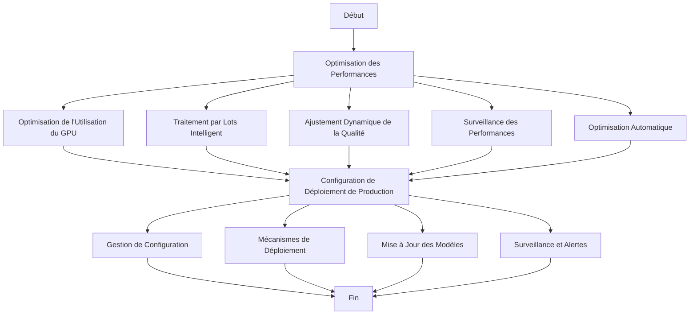
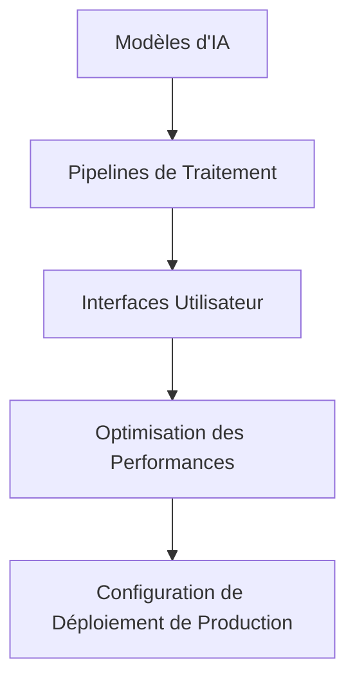

# Analyse des Exigences pour l'Optimisation des Performances et la Préparation à la Production

## Introduction
Ce document fournit une analyse détaillée des exigences pour l'optimisation des performances et la préparation à la production du système StoryCore Engine. L'analyse est basée sur les composants existants, les dépendances et les configurations nécessaires pour les tâches spécifiées.

## Composants Existants

### 1. Modèles d'IA
Les modèles d'IA sont au cœur du système et nécessitent une optimisation pour améliorer leurs performances. Les modèles identifiés incluent :
- Modèles de génération de texte
- Modèles de génération d'images
- Modèles de génération de vidéos
- Modèles de transfert de style
- Modèles de super-résolution

### 2. Pipelines de Traitement
Les pipelines de traitement orchestrent les différentes étapes de génération et de traitement des médias. Les pipelines identifiés incluent :
- Pipeline de traitement d'images
- Pipeline de traitement de vidéos
- Pipeline de traitement audio
- Pipeline d'amélioration de la qualité

### 3. Interfaces Utilisateur
Les interfaces utilisateur permettent aux utilisateurs d'interagir avec le système. Les interfaces identifiées incluent :
- Interface de contrôle des améliorations
- Interface de transfert de style
- Interface de gestion des couches
- Interface de visualisation

## Exigences pour l'Optimisation des Performances

### 1. Optimisation de l'Utilisation du GPU
- **Exigence** : Maximiser l'utilisation du GPU pour les tâches de traitement intensif.
- **Solution Proposée** : Implémenter un système de planification des tâches GPU pour optimiser l'utilisation des ressources.
- **Composants Concernés** : Modèles d'IA, pipelines de traitement.

### 2. Traitement par Lots Intelligent
- **Exigence** : Implémenter un système de traitement par lots pour améliorer l'efficacité.
- **Solution Proposée** : Utiliser des algorithmes de batching dynamique pour regrouper les tâches similaires.
- **Composants Concernés** : Pipelines de traitement.

### 3. Ajustement Dynamique de la Qualité
- **Exigence** : Ajuster dynamiquement la qualité de traitement en fonction des performances du système.
- **Solution Proposée** : Implémenter un système de feedback en temps réel pour ajuster les paramètres de qualité.
- **Composants Concernés** : Modèles d'IA, pipelines de traitement.

### 4. Surveillance des Performances
- **Exigence** : Surveiller les performances du système en temps réel.
- **Solution Proposée** : Implémenter un système de surveillance des performances avec des métriques clés.
- **Composants Concernés** : Tous les composants.

### 5. Optimisation Automatique
- **Exigence** : Optimiser automatiquement les performances en fonction des métriques collectées.
- **Solution Proposée** : Implémenter un système d'optimisation automatique basé sur des algorithmes d'apprentissage automatique.
- **Composants Concernés** : Tous les composants.

## Exigences pour la Configuration de Déploiement de Production

### 1. Gestion de Configuration
- **Exigence** : Gérer les configurations de manière centralisée et cohérente.
- **Solution Proposée** : Utiliser un système de gestion de configuration comme Ansible ou Terraform.
- **Composants Concernés** : Tous les composants.

### 2. Mécanismes de Déploiement
- **Exigence** : Implémenter des mécanismes de déploiement robustes et fiables.
- **Solution Proposée** : Utiliser des outils de déploiement continu comme Jenkins ou GitHub Actions.
- **Composants Concernés** : Tous les composants.

### 3. Mise à Jour des Modèles
- **Exigence** : Mettre à jour les modèles d'IA de manière transparente et sans interruption.
- **Solution Proposée** : Implémenter un système de mise à jour des modèles avec des mécanismes de rollback.
- **Composants Concernés** : Modèles d'IA.

### 4. Surveillance et Alertes
- **Exigence** : Surveiller les opérations d'IA et envoyer des alertes en cas de problèmes.
- **Solution Proposée** : Utiliser des outils de surveillance comme Prometheus et Grafana pour la surveillance et les alertes.
- **Composants Concernés** : Tous les composants.

## Feuille de Route pour la Mise en Œuvre

### Phase 1: Optimisation des Performances
1. **Optimisation de l'Utilisation du GPU**
   - Implémenter un système de planification des tâches GPU.
   - Tester et valider l'optimisation.

2. **Traitement par Lots Intelligent**
   - Implémenter des algorithmes de batching dynamique.
   - Tester et valider le traitement par lots.

3. **Ajustement Dynamique de la Qualité**
   - Implémenter un système de feedback en temps réel.
   - Tester et valider l'ajustement dynamique.

4. **Surveillance des Performances**
   - Implémenter un système de surveillance des performances.
   - Tester et valider la surveillance.

5. **Optimisation Automatique**
   - Implémenter un système d'optimisation automatique.
   - Tester et valider l'optimisation automatique.

### Phase 2: Configuration de Déploiement de Production
1. **Gestion de Configuration**
   - Configurer un système de gestion de configuration.
   - Tester et valider la gestion de configuration.

2. **Mécanismes de Déploiement**
   - Configurer des outils de déploiement continu.
   - Tester et valider les mécanismes de déploiement.

3. **Mise à Jour des Modèles**
   - Implémenter un système de mise à jour des modèles.
   - Tester et valider la mise à jour des modèles.

4. **Surveillance et Alertes**
   - Configurer des outils de surveillance et d'alertes.
   - Tester et valider la surveillance et les alertes.

## Diagrammes

### Diagramme de Flux de Travail

### Diagramme de Composants

## Conclusion
Cette analyse détaillée des exigences et cette feuille de route pour la mise en œuvre fournissent une base solide pour l'optimisation des performances et la préparation à la production du système StoryCore Engine. En suivant les étapes décrites, le système sera prêt pour un déploiement efficace et performant.