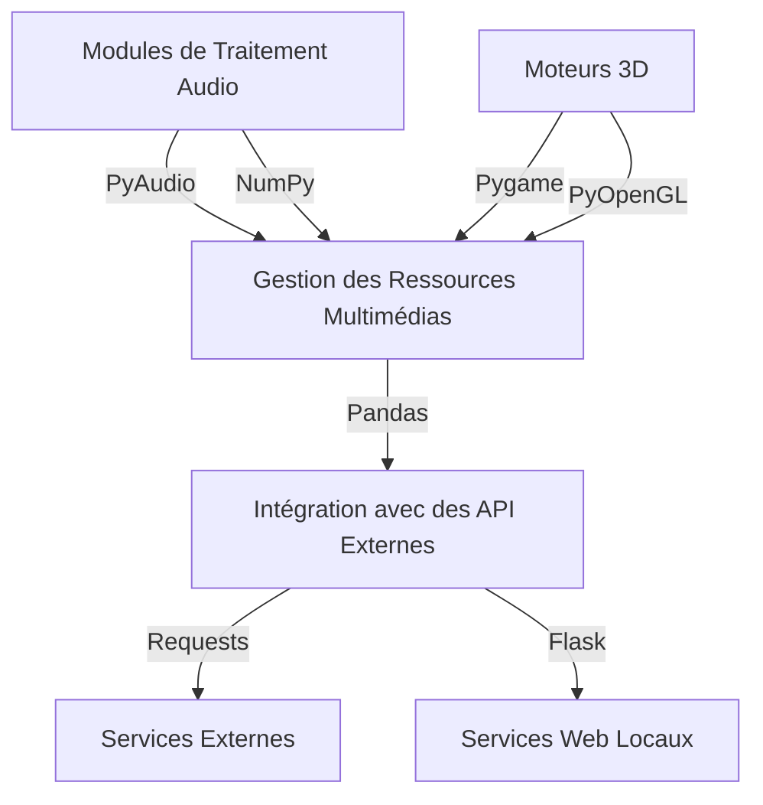

# Architecture Détaillée pour le Système Python

## Introduction
Ce document décrit l'architecture détaillée pour la migration du système Java vers Python, en mettant l'accent sur les composants audio et 3D, ainsi que sur les dépendances nécessaires.

## Composants Clés

### 1. Modules de Traitement Audio
- **Bibliothèques Requises** : PyAudio, NumPy
- **Fonctionnalités** :
  - Lecture et écriture de fichiers audio
  - Traitement en temps réel des signaux audio
  - Synthèse sonore

### 2. Moteurs 3D
- **Bibliothèques Requises** : Pygame, OpenGL (via PyOpenGL)
- **Fonctionnalités** :
  - Rendu graphique 3D
  - Gestion des textures et des modèles 3D
  - Animation et interaction en temps réel

### 3. Gestion des Ressources Multimédias
- **Bibliothèques Requises** : Pandas, PIL (pour les images)
- **Fonctionnalités** :
  - Gestion centralisée des ressources audio et vidéo
  - Conversion et optimisation des fichiers multimédias
  - Intégration avec des API externes pour le stockage et la récupération

### 4. Intégration avec des API Externes
- **Bibliothèques Requises** : Requests, Flask (pour les services web)
- **Fonctionnalités** :
  - Communication avec des services externes pour le traitement des données
  - Gestion des authentifications et des autorisations
  - Synchronisation des données entre le système local et les services cloud

## Diagramme d'Architecture

## Étapes de Migration

1. **Analyse des Composants Java Existants**
   - Identifier les modules Java spécifiques à migrer.
   - Documenter les fonctionnalités actuelles et les dépendances.

2. **Sélection des Bibliothèques Python**
   - Choisir les bibliothèques Python appropriées pour remplacer les fonctionnalités Java.
   - Tester les bibliothèques sélectionnées pour s'assurer de leur compatibilité.

3. **Développement des Modules Python**
   - Implémenter les modules de traitement audio en utilisant PyAudio et NumPy.
   - Développer les moteurs 3D avec Pygame et PyOpenGL.
   - Créer un système de gestion des ressources multimédias avec Pandas et PIL.

4. **Intégration des API Externes**
   - Configurer les communications avec les services externes en utilisant Requests.
   - Développer des services web locaux avec Flask pour faciliter l'intégration.

5. **Tests et Validation**
   - Effectuer des tests unitaires et d'intégration pour chaque module.
   - Valider la compatibilité et la performance des nouveaux modules Python.

## Conclusion
Cette architecture détaillée fournit une feuille de route claire pour la migration du système Java vers Python, en mettant l'accent sur les composants audio et 3D, ainsi que sur les dépendances nécessaires pour assurer une transition fluide et efficace.