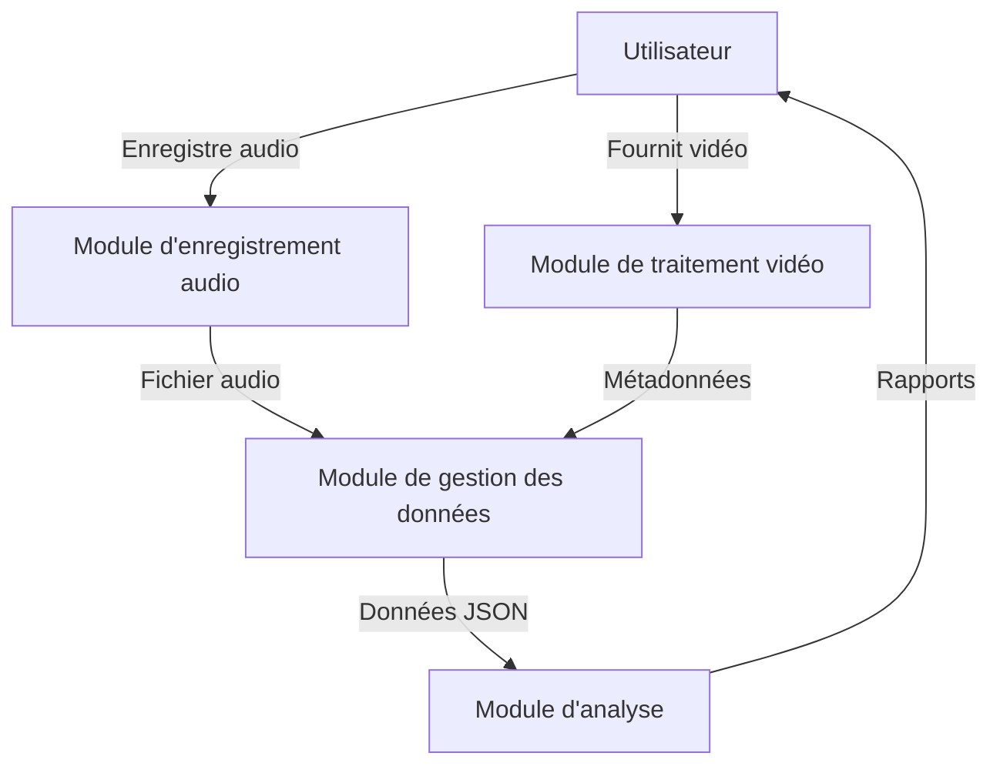
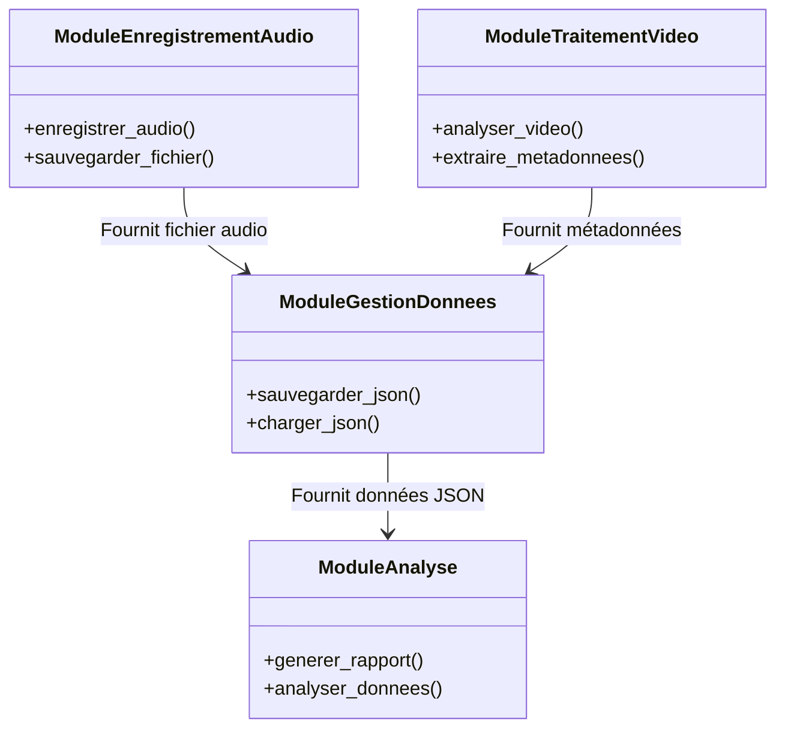

# Architecture détaillée du système Python

## Introduction
Ce document décrit l'architecture détaillée d'un système Python pour le traitement de données vidéo et audio, incluant l'enregistrement audio via microphone et la sauvegarde des données au format JSON.

## Besoins identifiés
- Traitement de données vidéo et audio.
- Enregistrement audio via microphone.
- Sauvegarde des données au format JSON.

## Dépendances Python nécessaires
- **OpenCV** : Pour le traitement vidéo.
- **PyAudio** : Pour l'enregistrement audio.
- **json** : Pour la gestion des données JSON (module standard).
- **MediaInfo** : Pour l'analyse des métadonnées.

## Architecture du système

### Composants principaux

1. **Module d'enregistrement audio**
   - **Fonction** : Gère l'enregistrement audio via microphone.
   - **Dépendances** : PyAudio.
   - **Sortie** : Fichier audio temporaire.

2. **Module de traitement vidéo**
   - **Fonction** : Analyse les métadonnées vidéo et extrait les informations.
   - **Dépendances** : OpenCV, MediaInfo.
   - **Sortie** : Métadonnées extraites.

3. **Module de gestion des données**
   - **Fonction** : Sauvegarde et charge les données au format JSON.
   - **Dépendances** : json.
   - **Sortie** : Fichiers JSON contenant les données traitées.

4. **Module d'analyse**
   - **Fonction** : Traite les données et génère des rapports.
   - **Dépendances** : Aucun (utilise les données des autres modules).
   - **Sortie** : Rapports d'analyse.

### Diagrammes Mermaid

#### Diagramme de flux des données

#### Diagramme de classes

## Spécification technique complète

### Module d'enregistrement audio
- **Entrée** : Signal audio du microphone.
- **Traitement** : Enregistrement et sauvegarde temporaire.
- **Sortie** : Fichier audio au format WAV.

### Module de traitement vidéo
- **Entrée** : Fichier vidéo.
- **Traitement** : Extraction des métadonnées (durée, format, etc.).
- **Sortie** : Métadonnées au format JSON.

### Module de gestion des données
- **Entrée** : Données des autres modules.
- **Traitement** : Conversion et sauvegarde au format JSON.
- **Sortie** : Fichier JSON contenant les données traitées.

### Module d'analyse
- **Entrée** : Données JSON.
- **Traitement** : Analyse et génération de rapports.
- **Sortie** : Rapports au format texte ou JSON.

## Conclusion
Cette architecture permet une modularité et une extensibilité pour ajouter de nouvelles fonctionnalités à l'avenir. Les diagrammes Mermaid illustrent les interactions entre les composants et facilitent la compréhension du système.