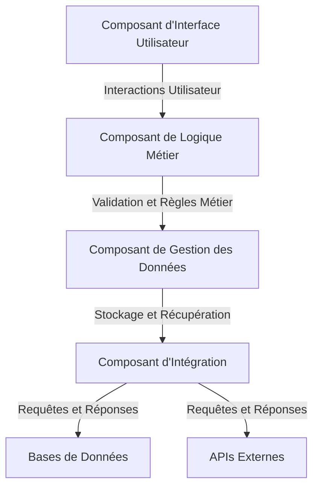

# Architecture Technique de l'Éditeur de Timeline

## Composants Principaux

### 1. Composant de Gestion des Données
**Responsabilités** :
- Gestion des événements temporels, des médias et des annotations.
- Interaction avec les bases de données pour le stockage et la récupération des données.
- Synchronisation des données avec les APIs externes.

### 2. Composant d'Interface Utilisateur
**Responsabilités** :
- Affichage de la timeline et des événements.
- Gestion des interactions utilisateur (glisser-déposer, visualisation interactive).
- Communication avec le composant de logique métier pour les mises à jour.

### 3. Composant de Logique Métier
**Responsabilités** :
- Validation des événements et gestion des conflits de temps.
- Application des règles métier pour la synchronisation des données.
- Coordination entre les composants de gestion des données et d'interface utilisateur.

### 4. Composant d'Intégration
**Responsabilités** :
- Gestion des requêtes et réponses avec les bases de données et les APIs externes.
- Transformation des données pour assurer la compatibilité.
- Gestion des erreurs et des reconnexions.

## Diagramme d'Architecture

## Interactions entre les Composants

1. **Interface Utilisateur → Logique Métier** : L'interface utilisateur envoie les actions de l'utilisateur (ajout, modification, suppression d'événements) à la logique métier pour validation.

2. **Logique Métier → Gestion des Données** : La logique métier valide les événements et envoie les données à gérer au composant de gestion des données.

3. **Gestion des Données → Intégration** : Le composant de gestion des données interagit avec le composant d'intégration pour stocker ou récupérer des données depuis les bases de données ou les APIs externes.

4. **Intégration → Bases de Données/APIs Externes** : Le composant d'intégration gère les requêtes et les réponses avec les bases de données et les APIs externes, assurant la transformation et la compatibilité des données.

## Prochaines Étapes

- Définir les fonctionnalités clés à implémenter.
- Proposer une feuille de route pour le développement.