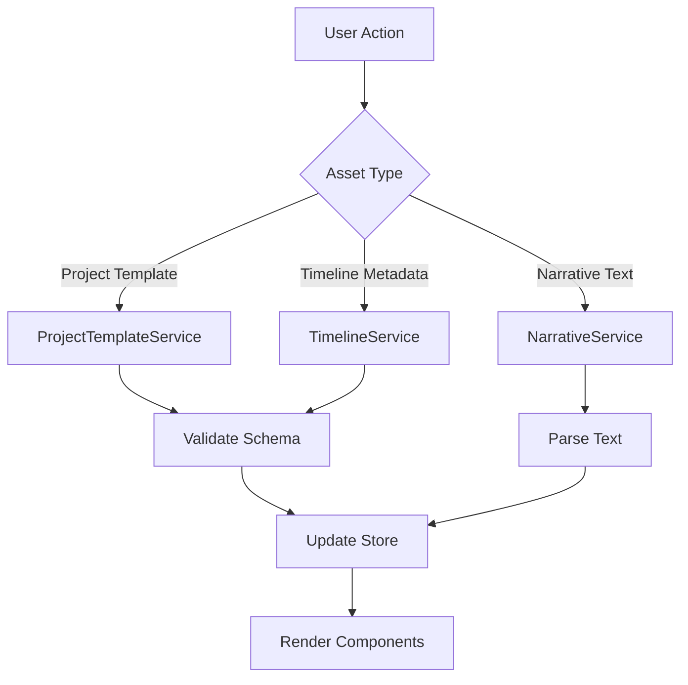

# Asset Integration Plan for Creative Studio UI

## Overview
This plan outlines the integration of narrative text files, project templates, and video timeline metadata into the creative-studio-ui. The integration will enable users to load, display, and edit these assets through dedicated UI components, leveraging the existing React-based architecture.

## Asset Types
1. **Project Templates** (`data/project.json`): JSON structures containing project metadata, format specifications, genres, narrative outlines, and character information.
2. **Video Timeline Metadata** (`data/video_timeline_metadata.json`): Detailed scene-by-scene metadata including timing, audio/video elements, character actions, camera movements, dialogue, effects, and transitions.
3. **Narrative Text Files**: Plain text files containing detailed story content (plot outlines, character descriptions, dialogue scripts). These files are referenced in the project templates and may be stored in `data/` or `assets/` directories.

## Component Architecture

### Core Architecture Principles
- **Modular Components**: Each asset type gets dedicated components for loading, viewing, and editing.
- **Service Layer**: Backend services handle data loading, validation, and persistence.
- **State Management**: Use existing store system (Zustand/Hooks) for asset state.
- **Type Safety**: Define TypeScript interfaces for all asset data structures.

### Component Hierarchy
```
src/components/
├── asset-integration/
│   ├── AssetLoader.tsx (Central loading component)
│   ├── ProjectTemplate/
│   │   ├── TemplateSelector.tsx
│   │   ├── TemplateEditor.tsx
│   │   └── TemplatePreview.tsx
│   ├── NarrativeEditor/
│   │   ├── NarrativeForm.tsx
│   │   ├── ActEditor.tsx
│   │   └── CharacterEditor.tsx
│   └── TimelineEditor/
│       ├── TimelineViewer.tsx
│       ├── SceneEditor.tsx
│       ├── TimelineCanvas.tsx
│       └── TimelineControls.tsx
```

## Data Flow Patterns

### Loading Assets
1. **File Selection**: User selects asset files via file picker or library browser.
2. **Validation**: Assets are validated against schemas before loading.
3. **Parsing**: JSON assets parsed, text files read as strings.
4. **State Update**: Parsed data stored in relevant stores.
5. **UI Update**: Components re-render with loaded data.

### Saving Assets
1. **Change Detection**: Use hooks to track dirty state.
2. **Validation**: Validate data before save.
3. **Serialization**: Convert state to JSON/text format.
4. **File Write**: Save to filesystem via Electron API.
5. **Notification**: Show success/error feedback.

### Data Flow Diagram


## UI Components Needed

### 1. Project Template Components
- **TemplateSelector**: Dropdown/list to choose from available templates.
- **TemplateEditor**: Form-based editor for project metadata (format, genres, budget, etc.).
- **TemplatePreview**: Read-only display of template structure.

### 2. Narrative Editor Components
- **NarrativeForm**: Rich text editor for plot outlines, loglines, themes.
- **ActEditor**: Visual editor for 3-act structure with duration estimates.
- **CharacterEditor**: Character creation/management interface.

### 3. Timeline Editor Components
- **TimelineViewer**: Horizontal timeline with scene blocks and timing markers.
- **SceneEditor**: Detailed scene editing panel (elements, characters, camera).
- **TimelineCanvas**: Interactive canvas for drag/drop editing.
- **TimelineControls**: Play/pause, zoom, export controls.

## Step-by-Step Integration Approach

### Phase 1: Foundation (Types & Services)
1. Define TypeScript interfaces in `src/types/asset-integration.ts`
2. Create asset services in `src/services/asset-integration/`
   - `ProjectTemplateService.ts`
   - `NarrativeService.ts`
   - `TimelineService.ts`
3. Add validation schemas using Zod or similar

### Phase 2: Core Components
1. Implement AssetLoader component
2. Build ProjectTemplate components
3. Build NarrativeEditor components
4. Build TimelineEditor components

### Phase 3: Integration
1. Integrate into EditorPage via routing/tabs
2. Add menu items for asset operations
3. Connect to existing panels (AudioPanel, EffectsPanel)

### Phase 4: Advanced Features
1. Real-time collaboration
2. Version control integration
3. Export/import functionality
4. Asset library management

## Technical Considerations

### State Management
- Use existing `useAppStore` for global asset state
- Custom hooks for asset-specific operations (`useProjectTemplate`, `useTimeline`)
- Optimistic updates for better UX

### Performance
- Lazy loading for large timeline data
- Virtualization for timeline canvas
- Memoization for expensive computations

### Error Handling
- Graceful degradation for missing assets
- User-friendly error messages
- Automatic recovery where possible

### Accessibility
- Keyboard navigation for timeline
- Screen reader support for metadata
- High contrast mode support

## Dependencies
- Existing: React, TypeScript, Tailwind CSS
- New: React Flow (for timeline canvas), Draft.js (for rich text), Zod (validation)

## Testing Strategy
- Unit tests for services and utilities
- Integration tests for component interactions
- E2E tests for complete workflows

## Migration Path
- Maintain backward compatibility with existing projects
- Gradual rollout starting with read-only features
- User feedback collection before full deployment