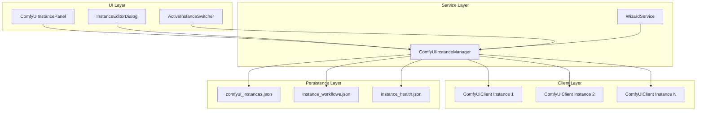
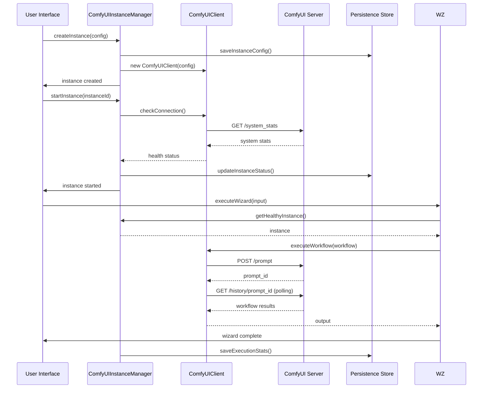

# ComfyUI Multi-Instance Support Architecture Design

## Overview

This document outlines the architecture for adding multi-instance support to ComfyUI integration, replacing the current singleton pattern with a comprehensive instance management system.

## Current Architecture Analysis

### Existing Components
- **ComfyUIClient**: Singleton-based client with hardcoded localhost:8188 endpoint
- **WizardService**: Uses singleton or accepts custom client instances
- **ComfyUIConfigurationWindow**: Single-instance configuration UI
- **Configuration Types**: Single ComfyUIConfiguration interface

### Limitations
- Single endpoint support only
- No resource isolation between workflows
- No load balancing or health monitoring
- Manual endpoint management
- No persistence of instance configurations

## Proposed Architecture

### Backend Architecture

#### ComfyUIInstanceManager Class

**Core Responsibilities:**
- Manage multiple ComfyUIClient instances
- Handle instance lifecycle (create, start, pause, resume, stop, delete)
- Provide load balancing across healthy instances
- Monitor instance health and performance
- Persist instance configurations and state

**Key Methods:**
```typescript
class ComfyUIInstanceManager {
  // Instance Management
  createInstance(config: ComfyUIInstanceConfig): Promise<ComfyUIInstance>
  getInstance(instanceId: string): ComfyUIInstance | null
  listInstances(): ComfyUIInstance[]
  updateInstance(instanceId: string, config: Partial<ComfyUIInstanceConfig>): Promise<void>
  deleteInstance(instanceId: string): Promise<void>

  // Lifecycle Management
  startInstance(instanceId: string): Promise<void>
  stopInstance(instanceId: string): Promise<void>
  pauseInstance(instanceId: string): Promise<void>
  resumeInstance(instanceId: string): Promise<void>

  // Load Balancing
  getHealthyInstance(): ComfyUIInstance | null
  getInstancesByLoad(): ComfyUIInstance[]
  executeOnInstance<T>(instanceId: string, operation: (client: ComfyUIClient) => Promise<T>): Promise<T>

  // Health Monitoring
  checkInstanceHealth(instanceId: string): Promise<InstanceHealth>
  getInstanceStats(instanceId: string): InstanceStats

  // Persistence
  saveInstances(): Promise<void>
  loadInstances(): Promise<void>
  exportInstances(): string
  importInstances(data: string): Promise<void>
}
```

#### ComfyUIInstance Interface

```typescript
interface ComfyUIInstance {
  id: string;
  name: string;
  config: ComfyUIInstanceConfig;
  status: InstanceStatus;
  client: ComfyUIClient;
  health: InstanceHealth;
  stats: InstanceStats;
  createdAt: Date;
  lastUsedAt: Date;
}
```

#### ComfyUIInstanceConfig Interface

```typescript
interface ComfyUIInstanceConfig {
  id: string;
  name: string;
  port: number;
  host?: string; // default: localhost
  gpuDevice?: string; // GPU device ID or 'auto'
  envVars?: Record<string, string>; // Environment variables
  customNodesPath?: string; // Custom nodes directory
  maxConcurrentWorkflows?: number; // default: 1
  timeoutMs?: number; // default: 300000
  enableQueueMonitoring?: boolean; // default: true
  autoStart?: boolean; // default: false
  description?: string;
}
```

#### Instance Status and Health Types

```typescript
type InstanceStatus = 'stopped' | 'starting' | 'running' | 'paused' | 'stopping' | 'error';

interface InstanceHealth {
  status: 'healthy' | 'degraded' | 'unhealthy';
  lastChecked: Date;
  responseTime: number;
  errorCount: number;
  consecutiveFailures: number;
  systemStats?: {
    cpuUsage: number;
    memoryUsage: number;
    gpuUsage?: number;
    activeWorkflows: number;
  };
}

interface InstanceStats {
  totalWorkflows: number;
  successfulWorkflows: number;
  failedWorkflows: number;
  averageResponseTime: number;
  uptime: number;
  lastError?: string;
}
```

### UI Architecture

#### Main Instance Overview Panel

**Location:** New tab/panel in main application window

**Features:**
- Grid/list view of all instances with status indicators
- Real-time health monitoring
- Quick actions (start/stop/pause/resume/delete)
- Instance metrics (active workflows, load, uptime)
- Search and filtering capabilities

**Component Structure:**
```
ComfyUIInstancePanel
├── InstanceListHeader (search, filters, add button)
├── InstanceGrid
│   ├── InstanceCard (for each instance)
│   │   ├── StatusIndicator
│   │   ├── InstanceInfo (name, port, GPU)
│   │   ├── HealthMetrics
│   │   ├── QuickActions (start/stop/delete)
│   │   └── ContextMenu
└── InstanceDetails (selected instance details)
```

#### Instance Editor Dialog

**Triggers:** Add new instance, edit existing instance

**Sections:**
1. **Basic Settings**
   - Name (required)
   - Description (optional)
   - Port (required, auto-suggest available ports)
   - Host (optional, default localhost)

2. **Resource Configuration**
   - GPU Device selection (dropdown with available GPUs)
   - Environment Variables (key-value editor)
   - Custom Nodes Path (file picker)
   - Max Concurrent Workflows (number input)

3. **Runtime Settings**
   - Timeout (ms)
   - Enable Queue Monitoring (checkbox)
   - Auto-start on application launch (checkbox)

4. **Validation & Testing**
   - Test Connection button
   - Configuration validation feedback
   - Port availability check

#### Active Instance Switcher

**Location:** Top toolbar or sidebar

**Features:**
- Dropdown showing all running instances
- Current active instance indicator
- Quick switch between instances
- Instance status in dropdown (healthy/degraded/unhealthy)
- Keyboard shortcut support (Ctrl/Cmd + number keys)

**Integration Points:**
- Workflow editor uses selected active instance
- Wizard operations target active instance
- Status updates in real-time

### Persistence Architecture

#### Configuration File: `comfyui_instances.json`

**Location:** `%APPDATA%/storycore-engine/comfyui_instances.json` (Windows)
           `~/Library/Application Support/storycore-engine/comfyui_instances.json` (macOS)
           `~/.config/storycore-engine/comfyui_instances.json` (Linux)

**Structure:**
```json
{
  "version": "1.0",
  "instances": [
    {
      "id": "instance_001",
      "name": "Primary GPU Instance",
      "port": 8188,
      "gpuDevice": "cuda:0",
      "envVars": {
        "CUDA_VISIBLE_DEVICES": "0",
        "COMFYUI_CUSTOM_NODES": "/path/to/custom/nodes"
      },
      "customNodesPath": "/path/to/custom/nodes",
      "maxConcurrentWorkflows": 2,
      "timeoutMs": 300000,
      "enableQueueMonitoring": true,
      "autoStart": true,
      "description": "Main instance for character generation"
    }
  ],
  "activeInstanceId": "instance_001",
  "lastSaved": "2024-01-17T16:00:00Z"
}
```

#### Instance State Persistence

**Workflow State File:** `instance_{id}_workflows.json`
- Saved workflows per instance
- Execution history with timestamps
- Paused workflow resumption data

**Health History:** `instance_{id}_health.json`
- Health check history
- Performance metrics over time
- Error logs and patterns

#### Backward Compatibility

**Migration Process:**
1. Detect existing single-instance config in project settings
2. Create default instance with existing configuration
3. Update project references to use instance ID
4. Save migrated configuration
5. Mark migration as complete

**Migration Types:**
```typescript
interface MigrationResult {
  migrated: boolean;
  fromVersion?: string;
  toVersion: string;
  instancesCreated: number;
  errors: string[];
}
```

### Integration Points

#### Modified Components

1. **WizardService**
   - Accept `instanceId` parameter for operations
   - Use ComfyUIInstanceManager instead of singleton
   - Fallback to default instance if none specified

2. **ComfyUIClient**
   - Accept `ComfyUIInstanceConfig` instead of endpoint string
   - Support GPU device specification
   - Environment variable handling

3. **Configuration System**
   - Update `ComfyUIConfiguration` to reference instance IDs
   - Maintain backward compatibility with single-instance configs

4. **Project Settings**
   - Instance selection per project
   - Default instance configuration
   - Instance-specific workflow templates

#### API Compatibility

**Existing API Surface Maintained:**
- `getComfyUIClient()` returns client for active instance
- `createComfyUIClient(endpoint)` creates temporary client
- All existing WizardService methods work unchanged (use active instance)

**New APIs:**
- `getComfyUIInstanceManager()` - Access instance manager
- `setActiveInstance(instanceId)` - Switch active instance
- `getActiveInstance()` - Get current active instance

### Component Diagrams

#### Backend Architecture Diagram



#### Data Flow Diagram



### Error Handling & Health Monitoring

#### Error Categories

1. **Instance Errors**
   - Connection failures
   - Port conflicts
   - GPU unavailability
   - Resource exhaustion

2. **Workflow Errors**
   - Timeout errors
   - Node execution failures
   - Invalid workflow configurations

3. **Persistence Errors**
   - Configuration file corruption
   - Insufficient disk space
   - Permission issues

#### Health Monitoring

**Health Checks:**
- HTTP endpoint availability (`/system_stats`)
- Response time measurement
- System resource monitoring
- GPU memory usage
- Active workflow count

**Monitoring Intervals:**
- Health checks: every 30 seconds for running instances
- Resource monitoring: every 5 seconds
- Error rate tracking: continuous

**Alerting:**
- Instance becomes unhealthy
- High error rate (>5 errors/minute)
- Resource usage >90%
- Connection timeout >30 seconds

#### Recovery Strategies

**Automatic Recovery:**
- Restart unhealthy instances
- Switch to healthy instances for load balancing
- Clear stalled workflows

**User-Initiated Recovery:**
- Manual instance restart
- Configuration reset
- Log export for debugging

### Implementation Plan

#### Phase 1: Core Infrastructure
1. Create `ComfyUIInstanceManager` class
2. Define new type interfaces
3. Implement persistence layer
4. Basic instance CRUD operations

#### Phase 2: UI Components
1. Instance overview panel
2. Instance editor dialog
3. Active instance switcher
4. Health monitoring display

#### Phase 3: Integration
1. Update WizardService
2. Modify ComfyUIClient
3. Update configuration system
4. Backward compatibility migration

#### Phase 4: Advanced Features
1. Load balancing algorithms
2. Performance monitoring
3. Auto-scaling capabilities
4. Advanced error recovery

### Files to Create/Modify

#### New Files:
- `src/services/wizard/ComfyUIInstanceManager.ts`
- `src/services/wizard/ComfyUIInstance.ts`
- `src/components/comfyui/ComfyUIInstancePanel.tsx`
- `src/components/comfyui/InstanceEditorDialog.tsx`
- `src/components/comfyui/ActiveInstanceSwitcher.tsx`
- `src/components/comfyui/InstanceCard.tsx`
- `src/components/comfyui/InstanceHealthIndicator.tsx`
- `src/types/comfyui-instance.ts`
- `src/services/persistence/ComfyUIInstanceStore.ts`

#### Modified Files:
- `src/services/wizard/ComfyUIClient.ts`
- `src/services/wizard/WizardService.ts`
- `src/services/wizard/types.ts`
- `src/types/configuration.ts`
- `src/components/configuration/ComfyUIConfigurationWindow.tsx`
- `src/hooks/useConfigurationHooks.ts`
- `src/stores/useAppStore.ts` (add instance state)

#### Configuration Files:
- `comfyui_instances.json` (new config file)
- Update existing project configuration schemas

### Testing Strategy

#### Unit Tests:
- Instance manager operations
- Health monitoring logic
- Persistence layer
- Configuration validation

#### Integration Tests:
- Full instance lifecycle
- UI component interactions
- Wizard service integration
- Backward compatibility

#### End-to-End Tests:
- Multi-instance workflow execution
- Load balancing scenarios
- Failure recovery
- UI workflow management

### Performance Considerations

#### Resource Management:
- Instance pooling to limit memory usage
- GPU memory monitoring and allocation
- Connection pooling for API calls

#### Monitoring Overhead:
- Asynchronous health checks
- Batched metric collection
- Configurable monitoring intervals

#### Scalability:
- Support for 10+ concurrent instances
- Efficient instance switching
- Memory usage optimization

### Security Considerations

#### Access Control:
- Instance isolation per user/project
- Environment variable sanitization
- Path traversal prevention

#### Network Security:
- Endpoint validation
- API key handling
- Secure configuration storage

This architecture provides a comprehensive foundation for multi-instance ComfyUI support while maintaining backward compatibility and enabling future enhancements.