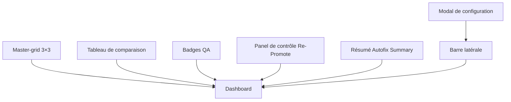

# Structure du Dashboard

## Vue d'ensemble
Le dashboard sera composé des éléments suivants :
1. **Master-grid 3×3 (Visual DNA)** : Un composant visuel pour représenter l'ADN du projet.
2. **Tableau de comparaison des panels (Before/After)** : Un tableau statique pour comparer les états avant et après.
3. **Badges QA** : Des badges générés dynamiquement pour afficher les états OK, Warning, Fail, et Auto-Fixed.
4. **Panel de contrôle "Re-Promote"** : Un panel avec des sliders pour ajuster les paramètres et un bouton pour déclencher l'action.
5. **Résumé "Autofix Summary"** : Un résumé généré dynamiquement à partir du fichier `qa_report.json`.
6. **Barre latérale avec état du backend et modal de configuration** : Une barre latérale pour afficher l'état du backend et un modal pour ajuster les paramètres du système.

## Schéma des Composants



## Structure des Fichiers

### Composants React
- `MasterGrid.tsx` : Composant pour le Master-grid 3×3.
- `ComparisonTable.tsx` : Composant pour le tableau de comparaison.
- `QABadges.tsx` : Composant pour les badges QA.
- `RePromotePanel.tsx` : Composant pour le panel de contrôle "Re-Promote".
- `AutofixSummary.tsx` : Composant pour le résumé "Autofix Summary".
- `Sidebar.tsx` : Composant pour la barre latérale.
- `ConfigModal.tsx` : Composant pour le modal de configuration.

### Fichiers de Données
- `qa_report.json` : Fichier JSON pour les données du résumé "Autofix Summary".

### Fichiers de Style
- `Dashboard.css` : Fichier CSS pour les styles spécifiques au dashboard.

## Implémentation

### MasterGrid.tsx
```tsx
import React from 'react';

const MasterGrid = () => {
    return (
        <div className="grid grid-cols-3 gap-4 p-4 bg-gray-100 rounded-lg">
            {Array.from({ length: 9 }).map((_, index) => (
                <div key={index} className="bg-white p-4 rounded shadow">
                    Visual DNA Cell {index + 1}
                </div>
            ))}
        </div>
    );
};

export default MasterGrid;
```

### ComparisonTable.tsx
```tsx
import React from 'react';

const ComparisonTable = () => {
    const data = [
        { id: 1, before: 'State A', after: 'State B' },
        { id: 2, before: 'State C', after: 'State D' },
    ];

    return (
        <div className="overflow-x-auto">
            <table className="min-w-full bg-white border border-gray-200">
                <thead>
                    <tr>
                        <th className="py-2 px-4 border-b">ID</th>
                        <th className="py-2 px-4 border-b">Before</th>
                        <th className="py-2 px-4 border-b">After</th>
                    </tr>
                </thead>
                <tbody>
                    {data.map((item) => (
                        <tr key={item.id}>
                            <td className="py-2 px-4 border-b">{item.id}</td>
                            <td className="py-2 px-4 border-b">{item.before}</td>
                            <td className="py-2 px-4 border-b">{item.after}</td>
                        </tr>
                    ))}
                </tbody>
            </table>
        </div>
    );
};

export default ComparisonTable;
```

### QABadges.tsx
```tsx
import React from 'react';

const QABadges = ({ status }: { status: 'OK' | 'Warning' | 'Fail' | 'Auto-Fixed' }) => {
    const badgeClasses = {
        OK: 'bg-green-500 text-white',
        Warning: 'bg-yellow-500 text-black',
        Fail: 'bg-red-500 text-white',
        'Auto-Fixed': 'bg-blue-500 text-white',
    };

    return (
        <span className={`inline-block px-3 py-1 rounded-full text-sm font-semibold ${badgeClasses[status]}`}>
            {status}
        </span>
    );
};

export default QABadges;
```

### RePromotePanel.tsx
```tsx
import React, { useState } from 'react';

const RePromotePanel = () => {
    const [sliderValue, setSliderValue] = useState(50);

    const handleSliderChange = (e: React.ChangeEvent<HTMLInputElement>) => {
        setSliderValue(parseInt(e.target.value));
    };

    const handlePromote = () => {
        alert(`Re-Promote avec une valeur de ${sliderValue}`);
    };

    return (
        <div className="p-4 bg-gray-100 rounded-lg">
            <h2 className="text-lg font-semibold mb-4">Re-Promote Panel</h2>
            <div className="mb-4">
                <label className="block text-sm font-medium text-gray-700 mb-2">
                    Ajuster les paramètres
                </label>
                <input
                    type="range"
                    min="0"
                    max="100"
                    value={sliderValue}
                    onChange={handleSliderChange}
                    className="w-full"
                />
                <span className="text-sm text-gray-600">Valeur : {sliderValue}</span>
            </div>
            <button
                onClick={handlePromote}
                className="bg-blue-500 text-white px-4 py-2 rounded hover:bg-blue-600"
            >
                Re-Promote
            </button>
        </div>
    );
};

export default RePromotePanel;
```

### AutofixSummary.tsx
```tsx
import React, { useEffect, useState } from 'react';

interface QAReport {
    totalChecks: number;
    passed: number;
    warnings: number;
    failures: number;
    autoFixed: number;
}

const AutofixSummary = () => {
    const [report, setReport] = useState<QAReport | null>(null);

    useEffect(() => {
        // Charger le rapport QA depuis le fichier JSON
        fetch('/qa_report.json')
            .then((response) => response.json())
            .then((data) => setReport(data));
    }, []);

    if (!report) {
        return <div>Chargement du rapport...</div>;
    }

    return (
        <div className="p-4 bg-gray-100 rounded-lg">
            <h2 className="text-lg font-semibold mb-4">Autofix Summary</h2>
            <div className="grid grid-cols-2 gap-4">
                <div>
                    <p className="text-sm text-gray-600">Total Checks</p>
                    <p className="text-lg font-semibold">{report.totalChecks}</p>
                </div>
                <div>
                    <p className="text-sm text-gray-600">Passed</p>
                    <p className="text-lg font-semibold text-green-500">{report.passed}</p>
                </div>
                <div>
                    <p className="text-sm text-gray-600">Warnings</p>
                    <p className="text-lg font-semibold text-yellow-500">{report.warnings}</p>
                </div>
                <div>
                    <p className="text-sm text-gray-600">Failures</p>
                    <p className="text-lg font-semibold text-red-500">{report.failures}</p>
                </div>
                <div>
                    <p className="text-sm text-gray-600">Auto-Fixed</p>
                    <p className="text-lg font-semibold text-blue-500">{report.autoFixed}</p>
                </div>
            </div>
        </div>
    );
};

export default AutofixSummary;
```

### Sidebar.tsx
```tsx
import React, { useState } from 'react';
import ConfigModal from './ConfigModal';

const Sidebar = () => {
    const [isModalOpen, setIsModalOpen] = useState(false);

    return (
        <div className="w-64 bg-gray-800 text-white p-4">
            <h2 className="text-lg font-semibold mb-4">Backend Status</h2>
            <div className="mb-4">
                <p className="text-sm text-gray-300">Status: Online</p>
                <p className="text-sm text-gray-300">Version: 1.0.0</p>
            </div>
            <button
                onClick={() => setIsModalOpen(true)}
                className="bg-blue-500 text-white px-4 py-2 rounded hover:bg-blue-600"
            >
                Configuration
            </button>
            <ConfigModal isOpen={isModalOpen} onClose={() => setIsModalOpen(false)} />
        </div>
    );
};

export default Sidebar;
```

### ConfigModal.tsx
```tsx
import React from 'react';

interface ConfigModalProps {
    isOpen: boolean;
    onClose: () => void;
}

const ConfigModal = ({ isOpen, onClose }: ConfigModalProps) => {
    if (!isOpen) return null;

    return (
        <div className="fixed inset-0 bg-black bg-opacity-50 flex items-center justify-center z-50">
            <div className="bg-white p-6 rounded-lg w-96">
                <h2 className="text-lg font-semibold mb-4">Configuration</h2>
                <div className="mb-4">
                    <label className="block text-sm font-medium text-gray-700 mb-2">
                        Paramètre 1
                    </label>
                    <input
                        type="text"
                        className="w-full p-2 border border-gray-300 rounded"
                    />
                </div>
                <div className="mb-4">
                    <label className="block text-sm font-medium text-gray-700 mb-2">
                        Paramètre 2
                    </label>
                    <input
                        type="text"
                        className="w-full p-2 border border-gray-300 rounded"
                    />
                </div>
                <div className="flex justify-end">
                    <button
                        onClick={onClose}
                        className="bg-gray-500 text-white px-4 py-2 rounded mr-2 hover:bg-gray-600"
                    >
                        Annuler
                    </button>
                    <button
                        onClick={onClose}
                        className="bg-blue-500 text-white px-4 py-2 rounded hover:bg-blue-600"
                    >
                        Sauvegarder
                    </button>
                </div>
            </div>
        </div>
    );
};

export default ConfigModal;
```

### qa_report.json
```json
{
    "totalChecks": 100,
    "passed": 85,
    "warnings": 10,
    "failures": 3,
    "autoFixed": 2
}
```

### Dashboard.css
```css
/* Styles spécifiques pour le dashboard */
.dashboard-container {
    display: flex;
    min-height: 100vh;
}

.main-content {
    flex: 1;
    padding: 20px;
}

.sidebar {
    width: 250px;
    background-color: #2d3748;
    color: white;
    padding: 20px;
}
```

## Étapes Suivantes
1. Créer les fichiers de composants dans le dossier `src/components`.
2. Intégrer les composants dans le fichier principal du dashboard.
3. Tester et valider le fonctionnement du dashboard.
