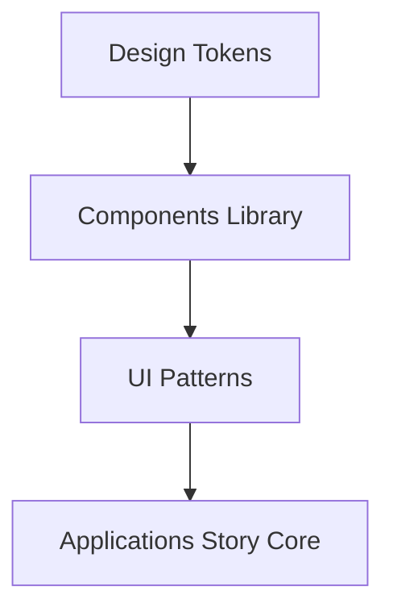

# Plan de mise en œuvre du Design System Story Core

Objectif: déployer un design system réutilisable et accessible pour Story Core, afin de garantir la cohérence UI et d'améliorer la vélocité des équipes. Ce document décrit les livrables, les дорожpatterns et les critères d’acceptation pour démarrer l’implémentation.

1) Portée et principes
- Centralisation des tokens et des composants UI
- Stabilité et évolutivité: versioning du design system, compatibilité ascendante
- Accessibilité intégrée dès le départ (WCAG 2.2+)
- Gouvernance: contributions, revue et dépréciation des composants

2) Tokens et palette
- Colors: primary, secondary, success, warning, danger, neutral
- Typography: scale headings, body, caption
- Spacing: scale (0-8)
- Radii: xs, sm, md, lg
- Shadows, elevation et tokens d’illumination

3) Composants MVP (React/TSX)
- Button, TextField, Select, Checkbox, Radio
- Card, Avatar, Tabs, Modal, Tooltip, IconButton
- List, AvatarGroup, Breadcrumbs
- Layout primitives: Grid, Stack, Container

4) Accessibilité et UX
- Keyboard navigation et focus management
- Contraintes de contraste, labels explicites, aria-labels
- Responsive design et behaviour clavier

5) Gouvernance et livrables
- Tokens JSON/TS, symboles d’import réutilisables
- Bibliothèque de composants avec fiches d’utilisation et props types
- Guides d’accessibilité et QA checklist
- Documentation vivante et repo de design-system

6) Phases et livrables (sans estimation temporelle)
- Phase MVP: tokens + 5 composants clés
- Phase 1: extension vers 15-20 composants et exemples d’intégration
- Phase 2: linting, tests d’accessibilité automatisés, et visual regression tests
- Phase 3: intégration continue avec les projets Story Core

7) Livrables attendus
- Fichiers tokens: design-tokens.json / design-tokens.ts
- Composants: fichier TSX/TS, hooks, props types
- Guides: README.md, docs/accessibility.md
- Exemples d’utilisation et scénarios d’intégration

8) Métriques et KPI
- Adoption du design system par les projets
- Temps moyen d’intégration par composant
- Score d’accessibilité et répétabilité des tests
- Taux de contribution et révisions de tokens

9) Exemples de sorties et artefacts
- design-tokens.json
- Button.tsx, Card.tsx, Modal.tsx (exemple de composant)
- docs/accessibility.md et guides d’intégration

10) Risques et mitigations
- Fragmentation des styles: etablir un assertive master theme
- Dépendances frontend et compatibilité: versioning strict
- Maintien des performances et chargements: splitting et lazy loading

11) Diagrammes Mermaid (livrables optionnels)
- Architecture du design system
- Flux d’utilisation des composants dans l’application Story Core

Mermaid architecture example

Plan de revue et prochaines étapes
- Validation du plan et alignment sur les Epics du plan vision
- Définition des tickets pour les composants MVP et tokens
- Lancement des livrables et mise en place d’un repo design-system

Références
- PLAN_AMELIORATION_VIDEO_CINEMATIQUE_V3.md
- docs/IMPLEMENTATION_PLAN_NEW_FEATURES.md

Next steps: dès validation, passer en mode Architect pour décliner les modules et écrire les ressources code et tests.

