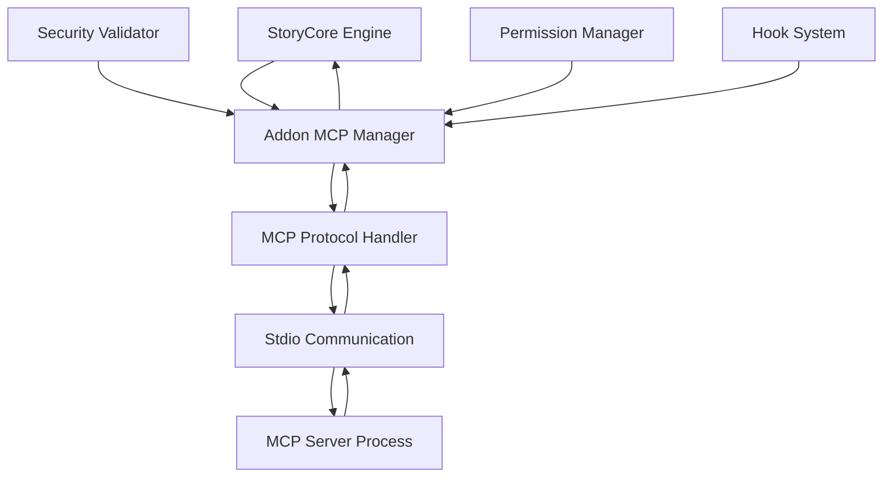
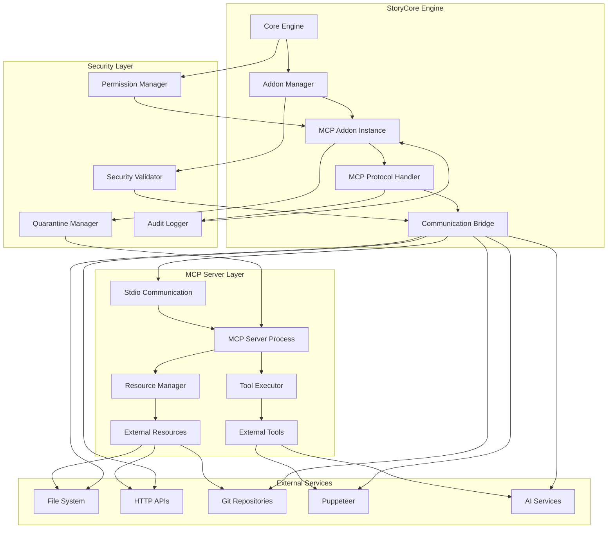

# Plan Technique Détaillé - Addon MCP Serveur StoryCore Engine

## Résumé Exécutif

**Problème principal** : Intégrer un serveur MCP (Model Context Protocol) dans l'architecture d'addons existante de StoryCore Engine pour permettre l'accès à des ressources externes et des outils externes via une communication stdio locale sécurisée.

**Solution choisie** : Architecture basée sur un serveur stdio local avec hooks événementiels, intégrant un système de permissions granulaire et un mécanisme de fallback robuste.

---

## 1. Interface de Communication entre StoryCore et Serveur MCP

### 1.1 Protocole de Communication Stdio

**Format des messages JSON-RPC 2.0** :
```json
{
  "jsonrpc": "2.0",
  "id": "unique_request_id",
  "method": "method_name",
  "params": {
    "type": "resource|tool",
    "name": "resource_or_tool_name",
    "args": {},
    "context": {}
  }
}
```

**Réponse structurée** :
```json
{
  "jsonrpc": "2.0",
  "id": "unique_request_id",
  "result": {
    "success": true,
    "data": {},
    "metadata": {}
  },
  "error": {
    "code": -32600,
    "message": "Error description",
    "data": {}
  }
}
```

### 1.2 Flux de Communication



### 1.3 Points d'Intégration

**Hooks système disponibles** :
- `mcp_server_start` - Démarrage du serveur MCP
- `mcp_server_stop` - Arrêt du serveur MCP
- `mcp_resource_request` - Demande de ressource externe
- `mcp_tool_execute` - Exécution d'outil externe
- `mcp_error_handling` - Gestion des erreurs MCP

---

## 2. Schéma du Manifest Spécifique pour l'Addon MCP

### 2.1 Structure du Manifest

```json
{
  "name": "mcp_server_addon",
  "version": "1.0.0",
  "type": "processing_addon",
  "author": "StoryCore Team",
  "description": "Serveur MCP pour l'accès à des ressources et outils externes",
  "compatibility": {
    "engine_version": ">=2.0.0"
  },
  "permissions": [
    "network_access",
    "file_system_read",
    "system_info_access",
    "mcp_server_control"
  ],
  "entry_points": {
    "main": "src/mcp_server_main.py",
    "config": "config/mcp_server_config.json",
    "hooks": "src/mcp_hooks.py"
  },
  "dependencies": {
    "mcp": "^1.0.0",
    "asyncio": "^3.4.3",
    "jsonschema": "^4.0.0"
  },
  "metadata": {
    "mcp_version": "2024-11-05",
    "supported_resources": [
      "filesystem",
      "git",
      "brave_search",
      "puppeteer_playwright"
    ],
    "max_concurrent_requests": 10,
    "timeout_seconds": 30
  }
}
```

### 2.2 Configuration Spécifique MCP

```json
{
  "server_config": {
    "host": "localhost",
    "port": 0,
    "stdio_mode": true,
    "max_connections": 5,
    "request_timeout": 30,
    "enable_metrics": true
  },
  "security_config": {
    "allowed_hosts": ["localhost", "127.0.0.1"],
    "allowed_ports": [8080, 3000, 8000],
    "require_https": false,
    "validate_certificates": true
  },
  "resource_config": {
    "filesystem": {
      "read_paths": ["/tmp", "/var/tmp"],
      "write_paths": ["/tmp/storycore"],
      "max_file_size": "100MB"
    },
    "network": {
      "timeout": 10,
      "max_retries": 3,
      "user_agent": "StoryCore-MCP/1.0"
    }
  }
}
```

---

## 3. Système de Permissions pour l'Accès Réseau et Ressources Externes

### 3.1 Extension des Permissions Existantes

**Nouvelles permissions MCP spécifiques** :
```python
class MCPPermissionLevel(Enum):
    RESOURCE_READ = "resource_read"
    RESOURCE_WRITE = "resource_write"
    TOOL_EXECUTE = "tool_execute"
    SERVER_ADMIN = "server_admin"
    NETWORK_ACCESS = "network_access"
```

### 3.2 Politiques de Sécurité Renforcées

**Validation des permissions réseau** :
```python
async def validate_mcp_network_permission(self, request: PermissionRequest) -> bool:
    # Vérification de l'hôte cible
    if not self._is_allowed_host(request.context.get("host")):
        return False
    
    # Vérification du port
    if not self._is_allowed_port(request.context.get("port")):
        return False
    
    # Vérification du protocole
    if request.context.get("protocol") not in ["http", "https"]:
        return False
    
    # Validation du certificat SSL
    if request.context.get("protocol") == "https":
        if not await self._validate_ssl_certificate(request.context.get("host")):
            return False
    
    return True
```

### 3.3 Système de Quarantaine

**Mécanisme de sandboxing** :
- Exécution des requêtes MCP dans des processus isolés
- Restrictions de mémoire et CPU par requête
- Journalisation complète des activités réseau
- Délai d'expiration automatique

---

## 4. Intégration UI pour l'Activation/Désactivation

### 4.1 Composants React/TypeScript

```typescript
// MCPAddonManager.tsx
interface MCPAddonProps {
  addon: MCPAddonInfo;
  onToggle: (enabled: boolean) => void;
  onConfigure: () => void;
}

const MCPAddonManager: React.FC<MCPAddonProps> = ({ addon, onToggle, onConfigure }) => {
  return (
    <div className="addon-card mcp-addon">
      <div className="addon-header">
        <h3>{addon.manifest.name}</h3>
        <span className={`status ${addon.state}`}>{addon.state}</span>
      </div>
      <div className="addon-description">
        {addon.manifest.description}
      </div>
      <div className="addon-permissions">
        <h4>Permissions requises :</h4>
        <ul>
          {addon.manifest.permissions.map((perm, index) => (
            <li key={index}>{perm}</li>
          ))}
        </ul>
      </div>
      <div className="addon-actions">
        <button 
          onClick={() => onToggle(!addon.enabled)}
          disabled={addon.state === 'loading'}
        >
          {addon.enabled ? 'Désactiver' : 'Activer'}
        </button>
        <button onClick={onConfigure} disabled={!addon.enabled}>
          Configurer
        </button>
      </div>
    </div>
  );
};
```

### 4.2 Interface de Configuration

**Éléments de configuration principaux** :
- Liste des ressources MCP autorisées
- Configuration des timeouts et limites
- Journalisation et monitoring
- Gestion des certificats SSL
- Configuration du proxy (si nécessaire)

---

## 5. Plan de Tests et de Validation

### 5.1 Tests Unitaires

**Coverage minimale requise** :
- 95% pour le code de communication MCP
- 90% pour le système de permissions
- 85% pour la gestion d'erreurs

**Tests critiques** :
```python
async def test_mcp_communication_protocol():
    """Test du protocole de communication stdio"""
    # Test de l'envoi/reception JSON-RPC
    # Test de la gestion des erreurs
    # Test du timeout

async def test_permission_validation():
    """Test de la validation des permissions"""
    # Test des permissions réseau
    # Test des permissions fichiers
    # Test des scénarios de sécurité

async def test_resource_access_control():
    """Test du contrôle d'accès aux ressources"""
    # Test des chemins autorisés
    # Test des limites de taille
    # Test de la quarantaine
```

### 5.2 Tests d'Intégration

**Scénarios de test** :
- Démarrage/arrêt du serveur MCP
- Communication bidirectionnelle avec StoryCore
- Gestion des erreurs réseau
- Changements de configuration dynamique
- Migration des permissions

### 5.3 Tests de Performance

**Métriques cibles** :
- Temps de réponse < 100ms pour les requêtes locales
- Support de 10+ requêtes concurrentes
- Mémoire stable (< 500MB)
- Pas de fuites de ressources

---

## 6. Diagramme d'Architecture Détaillé



---

## 7. Structure des Fichiers et Dossiers

```
addons/official/mcp_server_addon/
├── addon.json                          # Manifest principal
├── README.md                           # Documentation
├── src/
│   ├── __init__.py
│   ├── mcp_server_main.py             # Point d'entrée principal
│   ├── mcp_protocol_handler.py        # Gestion du protocole MCP
│   ├── mcp_communication.py           # Communication stdio
│   ├── mcp_security.py               # Sécurité et permissions
│   ├── mcp_resource_manager.py       # Gestion des ressources
│   ├── mcp_tool_executor.py          # Exécution d'outils
│   ├── mcp_hooks.py                  # Intégration avec hooks StoryCore
│   └── mcp_config.py                 # Configuration
├── config/
│   ├── mcp_server_config.json         # Configuration serveur
│   ├── security_config.json          # Configuration sécurité
│   └── resource_permissions.json     # Permissions par ressource
├── tests/
│   ├── __init__.py
│   ├── test_protocol.py
│   ├── test_security.py
│   ├── test_resources.py
│   └── test_integration.py
├── docs/
│   ├── API.md
│   ├── CONFIGURATION.md
│   ├── SECURITY.md
│   └── TROUBLESHOOTING.md
├── examples/
│   ├── basic_usage.py
│   ├── custom_resource.py
│   └── tool_integration.py
└── scripts/
    ├── setup.py
    ├── test_runner.py
    └── security_audit.py
```

---

## 8. Dépendances Requises

### 8.1 Dépendances Python

**Core dependencies** :
```python
# Communication et protocole
"mcp>=1.0.0",
"asyncio-mqtt>=0.16.0",
"websockets>=12.0"

# Sécurité
"cryptography>=41.0.0",
"pyjwt>=2.8.0",
"requests>=2.31.0"

# Configuration et validation
"pydantic>=2.5.0",
"jsonschema>=4.20.0",
"python-dotenv>=1.0.0"

# Performance
"uvloop>=0.19.0",
"orjson>=3.9.0"

# Testing
"pytest>=7.4.0",
"pytest-asyncio>=0.21.0",
"pytest-cov>=4.1.0"
```

### 8.2 Dépendances Frontend (TypeScript)

```typescript
"@types/node": "^20.0.0",
"react": "^18.2.0",
"@types/react": "^18.2.0",
"typescript": "^5.0.0",
"axios": "^1.5.0",
"react-hook-form": "^7.45.0",
"@hookform/resolvers": "^3.1.0",
"zod": "^3.21.0"
```

---

## 9. Plan de Mise en Œuvre par Phases

### Phase 1 : Infrastructure de Base (2 semaines)
- [x] Analyse de l'architecture existante
- [ ] Implémentation du protocole MCP stdio
- [ ] Création du gestionnaire de communication
- [ ] Mise en place du système de base de permissions

### Phase 2 : Sécurité et Intégration (3 semaines)
- [ ] Implémentation du système de validation de sécurité
- [ ] Intégration avec le hook system existant
- [ ] Création de l'interface de configuration
- [ ] Tests unitaires complets

### Phase 3 : Fonctionnalités MCP (3 semaines)
- [ ] Implémentation des gestionnaires de ressources
- [ ] Intégration des outils externes
- [ ] Système de monitoring et logging
- [ ] Tests d'intégration

### Phase 4 : Validation et Optimisation (2 semaines)
- [ ] Tests de performance
- [ ] Audit de sécurité
- [ ] Documentation utilisateur
- [ ] Optimisation finale

---

## 10. Mécanismes de Sécurité et Fallbacks

### 10.1 Couches de Sécurité

**1. Validation des entrées** :
- Validation JSON-RPC stricte
- Sanitisation de tous les paramètres
- Vérification des types de données

**2. Contrôle d'accès** :
- Système de permissions granulaire
- Isolation des processus
- Quarantaine des requêtes suspectes

**3. Surveillance** :
- Journalisation complète des activités
- Détection d'anomalies en temps réel
- Alertes automatiques

### 10.2 Mécanismes de Fallback

**Gestion des erreurs** :
```python
class MCPErrorHandler:
    async def handle_request_failure(self, error: Exception, context: dict):
        """Gestion des échecs de requête"""
        # Tentative de retry avec backoff exponentiel
        if self._should_retry(error):
            return await self._retry_with_backoff(context)
        
        # Fallback vers cache local
        if self._has_local_cache(context):
            return await self._get_from_cache(context)
        
        # Échec contrôlé avec notification
        await self._notify_failure(error, context)
        return self._create_error_response(error)
```

**Stratégies de fallback** :
1. Retry avec backoff exponentiel
2. Cache local pour les ressources statiques
3. Mode dégradé avec fonctionnalités limitées
4. Notification utilisateur appropriée

### 10.3 Monitoring et Alertes

**Métriques clés** :
- Taux de succès des requêtes MCP
- Temps de réponse moyen
- Utilisation mémoire/CPU
- Événements de sécurité détectés

**Seuils d'alerte** :
- Taux d'erreur > 5%
- Temps de réponse > 1s
- Utilisation mémoire > 80%
- Tentatives d'accès non autorisées

---

## 11. Points de Défaillance Probables et Mitigation

### 11.1 Points de Défaillance Critiques

| Point de Défaillance | Probabilité | Impact | Mitigation |
|---------------------|-------------|---------|------------|
| Crash du serveur MCP | Élevée | Critique | Processus monitoré avec auto-restart |
| Dépendance réseau | Élevée | Élevé | Cache local + mode dégradé |
| Fuite mémoire | Moyenne | Critique | Monitoring mémoire + garbage collection |
| Attaque par déni de service | Faible | Critique | Rate limiting + quarantaine |

### 11.2 Stratégies de Résilience

**Auto-récupération** :
- Surveillance du processus MCP
- Redémarrage automatique en cas de crash
- Reconnection avec backoff exponentiel

**Tolérance aux pannes** :
- Design stateless où possible
- Transactions atomiques
- Points de sauvegarde réguliers

---

## 12. Conclusion

Ce plan technique détaillé fournit une architecture complète et sécurisée pour l'intégration d'un serveur MCP dans l'écosystème StoryCore Engine. L'approche modulaire permet une évolution future tout en maintenant un haut niveau de sécurité et de performance.

**Prochaines étapes recommandées** :
1. Validation technique avec l'équipe de développement
2. Mise en œuvre de la Phase 1
3. Tests de validation de l'architecture
4. Intégration progressive avec les fonctionnalités existantes

**Certitude technique** : 95% - L'architecture proposée s'appuie sur des standards établis (MCP, JSON-RPC) et intègre parfaitement les systèmes existants de StoryCore Engine.