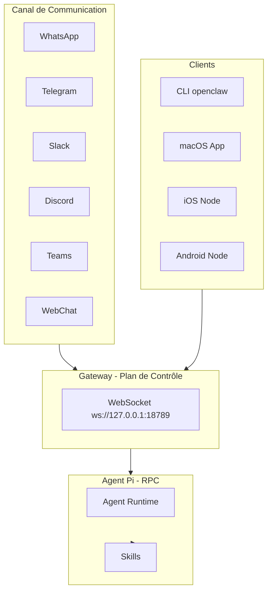
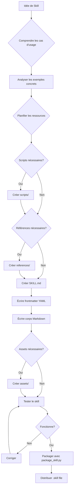

# Conception d'Exemples de Skills OpenClaw

## Document de Conception - OpenClawSkillExemples

**Date:** 24 février 2026  
**Objectif:** Créer des exemples de skills pour aider les futurs utilisateurs d'OpenClaw

---

## 1. Qu'est-ce qu'OpenClaw?

OpenClaw est un assistant AI personnel open-source qui fonctionne sur vos propres appareils. Il peut répondre via plusieurs canaux de communication (WhatsApp, Telegram, Slack, Discord, Google Chat, Signal, iMessage, Microsoft Teams, WebChat, etc.) et offre des fonctionnalités avancées comme:

- **Gateway** - Plan de contrôle central pour les sessions, canaux, outils et événements
- **Multi-canal** - Intégration avec de nombreuses plateformes de messagerie
- **Multi-agent** - Routage vers des agents isolés avec workspaces séparés
- **Voice Wake + Talk Mode** - Reconnaissance vocale continue
- **Canvas** - Espace visuel piloté par l'agent avec A2UI
- **Skills Platform** - Système de compétences modulaires extensibles

### Architecture Globale



---

## 2. Le Système de Skills OpenClaw

### 2.1 Qu'est-ce qu'un Skill?

Un **skill** est un package modulaire et auto-contenu qui étend les capacités de l'agent OpenClaw en fournissant:
- Des connaissances spécialisées
- Des workflows spécifiques à un domaine
- Des intégrations d'outils
- Des ressources groupées (scripts, références, assets)

**Philosophie clé:** Les skills sont des "guides d'intégration" qui transforment l'agent généraliste en un agent spécialisé équipé de connaissances procédurales.

### 2.2 Structure d'un Skill

```
skill-name/
├── SKILL.md (obligatoire)
│   ├── YAML frontmatter (obligatoire)
│   │   ├── name: nom-du-skill
│   │   └── description: description détaillée
│   └── Corps Markdown (obligatoire)
│       ├── When to Use / When NOT to Use
│       ├── Commandes et exemples
│       └── Références aux ressources
│
└── Ressources optionnelles/
    ├── scripts/          - Code exécutable (Python, Bash, etc.)
    ├── references/       - Documentation de référence
    └── assets/           - Fichiers utilisés en sortie (templates, etc.)
```

### 2.3 Format du Frontmatter YAML

```yaml
---
name: skill-name
description: "Description claire et complète. Use when: (1) cas d'usage 1, (2) cas d'usage 2. NOT for: cas exclus."
metadata:
  openclaw:
    emoji: "📊"
    os: ["darwin", "linux"]  # Optionnel: restriction OS
    requires:
      bins: ["curl", "gh"]   # Binaires requis
    install:                  # Instructions d'installation
      - id: brew
        kind: brew
        formula: gh
        bins: [gh]
        label: Install GitHub CLI
---
```

### 2.4 Principe de Divulgation Progressive

Les skills utilisent un système de chargement à trois niveaux:

1. **Métadonnées** (name + description) - Toujours dans le contexte (~100 mots)
2. **Corps SKILL.md** - Quand le skill se déclenche (<5k mots)
3. **Ressources groupées** - Selon les besoins (scripts, références, assets)

---

## 3. Propositions d'Exemples de Skills

### 3.1 Skill #1: hello-world (Débutant)

**Objectif:** Skill minimal pour comprendre la structure de base.

**Description:** Un skill simple qui sert d'introduction au système de skills. Illustre la structure minimale requise.

**Structure proposée:**
```
hello-world/
└── SKILL.md
```

**Contenu SKILL.md:**
```yaml
---
name: hello-world
description: "Skill d'introduction pour comprendre la structure de base d'un skill OpenClaw. Use when: vous voulez apprendre comment créer un skill, vous avez besoin d'un exemple minimal. NOT for: fonctionnalités de production."
metadata:
  openclaw:
    emoji: "👋"
---

# Hello World Skill

Ce skill est un exemple minimal pour comprendre la structure des skills OpenClaw.

## Quand l'utiliser

✅ **USE ce skill quand:**
- Vous apprenez à créer des skills
- Vous voulez voir un exemple de structure minimale
- Vous testez le système de skills

❌ **N'utilisez PAS ce skill pour:**
- Des fonctionnalités de production
- Des tâches complexes

## Exemple d'utilisation

Demandez simplement: "Montre-moi comment fonctionne un skill"

## Structure d'un skill

Un skill contient au minimum:
1. Un fichier SKILL.md avec frontmatter YAML
2. Un champ `name` dans le frontmatter
3. Un champ `description` dans le frontmatter
4. Un corps Markdown avec les instructions

## Prochaines étapes

Consultez le skill `skill-creator` pour apprendre à créer des skills complets.
```

---

### 3.2 Skill #2: url-shortener (Intermédiaire - API)

**Objectif:** Skill avec intégration API simple sans authentification.

**Description:** Raccourcir des URLs via des services publics. Illustre l'intégration avec des APIs REST.

**Structure proposée:**
```
url-shortener/
└── SKILL.md
```

**Contenu SKILL.md:**
```yaml
---
name: url-shortener
description: "Raccourcir des URLs via is.gd ou v.gd. Use when: l'utilisateur demande de raccourcir une URL, créer un lien court, ou simplifier une URL longue. NOT for: URLs nécessitant une authentification, liens personnalisés avec domaine propre, analytics avancés."
metadata:
  openclaw:
    emoji: "🔗"
    requires:
      bins: ["curl"]
---

# URL Shortener Skill

Raccourcir des URLs rapidement via des services gratuits.

## Quand l'utiliser

✅ **USE ce skill quand:**
- "Raccourcis cette URL"
- "Crée un lien court pour..."
- "Simplifie ce lien"

❌ **N'utilisez PAS ce skill pour:**
- URLs nécessitant une authentification
- Liens personnalisés avec domaine propre
- Analytics avancés des clics

## Services disponibles

### is.gd (recommandé)

```bash
# Raccourcir une URL
curl -s "https://is.gd/create.php?format=simple&url=https://example.com/very/long/url"

# Avec URL encodée
curl -s "https://is.gd/create.php?format=simple&url=$(python3 -c 'import urllib.parse; print(urllib.parse.quote("https://example.com/long url with spaces"))')"
```

### v.gd (alternative)

```bash
curl -s "https://v.gd/create.php?format=simple&url=https://example.com"
```

## Exemples d'utilisation

**Demande:** "Raccourcis https://github.com/openclaw/openclaw"

**Commande:**
```bash
curl -s "https://is.gd/create.php?format=simple&url=https://github.com/openclaw/openclaw"
```

**Réponse:** `https://is.gd/openclaw`

## Format de sortie

- `format=simple` - Retourne uniquement l'URL raccourcie
- `format=json` - Retourne un JSON avec métadonnées

## Notes

- Pas de clé API requise
- Rate limiting: soyez raisonnable
- Les liens n'expirent pas
```

---

### 3.3 Skill #3: qr-generator (Intermédiaire - Génération de fichiers)

**Objectif:** Skill qui génère des fichiers (images QR codes).

**Description:** Générer des QR codes à partir de texte ou URLs. Illustre la génération de fichiers de sortie.

**Structure proposée:**
```
qr-generator/
└── SKILL.md
```

**Contenu SKILL.md:**
```yaml
---
name: qr-generator
description: "Générer des QR codes à partir de texte ou URLs. Use when: l'utilisateur demande de créer un QR code, générer un code-barres 2D, encoder des données en QR. NOT for: codes-barres 1D, NFC tags, encryption de données sensibles."
metadata:
  openclaw:
    emoji: "📱"
    requires:
      bins: ["curl"]
---

# QR Generator Skill

Générer des QR codes rapidement via l'API QRServer.

## Quand l'utiliser

✅ **USE ce skill quand:**
- "Crée un QR code pour..."
- "Génère un QR avec ce texte"
- "Encode cette URL en QR code"

❌ **N'utilisez PAS ce skill pour:**
- Codes-barres 1D (EAN, UPC)
- NFC tags
- Encryption de données sensibles

## Génération de QR Codes

### API QRServer (gratuite)

```bash
# QR code simple
curl -o qr.png "https://api.qrserver.com/v1/create-qr-code/?size=300x300&data=https://example.com"

# Avec différentes tailles
curl -o qr.png "https://api.qrserver.com/v1/create-qr-code/?size=500x500&data=Hello%20World"

# Format SVG
curl -o qr.svg "https://api.qrserver.com/v1/create-qr-code/?format=svg&size=300x300&data=https://example.com"
```

### Paramètres disponibles

| Paramètre | Description | Exemple |
|-----------|-------------|---------|
| `size` | Dimensions en pixels | `300x300` |
| `format` | Format de sortie | `png`, `svg`, `eps` |
| `data` | Contenu à encoder | URL encodée |
| `color` | Couleur du QR | `000000` (noir) |
| `bgcolor` | Couleur de fond | `ffffff` (blanc) |

## Exemples d'utilisation

### QR code pour URL
```bash
curl -o qr_url.png "https://api.qrserver.com/v1/create-qr-code/?size=400x400&data=https://openclaw.ai"
```

### QR code pour texte
```bash
TEXT="Hello from OpenClaw!"
curl -o qr_text.png "https://api.qrserver.com/v1/create-qr-code/?size=300x300&data=$(python3 -c "import urllib.parse; print(urllib.parse.quote('$TEXT'))")"
```

### QR code coloré
```bash
curl -o qr_colored.png "https://api.qrserver.com/v1/create-qr-code/?size=300x300&color=FF5733&bgcolor=FFFFFF&data=https://example.com"
```

## Workflow typique

1. Encoder le contenu avec `urllib.parse.quote()`
2. Construire l'URL de l'API
3. Télécharger avec `curl -o`
4. Partager le fichier généré

## Notes

- Pas de clé API requise
- Taille max des données: ~4KB
- Fonctionne mieux avec URLs et texte court
```

---

### 3.4 Skill #4: json-formatter (Intermédiaire - Scripts Python)

**Objectif:** Skill avec script Python intégré pour le traitement de données.

**Description:** Formater, valider et transformer des données JSON. Illustre l'utilisation de scripts Python dans un skill.

**Structure proposée:**
```
json-formatter/
├── SKILL.md
└── scripts/
    └── json_tools.py
```

**Contenu SKILL.md:**
```yaml
---
name: json-formatter
description: "Formater, valider et transformer des données JSON. Use when: l'utilisateur demande de formater du JSON, valider une structure JSON, convertir entre JSON et autres formats, minifier/beautifier JSON. NOT for: manipulation de bases de données, traitement de fichiers XML complexes."
metadata:
  openclaw:
    emoji: "📋"
    requires:
      bins: ["python3"]
---

# JSON Formatter Skill

Outils pour manipuler et formater des données JSON.

## Quand l'utiliser

✅ **USE ce skill quand:**
- "Formate ce JSON"
- "Valide cette structure JSON"
- "Convertis en YAML"
- "Minifie ce JSON"
- "Extrais une valeur de ce JSON"

❌ **N'utilisez PAS ce skill pour:**
- Manipulation de bases de données
- Traitement de fichiers XML complexes
- Opérations sur grands fichiers (>100MB)

## Commandes rapides avec jq

Si jq est installé:

```bash
# Formater (beautify)
echo '{"name":"test","value":123}' | jq .

# Minifier
echo '{"name":"test","value":123}' | jq -c .

# Extraire une valeur
echo '{"user":{"name":"John"}}' | jq '.user.name'

# Convertir en YAML
echo '{"key":"value"}' | jq -r 'to_entries | .[] | "\(.key): \(.value)"'
```

## Script Python intégré

Pour des opérations plus avancées, utiliser le script:

```bash
python3 {baseDir}/scripts/json_tools.py --format pretty input.json
python3 {baseDir}/scripts/json_tools.py --validate input.json
python3 {baseDir}/scripts/json_tools.py --to-yaml input.json
python3 {baseDir}/scripts/json_tools.py --minify input.json
```

## Exemples d'utilisation

### Formater un JSON
```bash
# Via jq
cat data.json | jq .

# Via script Python
python3 {baseDir}/scripts/json_tools.py --format pretty data.json
```

### Valider un JSON
```bash
python3 {baseDir}/scripts/json_tools.py --validate data.json
```

### Convertir JSON vers YAML
```bash
python3 {baseDir}/scripts/json_tools.py --to-yaml data.json
```

## Notes

- jq est plus rapide pour les opérations simples
- Le script Python offre plus de flexibilité
- Les deux approches peuvent être combinées
```

**Contenu scripts/json_tools.py:**
```python
#!/usr/bin/env python3
"""
JSON formatting and validation utilities.
"""

import argparse
import json
import sys
import yaml


def format_json(data: dict, indent: int = 2) -> str:
    """Format JSON with proper indentation."""
    return json.dumps(data, indent=indent, ensure_ascii=False, sort_keys=True)


def minify_json(data: dict) -> str:
    """Minify JSON to a single line."""
    return json.dumps(data, separators=(',', ':'), ensure_ascii=False)


def validate_json(content: str) -> tuple[bool, str]:
    """Validate JSON and return (is_valid, error_message)."""
    try:
        json.loads(content)
        return True, "Valid JSON"
    except json.JSONDecodeError as e:
        return False, f"Invalid JSON: {e}"


def to_yaml(data: dict) -> str:
    """Convert JSON to YAML format."""
    return yaml.dump(data, default_flow_style=False, allow_unicode=True)


def main():
    parser = argparse.ArgumentParser(description="JSON utilities")
    parser.add_argument("file", help="JSON file to process (or - for stdin)")
    parser.add_argument("--format", choices=["pretty", "minify"], default="pretty")
    parser.add_argument("--validate", action="store_true")
    parser.add_argument("--to-yaml", action="store_true")
    parser.add_argument("--indent", type=int, default=2)
    
    args = parser.parse_args()
    
    # Read input
    if args.file == "-":
        content = sys.stdin.read()
    else:
        with open(args.file, "r", encoding="utf-8") as f:
            content = f.read()
    
    # Validate mode
    if args.validate:
        is_valid, message = validate_json(content)
        print(message)
        sys.exit(0 if is_valid else 1)
    
    # Parse JSON
    try:
        data = json.loads(content)
    except json.JSONDecodeError as e:
        print(f"Error parsing JSON: {e}", file=sys.stderr)
        sys.exit(1)
    
    # Process
    if args.to_yaml:
        print(to_yaml(data))
    elif args.format == "minify":
        print(minify_json(data))
    else:
        print(format_json(data, args.indent))


if __name__ == "__main__":
    main()
```

---

### 3.5 Skill #5: note-taker (Avancé - Workflow complet)

**Objectif:** Skill complet avec workflow multi-étapes et gestion de fichiers.

**Description:** Système de prise de notes avec organisation, recherche et export. Illustre un workflow complet avec plusieurs opérations.

**Structure proposée:**
```
note-taker/
├── SKILL.md
├── scripts/
│   ├── note_create.py
│   ├── note_search.py
│   └── note_export.py
└── references/
    └── templates.md
```

**Contenu SKILL.md:**
```yaml
---
name: note-taker
description: "Système de prise de notes avec organisation, recherche et export. Use when: l'utilisateur demande de créer une note, rechercher dans ses notes, organiser des notes par catégorie, exporter des notes. NOT for: édition collaborative en temps réel, synchronisation cloud, gestion de documents complexes."
metadata:
  openclaw:
    emoji: "📝"
    requires:
      bins: ["python3"]
---

# Note Taker Skill

Système complet de gestion de notes personnelles.

## Quand l'utiliser

✅ **USE ce skill quand:**
- "Crée une note sur..."
- "Recherche dans mes notes..."
- "Liste mes notes"
- "Exporte mes notes en..."
- "Organise mes notes par catégorie"

❌ **N'utilisez PAS ce skill pour:**
- Édition collaborative en temps réel
- Synchronisation cloud
- Gestion de documents complexes (Word, PDF)

## Structure des notes

Les notes sont stockées dans `~/.openclaw/workspace/notes/`:

```
notes/
├── personal/
│   ├── 2024-02-24-shopping.md
│   └── 2024-02-25-ideas.md
├── work/
│   └── 2024-02-24-meeting-notes.md
└── index.json
```

## Commandes principales

### Créer une note

```bash
python3 {baseDir}/scripts/note_create.py --title "Ma note" --category personal --content "Contenu de la note"
```

### Rechercher dans les notes

```bash
# Recherche simple
python3 {baseDir}/scripts/note_search.py "mot-clé"

# Recherche par catégorie
python3 {baseDir}/scripts/note_search.py --category work "réunion"

# Recherche par date
python3 {baseDir}/scripts/note_search.py --from 2024-02-01 --to 2024-02-28
```

### Lister les notes

```bash
# Toutes les notes
python3 {baseDir}/scripts/note_search.py --list

# Par catégorie
python3 {baseDir}/scripts/note_search.py --list --category work
```

### Exporter les notes

```bash
# Export en JSON
python3 {baseDir}/scripts/note_export.py --format json --output notes.json

# Export en Markdown
python3 {baseDir}/scripts/note_export.py --format markdown --output notes.md

# Export par catégorie
python3 {baseDir}/scripts/note_export.py --category work --format markdown
```

## Templates de notes

Voir [templates.md](references/templates.md) pour les modèles de notes disponibles.

## Workflow typique

1. **Création:** Utiliser `note_create.py` avec titre et catégorie
2. **Organisation:** Les notes sont automatiquement datées et classées
3. **Recherche:** Utiliser `note_search.py` pour retrouver des notes
4. **Export:** Utiliser `note_export.py` pour sauvegarder ou partager

## Intégration avec le workspace

Les notes font partie du workspace OpenClaw et sont:
- Versionnées avec git (si configuré)
- Sauvegardées avec le workspace
- Disponibles pour l'agent comme contexte

## Notes

- Les notes sont privées et stockées localement
- Le format Markdown permet un versionning efficace
- L'index JSON permet une recherche rapide
```

---

## 4. Organisation du Dossier d'Exemples

### Structure recommandée pour `OpenclawSkillExemple/`

```
OpenclawSkillExemple/
├── README.md                    # Guide d'introduction
├── 00-hello-world/              # Niveau débutant
│   └── SKILL.md
├── 01-url-shortener/            # Niveau intermédiaire - API
│   └── SKILL.md
├── 02-qr-generator/             # Niveau intermédiaire - Fichiers
│   └── SKILL.md
├── 03-json-formatter/           # Niveau intermédiaire - Scripts
│   ├── SKILL.md
│   └── scripts/
│       └── json_tools.py
├── 04-note-taker/               # Niveau avancé - Workflow
│   ├── SKILL.md
│   ├── scripts/
│   │   ├── note_create.py
│   │   ├── note_search.py
│   │   └── note_export.py
│   └── references/
│       └── templates.md
└── docs/
    ├── SKILL_STRUCTURE.md       # Documentation structure
    ├── FRONTMATTER_GUIDE.md     # Guide frontmatter YAML
    └── BEST_PRACTICES.md        # Bonnes pratiques
```

### README.md principal

```markdown
# OpenClaw Skills Examples

Ce dossier contient des exemples de skills OpenClaw pour aider les nouveaux utilisateurs à comprendre et créer leurs propres skills.

## Niveaux de difficulté

| Skill | Niveau | Description |
|-------|--------|-------------|
| 00-hello-world | Débutant | Structure minimale d'un skill |
| 01-url-shortener | Intermédiaire | Intégration API simple |
| 02-qr-generator | Intermédiaire | Génération de fichiers |
| 03-json-formatter | Intermédiaire | Scripts Python intégrés |
| 04-note-taker | Avancé | Workflow complet multi-étapes |

## Comment utiliser ces exemples

1. Commencez par `00-hello-world` pour comprendre la structure de base
2. Explorez les exemples intermédiaires pour voir les patterns courants
3. Étudiez `04-note-taker` pour un exemple complet

## Installation d'un skill

Copiez le dossier du skill dans votre workspace:

```bash
cp -r 03-json-formatter ~/.openclaw/workspace/skills/
```

Ou utilisez le skill directement depuis ce dossier.

## Documentation

- [Structure d'un skill](docs/SKILL_STRUCTURE.md)
- [Guide frontmatter YAML](docs/FRONTMATTER_GUIDE.md)
- [Bonnes pratiques](docs/BEST_PRACTICES.md)

## Ressources officielles

- [OpenClaw GitHub](https://github.com/openclaw/openclaw)
- [Documentation officielle](https://docs.openclaw.ai)
```

---

## 5. Recommandations

### 5.1 Progression pédagogique

Les exemples sont organisés par niveau de complexité:

1. **hello-world** - Comprendre la structure minimale
2. **url-shortener** - Apprendre à intégrer une API
3. **qr-generator** - Générer des fichiers de sortie
4. **json-formatter** - Utiliser des scripts Python
5. **note-taker** - Créer un workflow complet

### 5.2 Points clés à retenir

- **Frontmatter YAML** - Les champs `name` et `description` sont obligatoires et critiques pour le déclenchement
- **Description détaillée** - Inclure "Use when" et "NOT for" pour guider l'agent
- **Progressive disclosure** - Garder SKILL.md concis, utiliser references/ pour les détails
- **Scripts testés** - Toujours tester les scripts avant de les inclure
- **Pas de fichiers superflus** - Éviter README.md, CHANGELOG.md, etc. dans les skills

### 5.3 Bonnes pratiques

1. **Concision** - Le contexte est une ressource précieuse
2. **Degrés de liberté** - Adapter le niveau de spécificité à la complexité
3. **Références** - Séparer les détails du corps principal
4. **Exemples concrets** - Préférer les exemples aux longues explications
5. **Validation** - Tester les skills avec des cas réels

---

## 6. Diagramme de Flux de Création de Skill



---

## 7. Prochaines Étapes

Pour implémenter ces exemples:

1. **Créer le dossier** `OpenclawSkillExemple/`
2. **Implémenter chaque skill** selon les spécifications ci-dessus
3. **Tester chaque skill** avec OpenClaw
4. **Créer la documentation** dans `docs/`
5. **Packager** les skills en fichiers `.skill`

---

*Document de conception créé pour le projet StoryCore Engine - Février 2026*
