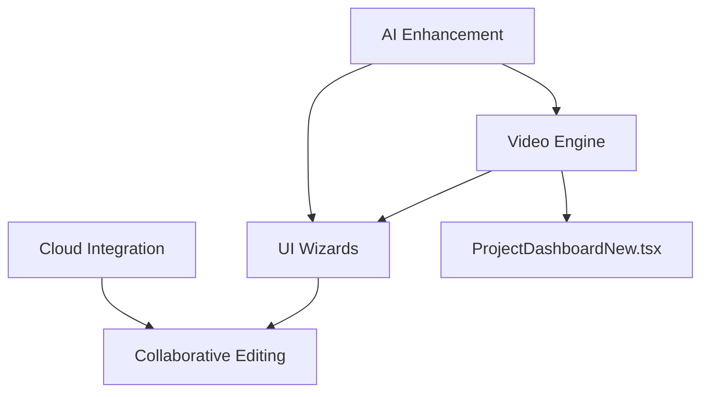

# Plan de Mise en Œuvre Phasé pour StoryCore-Engine

## Introduction
Ce document présente un plan de mise en œuvre phasé pour les fonctionnalités prioritaires identifiées dans l'analyse précédente. Le plan est structuré pour assurer une intégration transparente avec l'écosystème existant de StoryCore tout en identifiant des opportunités d'innovation.

## Diagramme des Dépendances

## Phases de Mise en Œuvre

### Phase 1: Préparation et Intégration Backend
**Objectif**: Assurer que les composants backend existants sont prêts pour les nouvelles fonctionnalités.

**Tâches**:
- [ ] Valider la stabilité du Video Engine et de l'AI Enhancement Integration
- [ ] Optimiser les performances du batch processing system
- [ ] Préparer les API pour l'intégration cloud

**Jalons**:
- Video Engine et AI Enhancement validés et documentés
- API backend prêtes pour le cloud
- Performances optimisées pour le traitement par lots

**Métriques de Succès**:
- 100% des tests unitaires et d'intégration réussis
- Temps de réponse des API < 200ms
- Capacité de traitement par lots > 5 jobs/seconde

**Dépendances**: Aucune dépendance externe pour cette phase.

### Phase 2: Développement des Fonctionnalités UI
**Objectif**: Implémenter les composants UI nécessaires pour supporter les nouvelles fonctionnalités.

**Tâches**:
- [ ] Finaliser ProjectDashboardNew.tsx avec gestion des prompts par plan
- [ ] Implémenter les wizards UI pour la configuration et la gestion des projets
- [ ] Intégrer les wizards avec le Video Engine et l'AI Enhancement

**Jalons**:
- ProjectDashboardNew.tsx fonctionnel et testé
- Wizards UI intégrés et opérationnels
- Intégration réussie avec les composants backend

**Métriques de Succès**:
- 100% des tests d'interface utilisateur réussis
- Temps de chargement des wizards < 1 seconde
- Intégration backend sans erreurs

**Dépendances**: Phase 1 doit être complétée.

### Phase 3: Intégration Cloud
**Objectif**: Déployer l'intégration cloud pour supporter la scalabilité et la collaboration.

**Tâches**:
- [ ] Configurer l'infrastructure multi-cloud (AWS, Azure, GCP)
- [ ] Implémenter la synchronisation des données avec cache local
- [ ] Développer le système de gestion des ressources et d'optimisation des coûts

**Jalons**:
- Infrastructure cloud configurée et testée
- Synchronisation des données fonctionnelle
- Système de gestion des ressources opérationnel

**Métriques de Succès**:
- 99,9% de disponibilité du service cloud
- Synchronisation des données < 5 secondes
- Réduction des coûts de 20% grâce à l'optimisation

**Dépendances**: Phase 2 doit être complétée.

### Phase 4: Édition Collaborative
**Objectif**: Implémenter l'édition collaborative en temps réel avec gestion des versions.

**Tâches**:
- [ ] Développer le système de résolution des conflits en temps réel
- [ ] Implémenter le contrôle de version de type Git pour les projets vidéo
- [ ] Intégrer la gestion des rôles utilisateurs et le partage de projets

**Jalons**:
- Système de résolution des conflits fonctionnel
- Contrôle de version implémenté et testé
- Gestion des rôles utilisateurs opérationnelle

**Métriques de Succès**:
- Résolution des conflits en < 100ms
- 100% des opérations de versionnement réussies
- Gestion des rôles sans erreurs

**Dépendances**: Phase 3 doit être complétée.

### Phase 5: Optimisation et Innovation
**Objectif**: Identifier et implémenter des opportunités d'innovation au-delà de la parité des fonctionnalités.

**Tâches**:
- [ ] Améliorer la scalabilité avec un système de mise à l'échelle automatique
- [ ] Implémenter des améliorations UX uniques comme des prévisualisations interactives
- [ ] Optimiser les performances pour les grands projets

**Jalons**:
- Système de mise à l'échelle automatique fonctionnel
- Améliorations UX implémentées et testées
- Performances optimisées pour les grands projets

**Métriques de Succès**:
- Mise à l'échelle automatique sans intervention manuelle
- Satisfaction utilisateur > 90%
- Performances améliorées de 30% pour les grands projets

**Dépendances**: Phases 1-4 doivent être complétées.

## Intégration avec l'Écosystème Existant

### Points d'Intégration Clés
1. **Video Engine**: Assurer la compatibilité avec les workflows ComfyUI existants.
2. **AI Enhancement**: Intégrer avec les modèles existants et les systèmes de traitement.
3. **UI Components**: Maintenir la cohérence avec l'interface utilisateur actuelle.
4. **Batch Processing**: Utiliser le système existant pour les nouvelles fonctionnalités.

### Stratégie d'Intégration
- **APIs**: Utiliser les APIs existantes et les étendre si nécessaire.
- **Tests**: Assurer que les nouveaux composants passent tous les tests existants.
- **Documentation**: Mettre à jour la documentation pour refléter les nouvelles intégrations.

## Opportunités d'Innovation

### Scalabilité
- **Mise à l'échelle automatique**: Déployer des ressources supplémentaires en fonction de la charge.
- **Optimisation des coûts**: Utiliser des algorithmes d'optimisation pour réduire les coûts cloud.

### Améliorations UX
- **Prévisualisations interactives**: Permettre aux utilisateurs de voir les changements en temps réel.
- **Gestion des versions visuelle**: Offrir une interface visuelle pour le contrôle de version.
- **Collaboration en temps réel**: Améliorer l'expérience de collaboration avec des indicateurs visuels.

### Performances
- **Traitement par lots optimisé**: Améliorer les performances du batch processing pour les grands projets.
- **Cache intelligent**: Utiliser un cache intelligent pour réduire les temps de chargement.

## Conclusion
Ce plan de mise en œuvre phasé assure une intégration transparente avec l'écosystème existant de StoryCore tout en identifiant des opportunités d'innovation. Chaque phase est conçue pour être autonome tout en s'appuyant sur les phases précédentes, assurant ainsi une progression logique et mesurable.