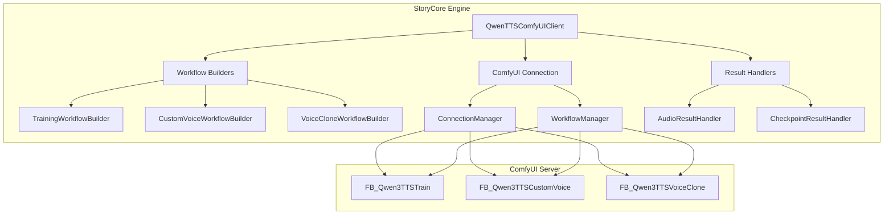

# Qwen TTS ComfyUI Integration Plan

## Overview

This plan outlines the implementation of a comprehensive Python module to interact with ComfyUI's Qwen TTS nodes programmatically, integrating fine-tuning, custom voice generation, and voice cloning capabilities into the storycore-engine project.

## Current State Analysis

### Existing Qwen3 TTS Integration (`src/qwen3_tts_integration.py`)
- Basic integration with `qwen_tts` package
- Simple voice generation and cloning methods
- Prompt strategy module for voice customization
- **Limitations**: Direct model usage without ComfyUI workflow orchestration

### Existing ComfyUI Infrastructure
- `ComfyUIManager` and `ConnectionManager` for server communication
- `WorkflowManager` for workflow deployment and execution
- Health monitoring and error handling systems
- Model management capabilities

### ComfyUI-Qwen-TTS Workflow Nodes (from GitHub)
The workflow provides three main nodes:

1. **FB_Qwen3TTSTrain** - Fine-tuning node
   - Parameters: `init_model`, `tokenizer`, `audio_folder`, `output_dir`, `speaker_name`, `test_text`, `language`, `learning_rate`, `num_epochs`, `batch_size`, `gradient_accumulation_steps`, `validate_every`
   - Output: `checkpoint_path`

2. **FB_Qwen3TTSCustomVoice** - Custom voice generation
   - Parameters: `text`, `speaker`, `model_choice`, `device`, `precision`, `language`, `seed`, `instruct`, `max_new_tokens`, `top_p`, `top_k`, `temperature`, `repetition_penalty`, `attention`, `unload_model_after_generate`, `custom_model_path`, `custom_speaker_name`
   - Output: `audio`

3. **FB_Qwen3TTSVoiceClone** - Voice cloning
   - Parameters: `ref_audio`, `voice_clone_prompt`, `target_text`, `model_choice`, `device`, `precision`, `language`, `ref_text`, `seed`, `max_new_tokens`, `top_p`, `top_k`, `temperature`, `repetition_penalty`, `x_vector_only`, `attention`, `unload_model_after_generate`, `custom_model_path`
   - Output: `audio`

## Architecture Design



## Module Structure

```
src/
├── qwen_tts_comfyui/
│   ├── __init__.py
│   ├── client.py              # Main QwenTTSComfyUIClient class
│   ├── config.py              # Configuration dataclasses
│   ├── workflows/
│   │   ├── __init__.py
│   │   ├── base.py            # Base workflow builder
│   │   ├── training.py        # Training workflow builder
│   │   ├── custom_voice.py    # Custom voice workflow builder
│   │   └── voice_clone.py     # Voice clone workflow builder
│   ├── handlers/
│   │   ├── __init__.py
│   │   ├── audio.py           # Audio result handler
│   │   └── checkpoint.py      # Checkpoint result handler
│   └── utils/
│       ├── __init__.py
│       ├── audio_utils.py     # Audio processing utilities
│       └── prompt_utils.py    # Prompt generation utilities
├── qwen3_tts_integration.py   # Updated to use ComfyUI client
└── qwen3_tts_prompt_strategy.py
```

## Implementation Details

### 1. Configuration Classes (`config.py`)

```python
@dataclass
class QwenTTSModelConfig:
    model_choice: str = "1.7B"  # 0.6B or 1.7B
    device: str = "cuda"
    precision: str = "bf16"
    attention: str = "auto"
    
@dataclass
class QwenTTSGenerationConfig:
    max_new_tokens: int = 2048
    top_p: float = 0.8
    top_k: int = 20
    temperature: float = 1.0
    repetition_penalty: float = 1.05
    seed: int = 0
    
@dataclass
class QwenTTSTrainingConfig:
    init_model: str = "Qwen/Qwen3-TTS-12Hz-1.7B-Base"
    tokenizer: str = "Qwen/Qwen3-TTS-Tokenizer-12Hz"
    learning_rate: float = 0.00002
    num_epochs: int = 10
    batch_size: int = 1
    gradient_accumulation_steps: int = 4
    validate_every: int = 2
```

### 2. Main Client Class (`client.py`)

Key methods:
- `__init__(comfyui_url, config)` - Initialize with ComfyUI connection
- `generate_voice(text, speaker, **kwargs)` - Generate voice with built-in speaker
- `generate_custom_voice(text, custom_model_path, custom_speaker_name, **kwargs)` - Generate with fine-tuned model
- `clone_voice(ref_audio, target_text, **kwargs)` - Clone voice from reference
- `train_model(audio_folder, output_dir, speaker_name, **kwargs)` - Fine-tune model
- `get_available_speakers()` - List available speakers
- `get_model_status()` - Check model loading status

### 3. Workflow Builders

Each workflow builder will:
1. Accept configuration parameters
2. Build the ComfyUI workflow JSON structure
3. Handle node connections and routing
4. Validate inputs before submission

### 4. Integration with Existing TTS Service

Update `backend/video_editor_ai_service.py`:
- Add `qwen_comfyui` as a TTS backend option
- Implement `QwenComfyUITTSService` class
- Support both direct and ComfyUI-based generation

## Workflow JSON Templates

### Custom Voice Generation Workflow

```json
{
  "1": {
    "class_type": "FB_Qwen3TTSCustomVoice",
    "inputs": {
      "text": "{{text}}",
      "speaker": "{{speaker}}",
      "model_choice": "{{model_choice}}",
      "device": "{{device}}",
      "precision": "{{precision}}",
      "language": "{{language}}",
      "seed": "{{seed}}",
      "instruct": "{{instruct}}",
      "max_new_tokens": {{max_new_tokens}},
      "top_p": {{top_p}},
      "top_k": {{top_k}},
      "temperature": {{temperature}},
      "repetition_penalty": {{repetition_penalty}},
      "attention": "{{attention}}",
      "unload_model_after_generate": {{unload_model_after_generate}},
      "custom_model_path": "{{custom_model_path}}",
      "custom_speaker_name": "{{custom_speaker_name}}"
    }
  }
}
```

### Voice Cloning Workflow

```json
{
  "1": {
    "class_type": "FB_Qwen3TTSVoiceClone",
    "inputs": {
      "ref_audio": "{{ref_audio}}",
      "target_text": "{{target_text}}",
      "model_choice": "{{model_choice}}",
      "device": "{{device}}",
      "precision": "{{precision}}",
      "language": "{{language}}",
      "ref_text": "{{ref_text}}",
      "seed": "{{seed}}",
      "max_new_tokens": {{max_new_tokens}},
      "top_p": {{top_p}},
      "top_k": {{top_k}},
      "temperature": {{temperature}},
      "repetition_penalty": {{repetition_penalty}},
      "x_vector_only": {{x_vector_only}},
      "attention": "{{attention}}",
      "unload_model_after_generate": {{unload_model_after_generate}},
      "custom_model_path": "{{custom_model_path}}"
    }
  }
}
```

### Training Workflow

```json
{
  "1": {
    "class_type": "FB_Qwen3TTSTrain",
    "inputs": {
      "init_model": "{{init_model}}",
      "tokenizer": "{{tokenizer}}",
      "audio_folder": "{{audio_folder}}",
      "output_dir": "{{output_dir}}",
      "speaker_name": "{{speaker_name}}",
      "test_text": "{{test_text}}",
      "language": "{{language}}",
      "learning_rate": {{learning_rate}},
      "num_epochs": {{num_epochs}},
      "batch_size": {{batch_size}},
      "gradient_accumulation_steps": {{gradient_accumulation_steps}},
      "validate_every": {{validate_every}}
    }
  }
}
```

## API Design

### Python API Usage

```python
from src.qwen_tts_comfyui import QwenTTSComfyUIClient, QwenTTSConfig

# Initialize client
config = QwenTTSConfig(
    comfyui_url="http://127.0.0.1:8188",
    model_choice="1.7B",
    device="cuda",
    precision="bf16"
)
client = QwenTTSComfyUIClient(config)

# Generate voice with built-in speaker
result = await client.generate_voice(
    text="Hello, this is a test.",
    speaker="Ryan",
    language="English",
    instruct="Speak with a warm, friendly tone"
)
# result.audio_path contains the generated audio file

# Generate with custom fine-tuned model
result = await client.generate_custom_voice(
    text="This is my custom voice.",
    custom_model_path="D:\\checkpoints\\checkpoint-epoch-9",
    custom_speaker_name="贞贞"
)

# Clone voice from reference audio
result = await client.clone_voice(
    ref_audio="reference.wav",
    target_text="This will sound like the reference.",
    language="Auto"
)

# Fine-tune a model
training_result = await client.train_model(
    audio_folder="/path/to/audio/dataset",
    output_dir="/path/to/output",
    speaker_name="new_speaker",
    language="English",
    num_epochs=10,
    learning_rate=0.00002
)
```

### REST API Endpoints

Add to `backend/video_editor_api.py`:

```python
@VIDEO_EDITOR_ROUTER.post("/ai/tts/qwen/generate")
async def qwen_tts_generate(request: QwenTTSRequest):
    """Generate voice using Qwen TTS via ComfyUI"""
    pass

@VIDEO_EDITOR_ROUTER.post("/ai/tts/qwen/clone")
async def qwen_tts_clone(request: QwenVoiceCloneRequest):
    """Clone voice using Qwen TTS via ComfyUI"""
    pass

@VIDEO_EDITOR_ROUTER.post("/ai/tts/qwen/train")
async def qwen_tts_train(request: QwenTTSTrainRequest):
    """Fine-tune Qwen TTS model"""
    pass

@VIDEO_EDITOR_ROUTER.get("/ai/tts/qwen/speakers")
async def get_qwen_speakers():
    """Get available Qwen TTS speakers"""
    pass
```

## Testing Strategy

### Unit Tests
- Test workflow builder JSON generation
- Test configuration validation
- Test client initialization
- Mock ComfyUI responses for isolated testing

### Integration Tests
- Test against running ComfyUI instance
- Test full voice generation pipeline
- Test voice cloning with sample audio
- Test training workflow with small dataset

### Performance Tests
- Measure generation latency
- Test concurrent request handling
- Memory usage monitoring

## Dependencies

Add to `requirements.txt`:
```
aiohttp>=3.8.0
websockets>=10.0
```

## Migration Path

1. **Phase 1**: Create new module alongside existing code
2. **Phase 2**: Add feature flag to switch between direct and ComfyUI modes
3. **Phase 3**: Update existing `Qwen3TTSIntegration` to use ComfyUI client internally
4. **Phase 4**: Deprecate direct model usage in favor of ComfyUI workflows

## Configuration

Add to `config/default.yaml`:

```yaml
tts:
  qwen:
    backend: comfyui  # direct or comfyui
    comfyui_url: http://127.0.0.1:8188
    model_choice: 1.7B
    device: cuda
    precision: bf16
    default_speaker: Ryan
    generation:
      max_new_tokens: 2048
      top_p: 0.8
      top_k: 20
      temperature: 1.0
      repetition_penalty: 1.05
    training:
      learning_rate: 0.00002
      num_epochs: 10
      batch_size: 1
      gradient_accumulation_steps: 4
```

## Error Handling

- Connection errors: Retry with exponential backoff
- Workflow execution errors: Parse ComfyUI error messages
- Timeout handling: Configurable timeouts for long operations
- Fallback mode: Use direct TTS if ComfyUI unavailable

## Documentation Updates

1. Update `documentation/API_REFERENCE.md` with new TTS endpoints
2. Create `documentation/QWEN_TTS_INTEGRATION.md` with usage examples
3. Add inline code documentation with docstrings
4. Create Jupyter notebook with examples

## Estimated Tasks Breakdown

1. **Core Module Implementation**
   - Configuration classes
   - Main client class
   - Workflow builders

2. **Integration Layer**
   - Backend TTS service integration
   - REST API endpoints
   - Configuration management

3. **Testing**
   - Unit tests
   - Integration tests
   - Test fixtures and mocks

4. **Documentation**
   - API documentation
   - Usage examples
   - Migration guide

## Success Criteria

- [ ] Can generate voice using built-in speakers via ComfyUI
- [ ] Can generate voice using fine-tuned custom models
- [ ] Can clone voices from reference audio
- [ ] Can initiate fine-tuning jobs
- [ ] All unit tests pass
- [ ] Integration tests pass with running ComfyUI
- [ ] Documentation is complete and accurate
