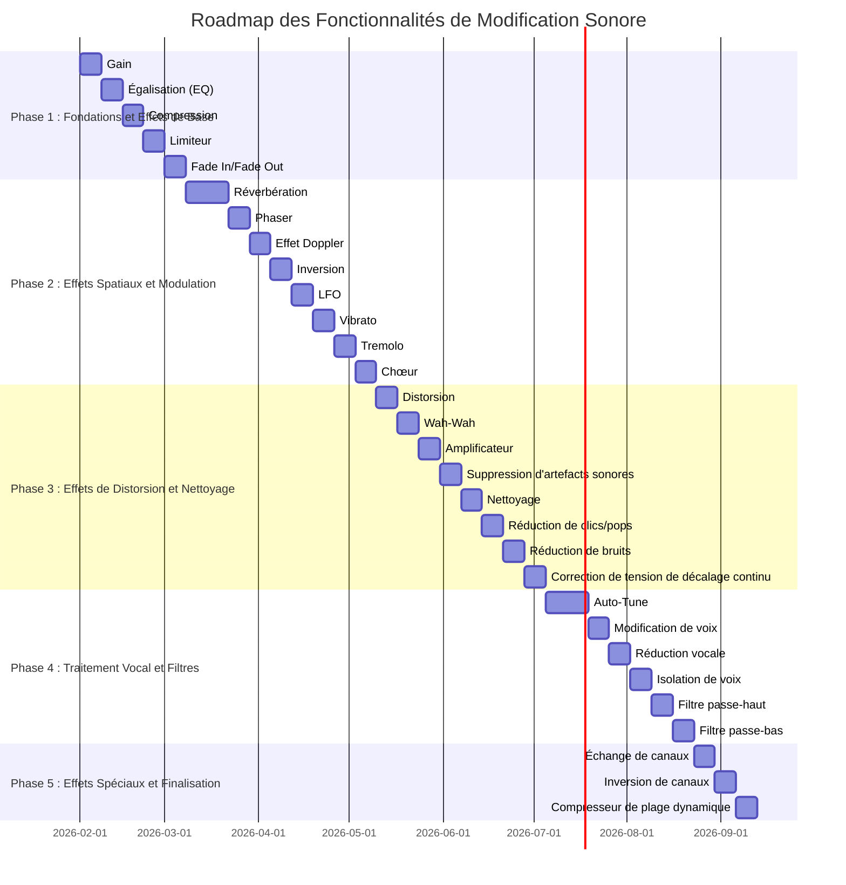

# Roadmap Détaillée pour les Fonctionnalités de Modification Sonore

## Introduction
Ce document présente une roadmap détaillée pour l'implémentation des fonctionnalités de modification sonore de base. Les fonctionnalités sont organisées en phases logiques, avec des dépendances claires et des priorités définies pour faciliter le développement.

## Catégories de Fonctionnalités

### 1. Effets de Base
- **Gain** : Ajustement du volume audio.
- **Égalisation (EQ)** : Ajustement des fréquences audio.
- **Compression** : Réduction de la plage dynamique.
- **Limiteur** : Empêcher la distorsion due aux pics de volume.
- **Fade In/Fade Out** : Transitions douces pour le début et la fin des pistes.

### 2. Effets Spatiaux
- **Réverbération** : Simulation de l'acoustique d'un espace.
- **Phaser** : Effet de modulation pour un son spatial.
- **Effet Doppler** : Simulation du changement de fréquence dû au mouvement.
- **Inversion** : Inverser l'audio pour des effets spéciaux.

### 3. Effets de Modulation
- **LFO (Low-Frequency Oscillator)** : Modulation périodique des paramètres audio.
- **Vibrato** : Variation périodique de la hauteur.
- **Tremolo** : Variation périodique du volume.
- **Chœur** : Effet de duplication de voix pour un son plus riche.

### 4. Effets de Distorsion
- **Distorsion** : Ajout de saturation pour un son plus agressif.
- **Wah-Wah** : Effet de filtre dynamique.
- **Amplificateur** : Simulation d'amplificateurs pour un son plus chaud.

### 5. Nettoyage et Réparation
- **Suppression d'artefacts sonores** : Élimination des bruits indésirables.
- **Nettoyage** : Réduction des bruits de fond.
- **Réduction de clics/pops** : Élimination des bruits impulsifs.
- **Réduction de bruits** : Réduction des bruits parasites.
- **Correction de tension de décalage continu** : Correction des problèmes de décalage.

### 6. Traitement Vocal
- **Auto-Tune** : Correction de la hauteur des voix.
- **Modification de voix** : Changement de la tonalité ou du timbre de la voix.
- **Réduction vocale** : Réduction des voix dans un mix.
- **Isolation de voix** : Extraction des voix d'un mix.

### 7. Filtres
- **Filtre passe-haut** : Élimination des basses fréquences.
- **Filtre passe-bas** : Élimination des hautes fréquences.

### 8. Effets Spéciaux
- **Échange de canaux** : Inversion des canaux stéréo.
- **Inversion de canaux** : Inversion des canaux audio.
- **Compresseur de plage dynamique** : Réduction de la plage dynamique pour un son plus uniforme.

## Phases de Développement

### Phase 1 : Fondations et Effets de Base
**Objectif** : Implémenter les fonctionnalités essentielles pour le traitement audio de base.

- **Gain**
- **Égalisation (EQ)**
- **Compression**
- **Limiteur**
- **Fade In/Fade Out**

**Priorité** : Haute
**Durée estimée** : 4 semaines

### Phase 2 : Effets Spatiaux et Modulation
**Objectif** : Ajouter des effets pour enrichir l'expérience audio.

- **Réverbération**
- **Phaser**
- **Effet Doppler**
- **Inversion**
- **LFO**
- **Vibrato**
- **Tremolo**
- **Chœur**

**Priorité** : Moyenne
**Durée estimée** : 6 semaines

### Phase 3 : Effets de Distorsion et Nettoyage
**Objectif** : Implémenter des effets pour un son plus dynamique et nettoyer les artefacts.

- **Distorsion**
- **Wah-Wah**
- **Amplificateur**
- **Suppression d'artefacts sonores**
- **Nettoyage**
- **Réduction de clics/pops**
- **Réduction de bruits**
- **Correction de tension de décalage continu**

**Priorité** : Moyenne
**Durée estimée** : 5 semaines

### Phase 4 : Traitement Vocal et Filtres
**Objectif** : Ajouter des fonctionnalités spécifiques pour le traitement vocal.

- **Auto-Tune**
- **Modification de voix**
- **Réduction vocale**
- **Isolation de voix**
- **Filtre passe-haut**
- **Filtre passe-bas**

**Priorité** : Moyenne
**Durée estimée** : 5 semaines

### Phase 5 : Effets Spéciaux et Finalisation
**Objectif** : Implémenter les effets spéciaux et finaliser le projet.

- **Échange de canaux**
- **Inversion de canaux**
- **Compresseur de plage dynamique**

**Priorité** : Basse
**Durée estimée** : 3 semaines

## Dépendances

- **Phase 1** : Aucune dépendance, mais nécessaire pour les phases suivantes.
- **Phase 2** : Dépend de la Phase 1 pour les fonctionnalités de base.
- **Phase 3** : Dépend de la Phase 1 pour les fonctionnalités de base.
- **Phase 4** : Dépend de la Phase 1 pour les fonctionnalités de base.
- **Phase 5** : Dépend des Phases 1, 2, 3, et 4 pour les fonctionnalités avancées.

## Diagramme de Roadmap

## Conclusion
Cette roadmap fournit une structure claire pour le développement des fonctionnalités de modification sonore. Les phases sont conçues pour être logiques et progressives, avec des dépendances bien définies pour assurer une implémentation fluide et efficace.