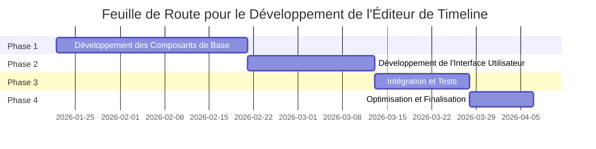

# Feuille de Route pour le Développement de l'Éditeur de Timeline

## Phase 1 : Développement des Composants de Base

### Objectifs
- Développer les composants de base nécessaires pour la gestion des données et des intégrations.
- Assurer la stabilité et la fiabilité des composants avant l'intégration avec l'interface utilisateur.

### Tâches
1. **Développement du Composant de Gestion des Données**
   - Implémentation des fonctionnalités de gestion des événements temporels, des médias et des annotations.
   - Développement des méthodes de validation des événements.
   - Tests unitaires pour assurer la fiabilité du composant.

2. **Développement du Composant d'Intégration**
   - Implémentation des connexions aux bases de données.
   - Développement des méthodes pour les requêtes et réponses avec les APIs externes.
   - Gestion des erreurs et des reconnexions.

3. **Développement du Composant de Logique Métier**
   - Implémentation des règles métier pour la validation des événements.
   - Développement des méthodes pour la gestion des conflits de temps.
   - Coordination entre les composants de gestion des données et d'intégration.

### Dépendances
- Aucune dépendance externe pour cette phase.
- Les composants doivent être développés en parallèle pour assurer une intégration fluide.

## Phase 2 : Développement de l'Interface Utilisateur

### Objectifs
- Développer une interface utilisateur intuitive et interactive pour la timeline.
- Implémenter les fonctionnalités de glisser-déposer et de visualisation interactive.

### Tâches
1. **Développement de l'Interface de Base**
   - Création de la structure de base pour l'affichage de la timeline.
   - Implémentation des fonctionnalités de zoom et de défilement.
   - Affichage des événements, médias et annotations sur la timeline.

2. **Implémentation du Glisser-Déposer**
   - Développement des fonctionnalités de glisser-déposer pour les événements et les médias.
   - Feedback visuel pendant les opérations de glisser-déposer.
   - Validation des réorganisations pour éviter les conflits.

3. **Ajout des Détails des Événements**
   - Affichage des détails des événements (heure, durée, description, etc.).
   - Affichage des annotations associées aux événements.
   - Options pour masquer ou afficher les détails selon les préférences de l'utilisateur.

### Dépendances
- Dépend de la Phase 1 pour les composants de gestion des données et de logique métier.
- Les fonctionnalités de glisser-déposer dépendent de la stabilité du composant de gestion des données.

## Phase 3 : Intégration et Tests

### Objectifs
- Intégrer les composants de base avec l'interface utilisateur.
- Tester les fonctionnalités pour assurer leur bon fonctionnement.

### Tâches
1. **Intégration des Composants**
   - Intégration du composant de gestion des données avec l'interface utilisateur.
   - Intégration du composant de logique métier avec l'interface utilisateur.
   - Assurer la communication fluide entre les composants.

2. **Tests des Fonctionnalités**
   - Tests des fonctionnalités de gestion des événements et des séquences.
   - Tests des intégrations avec les bases de données et les APIs.
   - Tests de l'interface utilisateur pour assurer une expérience utilisateur fluide.

3. **Correction des Bugs**
   - Identification et correction des bugs identifiés lors des tests.
   - Optimisation des performances si nécessaire.

### Dépendances
- Dépend de la Phase 1 et de la Phase 2 pour les composants et l'interface utilisateur.
- Les tests dépendent de la stabilité des composants et de l'interface utilisateur.

## Phase 4 : Optimisation et Finalisation

### Objectifs
- Optimiser les performances de l'éditeur.
- Finaliser la documentation et préparer pour le déploiement.

### Tâches
1. **Optimisation des Performances**
   - Analyse des performances de l'éditeur.
   - Optimisation des requêtes et des réponses avec les bases de données et les APIs.
   - Amélioration de la réactivité de l'interface utilisateur.

2. **Correction des Bugs Finaux**
   - Identification et correction des bugs restants.
   - Assurer la stabilité de l'éditeur avant le déploiement.

3. **Finalisation de la Documentation**
   - Rédaction de la documentation technique pour les développeurs.
   - Rédaction de la documentation utilisateur pour les éditeurs de contenu et les utilisateurs finaux.
   - Préparation des guides d'installation et de configuration.

### Dépendances
- Dépend de la Phase 3 pour les tests et la correction des bugs.
- La finalisation de la documentation dépend de la stabilité de l'éditeur.

## Diagramme de la Feuille de Route

## Conclusion

Cette feuille de route propose une approche structurée pour le développement de l'éditeur de timeline, en assurant que chaque phase dépend des résultats de la phase précédente. Cela permet de minimiser les risques et d'assurer une intégration fluide des composants.