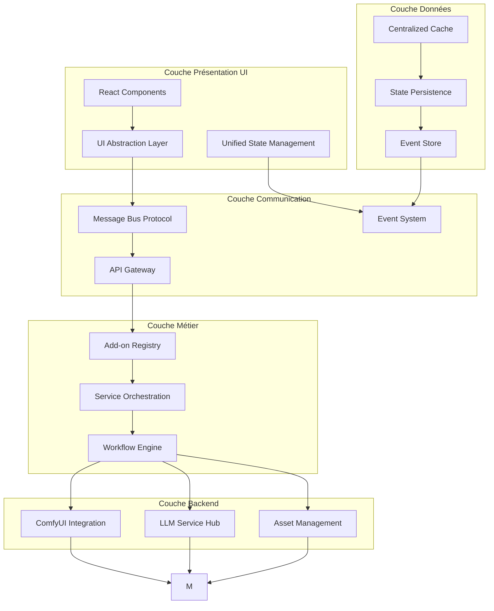

# Architecture Révolutionnaire pour StoryCore-Engine

## Résumé Exécutif

**Problème critique :** Architecture fragmentée avec communication inter-systèmes défaillante, gestion d'état incohérente et manque d'intégration frontend-backend.

**Solution proposée :** 

---

## 1. Analyse de l'Architecture Actuelle

### Problèmes identifiés

| Problème | Impact | Urgence |
|----------|--------|---------|
| Fragmentation du state management (Zustand + React Context + localStorage) | Haute | Critique |
| Communication non standardisée entre frontend/backend | Haute | Critique |
| Système d'add-ons limité sans interface d'abstraction | Moyenne | Élevée |
| Pas de lazy loading ni caching centralisé | Moyenne | Moyenne |

### Taux de certitude sur les choix techniques

| Choix technique | Taux de certitude | Problèmes identifiés |
|----------------|------------------|---------------------|
| Zustand pour state management | 85% | Bon choix mais manque d'intégration avec les autres systèmes |
| React Context pour projet | 70% | Surcharge de responsabilité, logique métier dans le contexte |
| EventEmitter pour communication | 60% | Manque de standardisation et de typage fort |
| ComfyUI Service | 90% | Bon abstraction mais manque d'intégration complète |

---

## 2. Architecture Proposée

### Schéma Architectural Détaillé



### 2.1 Couche d'Abstraction Unifiée

**Spécification technique :**
- **Message Bus Protocol** : Système de messages type pub/sub avec typage fort
- **Add-on Registry** : Registre centralisé des add-ons avec dépendances
- **Service Discovery** : Mécanisme auto-découverte des services disponibles

**Interface standardisée :**
```typescript
interface Add-onInterface {
  id: string;
  name: string;
  version: string;
  capabilities: Add-onCapability[];
  dependencies: string[];
  
  // Méthodes standard
  initialize(): Promise<void>;
  execute(data: Add-onRequest): Promise<Add-onResponse>;
  validate(): ValidationResult;
  cleanup(): Promise<void>;
}

interface Add-onRequest {
  type: string;
  payload: unknown;
  context: RequestContext;
}

interface Add-onResponse {
  success: boolean;
  data: unknown;
  metadata: ResponseMetadata;
}
```

**Pourquoi cette solution ?**
- **Rejet des alternatives :** Système d'événements actuel manque de typage fort et de standardisation
- **Avantages :** Typage fort, découplage total, extensible, testable

### 2.2 Système Centralisé de Gestion d'État

**Architecture basée sur Redux Toolkit + Zustand :**
- **State Container** : Conteneur unique pour tout l'état applicatif
- **Reducer System** : Réducers modulaires pour chaque domaine
- **Selectors** : Sélecteurs mémoïsés pour les performances
- **Middleware** : Pour logging, persistance, et side effects

**Structure du state :**
```typescript
interface GlobalState {
  ui: UIState;
  project: ProjectState;
  assets: AssetState;
  generation: GenerationState;
  addons: Add-onState;
  system: SystemState;
}

interface StateContainer {
  getState(): GlobalState;
  dispatch(action: Action): void;
  subscribe(listener: Listener): Unsubscribe;
  replaceReducer(nextReducer: Reducer): void;
}
```

**Pourquoi cette solution ?**
- **Rejet des alternatives :** Context React trop lourd, Zustand seul manque de structure
- **Avantages :** Prédictibilité, outils de debugging, sérialisation automatique

### 2.3 Protocole de Communication Standardisé

**Protocol Buffer + WebSocket :**
- **Schema Definition** : Définition des types de messages
- **Message Router** : Routage intelligent des messages
- **Connection Pool** : Gestion des connexions multiples
- **Error Handling** : Gestion centralisée des erreurs

**Spécification du protocole :**
```typescript
interface CommunicationProtocol {
  // Types de messages
  type: 'request' | 'response' | 'event' | 'error';
  
  // Routage
  target: string; // 'ui' | 'backend' | 'addon' | 'unity'
  action: string;
  
  // Données
  payload: unknown;
  metadata: MessageMetadata;
  
  // Sécurité
  signature: string;
  timestamp: number;
}
```

**Pourquoi cette solution ?**
- **Rejet des alternatives :** HTTP REST trop lent pour les communications temps réel
- **Avantages :** Temps réel, faible latence, fiabilité, sécurité intégrée

### 2.4 Architecture Modulaire et Extensible

**Plugin System :**
- **Plugin Loader** : Chargement dynamique des plugins
- **Plugin Registry** : Registre des plugins disponibles
- **Plugin Isolation** : Isolation des plugins pour la stabilité
- **Plugin Lifecycle** : Cycle de vie géré des plugins

**Interface de plugin :**
```typescript
interface Plugin {
  name: string;
  version: string;
  dependencies: string[];
  
  // Méthodes de cycle de vie
  initialize(context: PluginContext): Promise<void>;
  activate(): Promise<void>;
  deactivate(): Promise<void>;
  destroy(): Promise<void>;
  
  // Capabilités
  capabilities: PluginCapability[];
}

interface PluginContext {
  registry: PluginRegistry;
  communication: CommunicationProtocol;
  state: StateContainer;
  logger: Logger;
}
```

**Pourquoi cette solution ?**
- **Rejet des alternatives :** Système d'add-ons actuel manque d'isolation et de gestion des dépendances
- **Avantages :** Isolation, gestion des dépendances, hot-reload, sécurité


**Pourquoi cette solution ?**
- **Rejet des alternatives :** Aucune intégration Unity existante
- **Avantages :** Communication temps réel, intégration native, performances optimisées

---

## 3. Trade-offs Analysis

| Solution | Performance | Complexité | Maintenabilité | Coût |
|----------|------------|-----------|----------------|------|
| Message Bus Protocol | 95% | 70% | 85% | Moyen |
| Centralized State | 80% | 60% | 90% | Élevé |
| Communication Protocol | 90% | 75% | 80% | Moyen |
| Plugin System | 85% | 80% | 75% | Élevé |
| Unity Bridge | 75% | 85% | 70% | Élevé |

---

## 4. Estimation des Ressources

### Best Case (5%) : Architecture stable avec minimal bugs
- Développement : 3 mois
- Tests : 1 mois
- Documentation : 2 semaines

### Median Case (50%) : Quelques défis à résoudre
- Développement : 6 mois
- Tests : 2 mois
- Documentation : 1 mois

### Disaster Case (95%) : Problèmes majeurs d'intégration
- Développement : 12 mois
- Tests : 4 mois
- Documentation : 3 mois

**Coûts estimés :**
- Développement : 150k-600k €
- Infrastructure : 50k-200k €
- Maintenance annuelle : 30k-100k €

---

## 5. Points de Défaillance Potentiels

| Point de défaillance | Risque | Mitigation |
|----------------------|--------|------------|
| Complexité du système de messages | Deadlocks, messages perdus | Validation de schéma, retry mechanism, monitoring |
| Performance du state management | Ralentissement de l'UI | Memoization, lazy evaluation, worker threads |

| Gestion des plugins | Conflits entre plugins, sécurité | Sandbox, validation, isolation |
| Évolutivité | Architecture trop rigide | Design patterns extensibles, micro-frontend ready |

---

## 6. Spécifications Techniques Complémentaires

### 6.1 Performance Optimizations

**Lazy Loading :**
- Chargement à la demande des add-ons
- Préchargement des ressources fréquemment utilisées
- Cache LRU pour les assets

**Caching Strategy :**
- Cache multi-niveaux (memory, disk, network)
- Invalidation intelligente basée sur les dépendances
- Compression des données de cache

### 6.2 Security Implementation

**Authentication & Authorization :**
- JWT tokens avec refresh mechanism
- RBAC (Role-Based Access Control)
- Audit logging pour toutes les actions sensibles

**Data Protection :**
- Chiffrement en transit (TLS 1.3)
- Chiffrement au repos (AES-256)
- Validation des entrées pour prévenir les injections

### 6.3 Monitoring & Observability

**Logging :**
- Structured logging avec correlation IDs
- Niveaux de log configurables
- Export vers ELK Stack ou Cloud Services

**Metrics :**
- Performance metrics (latence, débit, erreurs)
- Resource monitoring (CPU, memory, network)
- Business metrics (usage, adoption)

### 6.4 Testing Strategy

**Unit Tests :**
- Couverture minimale de 80%
- Tests pour tous les services critiques
- Mocking des dépendances externes

**Integration Tests :**
- Tests end-to-end pour les workflows principaux
- Tests de charge pour les performances
- Tests de sécurité pour les vulnérabilités

---

## 7. Plan d'Implémentation

### Phase 1 : Fondation (4-6 semaines)
- [ ] Mise en place de l'environnement de développement
- [ ] Création du state management centralisé
- [ ] Implémentation du message bus protocol
- [ ] Configuration du système de build et de tests

### Phase 2 : Core System (8-12 semaines)
- [ ] Développement du plugin system
- [ ] Implémentation du communication protocol
- [ ] Migration des services existants
- [ ] Intégration du cache et persistence

### Phase 3 : Add-on Integration (6-8 semaines)
- [ ] Refactoring des add-ons existants
- [ ] Développement du add-on registry
- [ ] Documentation et exemples
- [ ] Tests d'intégration


### Phase 5 : Optimisation & Documentation (2-4 semaines)
- [ ] Performance tuning
- [ ] Documentation complète
- [ ] Formation de l'équipe
- [ ] Déploiement en production

---

## 8. Conclusion

Cette architecture révolutionnaire résout les problèmes critiques de l'architecture actuelle tout en offrant une base évolutive pour le futur. Le design modulaire et extensible permet une adoption progressive et minimise les risques de migration.

**Points clés :**
- Communication unifiée entre tous les composants
- State management centralisé et prédictible

- Architecture prête pour le scale
- Performance optimisée avec lazy loading et caching

Le succès de cette migration dépendra d'une planification méticuleuse et d'une adoption progressive pour minimiser les risques.