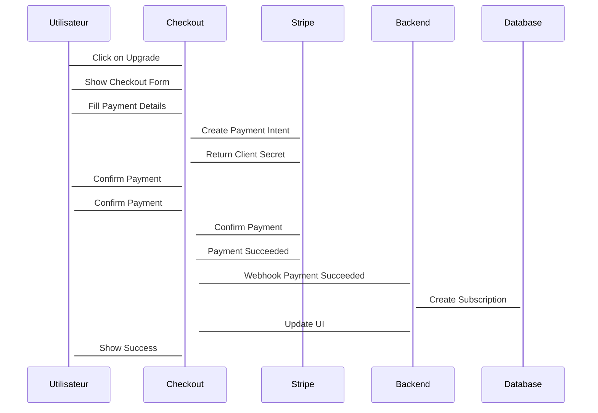

# Plan d'Action - Développement du SaaS de Monétisation

## Objectifs

1. **Architecture** : Construire une architecture scalable et sécurisée
2. **Monétisation** : Implémenter des modèles d'abonnement flexibles
3. **Multi-plateforme** : Déployer sur web, mobile et desktop
4. **Store d'Assets** : Créer un marketplace pour plugins/extensions
5. **Scalabilité** : Préparer pour la croissance et l'adoption massive

## Phase 1 : Fondations (Semaines 1-4)

### Semaine 1-2 : Backend Core

#### Tâche 1.1 : Setup Architecture
- **Action** : Initialiser projet Node.js/TypeScript
- **Fichiers** : `package.json`, `tsconfig.json`, `docker-compose.yml`
- **Framework** : NestJS avec TypeScript
- **Database** : PostgreSQL avec TypeORM
- **Cache** : Redis pour sessions et cache

#### Tâche 1.2 : Système d'Authentification
- **Action** : Implémenter OAuth 2.0/JWT
- **Providers** : Google, Apple, Email, GitHub
- **Sécurité** : Rate limiting, 2FA optionnelle
- **Sessions** : Redis pour scalabilité
- **Tests** : Tests unitaires et d'intégration

#### Tâche 1.3 : API Gateway
- **Action** : Créer API Gateway avec rate limiting
- **Routes** : `/auth`, `/users`, `/subscriptions`
- **Validation** : Validation de schéma avec Joi/P class-validator
- **Logging** : Structured logging avec Winston
- **Monitoring** : Métriques de base avec Prometheus

### Semaine 3-4 : Base de Données et Models

#### Tâche 2.1 : Schéma PostgreSQL
- **Action** : Créer schéma de base de données
- **Tables** : users, subscriptions, api_keys, assets
- **Relations** : Clés étrangères et index
- **Migrations** : TypeORM migrations
- **Seed** : Données de test

#### Tâche 2.2 : Models et Services
- **Action** : Créer models et services
- **Models** : User, Subscription, ApiKey, Asset
- **Services** : UserService, SubscriptionService, AssetService
- **Validation** : DTOs avec validation
- **Business Logic** : Règles métier

#### Tâche 2.3 : Tests et CI/CD
- **Action** : Configurer tests et CI/CD
- **Tests** : Unit, integration, e2e
- **CI** : GitHub Actions ou GitLab CI
- **Coverage** : 90%+ coverage requirement
- **Linting** : ESLint et Prettier

## Phase 2 : Monétisation (Semaines 5-8)

### Semaine 5-6 : Système d'Abonnement

#### Tâche 3.1 : Modèles d'Abonnement
- **Action** : Implémenter plans d'abonnement
- **Plans** : Basic, Pro, Enterprise
- **Quotas** : API calls, storage, bandwidth
- **Billing** : Stripe integration
- **Webhooks** : Stripe webhooks pour events

#### Tâche 3.2 : Gestion des Abonnements
- **Action** : Système de gestion d'abonnements
- **Lifecycle** : Trial, active, cancelled, expired
- **Upgrades** : Downgrades et upgrades
- **Notifications** : Email notifications
- **Analytics** : Métriques d'abonnement

#### Tâche 3.3 : API Keys et Rate Limiting
- **Action** : Système de clés API
- **Generation** : Clés sécurisées avec permissions
- **Rate Limiting** : Par clé et par utilisateur
- **Monitoring** : Tracking d'utilisation
- **Security** : Rotation et révocation

### Semaine 7-8 : Store d'Assets

#### Tâche 4.1 : Catalogue d'Assets
- **Action** : Créer marketplace
- **Assets** : Plugins, extensions, templates
- **Categories** : Organisation par type
- **Search** : Full-text search avec Elasticsearch
- **Reviews** : Système de review/commentaires

#### Tâche 4.2 : Gestion des Licences
- **Action** : Système de licences
- **Types** : Personal, Commercial, Enterprise
- **Validation** : Vérification des licences
- **Updates** : Distribution automatique
- **Revenue** : Partage de revenus avec développeurs

#### Tâche 4.3 : Dashboard Développeur
- **Action** : Dashboard pour développeurs
- **Analytics** : Ventes, revenus, téléchargements
- **Management** : Gestion des assets
- **Payouts** : Système de payouts
- **Support** : Support pour développeurs

## Phase 3 : Multi-plateforme (Semaines 9-12)

### Semaine 9-10 : Web App

#### Tâche 5.1 : Frontend Web
- **Action** : Créer PWA avec React
- **Framework** : React avec TypeScript
- **State Management** : Redux Toolkit ou Zustand
- **Styling** : Tailwind CSS ou Material-UI
- **PWA** : Service worker, offline support

#### Tâche 5.2 : Intégration API
- **Action** : Connecter frontend à API
- **Client** : Axios ou fetch avec interceptors
- **Auth** : Gestion du token JWT
- **Caching** : SWR ou React Query
- **Error Handling** : Gestion centralisée des erreurs

#### Tâche 5.3 : Dashboard Utilisateur
- **Action** : Créer dashboard utilisateur
- **Overview** : Métriques d'utilisation
- **Billing** : Gestion des paiements
- **Profile** : Gestion du profil
- **Settings** : Préférences utilisateur

### Semaine 11-12 : Mobile & Desktop

#### Tâche 6.1 : Mobile App
- **Action** : Créer app React Native
- **Platform** : iOS et Android
- **Navigation** : React Navigation
- **Storage** : AsyncStorage ou SQLite
- **Push Notifications** : Firebase Cloud Messaging

#### Tâche 6.2 : Desktop App
- **Action** : Créer app Electron
- **Platform** : Windows, macOS, Linux
- **UI** : React avec desktop components
- **Native** : Accès aux fonctionnalités natives
- **Updates** : Auto-updates

#### Tâche 6.3 : Tests Multi-plateforme
- **Action** : Tests sur toutes les plateformes
- **Mobile** : Tests sur devices réels
- **Desktop** : Tests sur différentes plateformes
- **Web** : Tests cross-browser
- **CI** : Tests automatisés sur toutes les plateformes

## Phase 4 : Scaling (Semaines 13-16)

### Semaine 13-14 : Microservices

#### Tâche 7.1 : Architecture Microservices
- **Action** : Découper en microservices
- **Services** : Auth, Subscription, Asset, Usage, Notification
- **Communication** : gRPC ou REST
- **Orchestration** : Kubernetes ou Docker Compose
- **Service Mesh** : Istio ou Linkerd

#### Tâche 7.2 : Scalabilité
- **Action** : Implémenter scalabilité
- **Load Balancing** : Nginx ou AWS ALB
- **Auto-scaling** : Horizontal pod autoscaling
- **Cache** : Redis Cluster
- **Database** : Read replicas et sharding

#### Tâche 7.3 : Monitoring Avancé
- **Action** : Mettre en place monitoring avancé
- **APM** : New Relic ou Datadog
- **Tracing** : Distributed tracing
- **Alerting** : PagerDuty ou Opsgenie
- **Logging** : ELK stack ou Splunk

### Semaine 15-16 : Sécurité et Compliance

#### Tâche 8.1 : Sécurité Avancée
- **Action** : Renforcer la sécurité
- **Encryption** : AES-256 pour données sensibles
- **WAF** : Web Application Firewall
- **DDoS** : Protection DDoS
- **Pen Testing** : Penetration testing

#### Tâche 8.2 : Compliance
- **Action** : Implémenter compliance
- **RGPD** : GDPR compliance
- **CCPA** : California Consumer Privacy Act
- **LGPD** : Brazil General Data Protection Law
- **Audit** : Audit logging et reporting

#### Tâche 8.3 : Performance
- **Action** : Optimiser la performance
- **CDN** : Cloudflare ou AWS CloudFront
- **Database** : Indexation et optimisation
- **API** : Caching et compression
- **Frontend** : Code splitting et lazy loading

## Phase 5 : Growth (Ongoing)

### Semaine 17-20 : Features Avancées

#### Tâche 9.1 : AI & Machine Learning
- **Action** : Implémenter AI features
- **Recommendations** : Asset recommendations
- **Analytics** : Predictive analytics
- **Automation** : Automated customer support
- **Personalization** : Personalized experiences

#### Tâche 9.2 : Partner Ecosystem
- **Action** : Créer écosystème de partenaires
- **API** : Public API pour développeurs
- **Marketplace** : Partner marketplace
- **Integration** : Third-party integrations
- **Revenue** : Partner revenue sharing

#### Tâche 9.3 : Enterprise Features
- **Action** : Features pour entreprises
- **SSO** : Single Sign-On
- **Audit** : Advanced audit logging
- **SLA** : Service Level Agreements
- **Support** : Premium support

## Stack Technique Final

### Backend
```typescript
// NestJS avec microservices
import { Module } from '@nestjs/common';
import { TypeOrmModule } from '@nestjs/typeorm';
import { ClientsModule } from '@nestjs/microservices';

@Module({
  imports: [
    TypeOrmModule.forRoot(),
    ClientsModule.register([{
      name: 'AUTH_SERVICE',
      transport: Transport.GRPC,
    }]),
  ],
})
export class AppModule {}
```

### Frontend Web
```typescript
// React avec TypeScript
import React from 'react';
import { BrowserRouter as Router } from 'react-router-dom';
import { QueryClient, QueryClientProvider } from 'react-query';

const queryClient = new QueryClient({
  defaultOptions: {
    queries: {
      retry: 3,
      staleTime: 5 * 60 * 1000,
    },
  },
});

export default function App() {
  return (
    <QueryClientProvider client={queryClient}>
      <Router>
        <AppContent />
      </Router>
    </QueryClientProvider>
  );
}
```

### Mobile
```typescript
// React Native
import React from 'react';
import { SafeAreaView, StyleSheet } from 'react-native';

export default function App() {
  return (
    <SafeAreaView style={styles.container}>
      <AppContent />
    </SafeAreaView>
  );
}

const styles = StyleSheet.create({
  container: {
    flex: 1,
    backgroundColor: '#fff',
  },
});
```

## Base de Données

### Schéma PostgreSQL
```sql
-- Utilisateurs
CREATE TABLE users (
    id UUID PRIMARY KEY DEFAULT gen_random_uuid(),
    email VARCHAR(255) UNIQUE NOT NULL,
    password_hash VARCHAR(255),
    provider VARCHAR(50),
    provider_id VARCHAR(255),
    role VARCHAR(20) DEFAULT 'user',
    created_at TIMESTAMP DEFAULT NOW(),
    updated_at TIMESTAMP DEFAULT NOW()
);

-- Abonnements
CREATE TABLE subscriptions (
    id UUID PRIMARY KEY DEFAULT gen_random_uuid(),
    user_id UUID REFERENCES users(id),
    plan_type VARCHAR(20) NOT NULL,
    status VARCHAR(20) DEFAULT 'active',
    current_period_start TIMESTAMP,
    current_period_end TIMESTAMP,
    created_at TIMESTAMP DEFAULT NOW()
);

-- API Keys
CREATE TABLE api_keys (
    id UUID PRIMARY KEY DEFAULT gen_random_uuid(),
    user_id UUID REFERENCES users(id),
    key_hash VARCHAR(255) UNIQUE NOT NULL,
    permissions JSONB,
    rate_limit_per_hour INTEGER DEFAULT 1000,
    created_at TIMESTAMP DEFAULT NOW()
);

-- Assets
CREATE TABLE assets (
    id UUID PRIMARY KEY DEFAULT gen_random_uuid(),
    name VARCHAR(255) NOT NULL,
    description TEXT,
    price DECIMAL(10,2),
    developer_id UUID REFERENCES users(id),
    category VARCHAR(50),
    version VARCHAR(20),
    created_at TIMESTAMP DEFAULT NOW()
);
```

## Workflow de Paiement



## Coûts Opérationnels Estimés

### Infrastructure
- **AWS/GCP** : $500-2000/mois (selon traffic)
- **Database** : $100-500/mois (PostgreSQL + Redis)
- **CDN** : $100-300/mois (Cloudflare/AWS CloudFront)
- **Monitoring** : $50-200/mois (Datadog/New Relic)

### Services Tiers
- **Stripe** : 2.9% + 30¢ par transaction
- **Email** : $10-50/mois (SendGrid/Postmark)
- **Support** : $200-1000/mois (interne ou externalisé)
- **Legal/Compliance** : $500-2000/mois

### Total Estimé
- **Phase MVP** : $1000-3000/mois
- **Phase Scaling** : $3000-8000/mois
- **Phase Growth** : $8000-20000+/mois

## Métriques Clés

### Acquisition
- **CAC** : Customer Acquisition Cost
- **Conversion Rate** : Signup > Trial > Paid
- **Traffic Sources** : Organic, Paid, Referral

### Engagement
- **DAU/MAU** : Daily/Monthly Active Users
- **Retention** : Week 1, Week 4, Month 6
- **Usage Depth** : Features utilisées par utilisateur

### Financials
- **MRR** : Monthly Recurring Revenue
- **ARR** : Annual Recurring Revenue
- **LTV** : Lifetime Value
- **Churn Rate** : Taux de désabonnement

### Technical
- **Uptime** : Disponibilité du service
- **Response Time** : Temps de réponse API
- **Error Rate** : Taux d'erreurs
- **Cost per User** : Coût opérationnel par utilisateur

---

**Date** : 29 janvier 2026  
**Statut** : Plan stratégique complet  
**Prochaines étapes** : Validation du plan et démarrage du développement