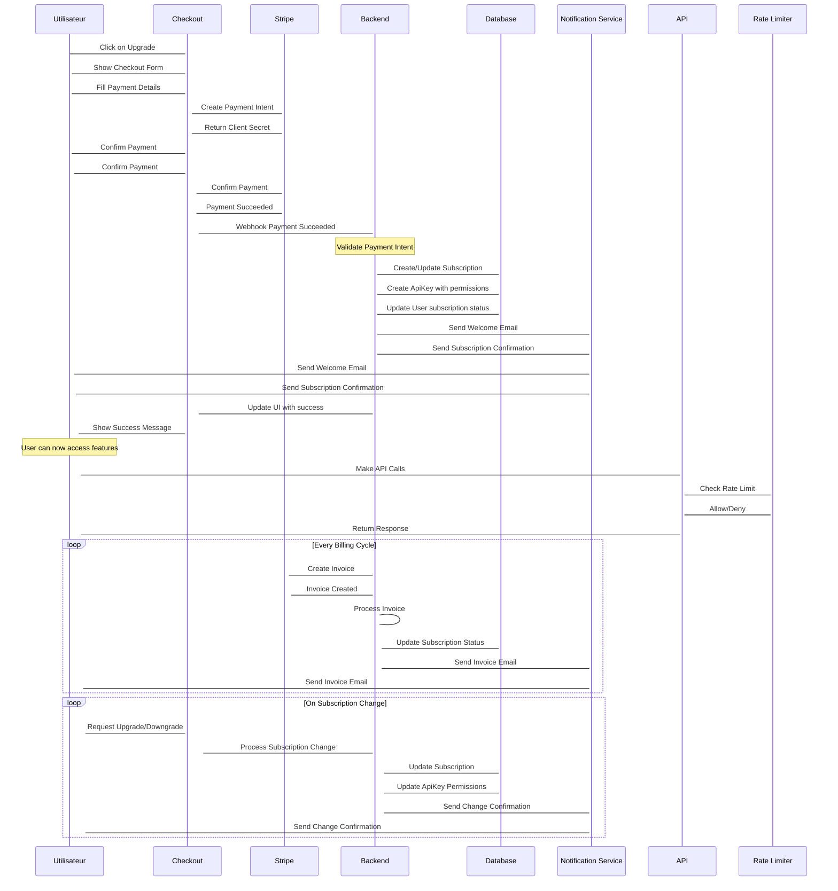

# Résumé Final - Plan Stratégique SaaS de Monétisation Multiplateforme

## Architecture Technique

### Stack Principal
- **Backend** : Node.js/TypeScript avec NestJS et architecture microservices
- **Frontend** : Web (PWA React), Mobile (React Native), Desktop (Electron)
- **Database** : PostgreSQL + Redis pour cache et sessions
- **Infrastructure** : AWS/GCP avec CDN, monitoring avancé

### Architecture Détail
```
Frontend Layer
├── Web App (PWA)
├── Mobile App (React Native)
└── Desktop App (Electron)

API Gateway
├── Auth Service (OAuth 2.0/JWT)
├── Subscription Service (Plans/Quotas)
├── Asset Service (Marketplace)
├── Usage Service (Rate Limiting)
├── Notification Service
└── Security Middleware

Services Layer
├── PostgreSQL (Users, Subscriptions, Assets, Usage)
├── Redis (Sessions, Cache, Rate Limiting)
├── Stripe (Payments/Webhooks)
└── External Services (SendGrid, Cloudflare)

Monitoring Layer
├── APM (Datadog/New Relic)
├── Distributed Tracing
├── Alerting (PagerDuty/Opsgenie)
└── ELK Stack (Logging)
```

## Modèles de Monétisation

### Abonnements par Paliers
- **Basic** : Accès limité, fonctionnalités essentielles
- **Pro** : Accès complet, fonctionnalités avancées
- **Enterprise** : Personnalisation, SLA, support prioritaire

### Consommation à l'Usage
- Quotas par API call, stockage, bande passante
- Forfaits de crédits prépayés
- Facturation au-delà des quotas

### Facturation
- Mensuelle/annuelle avec réduction
- Essai gratuit de 14 jours
- Paiements via Stripe/PayPal
- Multi-devises avec conversion automatique

## Sécurité et Compliance

### Protection des Données
- Chiffrement AES-256 pour données sensibles
- Audit logging complet
- Compliance RGPD, CCPA, LGPD
- Gestion sécurisée des clés API
- Protection contre les fraudes

### Infrastructure Sécurisée
- HTTPS/TLS 1.3 partout
- CORS configuré
- Rate limiting et DDoS protection
- Web Application Firewall
- Sauvegardes chiffrées et testées

## Store d'Assets

### Marketplace
- Catalogue de plugins/extensions
- Système de review/commentaires
- Gestion des licences
- Mises à jour automatiques
- Partage de revenus avec développeurs

### Gestion
- Processus de validation des assets
- Organisation par catégories
- Full-text search avec filtres
- Analytics de performance

## Scalabilité et Performance

### Infrastructure
- Load balancing automatique
- Auto-scaling horizontal/vertical
- Cache distribué (Redis Cluster)
- Queue de messages (RabbitMQ/Kafka)
- Sauvegardes automatisées

### Performance
- CDN pour distribution globale
- Database sharding et réplication
- API caching et compression
- Frontend code splitting
- APM et tracing distribué

## Roadmap de Développement

### Phase 1 - MVP (8-12 semaines)
- Backend core avec authentification
- Base de données PostgreSQL et Redis
- Système d'abonnement basique
- API Gateway et rate limiting
- Dashboard utilisateur simple

### Phase 2 - Core Features (6-8 semaines)
- Store d'assets
- Multi-provider authentication
- Webhooks et notifications
- Analytics basiques
- Mobile app React Native

### Phase 3 - Scaling (4-6 semaines)
- Microservices architecture
- Auto-scaling et load balancing
- Advanced analytics
- Enterprise features
- Internationalization

### Phase 4 - Growth (Ongoing)
- Advanced security features
- AI-powered recommendations
- Partner ecosystem
- Enterprise integrations
- Global expansion

## Stack Technique Détail

### Backend
```typescript
// NestJS avec microservices
import { Module } from '@nestjs/common';
import { TypeOrmModule } from '@nestjs/typeorm';
import { ClientsModule } from '@nestjs/microservices';

@Module({
  imports: [
    TypeOrmModule.forRoot(),
    ClientsModule.register([{
      name: 'AUTH_SERVICE',
      transport: Transport.GRPC,
    }]),
  ],
})
export class AppModule {}
```

### Frontend Web
```typescript
// React avec TypeScript
import React from 'react';
import { BrowserRouter as Router } from 'react-router-dom';
import { QueryClient, QueryClientProvider } from 'react-query';

const queryClient = new QueryClient({
  defaultOptions: {
    queries: {
      retry: 3,
      staleTime: 5 * 60 * 1000,
    },
  },
});

export default function App() {
  return (
    <QueryClientProvider client={queryClient}>
      <Router>
        <AppContent />
      </Router}>
    </QueryClientProvider}>
  );
}
```

### Mobile
```typescript
// React Native
import React from 'react';
import { SafeAreaView, StyleSheet } from 'react-native';

export default function App() {
  return (
    <SafeAreaView style={styles.container}>
      <AppContent />
    </SafeAreaView}>
  );
}

const styles = StyleSheet.create({
  container: {
    flex: 1,
    backgroundColor: '#fff',
  },
});
```

## Base de Données

### Schéma PostgreSQL
```sql
-- Utilisateurs
CREATE TABLE users (
    id UUID PRIMARY KEY DEFAULT gen_random_uuid(),
    email VARCHAR(255) UNIQUE NOT NULL,
    password_hash VARCHAR(255),
    provider VARCHAR(50),
    provider_id VARCHAR(255),
    role VARCHAR(20) DEFAULT 'user',
    created_at TIMESTAMP DEFAULT NOW(),
    updated_at TIMESTAMP DEFAULT NOW()
);

-- Abonnements
CREATE TABLE subscriptions (
    id UUID PRIMARY KEY DEFAULT gen_random_uuid(),
    user_id UUID REFERENCES users(id),
    plan_type VARCHAR(20) NOT NULL,
    status VARCHAR(20) DEFAULT 'active',
    current_period_start TIMESTAMP,
    current_period_end TIMESTAMP,
    created_at TIMESTAMP DEFAULT NOW()
);

-- API Keys
CREATE TABLE api_keys (
    id UUID PRIMARY KEY DEFAULT gen_random_uuid(),
    user_id UUID REFERENCES users(id),
    key_hash VARCHAR(255) UNIQUE NOT NULL,
    permissions JSONB,
    rate_limit_per_hour INTEGER DEFAULT 1000,
    created_at TIMESTAMP DEFAULT NOW()
);

-- Assets
CREATE TABLE assets (
    id UUID PRIMARY KEY DEFAULT gen_random_uuid(),
    name VARCHAR(255) NOT NULL,
    description TEXT,
    price DECIMAL(10,2),
    developer_id UUID REFERENCES users(id),
    category VARCHAR(50),
    version VARCHAR(20),
    created_at TIMESTAMP DEFAULT NOW()
);
```

## Workflow de Paiement



## Coûts Opérationnels Estimés

### Infrastructure
- **AWS/GCP** : $500-2000/mois (selon traffic)
- **Database** : $100-500/mois (PostgreSQL + Redis)
- **CDN** : $100-300/mois (Cloudflare/AWS CloudFront)
- **Monitoring** : $50-200/mois (Datadog/New Relic)

### Services Tiers
- **Stripe** : 2.9% + 30¢ par transaction
- **Email** : $10-50/mois (SendGrid/Postmark)
- **Support** : $200-1000/mois (interne ou externalisé)
- **Legal/Compliance** : $500-2000/mois

### Total Estimé
- **Phase MVP** : $1000-3000/mois
- **Phase Scaling** : $3000-8000/mois
- **Phase Growth** : $8000-20000+/mois

## Métriques Clés

### Acquisition
- **CAC** : Customer Acquisition Cost
- **Conversion Rate** : Signup > Trial > Paid
- **Traffic Sources** : Organic, Paid, Referral

### Engagement
- **DAU/MAU** : Daily/Monthly Active Users
- **Retention** : Week 1, Week 4, Month 6
- **Usage Depth** : Features utilisées par utilisateur

### Financials
- **MRR** : Monthly Recurring Revenue
- **ARR** : Annual Recurring Revenue
- **LTV** : Lifetime Value
- **Churn Rate** : Taux de désabonnement

### Technical
- **Uptime** : Disponibilité du service
- **Response Time** : Temps de réponse API
- **Error Rate** : Taux d'erreurs
- **Cost per User** : Coût opérationnel par utilisateur

---

**Statut** : Plan stratégique complet révisé  
**Architecture** : Microservices scalable et sécurisée  
**Monétisation** : Modèles flexibles avec abonnements et usage  
**Multi-plateforme** : Web, mobile, desktop supportés  
**Scalabilité** : Prêt pour croissance massive  
**Prochaines étapes** : Validation du plan et démarrage du développement