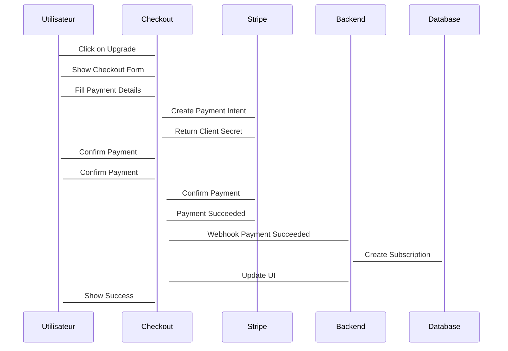

# Plan Stratégique - SaaS de Monétisation Multiplateforme

## Architecture Technique

### Backend
- **Node.js/TypeScript** avec architecture microservices
- **PostgreSQL** pour données transactionnelles
- **Redis** pour cache et sessions
- **API Gateway** pour gestion des routes
- **WebSocket** pour communications temps réel
- **Cloud hosting** (AWS/GCP) avec CDN

### Frontend
- **Web** : PWA avec React/Vue
- **Mobile** : React Native pour iOS/Android
- **Desktop** : Electron pour Windows/macOS/Linux
- **API** : RESTful avec GraphQL optionnel

## Modèles de Monétisation

### Abonnements
- **Basic** : Accès limité, fonctionnalités essentielles
- **Pro** : Accès complet, fonctionnalités avancées
- **Enterprise** : Personnalisation, SLA, support prioritaire

### Consommation
- **À l'usage** : Quotas par API call, stockage, bande passante
- **Forfaits** : Packs de crédits prépayés
- **Surconsommation** : Tarification au-delà des quotas

### Facturation
- **Mensuelle/Annuelle** : Réduction pour engagement annuel
- **Essai gratuit** : 14 jours limité
- **Paiements** : Stripe/PayPal avec gestion des abonnements
- **Devises** : Multi-devises avec conversion automatique

## Système d'Authentification

### OAuth 2.0/JWT
- **Multi-provider** : Google, Apple, Email, GitHub
- **Session management** : Redis pour scalabilité
- **Rate limiting** : Protection contre les abus
- **2FA optionnelle** : SMS, Authenticator, Email
- **SSO** : Support pour entreprises

### Gestion des Utilisateurs
- **Rôles** : Admin, Développeur, Utilisateur
- **Permissions** : Granulaires par ressource
- **Invitations** : Système d'invitation pour équipes
- **Profil** : Gestion complète du profil utilisateur

## Store d'Assets

### Catalogue
- **Plugins/Extensions** : Système de marketplace
- **Review/commentaires** : Système de feedback
- **Licences** : Gestion des droits d'utilisation
- **Mises à jour** : Distribution automatique
- **Partage de revenus** : Modèle économique pour développeurs

### Gestion
- **Validation** : Processus de review pour les assets
- **Catégories** : Organisation par type et usage
- **Recherche** : Full-text search avec filtres
- **Analytics** : Suivi des performances des assets

## Sécurité

### Protection des Données
- **Chiffrement** : AES-256 pour données sensibles
- **Audit logging** : Suivi complet des actions
- **Compliance RGPD** : GDPR, CCPA, LGPD
- **Clés API** : Gestion sécurisée avec rotation
- **Fraudes** : Détection et prévention en temps réel

### Infrastructure
- **HTTPS** : TLS 1.3 partout
- **CORS** : Configuration sécurisée
- **Rate limiting** : Protection DDoS
- **Web Application Firewall** : Protection avancée
- **Backup** : Sauvegardes chiffrées et testées

## Monitoring & Analytics

### Métriques
- **Usage** : API calls, stockage, bande passante
- **Conversions** : Inscriptions, upgrades, paiements
- **Performance** : Temps de réponse, disponibilité
- **Erreurs** : Logging et tracking des erreurs
- **Revenue** : Suivi des revenus et MRR/ARR

### Dashboards
- **Temps réel** : Métriques en direct
- **Historique** : Analyse sur 30/90/365 jours
- **Alerting** : Notifications pour événements critiques
- **Reporting** : Rapports personnalisés et export
- **Billing** : Facturation et gestion des paiements

## Scalabilité

### Infrastructure
- **Load balancing** : Répartition de charge automatique
- **Auto-scaling** : Scaling horizontal et vertical
- **Cache distribué** : Redis Cluster
- **Queue de messages** : RabbitMQ/Kafka
- **Sauvegardes** : Automatisées et testées

### Performance
- **CDN** : Distribution globale du contenu
- **Database** : Sharding et réplication
- **API** : Caching et compression
- **Monitoring** : APM et tracing distribué
- **Optimisation** : Indexation et requêtes optimisées

## Stack Technique Détail

### Backend
```typescript
// Microservices avec NestJS
import { Module } from '@nestjs/common';
import { TypeOrmModule } from '@nestjs/typeorm';
import { RedisModule } from 'nestjs-redis';
import { BullModule } from '@nestjs/bull';

@Module({
  imports: [
    TypeOrmModule.forRoot(),
    RedisModule.register(),
    BullModule.registerQueue(),
  ],
})
export class AppModule {}
```

### Frontend Web
```typescript
// React avec TypeScript
import React from 'react';
import { BrowserRouter as Router } from 'react-router-dom';
import { QueryClient, QueryClientProvider } from 'react-query';

const queryClient = new QueryClient({
  defaultOptions: {
    queries: {
      retry: 3,
      staleTime: 5 * 60 * 1000,
    },
  },
});

export default function App() {
  return (
    <QueryClientProvider client={queryClient}>
      <Router>
        <AppContent />
      </Router>
    </QueryClientProvider>
  );
}
```

### Mobile
```typescript
// React Native
import React from 'react';
import { SafeAreaView, StyleSheet } from 'react-native';

export default function App() {
  return (
    <SafeAreaView style={styles.container}>
      <AppContent />
    </SafeAreaView>
  );
}

const styles = StyleSheet.create({
  container: {
    flex: 1,
    backgroundColor: '#fff',
  },
});
```

## Base de Données

### Schéma PostgreSQL
```sql
-- Utilisateurs
CREATE TABLE users (
    id UUID PRIMARY KEY DEFAULT gen_random_uuid(),
    email VARCHAR(255) UNIQUE NOT NULL,
    password_hash VARCHAR(255),
    provider VARCHAR(50),
    provider_id VARCHAR(255),
    role VARCHAR(20) DEFAULT 'user',
    created_at TIMESTAMP DEFAULT NOW(),
    updated_at TIMESTAMP DEFAULT NOW()
);

-- Abonnements
CREATE TABLE subscriptions (
    id UUID PRIMARY KEY DEFAULT gen_random_uuid(),
    user_id UUID REFERENCES users(id),
    plan_type VARCHAR(20) NOT NULL,
    status VARCHAR(20) DEFAULT 'active',
    current_period_start TIMESTAMP,
    current_period_end TIMESTAMP,
    created_at TIMESTAMP DEFAULT NOW()
);

-- API Keys
CREATE TABLE api_keys (
    id UUID PRIMARY KEY DEFAULT gen_random_uuid(),
    user_id UUID REFERENCES users(id),
    key_hash VARCHAR(255) UNIQUE NOT NULL,
    permissions JSONB,
    rate_limit_per_hour INTEGER DEFAULT 1000,
    created_at TIMESTAMP DEFAULT NOW()
);

-- Assets
CREATE TABLE assets (
    id UUID PRIMARY KEY DEFAULT gen_random_uuid(),
    name VARCHAR(255) NOT NULL,
    description TEXT,
    price DECIMAL(10,2),
    developer_id UUID REFERENCES users(id),
    category VARCHAR(50),
    version VARCHAR(20),
    created_at TIMESTAMP DEFAULT NOW()
);
```

## Workflow de Paiement



## Roadmap de Développement

### Phase 1 : MVP (8-12 semaines)
- [ ] Backend Node.js avec authentification
- [ ] Base de données PostgreSQL et Redis
- [ ] Système d'abonnement basique
- [ ] API Gateway et rate limiting
- [ ] Dashboard utilisateur simple

### Phase 2 : Core Features (6-8 semaines)
- [ ] Store d'assets
- [ ] Multi-provider authentication
- [ ] Webhooks et notifications
- [ ] Analytics basiques
- [ ] Mobile app React Native

### Phase 3 : Scaling (4-6 semaines)
- [ ] Microservices architecture
- [ ] Auto-scaling et load balancing
- [ ] Advanced analytics
- [ ] Enterprise features
- [ ] Internationalization

### Phase 4 : Growth (Ongoing)
- [ ] Advanced security features
- [ ] AI-powered recommendations
- [ ] Partner ecosystem
- [ ] Enterprise integrations
- [ ] Global expansion

## Coûts Opérationnels Estimés

### Infrastructure
- **AWS/GCP** : $500-2000/mois (selon traffic)
- **Database** : $100-500/mois (PostgreSQL + Redis)
- **CDN** : $100-300/mois (Cloudflare/AWS CloudFront)
- **Monitoring** : $50-200/mois (Datadog/New Relic)

### Services Tiers
- **Stripe** : 2.9% + 30¢ par transaction
- **Email** : $10-50/mois (SendGrid/Postmark)
- **Support** : $200-1000/mois (interne ou externalisé)
- **Legal/Compliance** : $500-2000/mois

### Total Estimé
- **Phase MVP** : $1000-3000/mois
- **Phase Scaling** : $3000-8000/mois
- **Phase Growth** : $8000-20000+/mois

## Métriques Clés

### Acquisition
- **CAC** : Customer Acquisition Cost
- **Conversion Rate** : Signup > Trial > Paid
- **Traffic Sources** : Organic, Paid, Referral

### Engagement
- **DAU/MAU** : Daily/Monthly Active Users
- **Retention** : Week 1, Week 4, Month 6
- **Usage Depth** : Features utilisées par utilisateur

### Financials
- **MRR** : Monthly Recurring Revenue
- **ARR** : Annual Recurring Revenue
- **LTV** : Lifetime Value
- **Churn Rate** : Taux de désabonnement

### Technical
- **Uptime** : Disponibilité du service
- **Response Time** : Temps de réponse API
- **Error Rate** : Taux d'erreurs
- **Cost per User** : Coût opérationnel par utilisateur

---

**Date** : 29 janvier 2026  
**Statut** : Plan stratégique complet  
**Prochaines étapes** : Validation du plan et démarrage du développement