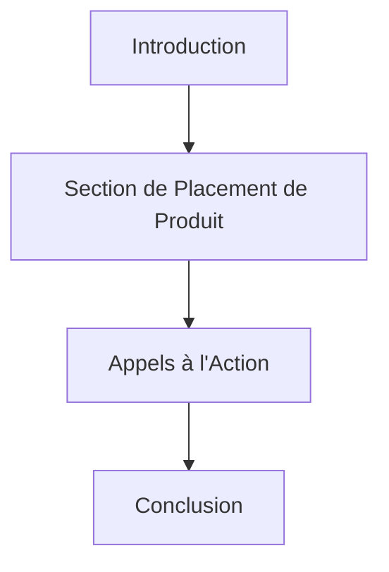

# Plan pour le Template Vidéo AI Slop

## Objectif
Créer un template vidéo pour des vidéos de type AI slop, destinées à YouTube avec placement de produit ou ventes diverses. Le template doit inclure des éléments visuels et structurels adaptés à ce format, tels que des sections pour le placement de produit, des appels à l'action, et des éléments graphiques attrayants.

## Structure du Template

### 1. Introduction
- **Durée** : 5-10 secondes
- **Éléments** :
  - Animation courte et accrocheuse pour capter l'attention
  - Présentation du thème ou du produit principal
  - Effets spéciaux pour attirer l'attention (ex. : animaux mignons faisant des actions humaines)

### 2. Section de Placement de Produit
- **Durée** : 10-15 secondes par produit
- **Éléments** :
  - Visuels attrayants du produit
  - Animations pour mettre en valeur les caractéristiques du produit
  - Effets spéciaux pour créer des pics de dopamine (ex. : couleurs vives, effets doux et synthétiques)

### 3. Appels à l'Action (CTA)
- **Durée** : 5-10 secondes
- **Éléments** :
  - Messages clairs et concis pour inciter à l'action (ex. : "Achetez maintenant", "Cliquez ici pour en savoir plus")
  - Animations pour attirer l'attention sur le CTA
  - Effets spéciaux pour renforcer l'impact

### 4. Conclusion
- **Durée** : 5-10 secondes
- **Éléments** :
  - Récapitulatif des produits présentés
  - Message final pour encourager l'engagement (ex. : "Likez, commentez, abonnez-vous")
  - Animation de fin pour laisser une impression durable

## Éléments Visuels et Graphiques

### Animations
- **Types** :
  - Animations courtes et dynamiques
  - Animations d'animaux mignons faisant des actions humaines
  - Transitions fluides entre les sections

### Effets Spéciaux
- **Types** :
  - Effets de couleur vive pour attirer l'attention
  - Effets doux et synthétiques pour créer une ambiance agréable
  - Effets pour créer des pics de dopamine chez le spectateur

### Graphiques
- **Types** :
  - Icônes et images pour illustrer les produits
  - Graphiques pour montrer les caractéristiques des produits
  - Éléments visuels pour renforcer les messages clés

## Sections pour le Placement de Produit et les Appels à l'Action

### Placement de Produit
- **Structure** :
  - Section dédiée pour chaque produit
  - Visuels attrayants et animations pour mettre en valeur les produits
  - Messages clairs et concis pour décrire les produits

### Appels à l'Action
- **Structure** :
  - Intégration des CTA dans la vidéo
  - Messages clairs et concis pour inciter à l'action
  - Animations et effets spéciaux pour attirer l'attention sur les CTA

## Plan de Développement

### Étape 1 : Conception des Éléments Visuels
- **Tâches** :
  - Créer des animations courtes et dynamiques
  - Concevoir des effets spéciaux pour attirer l'attention
  - Développer des graphiques pour illustrer les produits

### Étape 2 : Structuration du Template
- **Tâches** :
  - Définir la durée et les éléments de chaque section
  - Intégrer les sections de placement de produit et les appels à l'action
  - Ajouter des transitions fluides entre les sections

### Étape 3 : Intégration des Éléments
- **Tâches** :
  - Intégrer les animations et les effets spéciaux dans le template
  - Ajouter les graphiques et les visuels pour illustrer les produits
  - Tester et ajuster les éléments pour garantir une expérience utilisateur optimale

### Étape 4 : Finalisation
- **Tâches** :
  - Révision finale du template
  - Tests pour garantir la qualité et l'efficacité du template
  - Préparation pour le déploiement et l'utilisation

## Diagramme de Flux

## Conclusion
Ce plan détaillé permet de créer un template vidéo AI slop efficace pour YouTube, avec des sections dédiées pour le placement de produit et les appels à l'action, ainsi que des éléments visuels et graphiques attrayants pour capter l'attention des spectateurs.