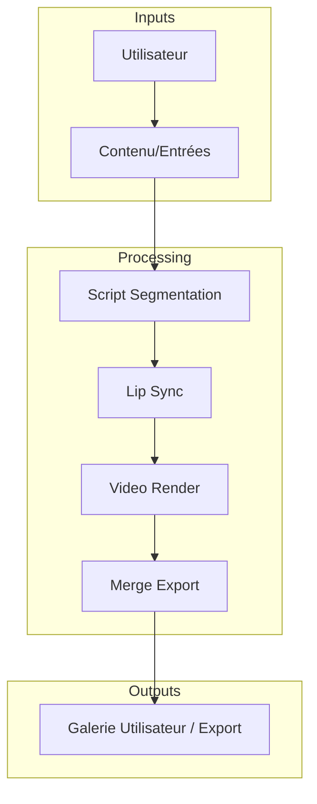
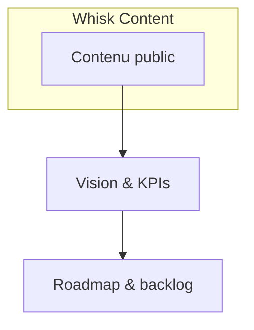

# Vision révisée de Story Core inspirée du Whisk public content

- But: créer une expérience centrée utilisateur et produit pour Story Core, avec une proposition de valeur claire, une architecture produit et technique robuste, et un backlog/action plan pour 6 mois.

## 1) Méthodologie d'analyse et hypothèses
- Source: contenus publics Whisk (sections UX, parcours utilisateur, architecture des modules)
- Hypothèses: Whisk est le benchmark; les patterns peuvent être transposables en Story Core; adaptation au contexte Story Core.
- Risques: accès externe instable, citations sous copyright; mitigation: paraphraser et référencer correctement plutôt que d'extraire textuellement.

## 2) Propositions de valeur et objectifs (KPI)
- Problème résolu: faciliter la création de contenu narratif via un studio Story Core intégré.
- Propositions de valeur: productivité accrue, cohérence des personnages, workflows automatisés, expérience utilisateur fluide.
- KPI principaux: time-to-create story, satisfaction utilisateur, taux de rétention, taux d'erreurs, adoption des fonctionnalités, accessibilité.

## 3) Architecture produit et technique recommandée
- Architecture produit: couche UX, couche produit, API, services, intégrations.
- Modules clés: Identity Lock, Script Segmentation, Lip Sync & Audio, Video Render, Merge/Export, Templates.
- Flux de données: utilisateur action -> entrée -> traitement -> résultat -> feedback.
- Tech stack proposé: frontend React/TypeScript, backend Python (FastAPI), file-based ou Redis pour la queue, architecture microservices, OpenAPI, tests automatisés.
- Accessibilité et sécurité: WCAG 2.2+, OWASP, gestion des secrets.

## 4) Trois scénarios d'utilisation et parcours
- Scénario A: Product Owner gère le backlog Story Core et suit les métriques
- Scénario B: Créateur de contenu utilise le studio pour générer et exporter des scènes

## 5) Backlog produit et roadmap 6 mois
- Epique 0: Fondation Identity Lock & Segmentation
- Epique 1: Multishot + Lip Sync
- Epique 2: Templates & Prompts optimisés
- Epique 3: Plugins n8n et intégrations externes
- Roadmap: Q1 Identity Lock + Segmentation; Q2 Lip Sync & Multishot; Q3 Templates; Q4 Intégrations et hardening

## 6) Système de design et kit UI
- Tokens: palette couleurs, typographie, spacing, radii
- Composants: Button, Input, Select, Card, Tabs, Avatar, Wizard, Modal
- Accessibilité et navigation clavier; ARIA et états de focus
- Guide d'utilisation du design system et exemples

## 7) API et modèles de données
- Identity: identity profiles; endpoints create, apply, validate
- Segmentation: segment, adjust
- Templates: list, render, create
- Video: render, merge/export
- Données: IdentityProfile, ScriptSegment, PromptTemplate

## 8) Critères d'accessibilité, performance et sécurité
- WCAG 2.2+: contrast, keyboard navigation, focus management
- Performance: budgets, RUM, observabilité
- Sécurité: gestion des secrets, IAM/roles, sécurisation des endpoints

## 9) Méthodologie de tests utilisateurs et KPI
- Tests utilisateur à distance; KPI: taux de réussite, SUS, NPS
- Tests A/B sur prompts et UX
- Plan de validation avec jalons et sign-off

## 10) Pitch concis et message de valeur
- Story Core est votre studio IA de narration qui unifie prompts, segmentation et rendu vidéo pour livrer des histoires cohérentes plus rapidement et plus sûr
- Messages: productivité, sécurité d'identité, cohérence des personnages

## 11) Hypothèses, risques, choix critiques et mitigations
- Hypothèses et risques identifiés; mitigations associées (ex: fallback identity lock)

## 12) Livrables
- Résumé écrit; wireframes optionnels; liste d'actions avec priorités et métriques

## 13) Diagrammes Mermaid livrables
- Architecture système: plan
- Parcours utilisateur: journey

## 14) Plan de revue et prochaines étapes
- Validation et planification via une revue

## 15) Références
- PLAN_AMELIORATION_VIDEO_CINEMATIQUE_V3.md
- docs/IMPLEMENTATION_PLAN_NEW_FEATURES.md

--- Diagrammes Mermaid ---

## 5) Backlog produit et roadmap 6 mois
- Epique 0: Fondation Identity Lock & Segmentation
- Epique 1: Multishot + Lip Sync
- Epique 2: Templates & Prompts optimisés
- Epique 3: Plugins n8n et intégrations externes
- Roadmap: Q1 Identity Lock + Segmentation; Q2 Lip Sync & Multishot; Q3 Templates; Q4 Intégrations et hardening

## 6) Système de design et kit UI
- Tokens: palette couleurs, typographie, spacing, radii
- Composants: Button, Input, Select, Card, Tabs, Avatar, Wizard, Modal
- Accessibilité et navigation clavier; ARIA et états de focus
- Guide d'utilisation du design system et exemples

## 7) API et modèles de données
- Identity: identity profiles; endpoints create, apply, validate
- Segmentation: segment, adjust
- Templates: list, render, create
- Video: render, merge/export
- Données: IdentityProfile, ScriptSegment, PromptTemplate

## 8) Critères d'accessibilité, performance et sécurité
- WCAG 2.2+: contrast, keyboard navigation, focus management
- Performance: budgets, RUM, observabilité
- Sécurité: gestion des secrets, IAM/roles, sécurisation des endpoints

## 9) Méthodologie de tests utilisateurs et KPI
- Tests utilisateur à distance; KPI: taux de réussite, SUS, NPS
- Tests A/B sur prompts et UX
- Plan de validation avec jalons et sign-off

## 10) Pitch concis et message de valeur
- Story Core est votre studio IA de narration qui unifie prompts, segmentation et rendu vidéo pour livrer des histoires cohérentes plus rapidement et plus sûr
- Messages: productivité, sécurité d'identité, cohérence des personnages

## 11) Hypothèses, risques, choix critiques et mitigations
- Hypothèses et risques identifiés; mitigations associées (ex: fallback identity lock)

## 12) Livrables
- Résumé écrit; wireframes optionnels; liste d'actions avec priorités et métriques

## 13) Diagrammes Mermaid livrables
- Architecture système: plan
- Parcours utilisateur: journey

## 14) Plan de revue et prochaines étapes
- Validation et planification via une revue

## 15) Références
- PLAN_AMELIORATION_VIDEO_CINEMATIQUE_V3.md
- docs/IMPLEMENTATION_PLAN_NEW_FEATURES.md

--- Diagrammes Mermaid ---

