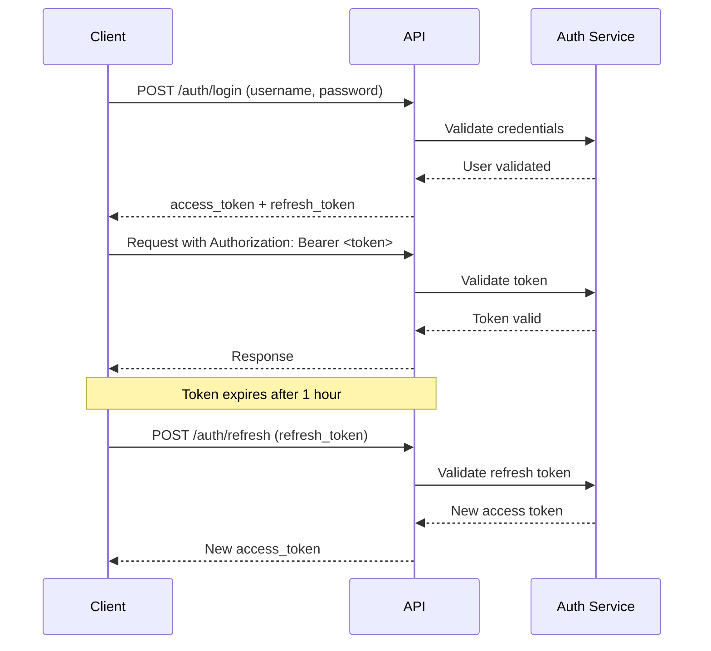

# StoryCore AI Assistant API Documentation

## Overview

The StoryCore AI Assistant API provides a RESTful interface for creating, managing, and modifying StoryCore projects through natural language commands. The API includes secure authentication, rate limiting, and comprehensive project generation capabilities.

**Base URL**: `http://localhost:8000/api/v1`

**API Version**: 1.0.0

## Table of Contents

1. [Authentication](#authentication)
2. [Rate Limiting](#rate-limiting)
3. [Error Handling](#error-handling)
4. [Endpoints](#endpoints)
   - [Authentication](#authentication-endpoints)
   - [Project Generation](#project-generation-endpoints)
   - [Project Management](#project-management-endpoints)
   - [Project Modifications](#project-modification-endpoints)
   - [Storage & Monitoring](#storage-and-monitoring-endpoints)
5. [Usage Examples](#usage-examples)
6. [Best Practices](#best-practices)

---

## Authentication

All API endpoints (except `/auth/login`) require authentication using JWT (JSON Web Token) bearer tokens.

### Authentication Flow



### Token Types

- **Access Token**: Short-lived token (1 hour) for API requests
- **Refresh Token**: Long-lived token (7 days) for obtaining new access tokens

### Using Authentication

Include the access token in the `Authorization` header:

```http
Authorization: Bearer <your_access_token>
```

### Token Expiration

- **Access tokens** expire after 1 hour
- **Refresh tokens** expire after 7 days
- Use the `/auth/refresh` endpoint to obtain a new access token before expiration

---

## Rate Limiting

The API enforces rate limits to ensure fair usage and system stability.

### Rate Limit Policy

- **Limit**: 100 requests per minute per user
- **Window**: 60 seconds (sliding window)
- **Scope**: Per authenticated user (or IP for unauthenticated requests)

### Rate Limit Headers

Every response includes rate limit information:

```http
X-RateLimit-Limit: 100
X-RateLimit-Remaining: 87
X-RateLimit-Reset: 1640000000
```

- `X-RateLimit-Limit`: Maximum requests allowed in the window
- `X-RateLimit-Remaining`: Requests remaining in current window
- `X-RateLimit-Reset`: Unix timestamp when the limit resets

### Warning Threshold

When you reach 90% of your rate limit (90 requests), a warning header is added:

```http
X-RateLimit-Warning: Approaching rate limit (90/100 requests used)
```

### Rate Limit Exceeded

When the rate limit is exceeded, the API returns:

**Status Code**: `429 Too Many Requests`

**Response**:
```json
{
  "error": {
    "code": "RATE_LIMIT_EXCEEDED",
    "message": "Rate limit exceeded: 100 requests per 60 seconds",
    "details": {
      "limit": 100,
      "window_seconds": 60,
      "retry_after": 45
    }
  }
}
```

**Retry Strategy**: Wait for the time specified in `retry_after` (seconds) before making new requests.

---

## Error Handling

The API uses standard HTTP status codes and returns structured error responses.

### HTTP Status Codes

| Code | Meaning | Description |
|------|---------|-------------|
| 200 | OK | Request succeeded |
| 201 | Created | Resource created successfully |
| 400 | Bad Request | Invalid request parameters |
| 401 | Unauthorized | Missing or invalid authentication |
| 403 | Forbidden | Insufficient permissions |
| 404 | Not Found | Resource not found |
| 429 | Too Many Requests | Rate limit exceeded |
| 500 | Internal Server Error | Server error |
| 507 | Insufficient Storage | Storage limit exceeded |

### Error Response Format

All errors follow this structure:

```json
{
  "error": {
    "code": "ERROR_CODE",
    "message": "Human-readable error message",
    "details": {
      "field": "Additional context"
    },
    "suggested_action": "How to resolve the error"
  }
}
```

### Common Error Codes

- `AUTHENTICATION_ERROR`: Invalid or missing authentication
- `AUTHORIZATION_ERROR`: Insufficient permissions
- `VALIDATION_ERROR`: Invalid request data
- `RESOURCE_NOT_FOUND`: Requested resource doesn't exist
- `STORAGE_LIMIT_EXCEEDED`: Storage quota exceeded
- `PROJECT_ERROR`: Project-specific error
- `RATE_LIMIT_EXCEEDED`: Too many requests
- `INTERNAL_SERVER_ERROR`: Unexpected server error

---

## Endpoints

### Authentication Endpoints

#### POST /auth/login

Authenticate and obtain access tokens.

**Request Body**:
```json
{
  "username": "user@example.com",
  "password": "secure_password"
}
```

**Response** (200 OK):
```json
{
  "access_token": "eyJhbGciOiJIUzI1NiIsInR5cCI6IkpXVCJ9...",
  "refresh_token": "eyJhbGciOiJIUzI1NiIsInR5cCI6IkpXVCJ9...",
  "token_type": "bearer",
  "expires_in": 3600
}
```

**Errors**:
- `401 Unauthorized`: Invalid credentials

---

#### POST /auth/refresh

Refresh an expired access token.

**Request Body**:
```json
{
  "refresh_token": "eyJhbGciOiJIUzI1NiIsInR5cCI6IkpXVCJ9..."
}
```

**Response** (200 OK):
```json
{
  "access_token": "eyJhbGciOiJIUzI1NiIsInR5cCI6IkpXVCJ9...",
  "token_type": "bearer",
  "expires_in": 3600
}
```

**Errors**:
- `401 Unauthorized`: Invalid or expired refresh token

---

### Project Generation Endpoints

#### POST /generate/project

Generate a complete project from a natural language prompt.

**Authentication**: Required

**Request Body**:
```json
{
  "prompt": "Create a sci-fi thriller about a detective investigating AI crimes in a cyberpunk city",
  "language": "en",
  "preferences": {
    "sceneCount": 8,
    "duration": 180,
    "style": "dark and moody"
  }
}
```

**Parameters**:
- `prompt` (required): Natural language project description
- `language` (optional): Language code (en, fr, es, etc.) - default: "en"
- `preferences` (optional): Generation preferences
  - `sceneCount`: Desired number of scenes (3-12)
  - `duration`: Total duration in seconds
  - `style`: Visual style description

**Response** (200 OK):
```json
{
  "preview_id": "preview_abc123",
  "project_name": "ai-crimes-detective",
  "scenes": [
    {
      "id": "scene_1",
      "number": 1,
      "title": "Opening Scene",
      "description": "Detective arrives at crime scene",
      "location": "Downtown cyberpunk district",
      "time_of_day": "night",
      "duration": 15.0,
      "characters": ["detective_maya"],
      "key_actions": ["arrives", "examines evidence"],
      "visual_notes": "Neon lights, rain-soaked streets"
    }
  ],
  "characters": [
    {
      "id": "char_1",
      "name": "Detective Maya Chen",
      "role": "protagonist",
      "description": "Hardened detective specializing in AI crimes",
      "appearance": "Asian woman, 35, short black hair, cybernetic eye implant",
      "personality": "Cynical but determined, tech-savvy"
    }
  ],
  "sequences": [
    {
      "id": "seq_1",
      "scene_id": "scene_1",
      "total_duration": 15.0,
      "shots": [
        {
          "id": "scene_1_shot_1",
          "number": 1,
          "type": "wide",
          "camera_movement": "dolly",
          "duration": 5.0,
          "description": "Establishing shot of crime scene",
          "visual_style": "dark and moody"
        }
      ]
    }
  ],
  "estimated_size_mb": 2.5,
  "estimated_file_count": 15
}
```

**Errors**:
- `400 Bad Request`: Invalid prompt or preferences
- `507 Insufficient Storage`: Storage limit would be exceeded

---

#### POST /generate/finalize

Finalize a project preview and save to disk.

**Authentication**: Required

**Request Body**:
```json
{
  "preview_id": "preview_abc123"
}
```

**Response** (200 OK):
```json
{
  "project_name": "ai-crimes-detective",
  "project_path": "/Users/username/Documents/StoryCore Projects/ai-crimes-detective",
  "created_at": "2026-01-25T10:30:00Z"
}
```

**Errors**:
- `404 Not Found`: Preview ID not found
- `507 Insufficient Storage`: Storage limit exceeded

---

### Project Management Endpoints

#### POST /projects/open

Open an existing project by name.

**Authentication**: Required

**Request Body**:
```json
{
  "project_name": "ai-crimes-detective"
}
```

**Response** (200 OK):
```json
{
  "project_name": "ai-crimes-detective",
  "scene_count": 8,
  "character_count": 5,
  "sequence_count": 8,
  "created_at": "2026-01-25T10:30:00Z",
  "modified_at": "2026-01-25T14:20:00Z"
}
```

**Errors**:
- `404 Not Found`: Project not found
- `400 Bad Request`: Project file corrupted or invalid

---

#### POST /projects/close

Close the currently active project.

**Authentication**: Required

**Request Body**:
```json
{
  "save": true
}
```

**Response** (200 OK):
```json
{
  "message": "Project closed successfully",
  "saved": true
}
```

---

#### GET /projects/list

List all available projects.

**Authentication**: Required

**Response** (200 OK):
```json
{
  "projects": [
    "ai-crimes-detective",
    "space-adventure",
    "mystery-mansion"
  ],
  "total_count": 3
}
```

---

#### DELETE /projects/{project_name}

Delete a project.

**Authentication**: Required

**Query Parameters**:
- `confirmed` (required): Must be `true` to confirm deletion

**Response** (200 OK):
```json
{
  "message": "Project deleted successfully",
  "deleted_project": "ai-crimes-detective"
}
```

**Errors**:
- `400 Bad Request`: Confirmation not provided
- `404 Not Found`: Project not found

---

### Project Modification Endpoints

#### PATCH /projects/{project_name}/scenes/{scene_id}

Modify a scene in the active project.

**Authentication**: Required

**Request Body**:
```json
{
  "title": "Updated Scene Title",
  "description": "New scene description",
  "duration": 20.0
}
```

**Response** (200 OK):
```json
{
  "message": "Scene modified successfully",
  "modified_element_id": "scene_1"
}
```

---

#### PATCH /projects/{project_name}/characters/{character_id}

Modify a character in the active project.

**Authentication**: Required

**Request Body**:
```json
{
  "name": "Updated Character Name",
  "appearance": "New appearance description"
}
```

**Response** (200 OK):
```json
{
  "message": "Character modified successfully",
  "modified_element_id": "char_1"
}
```

---

#### POST /projects/{project_name}/scenes

Add a new scene to the project.

**Authentication**: Required

**Request Body**:
```json
{
  "id": "scene_9",
  "number": 9,
  "title": "New Scene",
  "description": "Scene description",
  "location": "Location",
  "time_of_day": "day",
  "duration": 10.0,
  "characters": ["char_1"],
  "key_actions": ["action1"]
}
```

**Response** (201 Created):
```json
{
  "message": "Scene added successfully",
  "modified_element_id": "scene_9"
}
```

---

#### DELETE /projects/{project_name}/scenes/{scene_id}

Remove a scene from the project.

**Authentication**: Required

**Query Parameters**:
- `confirmed` (required): Must be `true` to confirm deletion

**Response** (200 OK):
```json
{
  "message": "Scene removed successfully",
  "modified_element_id": "scene_9"
}
```

---

### Storage and Monitoring Endpoints

#### GET /storage/stats

Get current storage statistics.

**Authentication**: Required

**Response** (200 OK):
```json
{
  "total_bytes": 5368709120,
  "total_gb": 5.0,
  "file_count": 125,
  "limit_bytes": 53687091200,
  "limit_gb": 50.0,
  "file_limit": 248,
  "usage_percent": 10.0,
  "file_usage_percent": 50.4,
  "warnings": []
}
```

---

#### GET /usage/stats

Get API usage statistics for the current user.

**Authentication**: Required

**Response** (200 OK):
```json
{
  "user_id": "user_123",
  "total_requests": 1250,
  "successful_requests": 1200,
  "failed_requests": 50,
  "total_data_transferred_mb": 125.5,
  "average_response_time_ms": 245.3,
  "operation_counts": {
    "project_generation": 10,
    "scene_modification": 45,
    "project_open": 30
  },
  "endpoint_counts": {
    "/generate/project": 10,
    "/projects/open": 30
  },
  "first_request_time": "2026-01-20T08:00:00Z",
  "last_request_time": "2026-01-25T15:30:00Z"
}
```

---

#### GET /health

Health check endpoint (no authentication required).

**Response** (200 OK):
```json
{
  "status": "healthy",
  "version": "1.0.0",
  "storage_usage_gb": 5.0,
  "storage_limit_gb": 50.0,
  "file_count": 125,
  "file_limit": 248
}
```

---

## Usage Examples

### Complete Workflow Example

```python
import requests
import json

BASE_URL = "http://localhost:8000/api/v1"

# 1. Authenticate
login_response = requests.post(
    f"{BASE_URL}/auth/login",
    json={
        "username": "user@example.com",
        "password": "secure_password"
    }
)
tokens = login_response.json()
access_token = tokens["access_token"]

# Set up headers for authenticated requests
headers = {
    "Authorization": f"Bearer {access_token}",
    "Content-Type": "application/json"
}

# 2. Generate a project
generate_response = requests.post(
    f"{BASE_URL}/generate/project",
    headers=headers,
    json={
        "prompt": "Create a mystery thriller set in a haunted mansion",
        "language": "en",
        "preferences": {
            "sceneCount": 6,
            "style": "gothic horror"
        }
    }
)
project_preview = generate_response.json()
preview_id = project_preview["preview_id"]

print(f"Generated project: {project_preview['project_name']}")
print(f"Scenes: {len(project_preview['scenes'])}")
print(f"Characters: {len(project_preview['characters'])}")

# 3. Review and finalize the project
finalize_response = requests.post(
    f"{BASE_URL}/generate/finalize",
    headers=headers,
    json={"preview_id": preview_id}
)
finalized = finalize_response.json()

print(f"Project saved to: {finalized['project_path']}")

# 4. Open the project
open_response = requests.post(
    f"{BASE_URL}/projects/open",
    headers=headers,
    json={"project_name": finalized["project_name"]}
)
project_info = open_response.json()

# 5. Modify a scene
modify_response = requests.patch(
    f"{BASE_URL}/projects/{project_info['project_name']}/scenes/scene_1",
    headers=headers,
    json={
        "description": "Updated scene description with more detail",
        "duration": 25.0
    }
)

# 6. Check storage usage
storage_response = requests.get(
    f"{BASE_URL}/storage/stats",
    headers=headers
)
storage = storage_response.json()

print(f"Storage used: {storage['usage_percent']:.1f}%")
print(f"Files: {storage['file_count']}/{storage['file_limit']}")

# 7. Close the project
close_response = requests.post(
    f"{BASE_URL}/projects/close",
    headers=headers,
    json={"save": True}
)

print("Project closed and saved")
```

### JavaScript/TypeScript Example

```typescript
const BASE_URL = "http://localhost:8000/api/v1";

// Authentication
async function authenticate(username: string, password: string) {
  const response = await fetch(`${BASE_URL}/auth/login`, {
    method: "POST",
    headers: { "Content-Type": "application/json" },
    body: JSON.stringify({ username, password })
  });
  
  if (!response.ok) {
    throw new Error("Authentication failed");
  }
  
  const data = await response.json();
  return data.access_token;
}

// Generate project
async function generateProject(token: string, prompt: string) {
  const response = await fetch(`${BASE_URL}/generate/project`, {
    method: "POST",
    headers: {
      "Authorization": `Bearer ${token}`,
      "Content-Type": "application/json"
    },
    body: JSON.stringify({
      prompt,
      language: "en",
      preferences: {
        sceneCount: 8,
        style: "cinematic"
      }
    })
  });
  
  if (!response.ok) {
    const error = await response.json();
    throw new Error(error.error.message);
  }
  
  return await response.json();
}

// Usage
async function main() {
  try {
    const token = await authenticate("user@example.com", "password");
    const project = await generateProject(
      token,
      "Create an action adventure about treasure hunters"
    );
    
    console.log("Project generated:", project.project_name);
    console.log("Scenes:", project.scenes.length);
  } catch (error) {
    console.error("Error:", error.message);
  }
}

main();
```

### cURL Examples

```bash
# 1. Login
curl -X POST http://localhost:8000/api/v1/auth/login \
  -H "Content-Type: application/json" \
  -d '{"username":"user@example.com","password":"secure_password"}'

# Save the access token
TOKEN="eyJhbGciOiJIUzI1NiIsInR5cCI6IkpXVCJ9..."

# 2. Generate project
curl -X POST http://localhost:8000/api/v1/generate/project \
  -H "Authorization: Bearer $TOKEN" \
  -H "Content-Type: application/json" \
  -d '{
    "prompt": "Create a space opera about rebels fighting an empire",
    "language": "en",
    "preferences": {"sceneCount": 10}
  }'

# 3. List projects
curl -X GET http://localhost:8000/api/v1/projects/list \
  -H "Authorization: Bearer $TOKEN"

# 4. Check storage
curl -X GET http://localhost:8000/api/v1/storage/stats \
  -H "Authorization: Bearer $TOKEN"

# 5. Health check (no auth required)
curl -X GET http://localhost:8000/api/v1/health
```

---

## Best Practices

### 1. Token Management

- **Store tokens securely**: Never commit tokens to version control
- **Refresh proactively**: Refresh access tokens before they expire
- **Handle expiration**: Implement automatic token refresh on 401 errors

```python
def make_authenticated_request(url, token, data=None):
    headers = {"Authorization": f"Bearer {token}"}
    response = requests.post(url, headers=headers, json=data)
    
    if response.status_code == 401:
        # Token expired, refresh it
        new_token = refresh_access_token(refresh_token)
        headers["Authorization"] = f"Bearer {new_token}"
        response = requests.post(url, headers=headers, json=data)
    
    return response
```

### 2. Rate Limit Handling

- **Monitor headers**: Check `X-RateLimit-Remaining` in responses
- **Implement backoff**: Wait when approaching limits
- **Handle 429 errors**: Respect `retry_after` values

```python
def make_request_with_rate_limit(url, headers, data):
    response = requests.post(url, headers=headers, json=data)
    
    # Check if approaching limit
    remaining = int(response.headers.get("X-RateLimit-Remaining", 100))
    if remaining < 10:
        print("Warning: Approaching rate limit")
        time.sleep(1)  # Slow down requests
    
    # Handle rate limit exceeded
    if response.status_code == 429:
        retry_after = response.json()["error"]["details"]["retry_after"]
        print(f"Rate limited. Waiting {retry_after} seconds...")
        time.sleep(retry_after)
        return make_request_with_rate_limit(url, headers, data)
    
    return response
```

### 3. Error Handling

- **Parse error responses**: Extract actionable information
- **Log errors**: Include error codes and details
- **Provide user feedback**: Show suggested actions

```python
def handle_api_error(response):
    if not response.ok:
        error_data = response.json()["error"]
        
        print(f"Error {response.status_code}: {error_data['code']}")
        print(f"Message: {error_data['message']}")
        
        if "suggested_action" in error_data:
            print(f"Suggestion: {error_data['suggested_action']}")
        
        if "details" in error_data:
            print(f"Details: {json.dumps(error_data['details'], indent=2)}")
```

### 4. Storage Management

- **Monitor usage**: Check storage stats regularly
- **Handle limits**: Implement cleanup when approaching limits
- **Estimate operations**: Check if operations will exceed limits

```python
def check_storage_before_generation(headers):
    response = requests.get(
        f"{BASE_URL}/storage/stats",
        headers=headers
    )
    storage = response.json()
    
    if storage["usage_percent"] > 90:
        print("Warning: Storage nearly full")
        return False
    
    return True
```

### 5. Project Workflow

- **Preview before finalizing**: Review generated content
- **Save regularly**: Close projects with save=True
- **Handle active projects**: Close before opening another
- **Confirm destructive operations**: Always set confirmed=True for deletions

---

## OpenAPI/Swagger Documentation

Interactive API documentation is available at:

- **Swagger UI**: `http://localhost:8000/api/docs`
- **ReDoc**: `http://localhost:8000/api/redoc`

These interfaces provide:
- Interactive endpoint testing
- Request/response schemas
- Authentication configuration
- Example requests and responses

---

## Support and Resources

- **GitHub Repository**: [StoryCore-Engine](https://github.com/your-org/storycore-engine)
- **Issue Tracker**: Report bugs and request features
- **API Changelog**: Track API version changes
- **Community Forum**: Get help from other developers

---

## API Versioning

The API uses URL-based versioning (`/api/v1/`). Breaking changes will result in a new version (`/api/v2/`), while backward-compatible changes will be added to the current version.

**Current Version**: v1.0.0

**Deprecation Policy**: Deprecated endpoints will be supported for at least 6 months after deprecation notice.
