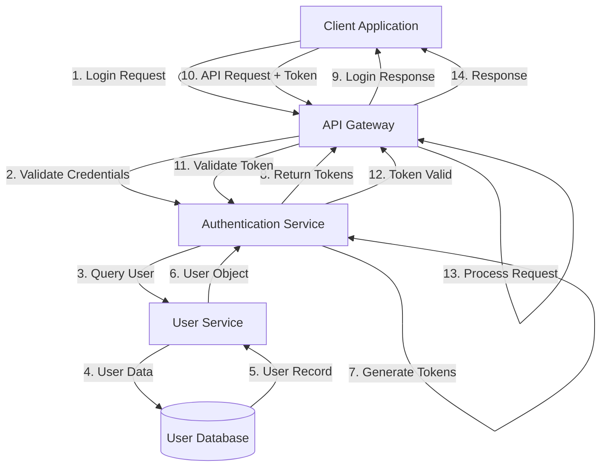

# Authentication Guide

## Overview

The StoryCore AI Assistant API uses JWT (JSON Web Token) based authentication to secure all endpoints. This guide explains the authentication flow, token management, and best practices for implementing authentication in your applications.

## Table of Contents

1. [Authentication Architecture](#authentication-architecture)
2. [Token Types](#token-types)
3. [Authentication Flow](#authentication-flow)
4. [Implementation Examples](#implementation-examples)
5. [Token Refresh Strategy](#token-refresh-strategy)
6. [Security Best Practices](#security-best-practices)
7. [Troubleshooting](#troubleshooting)

---

## Authentication Architecture



### Components

1. **Client Application**: Your application making API requests
2. **API Gateway**: FastAPI application handling requests
3. **Authentication Service**: JWT token generation and validation
4. **User Service**: User management and credential verification
5. **User Database**: Persistent user storage

---

## Token Types

### Access Token

**Purpose**: Short-lived token for API authentication

**Characteristics**:
- **Lifetime**: 1 hour (3600 seconds)
- **Usage**: Include in `Authorization` header for all API requests
- **Format**: JWT with user claims
- **Refresh**: Use refresh token to obtain new access token

**Token Structure**:
```json
{
  "header": {
    "alg": "HS256",
    "typ": "JWT"
  },
  "payload": {
    "sub": "user_123",
    "username": "user@example.com",
    "exp": 1640000000,
    "iat": 1639996400,
    "type": "access"
  },
  "signature": "..."
}
```

### Refresh Token

**Purpose**: Long-lived token for obtaining new access tokens

**Characteristics**:
- **Lifetime**: 7 days (604800 seconds)
- **Usage**: Send to `/auth/refresh` endpoint when access token expires
- **Format**: JWT with minimal claims
- **Security**: Store securely, never expose in URLs or logs

**Token Structure**:
```json
{
  "header": {
    "alg": "HS256",
    "typ": "JWT"
  },
  "payload": {
    "sub": "user_123",
    "exp": 1640604800,
    "iat": 1640000000,
    "type": "refresh"
  },
  "signature": "..."
}
```

---

## Authentication Flow

### Initial Authentication


### Making Authenticated Requests


### Token Refresh Flow


---

## Implementation Examples

### Python Implementation

```python
import requests
import time
from datetime import datetime, timedelta
from typing import Optional, Dict

class StoryCoreAuthClient:
    """Authentication client for StoryCore API"""
    
    def __init__(self, base_url: str):
        self.base_url = base_url
        self.access_token: Optional[str] = None
        self.refresh_token: Optional[str] = None
        self.token_expires_at: Optional[datetime] = None
    
    def login(self, username: str, password: str) -> bool:
        """
        Authenticate and store tokens.
        
        Returns:
            True if authentication successful, False otherwise
        """
        response = requests.post(
            f"{self.base_url}/auth/login",
            json={"username": username, "password": password}
        )
        
        if response.status_code == 200:
            data = response.json()
            self.access_token = data["access_token"]
            self.refresh_token = data["refresh_token"]
            
            # Calculate expiration time (with 5 minute buffer)
            expires_in = data["expires_in"] - 300
            self.token_expires_at = datetime.now() + timedelta(seconds=expires_in)
            
            return True
        
        return False
    
    def refresh_access_token(self) -> bool:
        """
        Refresh the access token using refresh token.
        
        Returns:
            True if refresh successful, False otherwise
        """
        if not self.refresh_token:
            return False
        
        response = requests.post(
            f"{self.base_url}/auth/refresh",
            json={"refresh_token": self.refresh_token}
        )
        
        if response.status_code == 200:
            data = response.json()
            self.access_token = data["access_token"]
            
            # Update expiration time
            expires_in = data["expires_in"] - 300
            self.token_expires_at = datetime.now() + timedelta(seconds=expires_in)
            
            return True
        
        return False
    
    def ensure_valid_token(self) -> bool:
        """
        Ensure we have a valid access token, refreshing if necessary.
        
        Returns:
            True if valid token available, False otherwise
        """
        if not self.access_token:
            return False
        
        # Check if token is about to expire
        if datetime.now() >= self.token_expires_at:
            return self.refresh_access_token()
        
        return True
    
    def get_headers(self) -> Dict[str, str]:
        """
        Get headers with authentication token.
        
        Returns:
            Dictionary of headers including Authorization
        """
        if not self.ensure_valid_token():
            raise Exception("No valid authentication token")
        
        return {
            "Authorization": f"Bearer {self.access_token}",
            "Content-Type": "application/json"
        }
    
    def make_request(self, method: str, endpoint: str, **kwargs) -> requests.Response:
        """
        Make an authenticated API request with automatic token refresh.
        
        Args:
            method: HTTP method (GET, POST, etc.)
            endpoint: API endpoint path
            **kwargs: Additional arguments for requests
            
        Returns:
            Response object
        """
        # Ensure valid token
        if not self.ensure_valid_token():
            raise Exception("Authentication required")
        
        # Add authentication headers
        if "headers" not in kwargs:
            kwargs["headers"] = {}
        kwargs["headers"].update(self.get_headers())
        
        # Make request
        url = f"{self.base_url}{endpoint}"
        response = requests.request(method, url, **kwargs)
        
        # Handle token expiration
        if response.status_code == 401:
            # Try to refresh token
            if self.refresh_access_token():
                # Retry request with new token
                kwargs["headers"].update(self.get_headers())
                response = requests.request(method, url, **kwargs)
        
        return response


# Usage example
def main():
    # Initialize client
    client = StoryCoreAuthClient("http://localhost:8000/api/v1")
    
    # Login
    if client.login("user@example.com", "secure_password"):
        print("Login successful")
        
        # Make authenticated requests
        response = client.make_request("GET", "/projects/list")
        if response.ok:
            projects = response.json()
            print(f"Projects: {projects['projects']}")
        
        # Generate project
        response = client.make_request(
            "POST",
            "/generate/project",
            json={
                "prompt": "Create a mystery thriller",
                "language": "en"
            }
        )
        if response.ok:
            project = response.json()
            print(f"Generated: {project['project_name']}")
    else:
        print("Login failed")


if __name__ == "__main__":
    main()
```

### JavaScript/TypeScript Implementation

```typescript
interface AuthTokens {
  accessToken: string;
  refreshToken: string;
  expiresAt: Date;
}

class StoryCoreAuthClient {
  private baseUrl: string;
  private tokens: AuthTokens | null = null;

  constructor(baseUrl: string) {
    this.baseUrl = baseUrl;
  }

  /**
   * Authenticate and store tokens
   */
  async login(username: string, password: string): Promise<boolean> {
    try {
      const response = await fetch(`${this.baseUrl}/auth/login`, {
        method: "POST",
        headers: { "Content-Type": "application/json" },
        body: JSON.stringify({ username, password })
      });

      if (!response.ok) {
        return false;
      }

      const data = await response.json();
      
      // Store tokens with expiration (5 minute buffer)
      const expiresIn = (data.expires_in - 300) * 1000;
      this.tokens = {
        accessToken: data.access_token,
        refreshToken: data.refresh_token,
        expiresAt: new Date(Date.now() + expiresIn)
      };

      return true;
    } catch (error) {
      console.error("Login error:", error);
      return false;
    }
  }

  /**
   * Refresh the access token
   */
  async refreshAccessToken(): Promise<boolean> {
    if (!this.tokens?.refreshToken) {
      return false;
    }

    try {
      const response = await fetch(`${this.baseUrl}/auth/refresh`, {
        method: "POST",
        headers: { "Content-Type": "application/json" },
        body: JSON.stringify({ refresh_token: this.tokens.refreshToken })
      });

      if (!response.ok) {
        return false;
      }

      const data = await response.json();
      
      // Update access token and expiration
      const expiresIn = (data.expires_in - 300) * 1000;
      this.tokens.accessToken = data.access_token;
      this.tokens.expiresAt = new Date(Date.now() + expiresIn);

      return true;
    } catch (error) {
      console.error("Token refresh error:", error);
      return false;
    }
  }

  /**
   * Ensure we have a valid token
   */
  async ensureValidToken(): Promise<boolean> {
    if (!this.tokens) {
      return false;
    }

    // Check if token is about to expire
    if (Date.now() >= this.tokens.expiresAt.getTime()) {
      return await this.refreshAccessToken();
    }

    return true;
  }

  /**
   * Get authentication headers
   */
  getHeaders(): Record<string, string> {
    if (!this.tokens) {
      throw new Error("No authentication token available");
    }

    return {
      "Authorization": `Bearer ${this.tokens.accessToken}`,
      "Content-Type": "application/json"
    };
  }

  /**
   * Make an authenticated API request
   */
  async makeRequest<T>(
    method: string,
    endpoint: string,
    body?: any
  ): Promise<T> {
    // Ensure valid token
    if (!await this.ensureValidToken()) {
      throw new Error("Authentication required");
    }

    const url = `${this.baseUrl}${endpoint}`;
    const options: RequestInit = {
      method,
      headers: this.getHeaders()
    };

    if (body) {
      options.body = JSON.stringify(body);
    }

    let response = await fetch(url, options);

    // Handle token expiration
    if (response.status === 401) {
      // Try to refresh token
      if (await this.refreshAccessToken()) {
        // Retry request with new token
        options.headers = this.getHeaders();
        response = await fetch(url, options);
      }
    }

    if (!response.ok) {
      const error = await response.json();
      throw new Error(error.error?.message || "Request failed");
    }

    return await response.json();
  }
}

// Usage example
async function main() {
  const client = new StoryCoreAuthClient("http://localhost:8000/api/v1");

  // Login
  if (await client.login("user@example.com", "secure_password")) {
    console.log("Login successful");

    // List projects
    const projects = await client.makeRequest<any>("GET", "/projects/list");
    console.log("Projects:", projects.projects);

    // Generate project
    const project = await client.makeRequest<any>(
      "POST",
      "/generate/project",
      {
        prompt: "Create a sci-fi adventure",
        language: "en"
      }
    );
    console.log("Generated:", project.project_name);
  } else {
    console.log("Login failed");
  }
}

main();
```

---

## Token Refresh Strategy

### Proactive Refresh

Refresh tokens before they expire to avoid interruptions:

```python
def should_refresh_token(expires_at: datetime, buffer_minutes: int = 5) -> bool:
    """Check if token should be refreshed"""
    buffer = timedelta(minutes=buffer_minutes)
    return datetime.now() >= (expires_at - buffer)

# In your request loop
if should_refresh_token(token_expires_at):
    refresh_access_token()
```

### Reactive Refresh

Handle 401 errors by attempting token refresh:

```python
def make_request_with_retry(url, headers, data):
    response = requests.post(url, headers=headers, json=data)
    
    if response.status_code == 401:
        # Token expired, try to refresh
        if refresh_access_token():
            # Update headers with new token
            headers["Authorization"] = f"Bearer {new_access_token}"
            # Retry request
            response = requests.post(url, headers=headers, json=data)
        else:
            # Refresh failed, user must login again
            raise AuthenticationError("Session expired, please login again")
    
    return response
```

### Background Refresh

For long-running applications, refresh tokens in the background:

```python
import threading
import time

def background_token_refresh(client, interval_seconds=3000):
    """Background thread to refresh tokens periodically"""
    while True:
        time.sleep(interval_seconds)
        try:
            client.refresh_access_token()
            print("Token refreshed successfully")
        except Exception as e:
            print(f"Token refresh failed: {e}")

# Start background refresh
refresh_thread = threading.Thread(
    target=background_token_refresh,
    args=(auth_client, 3000),
    daemon=True
)
refresh_thread.start()
```

---

## Security Best Practices

### 1. Token Storage

**DO**:
- Store tokens in secure, encrypted storage
- Use environment variables for server-side applications
- Use secure storage APIs (Keychain, Credential Manager) for desktop apps
- Use httpOnly cookies for web applications

**DON'T**:
- Store tokens in localStorage (vulnerable to XSS)
- Commit tokens to version control
- Log tokens in application logs
- Include tokens in URLs or query parameters

### 2. Token Transmission

**DO**:
- Always use HTTPS in production
- Include tokens in `Authorization` header
- Validate SSL certificates

**DON'T**:
- Send tokens over HTTP
- Include tokens in URL parameters
- Share tokens between users

### 3. Token Lifecycle

**DO**:
- Implement token expiration handling
- Refresh tokens proactively
- Clear tokens on logout
- Implement token revocation

**DON'T**:
- Reuse expired tokens
- Store tokens indefinitely
- Share refresh tokens

### 4. Error Handling

**DO**:
- Handle authentication errors gracefully
- Provide clear error messages
- Implement retry logic with backoff
- Log authentication failures

**DON'T**:
- Expose sensitive error details to users
- Retry indefinitely on authentication failures
- Ignore token validation errors

---

## Troubleshooting

### Common Issues

#### 1. "Invalid token" Error

**Cause**: Token is malformed or signature is invalid

**Solutions**:
- Verify token format (should be `Bearer <token>`)
- Check that token hasn't been modified
- Ensure correct secret key is used
- Verify token was issued by this API

#### 2. "Token expired" Error

**Cause**: Access token has exceeded its 1-hour lifetime

**Solutions**:
- Implement automatic token refresh
- Use refresh token to obtain new access token
- Check system clock synchronization

#### 3. "Refresh token expired" Error

**Cause**: Refresh token has exceeded its 7-day lifetime

**Solutions**:
- User must login again
- Implement session persistence
- Consider longer refresh token lifetime for trusted clients

#### 4. "Missing authentication token" Error

**Cause**: No Authorization header provided

**Solutions**:
- Ensure Authorization header is included
- Verify header format: `Authorization: Bearer <token>`
- Check that token is not empty

#### 5. Rate Limit on Login Endpoint

**Cause**: Too many login attempts

**Solutions**:
- Implement exponential backoff
- Cache valid tokens
- Avoid repeated login attempts

### Debugging Tips

1. **Inspect Token Claims**:
```python
import jwt

def decode_token(token):
    # Decode without verification for debugging
    decoded = jwt.decode(token, options={"verify_signature": False})
    print(f"User: {decoded['sub']}")
    print(f"Expires: {datetime.fromtimestamp(decoded['exp'])}")
    print(f"Type: {decoded['type']}")
```

2. **Log Authentication Flow**:
```python
import logging

logging.basicConfig(level=logging.DEBUG)
logger = logging.getLogger(__name__)

def login_with_logging(username, password):
    logger.debug(f"Attempting login for user: {username}")
    response = requests.post(url, json={"username": username, "password": password})
    logger.debug(f"Login response status: {response.status_code}")
    if response.ok:
        logger.debug("Login successful, tokens received")
    else:
        logger.error(f"Login failed: {response.text}")
    return response
```

3. **Test Token Expiration**:
```python
# Create a token with short expiration for testing
test_token = auth_service.generate_token(user, expires_in=10)  # 10 seconds
time.sleep(15)
# Token should now be expired
```

---

## Additional Resources

- [JWT.io](https://jwt.io/) - JWT debugger and documentation
- [OWASP Authentication Cheat Sheet](https://cheatsheetseries.owasp.org/cheatsheets/Authentication_Cheat_Sheet.html)
- [RFC 7519 - JSON Web Token](https://tools.ietf.org/html/rfc7519)
- [OAuth 2.0 Best Practices](https://tools.ietf.org/html/draft-ietf-oauth-security-topics)
