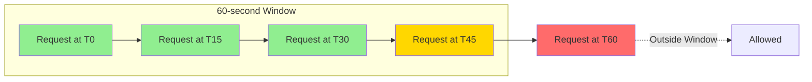
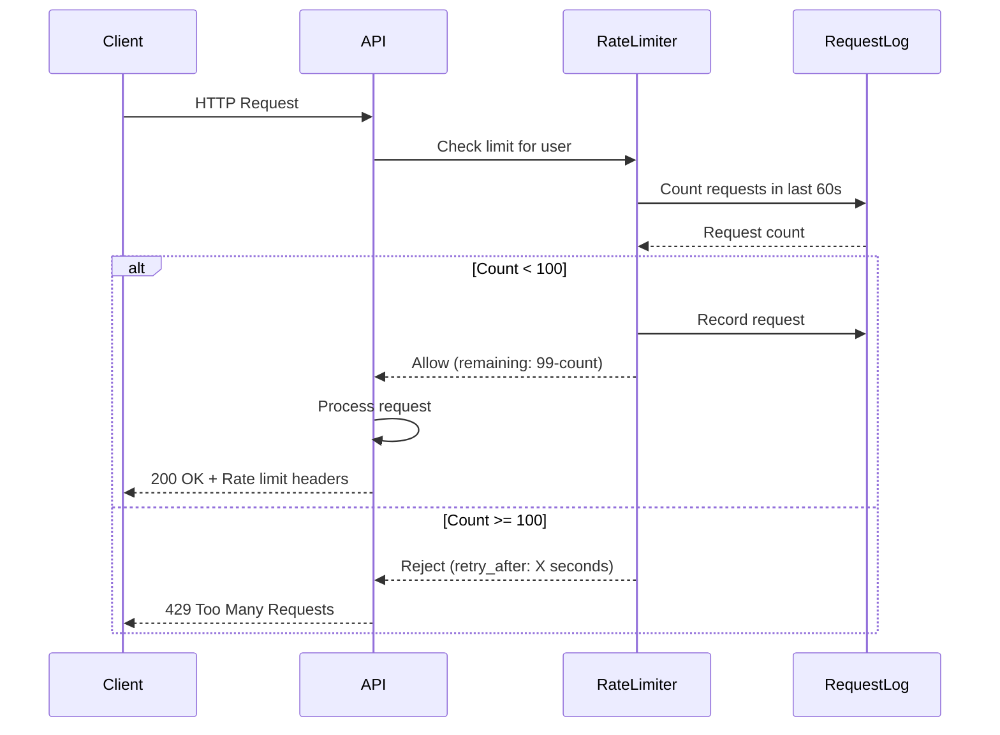

# Rate Limiting Guide

## Overview

The StoryCore AI Assistant API implements rate limiting to ensure fair usage, prevent abuse, and maintain system stability. This guide explains how rate limiting works, how to handle rate limits in your applications, and best practices for staying within limits.

## Table of Contents

1. [Rate Limiting Policy](#rate-limiting-policy)
2. [How Rate Limiting Works](#how-rate-limiting-works)
3. [Rate Limit Headers](#rate-limit-headers)
4. [Handling Rate Limits](#handling-rate-limits)
5. [Implementation Examples](#implementation-examples)
6. [Best Practices](#best-practices)
7. [Troubleshooting](#troubleshooting)

---

## Rate Limiting Policy

### Current Limits

| Limit Type | Value | Window | Scope |
|------------|-------|--------|-------|
| Request Rate | 100 requests | 60 seconds | Per user |
| Warning Threshold | 90 requests | 60 seconds | Per user |
| Burst Allowance | 10 requests | Immediate | Per user |

### Policy Details

- **Sliding Window**: The rate limit uses a sliding window algorithm, meaning the limit is calculated based on the last 60 seconds of activity, not a fixed time window
- **Per-User Enforcement**: Limits are enforced per authenticated user (or IP address for unauthenticated requests)
- **All Endpoints**: Rate limits apply to all API endpoints, including authentication endpoints
- **Automatic Reset**: Limits automatically reset as time passes in the sliding window

### Exemptions

The following endpoints have special considerations:

- **Health Check** (`/health`): Not counted toward rate limit
- **Login** (`/auth/login`): Counted, but has additional brute-force protection
- **Token Refresh** (`/auth/refresh`): Counted, but prioritized during rate limit enforcement

---

## How Rate Limiting Works

### Sliding Window Algorithm



**How it works**:
1. Each request is timestamped
2. When a new request arrives, the system counts requests in the last 60 seconds
3. If count < 100, request is allowed
4. If count >= 100, request is rejected with 429 status
5. Old requests automatically "fall off" the window as time passes

### Request Flow



### Warning System

When you reach 90% of your rate limit (90 requests in 60 seconds), the API adds a warning header to responses:

```http
X-RateLimit-Warning: Approaching rate limit (90/100 requests used)
```

This gives you time to slow down requests before hitting the limit.

---

## Rate Limit Headers

Every API response includes rate limit information in the headers:

### Standard Headers

```http
X-RateLimit-Limit: 100
X-RateLimit-Remaining: 42
X-RateLimit-Reset: 1640000060
```

**Header Descriptions**:

| Header | Description | Example |
|--------|-------------|---------|
| `X-RateLimit-Limit` | Maximum requests allowed in window | `100` |
| `X-RateLimit-Remaining` | Requests remaining in current window | `42` |
| `X-RateLimit-Reset` | Unix timestamp when oldest request expires | `1640000060` |

### Warning Header

```http
X-RateLimit-Warning: Approaching rate limit (90/100 requests used)
```

Appears when remaining requests < 10.

### Rate Limit Exceeded Response

When rate limit is exceeded, the response includes:

**Status Code**: `429 Too Many Requests`

**Headers**:
```http
X-RateLimit-Limit: 100
X-RateLimit-Remaining: 0
X-RateLimit-Reset: 1640000060
Retry-After: 45
```

**Body**:
```json
{
  "error": {
    "code": "RATE_LIMIT_EXCEEDED",
    "message": "Rate limit exceeded: 100 requests per 60 seconds",
    "details": {
      "limit": 100,
      "window_seconds": 60,
      "retry_after": 45
    },
    "suggested_action": "Wait 45 seconds before retrying"
  }
}
```

---

## Handling Rate Limits

### Strategy 1: Monitor and Throttle

Monitor rate limit headers and slow down when approaching the limit:

```python
import time
import requests

def make_request_with_monitoring(url, headers, data):
    response = requests.post(url, headers=headers, json=data)
    
    # Check remaining requests
    remaining = int(response.headers.get("X-RateLimit-Remaining", 100))
    limit = int(response.headers.get("X-RateLimit-Limit", 100))
    
    # Calculate usage percentage
    usage_percent = ((limit - remaining) / limit) * 100
    
    # Throttle if approaching limit
    if usage_percent > 80:
        # Slow down: wait 1 second between requests
        print(f"Rate limit at {usage_percent:.1f}%, throttling...")
        time.sleep(1)
    elif usage_percent > 90:
        # Very close to limit: wait 2 seconds
        print(f"Rate limit at {usage_percent:.1f}%, heavy throttling...")
        time.sleep(2)
    
    return response
```

### Strategy 2: Exponential Backoff

Implement exponential backoff when rate limited:

```python
import time
import requests

def make_request_with_backoff(url, headers, data, max_retries=3):
    for attempt in range(max_retries):
        response = requests.post(url, headers=headers, json=data)
        
        if response.status_code != 429:
            return response
        
        # Rate limited, calculate backoff
        retry_after = int(response.headers.get("Retry-After", 60))
        backoff_time = min(retry_after * (2 ** attempt), 300)  # Max 5 minutes
        
        print(f"Rate limited. Waiting {backoff_time} seconds (attempt {attempt + 1}/{max_retries})")
        time.sleep(backoff_time)
    
    raise Exception("Max retries exceeded")
```

### Strategy 3: Request Queue

Use a queue to control request rate:

```python
import time
import queue
import threading
from typing import Callable

class RateLimitedQueue:
    """Queue that enforces rate limits"""
    
    def __init__(self, max_requests_per_minute: int = 100):
        self.max_requests = max_requests_per_minute
        self.request_queue = queue.Queue()
        self.request_times = []
        self.lock = threading.Lock()
        self.running = True
        
        # Start worker thread
        self.worker = threading.Thread(target=self._process_queue, daemon=True)
        self.worker.start()
    
    def add_request(self, func: Callable, *args, **kwargs):
        """Add a request to the queue"""
        self.request_queue.put((func, args, kwargs))
    
    def _process_queue(self):
        """Process requests from queue with rate limiting"""
        while self.running:
            try:
                # Get next request (with timeout to allow checking running flag)
                func, args, kwargs = self.request_queue.get(timeout=1)
                
                # Wait if necessary to stay within rate limit
                self._wait_if_needed()
                
                # Execute request
                try:
                    result = func(*args, **kwargs)
                    print(f"Request completed: {result.status_code}")
                except Exception as e:
                    print(f"Request failed: {e}")
                
                # Record request time
                with self.lock:
                    self.request_times.append(time.time())
                
                self.request_queue.task_done()
                
            except queue.Empty:
                continue
    
    def _wait_if_needed(self):
        """Wait if we're at the rate limit"""
        with self.lock:
            # Remove requests older than 60 seconds
            current_time = time.time()
            self.request_times = [
                t for t in self.request_times 
                if current_time - t < 60
            ]
            
            # If at limit, wait for oldest request to expire
            if len(self.request_times) >= self.max_requests:
                oldest_request = min(self.request_times)
                wait_time = 60 - (current_time - oldest_request) + 0.1
                if wait_time > 0:
                    print(f"Rate limit reached, waiting {wait_time:.1f} seconds")
                    time.sleep(wait_time)
    
    def stop(self):
        """Stop the queue processor"""
        self.running = False
        self.worker.join()


# Usage
rate_limited_queue = RateLimitedQueue(max_requests_per_minute=90)  # Stay under limit

# Add requests to queue
for i in range(200):
    rate_limited_queue.add_request(
        requests.post,
        "http://localhost:8000/api/v1/projects/list",
        headers=headers
    )

# Wait for all requests to complete
rate_limited_queue.request_queue.join()
```

### Strategy 4: Adaptive Rate Limiting

Dynamically adjust request rate based on server responses:

```python
class AdaptiveRateLimiter:
    """Automatically adjusts request rate based on server responses"""
    
    def __init__(self, initial_rate: float = 1.0):
        self.request_interval = 1.0 / initial_rate  # seconds between requests
        self.last_request_time = 0
        self.consecutive_successes = 0
        self.consecutive_failures = 0
    
    def wait_if_needed(self):
        """Wait to maintain current rate"""
        elapsed = time.time() - self.last_request_time
        if elapsed < self.request_interval:
            time.sleep(self.request_interval - elapsed)
        self.last_request_time = time.time()
    
    def record_success(self, remaining: int, limit: int):
        """Record successful request and adjust rate"""
        self.consecutive_successes += 1
        self.consecutive_failures = 0
        
        # If we have plenty of capacity, speed up
        usage = (limit - remaining) / limit
        if usage < 0.5 and self.consecutive_successes > 10:
            self.request_interval *= 0.9  # 10% faster
            self.consecutive_successes = 0
            print(f"Speeding up: {1/self.request_interval:.1f} req/s")
    
    def record_rate_limit(self, retry_after: int):
        """Record rate limit and slow down"""
        self.consecutive_failures += 1
        self.consecutive_successes = 0
        
        # Slow down significantly
        self.request_interval *= 2.0  # 50% slower
        print(f"Rate limited! Slowing down: {1/self.request_interval:.1f} req/s")
        
        # Wait for retry_after
        time.sleep(retry_after)
    
    def make_request(self, url, headers, data):
        """Make request with adaptive rate limiting"""
        self.wait_if_needed()
        
        response = requests.post(url, headers=headers, json=data)
        
        if response.status_code == 429:
            retry_after = int(response.headers.get("Retry-After", 60))
            self.record_rate_limit(retry_after)
            # Retry after waiting
            return self.make_request(url, headers, data)
        else:
            remaining = int(response.headers.get("X-RateLimit-Remaining", 100))
            limit = int(response.headers.get("X-RateLimit-Limit", 100))
            self.record_success(remaining, limit)
            return response


# Usage
limiter = AdaptiveRateLimiter(initial_rate=1.5)  # Start at 1.5 req/s

for i in range(200):
    response = limiter.make_request(url, headers, data)
    print(f"Request {i}: {response.status_code}")
```

---

## Implementation Examples

### Python with Requests

```python
import requests
import time
from typing import Optional

class RateLimitedClient:
    """HTTP client with built-in rate limit handling"""
    
    def __init__(self, base_url: str, token: str):
        self.base_url = base_url
        self.token = token
        self.remaining_requests = 100
        self.rate_limit_reset = 0
    
    def _update_rate_limit_info(self, response: requests.Response):
        """Update rate limit info from response headers"""
        self.remaining_requests = int(
            response.headers.get("X-RateLimit-Remaining", 100)
        )
        self.rate_limit_reset = int(
            response.headers.get("X-RateLimit-Reset", 0)
        )
        
        # Check for warning
        warning = response.headers.get("X-RateLimit-Warning")
        if warning:
            print(f"Warning: {warning}")
    
    def _wait_for_rate_limit_reset(self):
        """Wait until rate limit resets"""
        if self.rate_limit_reset > 0:
            wait_time = self.rate_limit_reset - time.time()
            if wait_time > 0:
                print(f"Waiting {wait_time:.1f}s for rate limit reset...")
                time.sleep(wait_time + 1)  # Add 1 second buffer
    
    def request(
        self,
        method: str,
        endpoint: str,
        **kwargs
    ) -> requests.Response:
        """Make rate-limited request"""
        
        # Check if we should throttle
        if self.remaining_requests < 10:
            print(f"Low on requests ({self.remaining_requests} remaining), throttling...")
            time.sleep(1)
        
        # Make request
        url = f"{self.base_url}{endpoint}"
        headers = kwargs.get("headers", {})
        headers["Authorization"] = f"Bearer {self.token}"
        kwargs["headers"] = headers
        
        response = requests.request(method, url, **kwargs)
        
        # Handle rate limit
        if response.status_code == 429:
            print("Rate limit exceeded!")
            retry_after = int(response.headers.get("Retry-After", 60))
            print(f"Waiting {retry_after} seconds...")
            time.sleep(retry_after)
            # Retry
            return self.request(method, endpoint, **kwargs)
        
        # Update rate limit info
        self._update_rate_limit_info(response)
        
        return response


# Usage
client = RateLimitedClient("http://localhost:8000/api/v1", access_token)

# Make requests without worrying about rate limits
for i in range(150):
    response = client.request("GET", "/projects/list")
    print(f"Request {i}: {response.status_code}")
```

### JavaScript/TypeScript with Fetch

```typescript
interface RateLimitInfo {
  limit: number;
  remaining: number;
  reset: number;
}

class RateLimitedClient {
  private baseUrl: string;
  private token: string;
  private rateLimitInfo: RateLimitInfo = {
    limit: 100,
    remaining: 100,
    reset: 0
  };

  constructor(baseUrl: string, token: string) {
    this.baseUrl = baseUrl;
    this.token = token;
  }

  private updateRateLimitInfo(headers: Headers): void {
    this.rateLimitInfo = {
      limit: parseInt(headers.get("X-RateLimit-Limit") || "100"),
      remaining: parseInt(headers.get("X-RateLimit-Remaining") || "100"),
      reset: parseInt(headers.get("X-RateLimit-Reset") || "0")
    };

    // Check for warning
    const warning = headers.get("X-RateLimit-Warning");
    if (warning) {
      console.warn(`Rate limit warning: ${warning}`);
    }
  }

  private async waitForRateLimitReset(): Promise<void> {
    if (this.rateLimitInfo.reset > 0) {
      const waitTime = this.rateLimitInfo.reset - Date.now() / 1000;
      if (waitTime > 0) {
        console.log(`Waiting ${waitTime.toFixed(1)}s for rate limit reset...`);
        await new Promise(resolve => setTimeout(resolve, (waitTime + 1) * 1000));
      }
    }
  }

  async request<T>(
    method: string,
    endpoint: string,
    body?: any
  ): Promise<T> {
    // Throttle if low on requests
    if (this.rateLimitInfo.remaining < 10) {
      console.log(`Low on requests (${this.rateLimitInfo.remaining} remaining), throttling...`);
      await new Promise(resolve => setTimeout(resolve, 1000));
    }

    // Make request
    const url = `${this.baseUrl}${endpoint}`;
    const options: RequestInit = {
      method,
      headers: {
        "Authorization": `Bearer ${this.token}`,
        "Content-Type": "application/json"
      }
    };

    if (body) {
      options.body = JSON.stringify(body);
    }

    let response = await fetch(url, options);

    // Handle rate limit
    if (response.status === 429) {
      console.log("Rate limit exceeded!");
      const retryAfter = parseInt(response.headers.get("Retry-After") || "60");
      console.log(`Waiting ${retryAfter} seconds...`);
      await new Promise(resolve => setTimeout(resolve, retryAfter * 1000));
      // Retry
      return this.request<T>(method, endpoint, body);
    }

    // Update rate limit info
    this.updateRateLimitInfo(response.headers);

    if (!response.ok) {
      const error = await response.json();
      throw new Error(error.error?.message || "Request failed");
    }

    return await response.json();
  }
}

// Usage
const client = new RateLimitedClient("http://localhost:8000/api/v1", accessToken);

// Make requests
for (let i = 0; i < 150; i++) {
  try {
    const projects = await client.request<any>("GET", "/projects/list");
    console.log(`Request ${i}: Success`);
  } catch (error) {
    console.error(`Request ${i}: Failed -`, error);
  }
}
```

---

## Best Practices

### 1. Monitor Rate Limit Headers

Always check rate limit headers in responses:

```python
def check_rate_limit_status(response):
    remaining = int(response.headers.get("X-RateLimit-Remaining", 100))
    limit = int(response.headers.get("X-RateLimit-Limit", 100))
    usage_percent = ((limit - remaining) / limit) * 100
    
    print(f"Rate limit: {remaining}/{limit} remaining ({usage_percent:.1f}% used)")
    
    if usage_percent > 90:
        print("WARNING: Approaching rate limit!")
```

### 2. Implement Request Throttling

Don't wait until you hit the limit:

```python
# Good: Throttle proactively
if remaining_requests < 20:
    time.sleep(0.5)  # Slow down

# Bad: Wait until rate limited
# (No throttling, hit 429 error)
```

### 3. Use Exponential Backoff

When rate limited, use exponential backoff:

```python
def exponential_backoff(attempt, base_delay=1, max_delay=60):
    delay = min(base_delay * (2 ** attempt), max_delay)
    time.sleep(delay)
    return delay
```

### 4. Batch Operations

Combine multiple operations into single requests when possible:

```python
# Good: Single request with multiple modifications
response = client.request("PATCH", "/projects/bulk-update", json={
    "scenes": [scene1_updates, scene2_updates, scene3_updates]
})

# Bad: Multiple individual requests
for scene_update in scene_updates:
    client.request("PATCH", f"/projects/scenes/{scene_update['id']}", json=scene_update)
```

### 5. Cache Responses

Cache responses to reduce API calls:

```python
import time
from typing import Dict, Any, Optional

class CachedClient:
    def __init__(self, client, cache_ttl=60):
        self.client = client
        self.cache: Dict[str, tuple[Any, float]] = {}
        self.cache_ttl = cache_ttl
    
    def get_cached(self, endpoint: str) -> Optional[Any]:
        if endpoint in self.cache:
            data, timestamp = self.cache[endpoint]
            if time.time() - timestamp < self.cache_ttl:
                return data
        return None
    
    def request(self, method: str, endpoint: str, **kwargs):
        # Check cache for GET requests
        if method == "GET":
            cached = self.get_cached(endpoint)
            if cached:
                print(f"Cache hit: {endpoint}")
                return cached
        
        # Make request
        response = self.client.request(method, endpoint, **kwargs)
        
        # Cache GET responses
        if method == "GET" and response.ok:
            self.cache[endpoint] = (response.json(), time.time())
        
        return response
```

### 6. Distribute Load

For high-volume applications, distribute requests across multiple users/tokens:

```python
class LoadBalancedClient:
    def __init__(self, clients: list):
        self.clients = clients
        self.current_index = 0
    
    def get_next_client(self):
        client = self.clients[self.current_index]
        self.current_index = (self.current_index + 1) % len(self.clients)
        return client
    
    def request(self, method: str, endpoint: str, **kwargs):
        client = self.get_next_client()
        return client.request(method, endpoint, **kwargs)
```

---

## Troubleshooting

### Issue: Constantly Hitting Rate Limit

**Symptoms**:
- Frequent 429 errors
- Long wait times between requests

**Solutions**:
1. Reduce request frequency
2. Implement request queuing
3. Cache responses
4. Batch operations
5. Consider upgrading to higher rate limit tier (if available)

### Issue: Inconsistent Rate Limit Behavior

**Symptoms**:
- Rate limit seems to reset at unexpected times
- Remaining count doesn't match expectations

**Cause**: Sliding window algorithm means limits are based on last 60 seconds, not fixed windows

**Solution**: Track request timestamps and calculate expected remaining count

### Issue: Rate Limit After Long Idle Period

**Symptoms**:
- First request after idle period is rate limited

**Cause**: Previous requests still in 60-second window

**Solution**: Wait for full window to clear before resuming high-volume requests

### Issue: Different Rate Limits for Different Users

**Symptoms**:
- Some users have different limits

**Cause**: Rate limits may vary by user tier or authentication method

**Solution**: Check rate limit headers for each user's actual limits

---

## Additional Resources

- [API Documentation](./API_DOCUMENTATION.md)
- [Authentication Guide](./AUTHENTICATION_GUIDE.md)
- [RFC 6585 - Additional HTTP Status Codes](https://tools.ietf.org/html/rfc6585)
- [IETF Draft - RateLimit Header Fields](https://datatracker.ietf.org/doc/html/draft-ietf-httpapi-ratelimit-headers)
